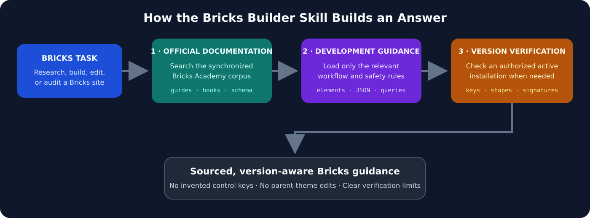
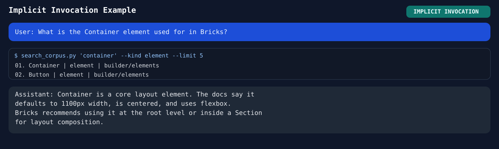
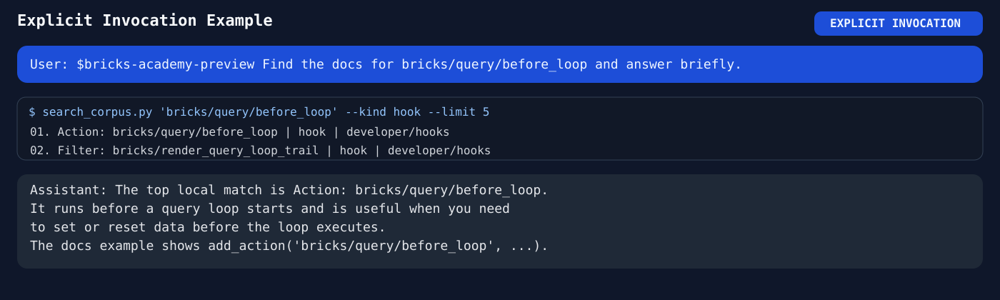

# Bricks Builder Skill

這是一個 local-first Agent Skill，用來查詢、開發、修改與審核 Bricks Builder 網站。

它整合三層證據：

1. 同步自 Bricks Academy 官方文件的本地 corpus；
2. 精簡、人工維護的開發工作流程；
3. 當精確實作細節會影響結果時，對獲授權的實際 Bricks 安裝進行版本感知查驗。



Skill 會先查詢公開文件，只載入與任務相關的開發指引，並在提出版本敏感結論前查驗獲授權的實際安裝。

此 Skill 不包含或重製 Bricks 商業 Theme 原始碼。

## Repository 結構

```text
skills/bricks-builder/
├── SKILL.md
├── agents/
├── references/
│   └── development/
├── corpus/
│   └── bricks-academy/
├── index/
└── scripts/
```

Academy corpus 與 index 是同步生成物。Development references 則刻意維持精簡，著重查證與實作流程，不建立難以維護的完整內部 control keys 快照。

## 能力範圍

- 從本機搜尋 Bricks Academy 官方 guides、hooks、elements、controls 與 schemas。
- 在不猜測儲存格式的前提下，指導 Bricks page／element JSON 開發。
- 在 child theme 或 plugin 中安全開發 custom elements。
- 處理 responsive settings、Theme Styles、global classes、variables 與 components。
- 為 Dynamic Data、Query Loop、Forms 與 hooks 選擇正確的官方及實際版本來源。
- 在 Builder 與 frontend 驗證變更。

## 目前 Academy 快照

- `768` 篇同步文件
- `631` 張本地圖片
- `51` 個外部 embed 以連結保留

以上數字會隨官方文件更新而變動。

## 版本與相容性

本 repository 依 installable Skill 的公開契約採用 Semantic Versioning。Skill 版號獨立於 Bricks 產品版本、WordPress 版本與 Academy snapshot 日期；只有更新實際改變公開行為、workflow 或隨附指引時，才依相容性調整 Skill 版號。

版本敏感的實作細節仍必須對使用者獲授權的實際 Bricks 安裝查驗。Snapshot 與相容性紀錄見 [`CHANGELOG.md`](CHANGELOG.md)。

## 安裝

Clone repository 後，將內層 `skills/bricks-builder/` 複製到 Agent 支援的 Skill 目錄。

### 使用者層級

```bash
git clone https://github.com/kenming/bricks-builder-skill.git /tmp/bricks-builder-skill
mkdir -p ~/.agents/skills
cp -R /tmp/bricks-builder-skill/skills/bricks-builder ~/.agents/skills/
```

### 專案層級

```bash
git clone https://github.com/kenming/bricks-builder-skill.git /tmp/bricks-builder-skill
mkdir -p .agents/skills
cp -R /tmp/bricks-builder-skill/skills/bricks-builder .agents/skills/
```

Claude Code 可使用相同方式，將目的地換成 `~/.claude/skills/` 或 `.claude/skills/`。

可用 `$bricks-builder` 顯式觸發，或直接提出明確的 Bricks 文件或開發問題。

## 觸發範例

提出明確的 Bricks 問題，即可隱式觸發 Skill：



需要查詢精確 hook、schema 或實作細節時，可用 `$bricks-builder` 明確觸發：



## 本地 corpus 工具

從 repository 根目錄執行：

```bash
python3 skills/bricks-builder/scripts/search_corpus.py "query loop"
python3 skills/bricks-builder/scripts/search_corpus.py "bricks/query/before_loop" --kind hook
python3 skills/bricks-builder/scripts/show_doc.py "new:developer/hooks/actions/action-bricks-query-before_loop"
```

不下載完整 corpus，先檢查 Academy 是否更新：

```bash
python3 skills/bricks-builder/scripts/check_academy_updates.py
```

確實需要時才執行完整同步：

```bash
bash skills/bricks-builder/scripts/run_academy_sync.sh
```

## 證據與授權邊界

- 查詢官方公開行為時，先使用本地 Academy corpus。
- 精確 control keys、hook signatures、JSON shapes 與內部行為，應在可用時對使用者獲授權的實際 Bricks 版本查驗。
- Bricks parent theme 維持唯讀；custom code 放在 child theme 或 plugin。
- 不發布商業 Theme 原始碼、credentials、私人網站資料或本機絕對路徑。

## 文件

- English：[`README.md`](README.md)
- 版本紀錄：[`CHANGELOG.md`](CHANGELOG.md)

## 授權

本 repository 採 MIT License，詳見 [`LICENSE`](LICENSE)。
