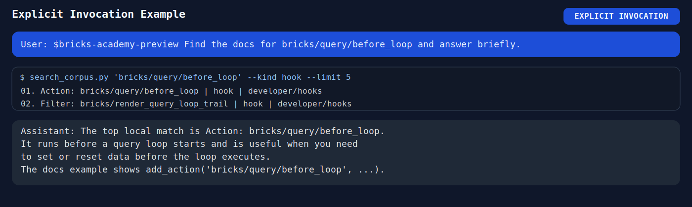
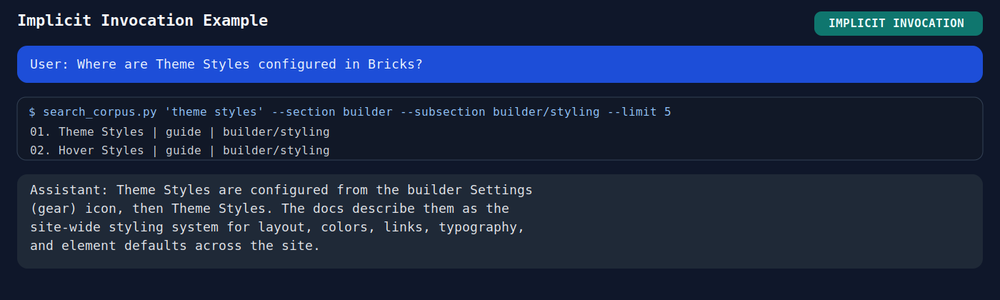
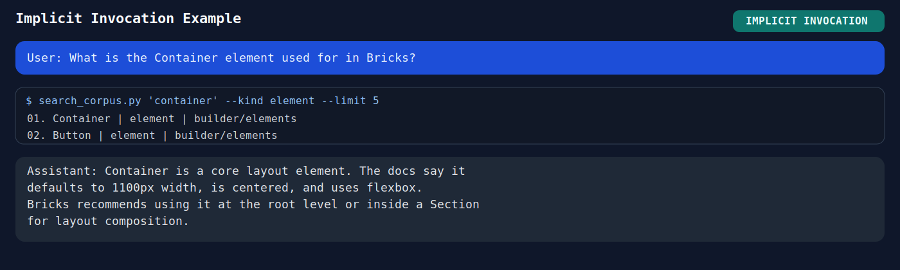

# Bricks Academy Preview Skill

這是一個可公開發布的 Agent Skill repo，用來查詢 Bricks Academy preview 文件。

此 repo 包含：

- `academy-preview.bricksbuilder.io` 的本地 Markdown 鏡像
- 文件所引用的本地圖片資產
- 查詢與開啟文檔的腳本
- 重新同步 preview 文件的腳本
- 一份放在 `skills/bricks-academy-preview/` 下的 skill 定義

## 目錄重點

```text
skills/bricks-academy-preview/
├── SKILL.md
├── corpus/
├── index/
├── references/
└── scripts/
```

重要路徑：

- Skill 入口：`skills/bricks-academy-preview/SKILL.md`
- 本地 corpus：`skills/bricks-academy-preview/corpus/bricks-academy-preview/`
- 搜尋索引：`skills/bricks-academy-preview/index/preview_corpus_manifest.csv`

## 目前快照

- `691` 篇同步完成的文件
- `569` 張已下載的本地圖片
- `34` 個外部嵌入內容以連結方式保留

以上數字會隨 preview 官方文件更新而變動。

## 安裝方式

這個 repo 採用帶有 `skills/` 巢狀目錄的 skill repository 形式：

```text
bricks-academy-preview-skill/
└── skills/
    └── bricks-academy-preview/
        └── SKILL.md
```

手動安裝時，應該複製內層的 `skills/bricks-academy-preview/` 到你的 agent 會掃描的 skill 目錄。

常見 skill 位置：

- Codex/Copilot 使用者層級：`~/.agents/skills/`
- Codex/Copilot 專案層級：`.agents/skills/`
- Claude Code 使用者層級：`~/.claude/skills/`
- Claude Code 專案層級：`.claude/skills/`
- 其他 AI agents：請查閱該 agent 關於 skill 儲存位置的官方或專案文件。

### 方式 1：安裝到 Codex/Copilot 使用者層級

```bash
git clone https://github.com/<your-account>/bricks-academy-preview-skill.git /tmp/bricks-academy-preview-skill
mkdir -p ~/.agents/skills
cp -R /tmp/bricks-academy-preview-skill/skills/bricks-academy-preview ~/.agents/skills/
rm -rf /tmp/bricks-academy-preview-skill
```

結果：

```text
~/.agents/skills/
└── bricks-academy-preview/
    └── SKILL.md
```

### 方式 2：安裝到 Codex/Copilot 專案層級

```bash
git clone https://github.com/<your-account>/bricks-academy-preview-skill.git /tmp/bricks-academy-preview-skill
mkdir -p .agents/skills
cp -R /tmp/bricks-academy-preview-skill/skills/bricks-academy-preview .agents/skills/
rm -rf /tmp/bricks-academy-preview-skill
```

結果：

```text
.agents/skills/
└── bricks-academy-preview/
    └── SKILL.md
```

若使用 Claude Code，請用相同複製方式，將目的地改為 `~/.claude/skills/`
或 `.claude/skills/`。

### 安裝後確認

請確認安裝後的 skill 目錄至少包含：

- `SKILL.md`
- `scripts/`
- `references/`
- `corpus/`
- `index/`

之後可直接對 agent 詢問：

- `How does Bricks query loop work?`
- `Look up bricks/query/before_loop`
- `Find the docs for Theme Styles in Bricks`

## 如何觸發 Skill

這份 skill 同時支援顯式與隱式兩種觸發方式。

### 顯式觸發

如果你想明確指定 agent 使用這份 skill，可以直接寫出 skill 名稱：

```text
$bricks-academy-preview Find the docs for bricks/query/before_loop and answer briefly.
```

這種方式適合：

- 你想強制先查本地文檔
- 你正在測試 skill 是否正常工作
- 你不想讓 agent 混用較廣泛的通用知識

### 隱式觸發

直接用自然語言提出明確屬於 Bricks Builder 的問題：

```text
In Bricks, what does bricks/query/before_loop do?
Where are Theme Styles configured in Bricks?
What is the Container element used for in Bricks?
```

這份 skill 的設計目標是：

- 對明確屬於 Bricks 的問題，自動觸發本地 corpus 查詢
- 對不相干的一般問題，不要過度觸發 skill

範例：







## 基本使用

搜尋：

```bash
python3 skills/bricks-academy-preview/scripts/search_corpus.py "query loop"
python3 skills/bricks-academy-preview/scripts/search_corpus.py "bricks/query/before_loop" --kind hook
python3 skills/bricks-academy-preview/scripts/search_corpus.py "theme styles" --section builder --subsection builder/styling --limit 5
```

開啟單篇文檔：

```bash
python3 skills/bricks-academy-preview/scripts/show_doc.py "new:developer/hooks/actions/action-bricks-query-before_loop"
```

重新同步 preview 文件：

```bash
bash skills/bricks-academy-preview/scripts/run_preview_sync.sh
```

不下載完整 corpus，輕量檢查官方 preview 文件是否更新：

```bash
python3 skills/bricks-academy-preview/scripts/check_preview_updates.py
```

完成可信任的完整同步後，更新輕量檢查用的遠端 ETag baseline：

```bash
python3 skills/bricks-academy-preview/scripts/check_preview_updates.py --update-cache
```

## 說明

- 這個 repo 追蹤的是 preview 文件，不是正式穩定版文件。
- 上游的文件結構與內容未來很可能持續調整。
- 這份 skill 的設計原則是先查本地 corpus，再視需要回退到線上網站。
- 版本變更紀錄請見 `CHANGELOG.md`。

## 授權

本 repo 採用 MIT License，詳見 `LICENSE`。
