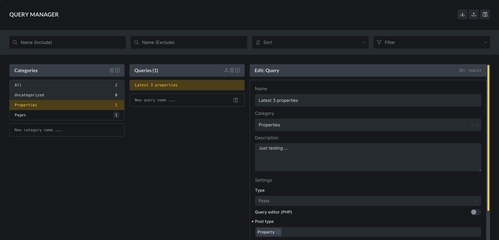

https://youtu.be/b4nGPJIE5rE

Starting with **Bricks 2.1**, Global Queries let you save a Query Loop configuration once and reuse it across your site. The Query Manager is the builder interface for creating, editing, organizing, importing, and exporting those reusable queries.

Use a Global Query when several loops should use the same query logic:

- "Latest news" cards used on multiple landing pages
- A consistent product carousel query
- A reusable team-member query
- A directory listing query with specific roles, ordering, and pagination
- A complex PHP Query Editor setup that should stay centralized
- A shared API query configuration

Global Queries are not required for ordinary one-off loops. Use a local query when the query only belongs to one element.

## Local Query vs Global Query {#local-vs-global}

A **local query** stores all query settings directly on the loop element.

A **global query** stores the full query settings in the site's global Bricks data. The loop element stores only a reference to the global query ID.

When Bricks renders a loop that references a global query, it resolves the global query first and then runs the resolved settings as if they were the loop's query settings.

That means:

- Editing a global query updates every loop that references it.
- Disconnecting a global query copies its current settings into the local loop.
- Deleting or missing global query data leaves referencing loops without the saved global settings.
- Global query settings can include regular query controls, API query settings, and PHP Query Editor settings.

## Create A Global Query From A Loop {#create-from-loop}

1. Select a supported loop element, such as a Container or Block.
2. Enable **Query Loop**.
3. Configure the query as a local query.
4. In the Query control, click the **Create Global Query** icon.
5. Enter a name.
6. Optionally enter a description and category.
7. Create the query.

After creating the global query, Bricks assigns the new global query ID to the loop. The loop now references the global query instead of storing the full local settings.

Use clear names. "Latest Three Properties" is better than "Query 1".

## Create A Global Query In Query Manager {#create-in-manager}

You can also create a global query directly in Query Manager.

Open Query Manager from:

- Toolbar: **Manage > Query Manager**
- Command Palette: **Manage Queries**
- Query control: globe/gear controls

In Query Manager:

1. Create a new query.
2. Select the query.
3. Enter a name, category, and description.
4. Configure the query settings.
5. Save the builder.

The query is available to any loop that can use Global Queries.

## Use A Global Query {#use}

1. Select a loop element.
2. Enable **Query Loop**.
3. Open the Query control.
4. Click the globe/select control.
5. Choose a global query.

If no global queries exist, the globe selection control is not shown.

After selection, the loop stores the global query ID. The query settings are read from the global query when the builder renders and when the frontend renders.

## Edit A Global Query {#edit}

You can edit a global query in two places:

- Query Manager
- The Query control on a loop that references the global query

When editing a global query inline, Bricks indicates that you are editing a shared query. Changes are global. They affect every loop that references that query ID.

Use inline editing for small, obvious adjustments. Use Query Manager when you need to compare names, categories, descriptions, imports, exports, or several saved queries.

## Disconnect A Global Query {#disconnect}

Disconnect converts a global query reference back into a local query.

When you disconnect:

1. Bricks finds the active global query.
2. It copies the global query settings into the current loop.
3. It removes the global query ID from the loop.
4. Future edits on this loop no longer affect the original global query.

Use Disconnect when one instance needs to become a variation. For example, if five pages use "Latest Three Posts" but one page should show six posts, disconnect that one loop first.

## Query Manager Organization {#organization}

Global queries can have:

- **Name**: Required for identifying the query.
- **Description**: Optional context for teams.
- **Category**: Optional grouping.
- **Settings**: The query configuration itself.

Categories help on larger sites where global queries are used for several areas such as blog, products, events, and members.

Avoid creating too many near-duplicates. If two queries differ only by Posts Per Page, decide whether that difference should be local or whether the shared query should be renamed to match its real purpose.

## Import And Export {#import-export}

Query Manager can export selected global queries as JSON.

Exported data includes:

- Selected queries
- Categories used by those selected queries

Importing adds missing queries and categories to the current site. If an imported query already exists by ID, Bricks treats it as an existing query instead of blindly duplicating it.

Use import/export for:

- Moving reusable query definitions between sites
- Sharing a starter query library across client projects
- Backing up global query definitions before major edits

After importing, open each query and verify post types, taxonomies, meta keys, API endpoints, and any dynamic-data assumptions. A query that is valid on one site can still return nothing on another site if the data model differs.

## Permissions {#permissions}

Access to Query Manager is controlled by the builder permission **Access query manager**.

Users without this permission cannot create, edit, disconnect, or manage global queries through the Query Manager controls. They can still select an existing global query when global queries are available. This matters for teams because changing a global query can affect many pages at once.

Give this permission only to users who understand the site-wide effect of shared query edits.

## Multisite Storage {#multisite}

On multisite installations, Bricks can read Global Queries from the main site when the multisite configuration is set to use main-site global queries. Global Query categories have their own main-site configuration.

The normal builder save path stores query and category changes on the current site. If a multisite query appears missing, unexpectedly shared, or unexpectedly local, check both the main-site query configuration and where the latest save was made.

## Global Queries And PHP Query Editor {#query-editor}

A Global Query can include Query Editor PHP.

Important behavior:

- Code execution must be enabled for PHP query editor code to run.
- Query Editor code is signed.
- Missing or invalid signatures prevent the code from running.
- Code Review can include global query Query Editor code.
- Editing Query Editor code inside a global query can affect every loop using that query.

Use a Global Query for PHP editor code only when centralization is worth the blast radius. For one-off special queries, a local query can be safer.

## Global Queries And API Queries {#api}

Global Queries can store API query settings. This is useful when several loops should read from the same endpoint with the same response path, auth method, cache duration, and pagination settings.

When editing API settings from a loop that references a global query, Bricks can update the global query settings rather than only the local loop. Treat this like any other global edit: every instance may change.

API query shortcuts created in the API popup are stored in browser localStorage. They are not saved as global query data and are not shared with other users.

## Global Queries And Query Filters {#query-filters}

Query Filters target the loop element, not the global query definition.

That means you can reuse one global query in several places and use different filter layouts around each loop. Each filter element still needs the correct target query ID for the loop instance it should control.

If you change the global query's object type or base query settings, all filtered instances may be affected.

## Template Import And Remote Templates {#templates}

Templates and imported content can include loops that reference global queries or include global query data. After importing templates, verify whether the expected global queries came with the import and whether the local site data supports them.

Common checks after import:

- Does the loop still reference a valid global query?
- Does the global query use post types that exist on this site?
- Do taxonomy and meta field names exist?
- Does API authentication need new constants or credentials?
- Does Query Editor code need a valid signature?

## Practical Workflow {#workflow}

For a reusable query:

1. Build and test the query locally on one loop.
2. Confirm the output, pagination, filters, and dynamic data.
3. Save it as a Global Query.
4. Name it according to its purpose.
5. Add a description that explains where it should be used.
6. Apply it to other loops.
7. When editing later, check every major place where it is used.

For a one-off variation:

1. Apply the global query.
2. Disconnect it.
3. Make local changes.
4. Rename the local wrapper/section so future editors know it is intentionally different.

## Troubleshooting {#troubleshooting}

### The globe icon is missing

No global queries exist yet, or the current loop already references a global query. Users without **Access query manager** can select existing global queries, but cannot create, edit, disconnect, or manage them.

### A loop changed on several pages

The loop probably uses a Global Query. Open the Query control and check whether it references a global query ID. If only one page should change, disconnect that loop before editing.

### A global query is selected but output is empty

Check the global query settings, then check the local site data. Missing post types, terms, user roles, meta keys, API responses, or query editor signatures can all produce empty output.

### A disconnected loop still seems linked

After disconnecting, save the builder and reopen the Query control. The loop should show local query settings instead of only a global query ID.

### Imported queries are not organized

Imported categories are included only for selected queries that use those categories. Reassign categories in Query Manager if the current site uses a different organization.

### Team members cannot edit queries

Check the user's builder permissions and enable **Access query manager** only for users who should be allowed to make site-wide query changes.
