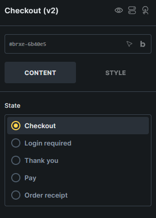
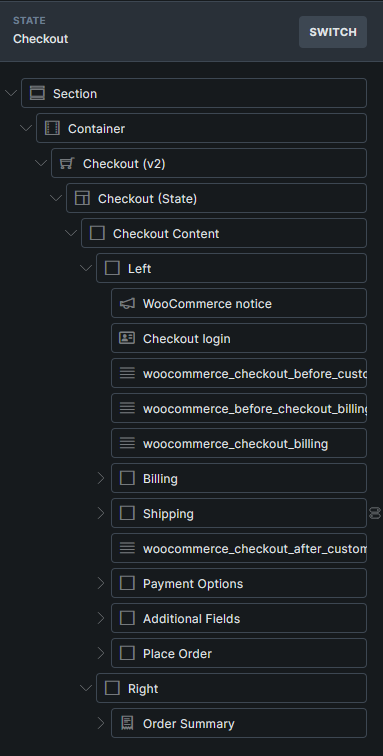
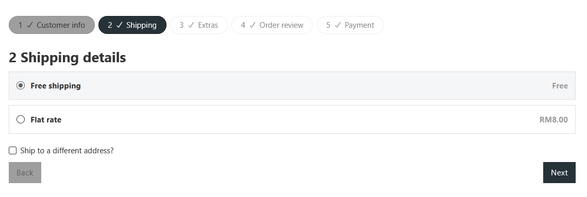
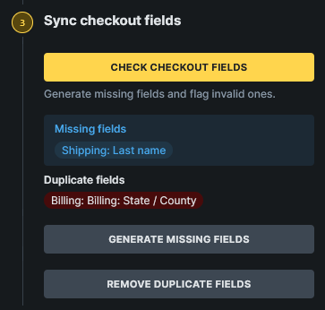

Displays the WooCommerce checkout page as editable Checkout, Login required, Pay, Thank you, and Order receipt states.

:::note
This element requires **Bricks > Settings > WooCommerce > Enable advanced modular elements**.
:::

## Where this element works

Checkout page.

## Key settings

- **State** (radio) - Switches the builder preview between checkout states.

## States

- **Checkout** - Customer details, order summary, payment options, and place order layout.
- **Login required** - Login screen shown when WooCommerce requires login before an order-related checkout screen.
- **Pay** - Payment screen for unpaid orders.
- **Thank you** - Order confirmation screen after checkout.
- **Order receipt** - Receipt screen for unpaid order links that no longer need payment.

## Generated structures

The Checkout state can generate these structures:

- **Complete checkout**
- **Billing fields**
- **Shipping fields**
- **Payment options**
- **Additional fields**
- **Order summary**
- **Place order**

When **Complete checkout** is selected, **Generate as multistep** creates a ready-made multistep checkout layout.

The Login required, Pay, Thank you, and Order receipt states each provide a complete block for that state.

:::note
Some Checkout v2 support elements, including generated form fields, checkout steps, step navigation items, payment options, and place order sections, rely on the correct Checkout v2 state context. If you cannot find a support element in the regular Elements panel, use **Insert a structure** and then edit the generated element in the Structure panel.
:::

## Multistep checkout

Use [Checkout v2 multistep checkout](/integrations/woocommerce/multistep-checkout-v2/) when you want the Checkout state split into multiple steps.

You can create the multistep layout with the [Woo Setup Wizard](/integrations/woocommerce/woo-setup-wizard/) by choosing **Advanced multistep (v2)**, or generate it from the Checkout state by selecting **Complete checkout** and enabling **Generate as multistep**.

The generated layout includes Checkout steps navigation, checkout step nav items, checkout step wrappers, and next/back interactions.

## Field maintenance

Checkout v2 includes a **Sync checkout fields** control group with actions to compare generated fields with the site's current WooCommerce checkout fields:

- **Check checkout fields**
- **Generate missing fields**
- **Remove invalid fields**
- **Remove duplicate fields**

Use these after changing WooCommerce checkout fields or installing plugins that add checkout fields.

Field sync can report valid, missing, invalid, and duplicate generated fields. It can generate missing fields, remove generated fields that no longer exist in WooCommerce, remove duplicate generated fields, and update generated field labels and placeholders from the current WooCommerce field data.

## Query loops, dynamic tags, and interactions

Checkout v2 supports WooCommerce v2 query loops for applied coupons, fees, taxes, order items, order totals, order downloads, and customer notes.

It also adds checkout/order tags such as `{woo_checkout_current_step_number}`, `{woo_order_number}`, `{woo_order_total}`, `{woo_order_item_count}`, and `{woo_order_total_with_item_count}`.

For multistep checkout layouts, use the **Checkout step** interaction action to move to the next step, previous step, a specific step, or a specific checkout field.

See [WooCommerce v2 query loops and dynamic tags](/integrations/woocommerce/woocommerce-v2-query-loops-dynamic-tags/) for the complete reference.

## Usage tips

- Use [WooCommerce advanced modular elements](/integrations/woocommerce/advanced-modular-elements/) or the [Woo Setup Wizard](/integrations/woocommerce/woo-setup-wizard/) to create the recommended Checkout v2 structure.
- Design every checkout state that customers can reach, especially Pay, Thank you, Order receipt, and Login required.
- Use the classic [Checkout template workflow](/integrations/woocommerce/checkout/) if you prefer separate checkout templates.
