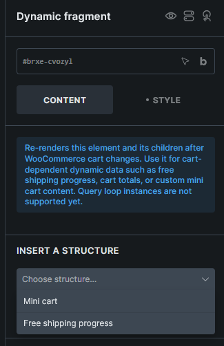

Re-renders WooCommerce cart-dependent content after cart changes.

:::note
This element requires **Bricks > Settings > WooCommerce > Enable advanced modular elements**.
:::

## Where this element works

WooCommerce-aware Bricks layouts, such as page content, headers, and footers that need to update after cart changes.

## Key settings

- **Insert a structure** (select) - Choose a generated starter structure.
- **Generate** (button) - Adds the selected structure to the element.

## Generated structures

- **Mini cart**
- **Free shipping progress**

Generated structures are appended to the current content and do not overwrite existing content.



## Usage tips

- Use Dynamic fragment for cart-dependent content outside the main Cart page, such as custom mini cart content, free shipping progress, or cart totals.
- Keep the fragment focused on content that needs to refresh after add-to-cart, remove-from-cart, or quantity changes.
- Keep the Dynamic fragment wrapper outside other query loops. A cart loop can be placed inside the fragment.

## Custom mini cart pattern

To build a lightweight custom mini cart:

1. Add a Dynamic fragment element where the mini cart should render.
2. Inside it, add a container and enable the **Cart contents** query loop.
3. Design the cart item row inside the loop.
4. Use cart item tags such as `{featured_image}`, `{woo_cart_product_name}`, `{woo_cart_quantity:value}`, `{woo_cart_subtotal}`, and `{woo_cart_remove_link:url}`.
5. Add cart total tags outside the loop but still inside the Dynamic fragment, such as `{woo_cart_items_count}`, `{woo_cart_order_subtotal}`, `{woo_cart_order_total}`, `{woo_free_shipping_remaining}`, and `{woo_free_shipping_progress}`.


See [WooCommerce v2 query loops and dynamic tags](/integrations/woocommerce/woocommerce-v2-query-loops-dynamic-tags/) for the complete tag list.

## Refresh behavior

Dynamic fragment refreshes after WooCommerce cart, coupon, and checkout events such as add to cart, remove from cart, cart emptied, cart totals updated, checkout updated, and coupon apply/remove events.

After a refresh, Bricks reruns frontend functions and dispatches:

```js
document.body.addEventListener('bricks/woocommerce/fragments/refreshed', (event) => {
  console.log(event.detail.fragments)
})
```

## Limitations

- Dynamic fragment is frontend-only.
- Do not place the Dynamic fragment wrapper inside a query loop.
- Component instances are not supported.
- The source area must be header, content, or footer.
