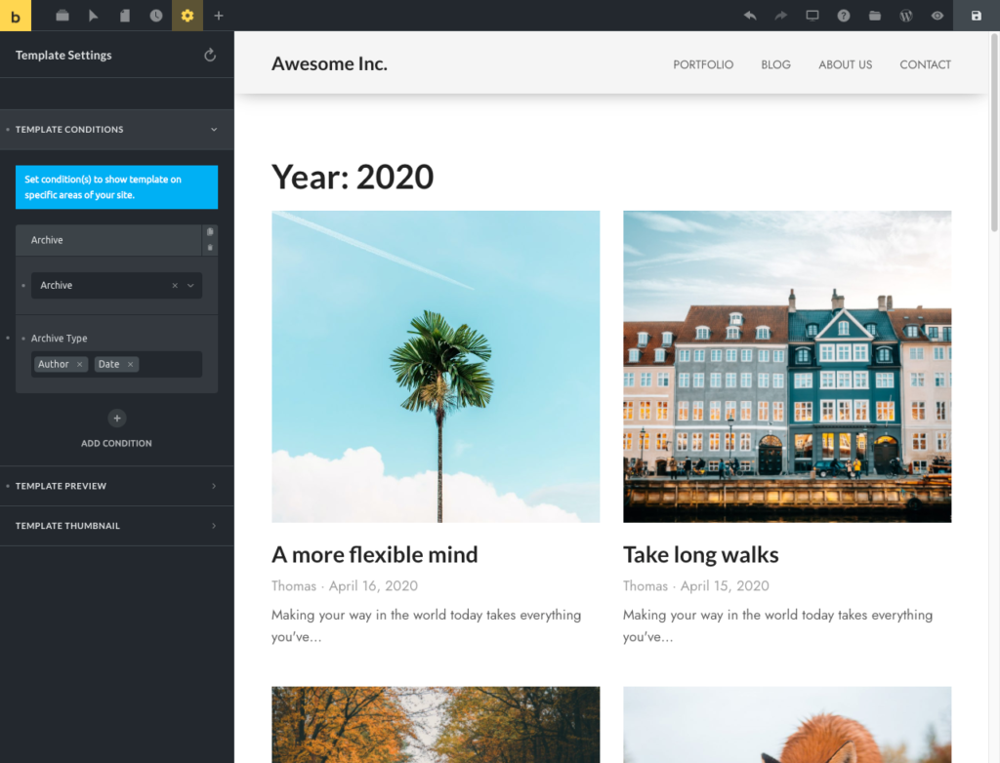
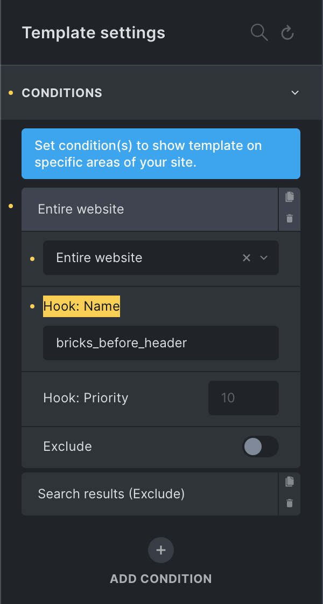

Templates are reusable Bricks layouts that can render in specific parts of your site. They are different from ordinary pages because Bricks can choose them automatically for the current request: the site header, site footer, blog posts, archives, search results, error pages, popups, password gates, and WooCommerce routes.

A template can be a small reusable section, a global header or footer, or the full main layout for a page type. The most common starting set is:

- A **Header** template for the site header.
- A **Footer** template for the site footer.
- A **Single** template for blog posts or another post type.
- An **Archive** template for archive views.

Templates are also used by the Template Library, remote template sources, the Template element, popups, WooCommerce layouts, and password protection.

https://www.youtube.com/watch?v=9v2TUaA-oFg

## The template mental model

Bricks separates a rendered page into template areas:

- **Header:** the active header template.
- **Content:** the active content template, such as a Single, Archive, Search Results, Error Page, Password Protection, or WooCommerce template.
- **Footer:** the active footer template.
- **Popups:** matching popup templates that are loaded for the current page.

When a visitor opens a frontend URL, Bricks checks the current WordPress context. For example, it can detect a single post, the front page, a search results page, an author archive, a category archive, a 404 page, or a WooCommerce route. Bricks then looks through published templates and picks the most suitable template for each area.

That choice is controlled by:

1. The template type.
2. The template conditions.
3. Whether the template is published.
4. Whether default templates are enabled.
5. Page settings such as **Disable header** and **Disable footer**.

## Template type

Every template should have a template type. The type tells Bricks what kind of layout the template is and which settings or elements should be available while editing it.

| Template type | Use it for | Notes |
| --- | --- | --- |
| Header | Site header layouts | Can be used by default when published. Has Header settings. |
| Footer | Site footer layouts | Can be used by default when published. |
| Single | Single posts, pages, or custom post type entries | Needs conditions for predictable frontend use. |
| Section | Reusable sections, hook-injected sections, or templates inserted manually | Inserted copies do not stay synced. Use Components for linked reusable structures. |
| Popup | Popup layouts | Rendered through popup conditions/interactions or through the Template element. |
| Archive | Blog, author, date, post type, taxonomy, and term archives | Can be used by default for archive contexts. |
| Search Results | Native search results pages | Can use Search Criteria settings. |
| Error Page | 404 pages | Can be used by default for error contexts. |
| Password Protection | Password gate templates | Available only when password protection is enabled. |
| WooCommerce templates | Product, product archive, cart, checkout, account, thank-you, and related routes | Visible when WooCommerce is active. Product archive and single product templates can use conditions; the other WooCommerce route templates render automatically on their route. |

## Template conditions {#template-conditions}

Template conditions determine where a template applies.

Open a template in Bricks, click the **Settings** icon, then go to **Template Settings > Conditions**.

<figcaption>

Template Conditions are located under Settings > Template Settings

</figcaption>

Condition types include:

- **Entire website:** broad condition for the whole site.
- **Front page:** the page configured as the WordPress front page.
- **Post type:** posts, pages, products, or custom post types.
- **Archive:** all archives, post type archives, author archives, date archives, or term archives.
- **Search results:** native WordPress search results.
- **Error page:** the 404 page.
- **Terms:** single entries assigned to selected terms.
- **Individual:** selected posts, pages, custom post type entries, or child pages.

Conditions can be broad or specific. A header with **Entire website** can cover the whole site. A Single template with **Post type: Posts** can cover every blog post. Another Single template with **Individual: About Us** can target only one page.

## How Bricks chooses between matching templates

More than one template can match the same page. Bricks scores matching conditions and uses the highest-scoring match.

In practical terms:

- **Individual** conditions are the most specific.
- **Front page** is more specific than a general post type match.
- **Term**, selected archive, and child-page matches are more specific than broad archive or post type matches.
- **Post type** is more specific than **Entire website**.
- **Entire website** is a broad fallback.
- **Exclude** conditions can disqualify a template when the excluded context matches.

If two templates target the same area with similar conditions, make the intended winner more specific or remove the competing condition. Avoid relying on template creation order as your template strategy.

## Include and exclude conditions

Each condition can be an include condition or an exclude condition.

Use include conditions to say where the template should render. Use exclude conditions to remove specific areas from a broad rule.

Example:

1. Header template condition: **Entire website**
2. Header template exclude condition: **Individual > Landing Page**

The header renders across the site except on the selected landing page.

For terms and individual entries, Bricks also supports child matching. You can apply a condition to child terms or child pages when the relationship should inherit the same template behavior.

## Default templates

Bricks can use some published templates even when no conditions are set. This is controlled by **Bricks > Settings > Templates > Disable default templates**.

When default templates are enabled, Bricks can use published templates of supported types as fallbacks. This commonly affects headers and footers, and also applies to supported archive, search, error, and WooCommerce route templates.

When default templates are disabled, templates need matching conditions or route-specific WooCommerce behavior to render on the frontend.

For production sites, explicit conditions are usually easier to audit and maintain.

## Preview content is not a condition

Template editing often needs a preview context. A Single template needs a real post to show post title, content, featured image, and other dynamic data. An Archive template needs an archive context. A Search Results template needs a search term.

Use **Template Settings > Populate Content** to choose what Bricks shows on the canvas while editing.

Populate Content does not decide where the template renders on the frontend. Conditions do that.

## Page settings can still affect templates

A page rendered through a template can still disable its header or footer.

Open the page, go to **Settings > Page Settings > General**, and use **Disable header** or **Disable footer**. This is useful for landing pages, splash pages, checkout-style flows, or isolated campaign pages.

This does not delete the header or footer template. It only disables that template area for the current page.

## Pre-Designed Templates {#community-templates}

Browse Bricks' built-in Wireframes and Design sets right from within the builder.

Access pre-designed templates by clicking the "folder" icon in the builder's top toolbar. Then, under "Source," select **Wireframes**, **Design sets**, or any configured **Remote templates** source.

Insert the template of your choice with a single click and tweak it from there.

:::note
**TIP:** When you start with Bricks, inspecting a template is a great way to learn how a certain layout is structured.
:::

## My Templates {#my-templates}

You can view, create, import, and export your own templates by clicking the Templates (folder) icon in the builder toolbar or directly from the WordPress dashboard:

<figcaption>

My Templates in WordPress Dashboard

</figcaption>

The dashboard view shows template type, template conditions, template bundles, template tags, and the featured image used as the template screenshot.

## Inject Section templates via hooks {#hook}

Section templates can be injected at a WordPress action hook.

When editing a Section template, add a condition and enter the action hook name under **Hook: Name**. You can also set **Hook: Priority**. Bricks evaluates the condition first, then renders the section when that hook runs.

For example, a Section template with condition **Entire website** and hook name `bricks_before_header` renders at that hook across the site.

<figcaption>

Section template rendered at the `bricks_before_header` hook

</figcaption>

:::note
Templates with a hook name are injected on the actual frontend.
:::

## Template Types {#template-types}

Use the table below as a quick reference when choosing a template type.

| Template type | Description | Default or route behavior |
| --- | --- | --- |
| Header | Site header area | Can be used by default. |
| Footer | Site footer area | Can be used by default. |
| Single | Main layout for posts, pages, or CPT entries | Needs conditions for predictable use. |
| Section | Reusable section or hook-injected layout | Render manually, insert into content, or inject through hooks. |
| Popup | Popup layout | Loaded through popup conditions/interactions or Template element usage. |
| Archive | Blog, author, date, post type, taxonomy, and term archives | Can be used by default for archive contexts. |
| Search Results | Native search results page | Can be used by default for search results. |
| Error Page | 404 page | Can be used by default for error pages. |
| Password Protection | Password gate template | Available when password protection is enabled. |
| WooCommerce - Product archive | Shop, product category, product tag, and product attribute archives | Uses WooCommerce archive routing and can use conditions. |
| WooCommerce - Single product | Single product pages | Uses WooCommerce product routing and can use conditions. |
| WooCommerce - Cart | Cart page with items | Automatically rendered on the cart route when the cart has items. |
| WooCommerce - Empty cart | Empty cart page state | Automatically rendered on the cart route when the cart is empty. |
| WooCommerce - Checkout | Checkout page | Automatically rendered on the checkout route. |
| WooCommerce - Pay | Order payment page | Automatically rendered on the order-pay route. |
| WooCommerce - Thank you | Post-checkout thank-you page | Automatically rendered on the order-received route. |
| WooCommerce - Order receipt | Order receipt page | Automatically rendered on the matching WooCommerce route. |
| WooCommerce - Account - Login | Account login form | Automatically rendered on the matching account route. |
| WooCommerce - Account - Lost password | Lost password form | Automatically rendered on the matching account route. |
| WooCommerce - Account - Lost password (Confirmation) | Lost password confirmation | Automatically rendered on the matching account route. |
| WooCommerce - Account - Reset password | Reset password form | Automatically rendered on the matching account route. |
| WooCommerce - Account - Dashboard | Account dashboard | Automatically rendered on the matching account route. |
| WooCommerce - Account - Orders | Account orders | Automatically rendered on the matching account route. |
| WooCommerce - Account - View order | Account view-order endpoint | Automatically rendered on the matching account route. |
| WooCommerce - Account - Downloads | Account downloads | Automatically rendered on the matching account route. |
| WooCommerce - Account - Addresses | Account addresses | Automatically rendered on the matching account route. |
| WooCommerce - Account - Edit address | Account edit-address endpoint | Automatically rendered on the matching account route. |
| WooCommerce - Account - Edit account | Account edit-account endpoint | Automatically rendered on the matching account route. |
| WooCommerce - Account - Payment methods | Account payment methods | Automatically rendered on the matching account route. |
| WooCommerce - Account - Add Payment method | Account add-payment-method endpoint | Automatically rendered on the matching account route. |

:::note
Section templates do not sync inserted copies between pages. If you need linked reusable structures, use [Components](/builder/features/components/).
:::

## Template Bundles & Template Tags {#bundles}

These two Bricks template taxonomies can be used to organize and group your templates together. They are 100% optional.

For example, Bricks template sources can use **Template Bundles** to group individual templates of the same website design together. Feel free to use template bundles in any other way.

**Template Tags** are simple tags. The "My Templates" screenshot above uses template tags such as "Dark" and "Light". Again, they are completely optional but often very useful. Especially as your template library grows over time.

## Troubleshooting template assignment

**Nothing renders:** Confirm the template is published, has the correct type, and has matching conditions. If it has no conditions, check whether default templates are disabled.

**The wrong layout renders:** Look for another template with a more specific condition. Individual, front page, selected term, and selected archive conditions can outrank broader conditions.

**A header or footer is missing only on one page:** Check that page's **Page Settings > General** for **Disable header** or **Disable footer**.

**The builder preview looks unrelated to the frontend:** Adjust **Populate Content**. Preview content controls the editing canvas, not the frontend assignment.

**WooCommerce conditions are missing:** Product archive and single product templates can use conditions. Other WooCommerce route templates, such as cart, checkout, thank-you, and account templates, render automatically on the correct WooCommerce page, so Bricks hides normal Conditions and Populate Content controls for those types.
