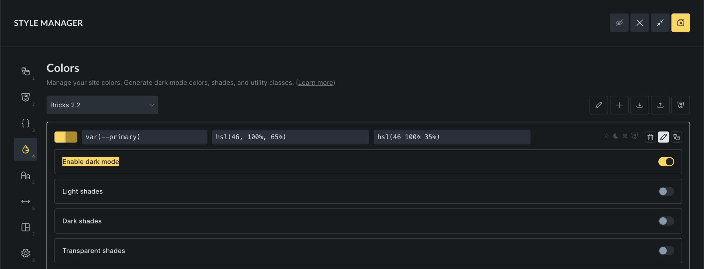
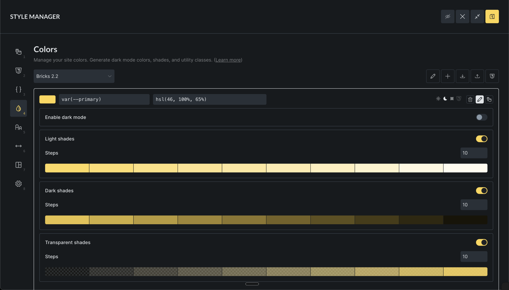

The Color Manager is where you create and maintain the reusable colors for a Bricks site. Use it to turn repeated color values into a color system: named variables, optional dark-mode values, generated shades, and utility classes that can be reused throughout the builder.

Instead of setting isolated hex, RGB, or HSL values on individual elements, save the color once and then select it from color controls. When you later update the saved color, every control that references that color can use the updated value.

## How Color Manager works

Color Manager stores colors in palettes. A palette is a named group of colors, and each color has:

- A generated internal ID.
- A CSS variable name, such as `var(--primary)` or `var(--brand-blue)`.
- A light-mode value, such as `#0057ff`, `rgb(0, 87, 255)`, or `hsl(220 100% 50%)`.
- Optional dark-mode value.
- Optional generated shade entries.
- Optional utility-class settings.

Bricks outputs color palette values as CSS custom properties. Modern Color Manager colors use the variable name you provide, so a color named `primary` is output as `--primary`. Older saved colors can still use the legacy `--bricks-color-{id}` variable format until you convert them.

Dark-mode values are output separately under `:root[data-brx-theme="dark"]`. Utility classes and Color Manager variables are also written into the generated Style Manager CSS file, so utility classes can be used consistently on the frontend.

:::note
Color Manager access depends on the **Access color manager** builder permission. Users without this permission cannot open the Color Manager or manage palettes from color controls.
:::

## Getting started

To access the Color Manager:

1. Open the builder
2. Click the **Settings** icon in the left builder toolbar
3. Open the **Colors** tab

If no palettes exist yet, Bricks prompts you to create one or import a JSON palette.

## Palettes

A palette is only an organizational group. It does not limit where colors can be used. Any saved palette color can be selected from color controls throughout the builder.

### Create a palette

1. Click the **Add Palette** button (plus icon)
2. Enter a palette name, such as `Brand`, `Neutral`, or `Client colors`
3. Click **Create**

### Select, rename, and delete palettes

- Use the palette dropdown to switch between palettes.
- Click the edit icon to rename the active palette.
- Click the trash icon while editing the palette name to delete it.

Deleting a palette removes the saved colors in that palette. Existing element settings that referenced deleted colors may no longer resolve to the expected palette value, so review important templates before deleting a production palette.

Bricks remembers the last active palette in your browser, so the same palette is selected the next time you open Color Manager on that machine.

## Adding colors to your palette

Each saved color needs a variable name and a color value.

1. Open a palette.
2. Enter a variable name, such as `primary`, `surface`, or `brand-blue`.
3. Enter a color value or choose one from the color picker.
4. Click **Add color**.

You can enter the variable name as `primary`, `--primary`, or `var(--primary)`. Bricks normalizes it to `var(--primary)`. If you leave the variable name empty, Bricks generates a variable name in the `var(--bricks-color-{id})` format.

Bricks blocks duplicate variable names across Color Manager palettes and Global Variables. This prevents two different tokens from fighting for the same CSS custom property name.

### Editing existing colors

Click the edit icon on a color to edit its variable name, light value, dark value, shades, or utility classes.

When you rename a color variable, Bricks also updates the generated shade variable names for that color. For example, if `var(--primary)` has light shades, those shades use names such as `var(--primary-l-1)`. Renaming the base variable updates those shade names to match.

### Adding a color from a color control

Color controls include a palette popup. When a control has a custom value, users with Color Manager access can add that current value to the active palette directly from the color control.

This is useful when you discover a useful color while designing, but the better long-term workflow is to create intentional color names in Color Manager and then select them from the palette.

## Selecting palette colors in controls

Most color controls can open the color palette popup. The popup lets you:

- Choose the active palette.
- Switch between list view and grid view.
- Select root colors and generated shades.
- Add the current color value to a palette if you have permission.
- Open Color Manager from the settings icon if you have permission.

When you select a palette color, the element stores a reference to that saved color instead of only storing a raw color value. This is what lets later palette edits update the visual result across the site.

If a saved color cannot be found anymore, Bricks can no longer resolve that palette reference. This usually happens when a color or palette was deleted after being used.

## Using dark mode

Dark mode lets a single color variable use one value in light mode and another value in dark mode.

1. Click the "Edit" icon on any color
2. Enable **Dark mode**
3. Adjust the generated dark value or enter your own
4. Save the builder when you are done

When you enable dark mode, Bricks generates an initial dark value from the light value. Treat that value as a starting point, not as final design guidance. Review contrast manually, especially for text and interactive states.

When you disable dark mode for a color, Bricks asks for confirmation and removes the dark value. Dark-mode shade values for that color are also removed.

## Creating color shades

Shades are generated child colors that stay connected to a root color. A root color can have three shade groups:

- **Light shades**: mixed toward white.
- **Dark shades**: mixed toward black.
- **Transparent shades**: same hue with varying opacity.

To generate shades:

1. Click the "Edit" icon on any color
2. Enable a shade type
3. Set the number of steps
4. Adjust individual generated shade values if needed

Bricks supports 1 to 20 steps per shade group. When you change the root light or dark color, Bricks regenerates the enabled shades for that mode. If you manually fine-tuned a shade, changing the root color or shade step count can replace that manual adjustment.

Shade variables follow the base variable name:

- `var(--primary-l-1)` for light shades
- `var(--primary-d-1)` for dark shades
- `var(--primary-t-1)` for transparent shades

The number at the end is the shade step.

Disabling a shade group removes the generated shade entries for that root color.

## Generating color harmonies

Color harmonies create additional root colors from a selected base color.

1. Select a base color
2. Click the **Harmony** icon
3. Choose a harmony model
4. Review the previewed colors
5. Edit generated variable names if needed
6. Click **Generate colors**

- **Analogous**: Colors next to each other on the color wheel
- **Monochromatic**: Different shades of the same color
- **Complementary**: Colors opposite each other
- **Split Complementary**: One complementary color split into two
- **Triadic**: Three colors evenly spaced
- **Tetradic**: Four colors in a rectangle pattern

Harmony colors are added to the current palette as normal root colors. They are not automatically linked to the source color after generation.

## Setting up utility classes

Utility classes generate reusable class names from your saved colors. Enable them per root color and per CSS property.

1. Edit a color
2. Scroll to **Utility classes**
3. Enable one or more utility types

Available utility types:

| Utility type | CSS property | Example class |
| --- | --- | --- |
| Background | `background-color` | `.bg-primary` |
| Text | `color` | `.text-primary` |
| Border | `border-color` | `.border-primary` |
| Outline | `outline-color` | `.outline-primary` |
| Fill | `fill` | `.fill-primary` |
| Stroke | `stroke` | `.stroke-primary` |

Utility classes are generated for the root color and for that color's shades. If `primary` has light shades and you enable the Text utility, Bricks can generate classes such as `.text-primary` and `.text-primary-l-1`.

Bricks also creates or updates matching global class records for generated utility classes. The CSS rules for those classes are written to the generated Style Manager CSS file.

If you rename a color variable, Bricks updates the generated global class names for that color. If you disable a utility type after assigning its classes to elements, review those elements because the generated CSS for that utility type will no longer be produced.

## Importing and exporting palettes

### Import palettes

1. Click the **Import** icon
2. Drop or select a JSON file
3. Review the import result messages

Imported palette files must contain the expected palette shape: `id`, `name`, and `colors`. Bricks blocks imports when a palette with the same name already exists.

Imported color data should still be reviewed before using it on a production site. Bricks checks the file shape and palette name conflict, but the imported palette may still contain naming conventions or utility-class choices that do not match your site.

### Export palettes and CSS

There are two export options:

- Export the active palette as JSON for use on another Bricks site.
- Open **Generated CSS** and export the active palette CSS.

The generated CSS preview includes variable declarations and utility classes for the active palette. Use this as an inspection or handoff tool. Do not manually edit the generated Style Manager CSS file, because Bricks regenerates it from saved Color Manager data.

## Saving and generated output

Color Manager data is global builder data. Normal palette edits are saved when you save the builder. Importing a palette also persists the updated palette data after the import completes.

When Color Manager data is saved, Bricks regenerates the Style Manager CSS file. That generated file contains:

- Color variables from palettes.
- Utility classes from colors with enabled utility types.
- Scale utility classes from Global Variables categories when those are configured.

Color variables are also included in Bricks generated CSS so selected palette colors can resolve on the frontend.

## Troubleshooting

### A color does not update everywhere

Check whether the elements use the saved palette color or a raw color value. A manually typed `#0057ff` does not stay linked to `var(--primary)`.

### A variable name cannot be saved

The name may already exist in another Color Manager palette or in Global Variables. Use one unique variable name per token.

### A dark-mode value is not visible

Dark-mode values are output for `:root[data-brx-theme="dark"]`. Confirm that the page is actually using the dark-theme attribute and that the color has a dark value.

### Utility classes exist but have no visible effect

Confirm that the utility type is still enabled for the root color. Also check that the generated CSS file was regenerated after the change and that the class is assigned to the element you are inspecting.

### Imported palettes look correct but behave unexpectedly

Review variable names, duplicate naming conventions, dark-mode values, shade groups, and utility-class settings after import. Imported palettes are not automatically adapted to your existing naming system.
