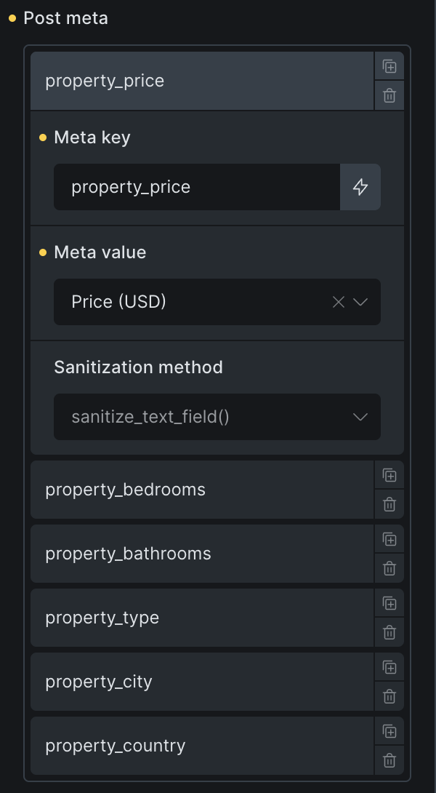

Bricks 2.1 introduced the **Create post** and **Update post** form actions. They let a frontend Form element create a new WordPress post or update an existing one without sending the user to wp-admin.

Use these actions for workflows such as property listings, classifieds, member-submitted posts, profile pages, or client portals. The examples below use a custom post type named `property`, but the same rules apply to any public post type that exists on your site.

:::note
**IMPORTANT:** By default, Bricks checks permissions twice: when rendering the form and again when processing the submission.

- **Create post** requires the current user to have the selected post type's `edit_posts` capability.
- **Update post** requires the current user to have `edit_post` for the target post.

Do not enable **Disable capability checks** unless the form is protected another way. When disabled, non-logged-in or unauthorized visitors can create or edit content through that form.
:::

https://www.youtube.com/watch?v=c9JcrLEVbnM

## Before you start

Decide these things before building the form:

- Which post type the form creates or updates.
- Which users are allowed to submit the form.
- Whether new posts should be saved as draft, pending review, published, or another available post status.
- Which core post fields, custom fields, and taxonomies the form may change.
- Whether uploads should be saved to the Media Library. Featured images, attachment posts, and many ACF/Meta Box media fields need attachment IDs.

## How to create or update posts via form submission

The create and update workflows use the same pattern: add fields, choose the form action, then map the fields to the WordPress data that should change.

### Step 1: Add form fields for post data

Create form fields for all the post data that you want to save when creating or updating a post through the Form element:

| Post data | Recommended field type |
| --- | --- |
| Post title | Text |
| Post content | Rich text |
| Post excerpt | Textarea |
| Featured image | Image |
| Post meta | The most suitable field type for the custom field |
| Taxonomy terms | Checkbox, radio, or select |

#### Post meta

Make sure to select the most suitable field type for every piece of post meta data you want to modify. Bricks stores mapped meta through ACF, Meta Box, or `update_post_meta()` depending on the meta key and the integrations available on the site.

For checkbox, radio, and select fields, Bricks can automatically load choices from ACF or Meta Box when:

- The field is mapped to a matching meta key.
- The form field has no manual options.
- ACF or Meta Box can resolve that field for the post or post type.

If you add manual options to the form field, Bricks uses your manual options instead.

#### Taxonomy

Use checkbox, radio, or select fields for taxonomies such as categories, tags, or custom taxonomies. You can leave the form field options empty. When the field is mapped in the **Taxonomies** repeater, Bricks automatically populates the field with terms from the selected taxonomy.

If you manually add options, use term IDs as the submitted values. On submission, Bricks stores taxonomy terms by ID. If the mapped taxonomy field is empty, Bricks clears the terms for that mapped taxonomy.

### Step 2: Select the form action

Edit the Form element and select **Create post** or **Update post** in the **Actions** control group.

The order of actions matters. If an action returns an error, Bricks stops processing the remaining actions. The **Redirect** action is always moved to the end of the action list so other selected actions can run first.

### Step 3: Configure the action

When creating a new post, select the post type that you want to create a new post for under the "Create post" control group:

<figcaption>

Create new post for post type "Property" on form submission

</figcaption>

When updating an existing post, select the specific post that you want to update under the "Update post" control group:

Leave **Post to update** empty to update the current post. If the form is inside a query loop, Bricks uses the submitted loop object ID so each repeated form can update its own loop item.

Both actions include a **Post status** setting. For **Create post**, leaving it empty lets WordPress use its default insert behavior. For **Update post**, leaving it empty keeps the current post status.

When **Create post** runs for a logged-in user, that user becomes the post author. If you disable capability checks and allow anonymous submissions, Bricks falls back to the site's first super admin user when assigning the author.

## Step 4: Field mapping

The last, and most important step is to map/connect your form fields with the post data that should be modified when the form is submitted. The mapping controls are also located within the "Create post" and "Update post" control groups.

### Mapping simple post data

For simple post data such as the Post title, Post content, Post excerpt, and Featured image you just have to select the corresponding form field from the select dropdown:

For featured images and attachment posts, use fields that save uploads to the Media Library so Bricks can work with the uploaded attachment ID.

Bricks verifies that the mapped featured image value is an image attachment ID before calling WordPress' featured image logic. If the mapped field has no value, Bricks removes the featured image.

### Mapping post meta

When updating post meta via a form field, add an item under **Post meta** and provide:

- **Meta key**: The custom field key to update. Bricks sanitizes this key before saving.
- **Meta value**: The form field whose submitted value should be saved.
- **Sanitization method**: How Bricks should sanitize the submitted value before saving it.

Available sanitization methods include text, integer, float, email, URL, and post-safe HTML. Values that are not handled by ACF or Meta Box fall back to WordPress post meta.

#### ACF and Meta Box handling

When possible, Bricks updates ACF fields through `update_field()` and Meta Box fields through `rwmb_set_meta()` instead of writing raw post meta only. This matters for field types that expect a specific value shape.

For media fields, file upload fields should save files to the Media Library. Bricks processes those uploads before the create/update action so mapped fields can receive attachment IDs.

For ACF group fields, Bricks can resolve nested meta keys and update the parent group value so nested data remains structured correctly.

### Taxonomies

Mapping a form field to a taxonomy is straightforward. Under **Taxonomies**, select the taxonomy to update and the corresponding form field.

There is no need to manually enter taxonomy terms unless you want to limit the choices. Bricks will automatically populate the form field with the selected taxonomy's terms when the mapped form field has no manual options.

## Security and validation details

Bricks still runs the normal form submission checks before the create/update action:

- The AJAX submission must include a valid Bricks form nonce.
- Submitted field IDs must match fields that exist in the form settings. Unexpected or duplicate field IDs are rejected.
- Required field validation, max-length validation, honeypot checks, and enabled captcha checks run before actions.
- The action repeats capability checks server-side unless you disabled them.

The form is not rendered for unauthorized users when capability checks are enabled. If you set a custom error message in the Create post or Update post control group, Bricks displays that message instead.

## Common setups

### Let users submit posts for review

Use **Create post**, keep capability checks enabled for trusted logged-in users, and set **Post status** to **Pending** or **Draft**. Map only the fields users should control.

### Let authors edit their own posts

Use **Update post**, leave **Post to update** empty on a single post template, and keep capability checks enabled. WordPress will allow the update only if the current user can edit that post.

### Update items inside a query loop

Place the update form inside the query loop and leave **Post to update** empty. Bricks submits the loop object ID and updates the matching loop item.

### Create attachment posts from uploads

Set **Post type** to **Attachment** and use a file upload field that saves to the Media Library. Bricks uses the first uploaded attachment it finds and can update its title, content, excerpt, status, meta, and terms through the mapped fields.

## Filters

Bricks supports many ACF and Meta Box field types out of the box, but every custom setup is different. You can adjust mapped meta values before they are saved with these filters:

- [`bricks/form/create_post/meta_value`](/developer/hooks/filters/filter-bricks-form-create_post-meta_value/)
- [`bricks/form/update_post/meta_value`](/developer/hooks/filters/filter-bricks-form-update_post-meta_value/)
