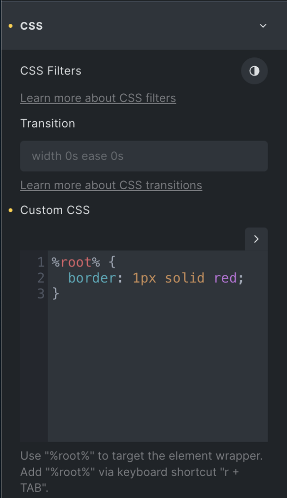
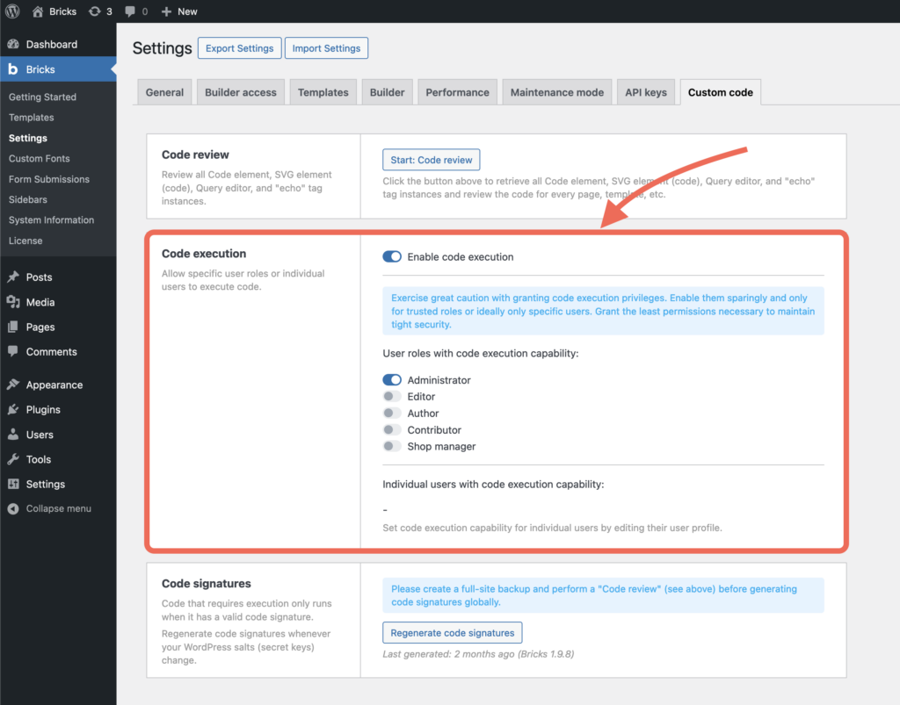
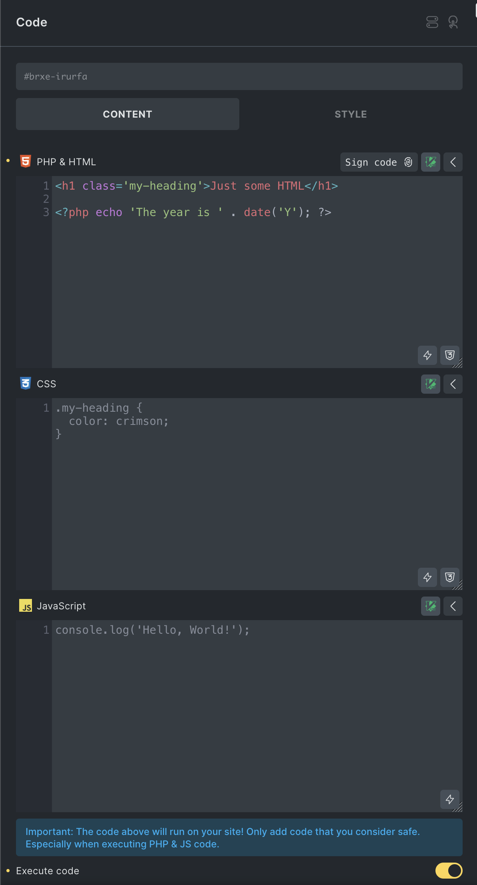

Bricks allows you to add custom code (CSS, JavaScript, HTML, and PHP) to different parts of your website.

https://www.youtube.com/watch?v=LiYwBZ_R-f8

## Where custom code can be added

Bricks has several custom-code locations. Choose the smallest location that matches what you need:

- **Global CSS and scripts**: Use this for code that should load across the entire site.
- **Page-specific CSS and scripts**: Use this for code that should load only on one page or template.
- **Element-specific CSS**: Use this for CSS tied to one element or global class.
- **Code element**: Use this when you need to place PHP/HTML, CSS, or JavaScript at a specific point in the page output.

Executable PHP and SVG code are security-sensitive. They only run when code execution is enabled, the current user has code execution capability, and the saved code has a valid code signature.

## Global CSS and JavaScript

You can add global **Custom CSS** and **Custom JavaScript** under **Bricks > Settings > Custom code**.

Global Custom CSS is added at the end of the document `<head>`.

Custom scripts can be added in three document locations:

- **Header scripts**: Added right before the closing `</head>` tag.
- **Body (header) scripts**: Added right after the opening `<body>` tag.
- **Body (footer) scripts**: Added right before the closing `</body>` tag.

Wrap JavaScript entered in the global script fields in `<script>` tags. These fields are intended for items such as analytics snippets, third-party embeds, and other site-wide scripts.

## Page-Specific CSS and JavaScript

To apply custom CSS and JavaScript to a specific page or template, edit it with Bricks and open **Settings > Page Settings > Custom Code**. Code entered there is scoped to the page or template you are editing instead of the entire site.

## Element-Specific Custom CSS {#custom-css}



Extend the styles of any element and global class by adding your own custom CSS to it.

First, select the element you want to style. Then open the **Style** tab and expand the **CSS** control group.

Use the `%root%` placeholder to target the element or global class you are currently editing. Bricks automatically converts `%root%` to the element ID or global class selector.

Keyboard shortcut to insert `%root%`: type `r` and press `TAB`.

Example:

```css
%root% {
  border: 1px solid red;
}
```

### CSS code completion via Emmet

You can use CSS abbreviations to write your CSS faster. Instead of writing `margin: 10px`, type `m10` and press `TAB`.

[https://docs.emmet.io/css-abbreviations/](https://docs.emmet.io/css-abbreviations/)

## Bi-directional CSS Sync

Introduced in Bricks 2.4, Bi-directional CSS Sync keeps an element's or global class's Custom CSS synchronized with the corresponding Bricks style controls.

https://www.youtube.com/watch?v=jZZA42hcS-U

Enable this experimental feature under **Bricks > Settings > Builder > CSS Sync**.

Change a supported property in the CSS editor, and its corresponding style control updates automatically. Changes made through a style control are written back to Custom CSS. Unrelated or unsupported CSS remains untouched.

CSS Sync respects the active breakpoint and pseudo-class. If the same property is defined in Custom CSS and a style control, Custom CSS takes precedence in the builder and on the frontend.

## Code Element (PHP, HTML, CSS, JS) {#code-element}

The **Code** element lets you place PHP/HTML, CSS, and JavaScript at a specific location in the page output.

By default, code entered in the Code element is displayed as a formatted code snippet. To execute PHP/HTML output instead, enable the element's **Execute code** setting.

The Code element has separate editors for:

- **PHP and HTML**: Can be rendered as a code snippet or executed when **Execute code** is enabled.
- **CSS**: Automatically wrapped in `<style>` tags when executed, unless you already include style tags.
- **JavaScript**: Automatically wrapped in `<script>` tags when executed, unless you already include script tags.

### Enable code execution

To execute Code element PHP/HTML, first enable **Code execution** under **Bricks > Settings > Custom code**.

Code execution has two layers:

- The global **Enable code execution** setting must be enabled.
- The user must have the Bricks **Execute code** capability, either through their role or an individual user-profile override.

If code execution is disabled, or if your user does not have the capability, Bricks does not show the executable controls and displays a "Code execution not allowed" notice.



<figcaption>

Code execution enabled for the Administrator role

</figcaption>

Make sure to only enable code execution for users and roles you trust.

Code execution can also be disabled by code using the `bricks/code/disable_execution` filter. Older sites may still use the deprecated `bricks/code/allow_execution` filter set to `false`; that also disables execution.

### Code signatures

Executable code only runs when code execution is enabled and the saved code has a valid code signature. Regenerate code signatures whenever your WordPress salts or secret keys change.

Code signatures apply to executable Bricks code such as Code element PHP/HTML, SVG element source code, Query editor code, component query properties, and global query records. Changing signed code invalidates the old signature until the code is signed again.

See [Code signatures](/builder/features/code-signatures/) for signing workflows, global regeneration, and the dangerous automatic signing constants.

### How to add PHP and HTML code to your element {#execute}



<figcaption>

Code Element: Executing HTML and PHP code

</figcaption>

1. Add a **Code** element to the canvas.
2. Enter PHP/HTML in the **PHP and HTML** editor.
3. Enable **Execute code**.
4. Review the code.
5. Click the **Sign code** icon at the top-right of the code editor, or use `CMD/CTRL + R`.
6. Save the page.

When **Execute code** is enabled, Bricks verifies the code signature before running the PHP/HTML. If the signature is missing or invalid, Bricks renders an error placeholder instead of executing the code.

The Code element also has optional execution settings:

- **Parse dynamic data**: Parses Bricks dynamic data inside the executable PHP/HTML.
- **Suppress PHP errors**: Hides PHP errors unless the URL includes `brx_code_errors`.
- **Render without wrapper**: Outputs the executed result without the Code element wrapper on the frontend.

## Security checklist

Before enabling or signing executable code:

- Grant code execution to the fewest trusted users possible.
- Prefer page-specific or element-specific CSS/JS when PHP is not needed.
- Review the code before signing it.
- Re-sign code after editing it.
- Regenerate signatures after changing WordPress salts.
- Run a Code review before global signature regeneration.

### HTML Code Completion via Emmet

You can use abbreviations to generate your HTML structures much faster via a familiar CSS-based syntax.

**Abbreviation:** `#header` (+ TAB key)

**Generates:**

```html
<div id="header"></div>
```

**Abbreviation:** `h$[title=item$]{Header $}*3`

**Generates:**

```html
<h1 title="item1">Header 1</h1>
<h2 title="item2">Header 2</h2>
<h3 title="item3">Header 3</h3>
```

[https://docs.emmet.io/cheat-sheet/](https://docs.emmet.io/cheat-sheet/)
