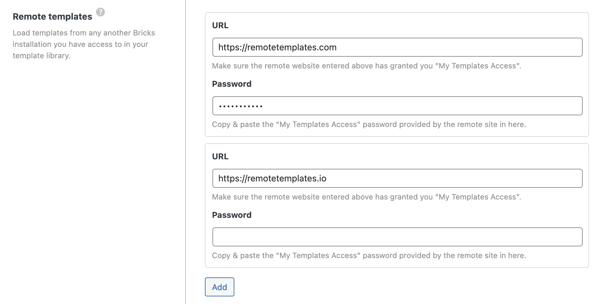
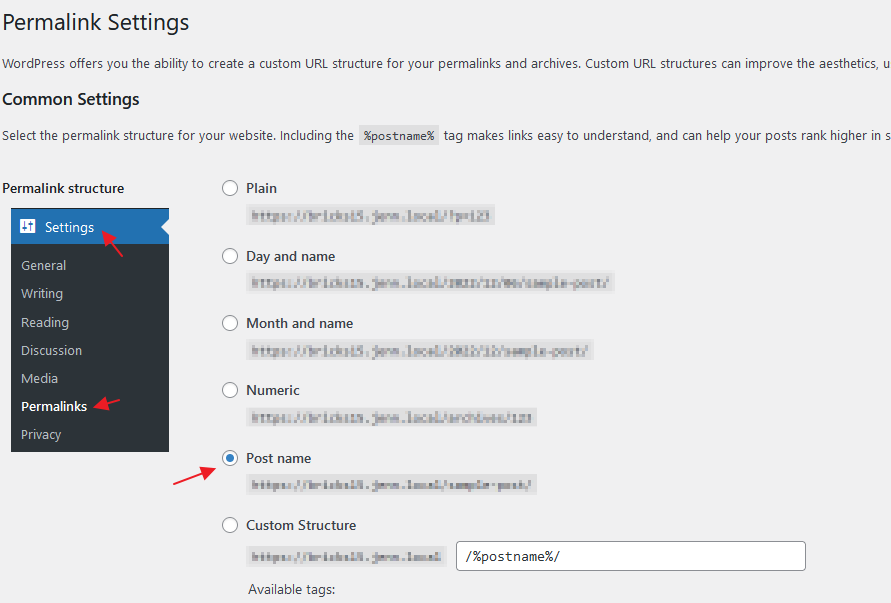
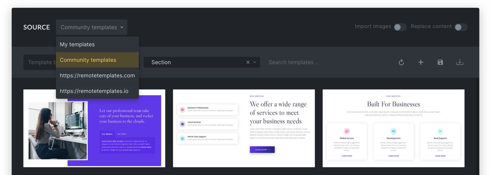

Remote templates allow you to view & insert templates of another Bricks installation. Avoiding the constant template export from one site and then importing them on another site.

Public access to your templates is disabled by default. Follow the steps below to make your templates easily available as a remote template source.

Remote templates have two sides:

- The **source site** exposes its Bricks templates through the Bricks REST API.
- The **consumer site** adds that source URL under its remote template settings and fetches the templates in the builder Template Library.

## Step 1: Enable My Templates Access

First, you have to enable template access on the site whose templates you want to browse and insert.

In your WordPress dashboard, go to **Bricks → Settings → Templates** and enable the **My Templates Access** checkbox. With this setting enabled, your template library is accessible to anyone who knows your site URL.

It is recommended to restrict access by whitelisting URLs and/or password protection:

Use the **Whitelist URLs** setting to provide template access only to the specified URLs.

Set a password under **Password Protection** to restrict template access to people who know the correct password.

Use **Exclude templates** to keep specific local templates out of remote template access.

:::note
**Since Bricks 1.9.4, you can add unlimited remote template URLs!** Click the "Add" button to add another template URL. To remove a previously added remote source, clear the URL and password input fields and save your settings.
:::

Please ensure the **permalink structure** of this WordPress website (Settings > Permalinks) is set to something other than **Plain**.

Bricks checks the following before returning templates from the source site:

- **My Templates Access** must be enabled.
- The request must include the consumer site's URL.
- If **Whitelist URLs** is filled, the consumer site's URL must match one of the listed URLs. Enter one URL per line.
- If **Password Protection** is filled, the consumer site must provide the same password.

## Step 2: Remote Templates Settings

Log into the site you want to browse and insert templates from.

Go to **Bricks → Settings → Templates** and paste the URL of the Bricks site you want to retrieve templates from into the **Remote Templates URL** field.

If you've set password protection on the other website, make sure to enter the password under **Remote Templates Password**.

Since Bricks 1.9.4, each remote source can also have a **Name**. If a name is set, the Template Library source dropdown shows that name instead of the remote URL.

Then click **Save Settings**, open the builder, and then open the template library.

You should now see the remote template URLs added to the template `SOURCE` dropdown, as illustrated in the following screenshot:

Users need the `Access remote templates` builder permission to see remote template sources in the Template Library.

## How fetching and caching works

When you select a remote source in the Template Library, Bricks asks your own site to fetch the source site's `get-templates-data` REST endpoint. The request includes the consumer site's URL and the remote password when one is configured.

Since version 1.9.4, Bricks no longer stores remote template data in your WordPress database. In the builder, remote template data is cached in the browser for up to 7 days per source. Use the refresh icon in the Template Library to fetch the selected remote source again before the cache expires.

The fetched data can include templates, authors, bundles, tags, global variables, and color palettes. When exporting remote template element data, Bricks removes code signatures from Code, SVG, and query settings unless the request explicitly keeps them.

## Troubleshooting

If a remote source does not appear, check that the current builder user has the `Access remote templates` permission.

If a remote source appears but fails to load, check these items on the source site:

- **My Templates Access** is enabled.
- Permalinks are not set to **Plain**.
- The consumer site's URL is listed under **Whitelist URLs**, if a whitelist is used.
- The password entered on the consumer site matches the source site's **Password Protection** value.
- The templates you expect are not selected under **Exclude templates**.
