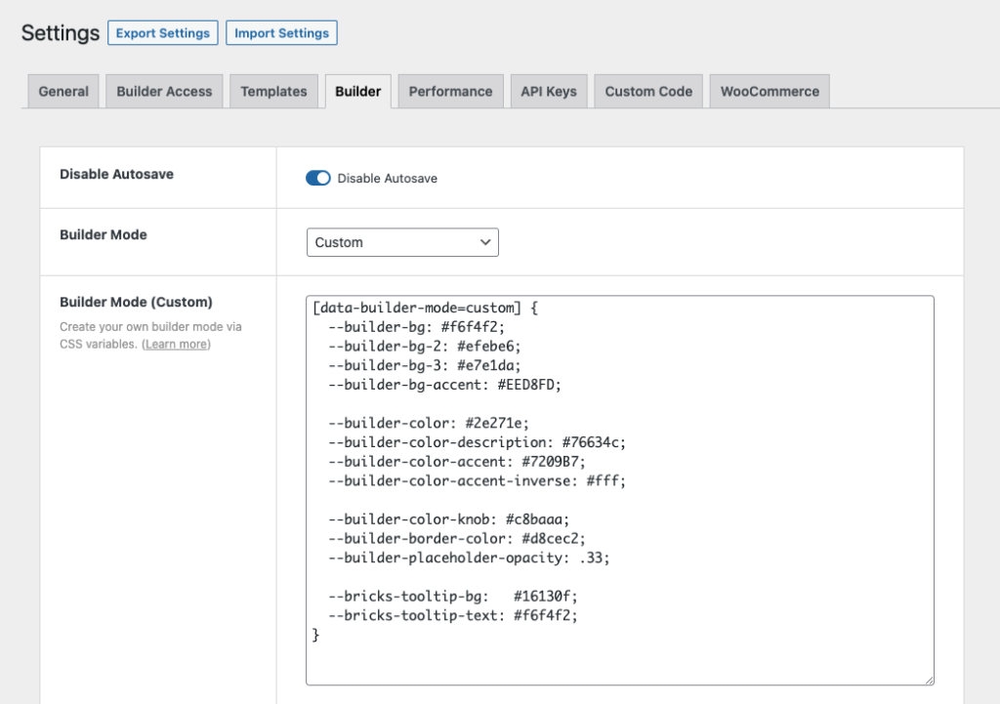
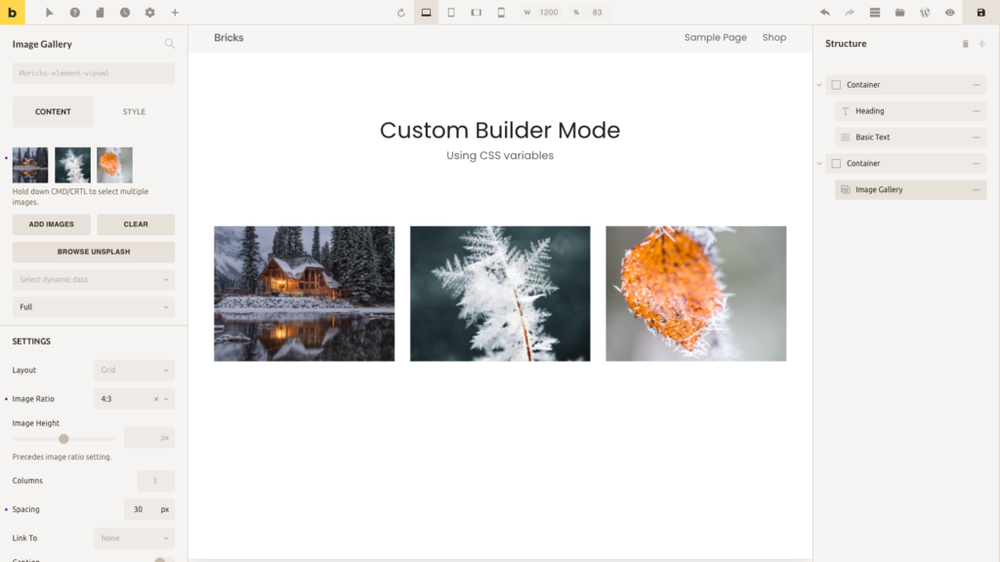

Starting with Bricks 1.3.7 you can customize the builder mode (color scheme) to your liking by tweaking a few CSS variables.

You first have to set the "Builder Mode" under Bricks → Settings → Builder to "Custom" and save your settings.

The following new setting called "Builder Mode (Custom)" should now appear:



Below you can find a starter CSS snippet with commonly customized builder CSS variables. Bricks 2.x defines additional variables for classes, components, status colors, muted colors, and the canvas scrollbar, so use this as a starting point and override any extra variables your custom mode needs.

```php
[data-builder-mode=custom] {
  --builder-bg: #f6f4f2;
  --builder-bg-2: #efebe6;
  --builder-bg-3: #e7e1da;
  --builder-bg-4: #dbd2c8;
  --builder-bg-accent: #EED8FD;

  --builder-color: #2e271e;
  --builder-color-description: #76634c;
  --builder-color-accent: #7209B7;
  --builder-color-accent-inverse: #fff;

  --builder-color-knob: #c8baaa;
  --builder-border-color: #d8cec2;
  --builder-placeholder-opacity: .33;

  --builder-color-class: #2b6cb0;
  --builder-bg-class: #d8e8f6;
  --builder-color-component: #6b46c1;
  --builder-bg-component: #eadcf8;
  --builder-color-info: #006c9c;
  --builder-bg-info: #d9f1ff;
  --builder-color-danger: #b42318;
  --builder-bg-danger: #ffe4e2;
  --builder-color-success: #027a48;
  --builder-bg-success: #dcfae6;
  --builder-color-muted: #7a6f63;
  --builder-bg-muted: #e2ddd6;

  --builder-canvas-scrollbar-thumb: #c8baaa;
  --builder-canvas-scrollbar-thumb_hover: #76634c;
  --builder-canvas-scrollbar-track: #efebe6;

  --bricks-tooltip-bg:   #16130f;
  --bricks-tooltip-text: #f6f4f2;
}
```

If you copy the CSS above, paste it into your "Builder Mode (Custom)" setting, and save your settings, your builder should look like this:




<figcaption>

Bricks builder with a custom color scheme (mode)

</figcaption>


### Resources

- Color palettes: [https://coolors.co/palettes/trending](https://coolors.co/palettes/trending)
- Color palettes: [https://colorhunt.co](https://colorhunt.co)
- Generate color shades & tints: [https://www.colorhexa.com](https://www.colorhexa.com)

Note: In custom builder mode, Code element's background color changes to a light color scheme.
