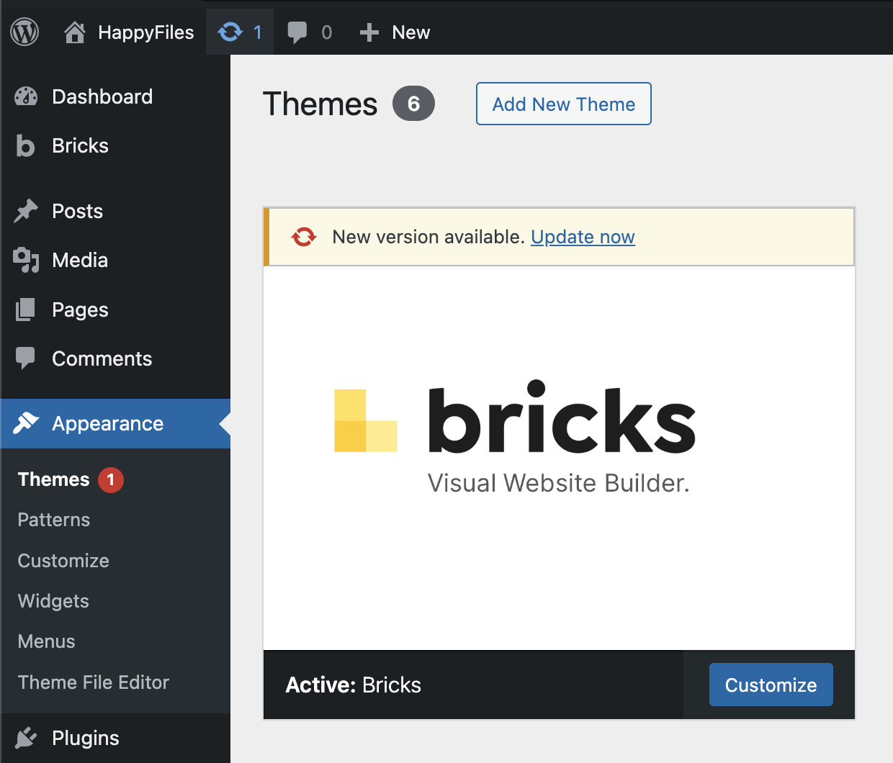

For first-time installation and activation, follow [Installation and setup](/getting-started/installation-setup/).

This article covers **automatic updates**, **staging and safe updates**, **which URLs count toward your license**, and **managing activations** in your Bricks account.

Your Bricks account and downloads live at [my.bricksbuilder.io](https://my.bricksbuilder.io/) (same destination the theme uses for remote services).

## Define the license key in wp-config.php {#constant}

Starting with Bricks 2.4, you can define your Bricks license key as a PHP constant in `wp-config.php`:

```php
define( 'BRICKS_LICENSE_KEY', 'your-license-key' );
```

Add the constant above the line that says `/* That's all, stop editing! Happy publishing. */`.

Use this when you manage WordPress sites from a blueprint, clone sites for development, or prefer to keep the raw license key out of the WordPress options table.

When `BRICKS_LICENSE_KEY` is defined, Bricks uses it as the active license key. The license screen at **Bricks > License** shows that the key is defined by the constant and provides a **Re-validate license** button.

If a license key is also saved in the database, Bricks keeps using `BRICKS_LICENSE_KEY` while the constant is active. The license screen shows a notice and a **Remove saved database key** button. This removes the local `bricks_license_key` option only. It does not remotely deactivate the license.

To use a different key, update the constant value and re-validate the license. To return to a database-stored key, remove the constant and activate the license from **Bricks > License**.

## How to update Bricks {#how-to-update}

If you have activated your Bricks license key on your site, you'll automatically receive update notifications in your WordPress dashboard. You can then perform the update to the latest version of Bricks with one click from your WordPress dashboard.



You can also always manually download the latest version from your Bricks account at [https://my.bricksbuilder.io/](https://my.bricksbuilder.io/) as a ZIP file.

### Test on staging & read the changelog

We recommend to perform updating a mission-critical software like Bricks first on a staging server. Especially if your website is live, receives a lot of traffic, you are running marketing campaigns, offers, etc. Once you confirmed that everything is working as expected you can update your live site.

Every noticeable host offers, mostly free of charge, an easy one-click staging solution. Please reach out to your host if you are not sure how this works.

Every update is accompanied by an in-depth release changelog. Please take the time to go over it at [https://bricksbuilder.io/changelog/](https://bricksbuilder.io/changelog/) before you perform the update.

This way you know exactly what changed, if any adjustments or steps need to be performed on your end, which new features are available, and so on.

### Local, staging & intranet installations don't count against your license limit {#local}

These rules are enforced by the Bricks account/licensing service. During license activation, validation, and update checks, the Bricks theme sends the current site/license data, including the site URL/domain and Bricks version, to the licensing service. The service then decides whether a URL counts toward your license limit.

The following URL structures are treated as local, staging, or intranet sites and do not count against your license limit.

**Local URLs:**

- `192.168.x.x`
- `127.0.0.1`
- `localhost` (includes)
- `.local` (top-level domain)
- `.test` (top-level domain)
- `.wip` (top-level domain)

<span id="staging"></span>

**Staging URLs:**

- Staging subdomains (dev, staging, test)
  - `dev.yoursite.com`
  - `staging.yoursite.com`
  - `test.yoursite.com`
- Cloudways: `.cloudwaysapps.com`
- Dreamhost: `.stage.site`
- Flywheel: `.mysites.io`
- GoDaddy: `.myftpupload.com`
- Hostinger: `.hostingersite.com`
- InstaWP: `.instawp.site` & `.instawp.xyz` & `instawp.com`
- Kinsta: `.kinsta.cloud`
- Lando Pantheon: `.lndo.site`
- Plesk: `.plesk.page`
- Raidboxes: `.myrdbx.io`
- Runcloud: `.temp-site.link`
- SiteGround: `.sg-host.com`
- SpinupWP: `.spinupwp.site`
- TasteWP: `.tastewp.com`
- WP Engine:`.wpenginepowered.com`
- wp-space.de: `.wpspace.partners`
- xCloud: `1wp.site`, `.wp1.site`, `wp1.sh`, `wp1.host`
- ZipWP: `.zipwp.link`

<span id="intranet"></span>

**Intranet (top-level domains):**

- `.intranet`
- `.internal`
- `.private`
- `.corp`
- `.home`
- `.lan`

**With a Bricks Starter license (1 active site limit), you can build your site locally with Bricks & use your Starter license on your live site simultaneously.**

You can deactivate the license key from your site from your WP dashboard under `Bricks > License`, and activate it on another site or remove the site from your Bricks account under the "Sites" tab. We monitor any potential misusage (attempts to avoid purchasing a sufficient plan) and reserve the right to limit further license activations.
