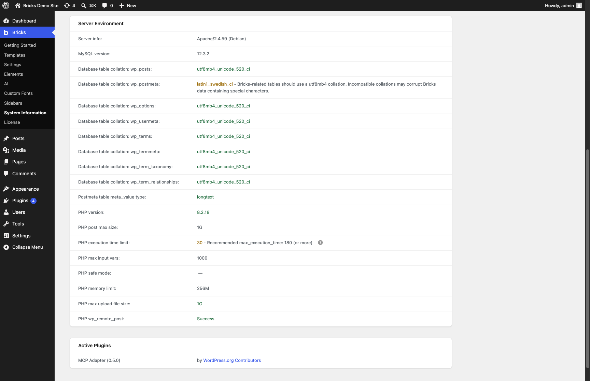

A website built with Bricks depends on more than Bricks itself. WordPress, plugins, custom code, your browser, caching, a CDN, the web server, PHP, and the database can all affect what you see.

When something goes wrong, you first need to find out which part of the site is causing it.

After helping thousands of Bricks users troubleshoot their websites, we have found that elimination is usually the quickest way to get there. Start with a few harmless checks, then test the site with only the components needed to reproduce the issue.

This guide applies whether the problem appears in the builder, on the frontend, while saving, after an update, or somewhere else on the site.

## A Bricks website has several moving parts

A problem that appears in Bricks does not necessarily start in Bricks. The same is true for problems that appear in WordPress or on the frontend.

The main parts involved are:

- Your browser and its extensions
- WordPress, Bricks, and other plugins
- The active theme and custom code
- Browser, plugin, server, and CDN caches
- Optimization and security services
- PHP, the web server, and the database

These parts interact with each other.

For example, a save button that keeps spinning may look like a builder problem. The request could actually be blocked by a browser extension, rejected by a security plugin, interrupted by a PHP error, or blocked by a firewall rule.

Troubleshooting is the process of removing possible causes until you know which part of the site is involved.

## Make sure you can reproduce the issue

Before changing anything, repeat the action that causes the problem.

You only need a basic understanding of:

- What action triggers it
- What you expected to happen
- What happened instead
- Whether it affects one page or the whole site
- Whether it happens every time

Keep the description factual. “The save indicator keeps spinning, and the old content returns after reloading” is more useful than “Bricks cannot save.”

If the issue is inconsistent, look for what changes between attempts. It may depend on a particular page, browser, user role, screen size, field value, or cached response.

Use a staging site when testing could affect visitors, orders, forms, memberships, stored content, or site configuration. Create a backup before investigating missing data, failed saves, migrations, or database problems.

## Start with the quick checks

Rule out causes that are easy to test and do not require changing the website.

1. Open the affected page in a private browser window.
2. Try another browser.
3. Temporarily disable browser extensions.
4. Clear the browser, WordPress, server, and CDN caches.
5. Temporarily bypass JavaScript delay, minification, script combination, and similar optimization features.

Repeat the same action after each test.

If the issue only occurs in one browser, the cause is probably local to that browser or one of its extensions.

If clearing a cache fixes the issue temporarily, find out which cache served the outdated response. Otherwise, the problem may return when that cache is populated again.

## Isolate the site in bulk

If the quick checks do not reveal the cause, test a minimal version of the site on staging.

Keep Bricks active. If the issue involves another plugin, keep that plugin active too. Disable the other plugins, custom snippets, caching, and optimization.

For example, if you are investigating an interaction between Bricks and a multilingual plugin, keep Bricks and that plugin active. Disable everything else for the test.

Then clear all caches and repeat the original steps.

:::note
Do not run plugin isolation on a live store, membership site, learning platform, or another site where disabling plugins could interrupt visitors, transactions, or background processing.
:::

### If the issue disappears

Something you removed was involved.

Restore the disabled plugins and features one at a time. Repeat the same test after each one. When the issue returns, the last component you enabled is part of the conflict.

That component may still work correctly on its own. The issue may only appear when two plugins, settings, or scripts interact.

Confirm the result by testing the suspected combination again.

### If the issue remains

You have ruled out most third-party plugins, custom code, caching, and optimization.

Reduce the test further:

- Try the same action on a new page.
- Use one basic Bricks element when possible.
- Test with a standard theme.
- Try another administrator account.
- Remove any content that is not required to trigger the issue.
- Test on a fresh WordPress installation with only Bricks active.
- If another plugin is involved, activate only Bricks and that plugin.

A problem that survives this process is much easier to investigate because fewer parts of the site can be responsible.

## Follow the evidence

You do not need to perform every diagnostic check. Use the visible symptom to decide where to look next.

### Compare the builder and frontend

When the issue affects a Bricks page, check the same page in the builder and on the frontend.

- If the builder is correct but the frontend is not, check caching, generated CSS, template conditions, rendering settings, and frontend code.
- If elements appear in the Structure panel but not on the canvas, check CSS, JavaScript, browser extensions, and optimization.
- If elements are missing from the Structure panel as well, check revisions and stored data before saving the page again.
- If the frontend works while logged in but not while logged out, check public caching, template conditions, permissions, and frontend requests.

Confirm that the page uses **Render with Bricks** when you expect Bricks to render its layout. **Render with WordPress** uses the WordPress content instead. Changing this setting does not delete the saved Bricks layout.

See [Start Editing With Bricks](/builder/interface/editing-with-bricks/#edit-with-bricks-vs-render-with-bricks).

### Check failed browser requests

Open the browser developer tools and repeat the action.

Check **Console** for JavaScript errors and **Network** for failed or blocked requests. Responses with `401`, `403`, `404`, or `500` status codes can help identify the next place to investigate.

A failed request may come from WordPress, Bricks, another plugin, a security service, or the server. The response body often contains more useful information than the status code alone.

### Check WordPress and the server

Open **Bricks > System Information** and review the WordPress, Bricks, PHP, database, server, and active-plugin information.

Compare the environment with the [Bricks requirements](/builder/setup/requirements/).

If the browser shows a failed request, match its timestamp with the PHP and web-server logs. Look for:

- PHP errors
- Exhausted memory
- Execution time limits
- Request-size limits
- File permission errors
- Blocked REST API requests
- ModSecurity or firewall rules
- Rate limiting
- SSL or proxy configuration errors

The time, request URL, response status, and corresponding log entry usually provide a better lead than the visible error alone.

## When content or saved data is missing

Stop saving the affected page until you know whether an earlier version can be recovered. Another save may replace a useful revision or autosave.

Open **Manage > History / Revisions** in the builder and preview the available versions before applying one.

See [Revisions](/builder/interface/revisions/) for the recovery workflow.

If an earlier revision contains the missing content, restore it and verify the page. Keep the backup until you understand why the data disappeared or became unreadable.

### After migrating a site

A migration can affect URLs, serialized data, file paths, permissions, caches, and database configuration.

The frontend may continue showing cached HTML while the destination database contains unreadable builder data. Check the builder and an uncached frontend request before deciding that the migration preserved everything.

Bricks element data can include PHP serialized values. A basic text or SQL replacement can change a URL without updating the stored string length. WordPress may then be unable to read the value.

If content is missing after a migration:

1. Stop saving the affected pages on the destination.
2. Check whether the content still opens on the source site.
3. Check a pre-migration backup.
4. Confirm that the migration tool handles PHP serialized data.
5. Repeat the migration from an intact source when necessary.

Do not run a raw SQL `REPLACE()` query against Bricks post metadata. The [WordPress migration guide](https://developer.wordpress.org/advanced-administration/upgrade/migrating/) explains why database-wide URL replacement can damage serialized data.

[WP-CLI search-replace](https://developer.wordpress.org/cli/commands/search-replace/) handles serialized data and supports a dry run.

### After entering special characters

If content disappears after saving a smart quote, non-breaking hyphen, emoji, or another special character, check the database section under **Bricks > System Information**.



- A green `utf8mb4_*` value is compatible.
- A warning means the table does not use a compatible `utf8mb4` collation.
- **Unknown** means Bricks could not retrieve the collation.

Correcting the collation can prevent the same storage problem on future saves. It cannot reconstruct data that is already corrupted.

Recover the affected page from a revision, autosave, intact source site, or database backup. Changing a production database collation requires a verified backup and someone familiar with WordPress database administration.

## Check whether the issue is already known

Once you have isolated the issue, search [Known issues](/builder/setup/known-issues/) for a confirmed conflict or workaround.

Search the [Bricks Forum](https://forum.bricksbuilder.io/) using the visible symptom, error message, or components involved. Another user may already have reported the same behavior.

Your isolation results make these searches more useful. Instead of searching for “builder not working,” you can search for a specific request error, plugin combination, element, or action.

## Reproduce and report a possible bug

Bricks can have bugs. If an issue remains after isolation, try to reproduce it on a fresh WordPress site.

Keep the setup as small as possible:

- Bricks
- Any plugin required to trigger the issue
- One page or template
- Only the elements and settings needed for the test

If the issue also occurs there, search Known Issues and the forum again using what you have learned. If no existing report matches, report it as a possible bug.

Include:

- The minimum plugins required
- The exact steps that trigger the issue
- What should happen
- What happens instead
- Whether it occurs every time
- Relevant browser or server errors
- A small template or page export when specific content is required

A useful reproduction might look like this:

1. Install WordPress and activate Bricks.
2. Create a page with a Form element.
3. Enable the specified setting.
4. Submit the form while logged out.
5. The request returns a `403` response instead of creating the submission.

These steps let someone reproduce the behavior without access to your website.

If the issue only happens on the original site, the environment or stored data is still part of the problem. Compare that site with the clean test until you find the difference that matters.

## Use an AI assistant during the investigation

Chat assistants such as ChatGPT or Claude can help interpret an error, compare what you have already tested, and suggest the next check. Paste the relevant error messages and explain what happened, but remove private information first.

An agent such as Codex or Claude Code can go further when it is running in an environment with access to your website files, command line, browser, or hosting account. Using an agent does not automatically give it access to any of those systems. You decide which tools and credentials it can use.

If you use the experimental [Bricks AI abilities and skills](/builder/features/ai-abilities-and-skills/), a connected agent can read Bricks system information, page structure, elements, and revisions.

Start with read-only access on staging. Bricks access alone does not include PHP logs, server configuration, the database, or file permissions. The agent needs separate hosting or server access for those checks.

```text
Help me investigate an issue on this WordPress site built with Bricks.

What happens: [describe the symptom]
Expected result: [what should happen]
Reproduction: [exact steps]
Already tested: [browser, cache, and isolation results]
```

Remove passwords, cookies, nonces, license keys, API keys, personal data, and database credentials before sharing errors or configuration.
