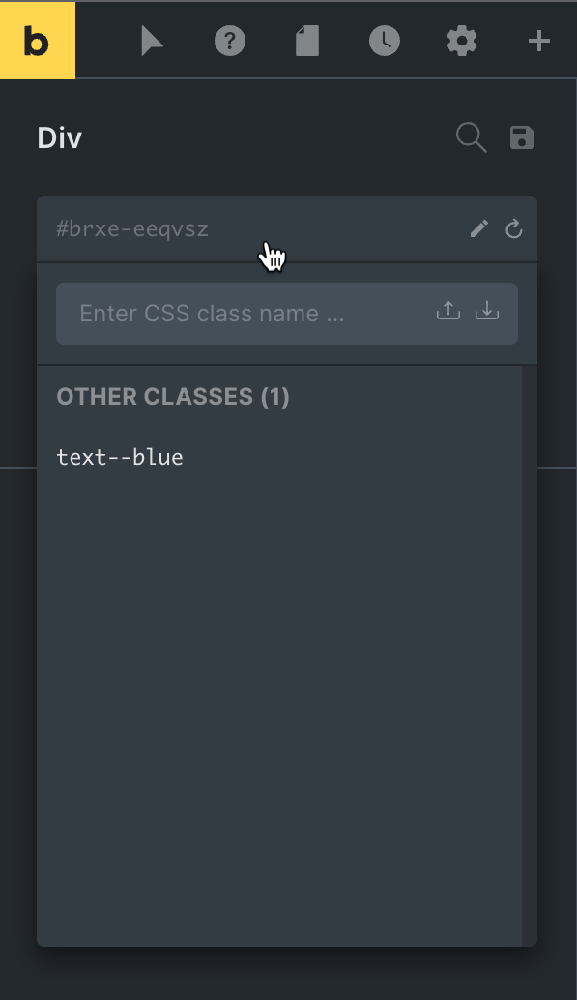

A global CSS class is a reusable Bricks style target. Instead of styling one element's ID only, you create a class, assign it to one or more elements, and edit the class visually with the same controls you use for element styling.

Use global classes for repeated design decisions: buttons, cards, grids, spacing wrappers, headings, badges, form rows, or any element pattern that should stay consistent across a page or site.

https://youtu.be/JMCkE6dneTM

## The mental model

Every element in Bricks has an element ID. When no global class is selected, visual style controls apply to that element ID only.

When a global class is selected as the active selector, style controls apply to the class instead. Any element that uses that class can receive the same class styles.

Think of the selector field at the top of the element panel as the current styling target:

- `#my-element`: you are styling only that element.
- `.card`: you are styling the global class named `card`.
- `.card:hover`, `.card::before`, or another selector/pseudo state: you are styling that state or selector for the class.

The important part is the active class state. Adding a class to an element and selecting that class are related, but not identical:

- Assigned class: the element uses the class on the frontend.
- Active class: the builder controls currently write styles to that class.

If you add `.card` to an element, then deselect the class, you are back to styling the element ID. If you select `.card`, your style changes update the class.

## Class styles vs element ID styles

Element ID styles are more specific than global class styles. If the same CSS property is set on both the element ID and a global class, the element ID style usually wins.

Use that on purpose:

- Put shared defaults on the class.
- Put one-off overrides on the element ID.
- If a style is meant to be reusable, avoid leaving the same property on the element ID.

:::note
If a class appears not to work, check whether the selected element already has the same property set on its element ID, page settings, or custom CSS.
:::

## How to create a global class



1. Select any element by clicking on it in the canvas or via the structure panel.
2. Click the selector input that shows the element's ID under its name in the left panel.
3. Type a class name in the class input.
4. Press `Enter` or click the save icon.
5. Select the class so it becomes the active selector.
6. Change style controls as needed.

Bricks accepts class names with or without a leading dot. The builder stores the class name without the dot and displays it as `.class-name`.

You can enter more than one class name separated by spaces or commas when creating classes. Bricks creates the missing classes and reuses existing classes with the same name.

## Assign an existing class to an element

1. Select the element.
2. Open the selector/class dropdown at the top of the element panel.
3. Search for the class name.
4. Click the class to add it to the element.

The class then appears in the element's active class list. Click the class chip to make it active for editing. Click the close icon on the chip to remove it from the element.

Removing a class from an element does not delete the global class. It only removes that class assignment from the selected element.

## Deselect a class before styling the element itself

When a global class is active, the style controls edit the class. To return to the element ID:

1. Click the active selector field.
2. Choose the element ID entry, or click the clear icon.
3. Confirm the selector field shows the element ID instead of the class name.

This is the safest way to avoid accidentally changing every element that uses the class.

## Multiple classes on one element

An element can have multiple global classes. This lets you separate responsibilities:

```text
.button
.button--primary
.margin-top-l
```

A common pattern is:

- One base class for structure and default styling.
- One modifier class for a variation.
- One utility class for a single property such as spacing or color.

When two classes set the same property with similar specificity, normal CSS cascade rules decide the final value. Avoid relying on conflicting class definitions as your main workflow. It is clearer to keep each class focused.

Starting in Bricks 2.4, admins can enable **Output global class CSS in Class Manager order** under [Bricks settings](/builder/setup/settings/#miscellaneous). When enabled, same-specificity global class rules follow the class order in the Class Manager. When disabled, Bricks uses the previous output order based on how classes are encountered on rendered elements.

## Pseudo classes and custom selectors

Global classes can have pseudo-class and custom-selector styles.

Use pseudo classes for states such as:

```text
:hover
:focus
:active
```

Use custom selectors when you need to style a child or related selector from the class context. For example, you might style an icon inside a card class, or a nested heading inside a reusable wrapper.

When a selector starts with `:`, Bricks attaches it directly to the class selector. Other selectors are treated as nested selectors.

:::tip
Use class selectors for reusable states and child styling. Use element ID selectors only for one-off exceptions.
:::

## Copy, paste, reset, and rename class styles

The class selector actions let you work with styles without manually copying CSS:

- Copy styles from an element ID or class.
- Paste styles into an element ID or class.
- Reset styles on an element ID.
- Reset styles on a class.
- Rename the element CSS ID or the active class.

When a class is renamed, Bricks updates the class name and also updates custom CSS stored inside that class where the old class root selector is used.

Renaming a class does not rename unrelated CSS that you wrote outside Bricks-managed class settings.

## Locked classes

Locked classes cannot be edited until they are unlocked. This protects shared design-system classes from accidental changes while still allowing them to be assigned where permissions allow.

If a class is locked and you cannot edit it, check whether your user role has permission to lock, unlock, and edit global classes.

## Bulk editing

When multiple elements are selected, the global classes panel shows classes that all selected elements have in common. You can add or remove a class across the selected elements.

Bulk editing is useful for applying a shared utility or layout class to multiple elements. It is not the right place to do detailed per-element cleanup.

## Permissions and disabled interface

Administrators can control access to global class features. Depending on your permissions, you may be able to:

- Create global classes.
- Edit global classes.
- Assign or unassign classes.
- Delete global classes.
- Lock or unlock classes.
- Copy and paste global class styles.

Administrators can also disable the Global Class Manager under `Bricks > Settings > General > Disable global class manager`. That hides the manager tab. Element-panel class actions are controlled by the global-class permissions above.

## Relationship to Class Manager

The element panel is where you apply a class and edit the active class while working on an element.

The Global Class Manager is where you maintain the class library: categories, bulk renaming, locks, trash, import/export, usage filters, and conflict review.

You can create and use classes from either workflow, but they serve different jobs:

- Element panel: "Use or edit this class on this element."
- Class Manager: "Maintain the whole class system."

## Relationship to utility classes

Some Style Manager features can generate utility classes from colors or variable scales. Those utility classes are stored as global classes too, so they can appear in the class list and be assigned like other classes.

Generated utility classes are best used as small, single-purpose classes. Avoid editing them into large component classes unless that is intentional.

## Troubleshooting

### The class is assigned, but the style does not show

Check these first:

1. Is the class selected as the active selector when you edit it?
2. Does the element ID already set the same property?
3. Is the class locked?
4. Does the class have styles for the current element type?
5. Is the class output affected by custom CSS with higher specificity?

### I changed a class and many elements changed

That is expected. A global class is reusable. If only one element should change, clear the active class and style the element ID instead, or create a more specific modifier class.

### I cannot create or edit a class

Check your builder permissions and whether the Global Class Manager is disabled in Bricks settings.

### A class from an imported template conflicts with an existing class

Bricks tracks classes by ID and name. If an imported class has the same ID or name as a local class, Bricks may map it to the existing class or ask you to review the conflict, depending on your import settings.

Review conflicts before accepting imports on production sites, especially when classes are part of a design system.
