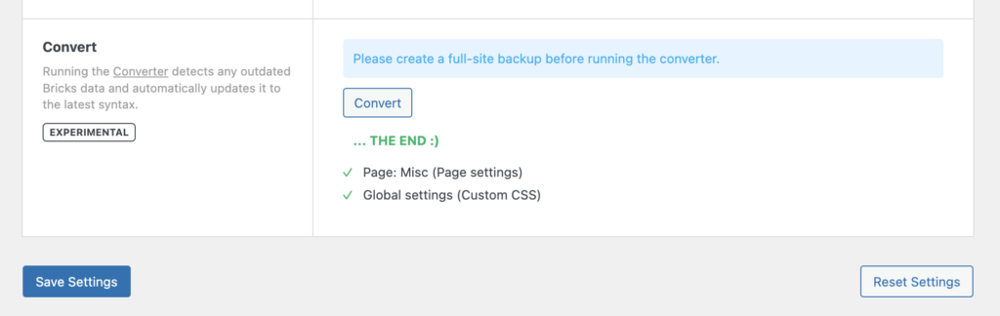

Bricks offers multiple so-called "Converter" options for legacy data migrations.

The Converter is a built-in tool that scans your database for outdated Bricks data and automatically updates it to the latest valid syntax of the installed version.

:::note
The converter performs changes to the Bricks data in your database. So please perform a full-site backup before running the converter.
:::

In current Bricks versions, the database Converter row is hidden from the normal Settings screen. Treat it as a legacy/support workflow, not a routine maintenance step.

When the legacy Converter is run, the process can take a minute or two depending on your server and the size of your Bricks data. Please do not close or refresh the page until you see the green "THE END" success message:

<figcaption>

Converter results: Updated Page Settings & Global Custom CSS

</figcaption>

## What is being converted?

With the improved DOM structure and element ID & class names, Bricks replaced the old `bricks-element-` element ID and class prefix with `brxe-`. Structural wrapper IDs such as `#bricks-header`, `#bricks-content`, and `#bricks-footer` are converted to `#brx-header`, `#brx-content`, and `#brx-footer`.

Depending on the selected conversion action, the Converter can update these areas of Bricks data:

- Bricks global settings
- Bricks theme styles
- Bricks global classes
- Bricks page settings
- Bricks page data
- Global elements, including conversion to components
- Bricks templates
- Legacy Container structures
- Entry animations
- Element positioning data

The Converter is not limited to custom CSS/JS. Only run the specific conversion requested for the legacy data you need to migrate.
