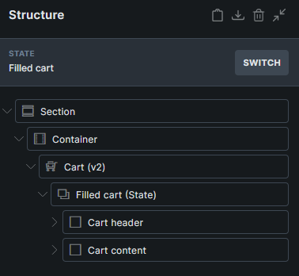
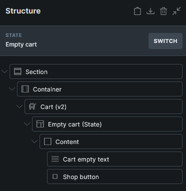
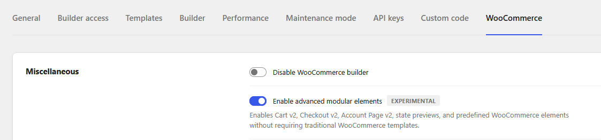
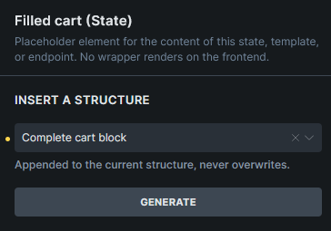
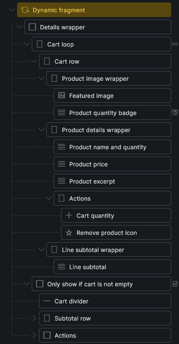

Starting in Bricks 2.4, the WooCommerce integration includes an advanced modular workflow for the store areas that usually require the most setup: Cart, Checkout, and My Account.

WooCommerce v2 lets you build these system pages from editable Bricks elements, protected state containers, predefined structures, dynamic data, query loops, conditions, and interactions.

In the classic setup, screens such as empty cart, checkout payment, order received, account orders, account downloads, and password reset are handled through separate Bricks templates or WooCommerce endpoints. In the v2 setup, those screens live as states on the assigned WooCommerce page, so you can switch between them in the builder and edit them in one place.

:::note
Advanced modular elements are experimental. Enable them under **Bricks > Settings > WooCommerce > Enable advanced modular elements**.

:::

## What changes in v2

The v2 workflow is useful when you want more control over WooCommerce system pages without recreating WooCommerce logic from scratch.

- Build Cart, Checkout, and My Account pages with editable Bricks elements.
- Edit template or endpoint-style views as page states directly on the assigned WooCommerce page.
- Preview states such as filled/empty cart, checkout/pay/thank-you, and account orders/downloads while editing.
- Insert predefined complete blocks and smaller section blocks.
- Keep generated checkout and account address fields aligned with WooCommerce field definitions.
- Refresh cart-dependent content with the [Dynamic fragment element](/builder/elements/woocommerce/dynamic-fragment/).
- Use new WooCommerce v2 [query loops and dynamic tags](/integrations/woocommerce/woocommerce-v2-query-loops-dynamic-tags/).
- Build [multistep checkout flows](/integrations/woocommerce/multistep-checkout-v2/) with checkout step elements and interactions.

## When to use this workflow

Use the advanced modular workflow when you want a more guided setup and a single editing place for each WooCommerce page.

| Workflow | Best for |
| --- | --- |
| **Standard (v1)** | Existing sites that already use WooCommerce shortcode pages and Bricks WooCommerce templates, or stores that prefer separate templates for each WooCommerce screen. |
| **Advanced (v2)** | New or redesigned Cart, Checkout, and My Account pages where you want editable page states, generated structures, and v2 dynamic data directly on the assigned page. |

The classic template workflow remains supported. You can keep using the existing Cart, Empty Cart, Checkout, Thank You, Pay, Order Receipt, and Account template types.

For guided setup checks and presets, use the [Woo Setup Wizard](/integrations/woocommerce/woo-setup-wizard/). The wizard can set up classic WooCommerce layouts without advanced modular elements enabled. V2 setup types are disabled until advanced modular elements are enabled.

## Predefined structures

Cart, Checkout, and Account Page v2 states can generate complete starter layouts or smaller WooCommerce sections through **Insert a structure**.

Generated structures are site-aware where needed. For checkout and account address forms, Bricks reads the WooCommerce field definitions that exist at generation time and turns them into editable Bricks form field elements. After generation, you can style, move, reorder, and place those fields like regular Bricks elements.

:::note
Some WooCommerce v2 support elements are generated-only or context-specific. If you do not see a v2 support element in the regular Elements panel, create it through **Insert a structure** or the [Woo Setup Wizard](/integrations/woocommerce/woo-setup-wizard/). After generation, the element appears in the Structure panel and can be edited inside its v2 state.
:::

:::note
Checkout fields can change after a layout is generated. For example, a plugin may add a VAT field, remove a company field, or change labels and placeholders. Use field sync after installing, removing, or reconfiguring plugins that modify WooCommerce checkout or account address fields.
:::

Field sync can report valid, missing, invalid, and duplicate generated fields. It can generate missing fields, remove invalid or duplicate generated fields, and update labels and placeholders from the current WooCommerce field data.

Checkout v2 and several Account v2 form states also include a **Floating label style** option for supported generated fields. Review third-party fields manually because plugin-generated fields can use different markup.

## V2 element groups

The main parent elements are:

- [Cart v2](/builder/elements/woocommerce/cart-v2/)
- [Checkout v2](/builder/elements/woocommerce/checkout-v2/)
- [Account Page v2](/builder/elements/woocommerce/account-page-v2/)

V2 layouts can also include support elements that only make sense inside their matching WooCommerce state or generated structure.

Bricks 2.4 registers these advanced modular support elements:

| Area | Registered support elements |
| --- | --- |
| Cart v2 | Cart form, Cart quantity |
| Checkout v2 | Checkout steps navigation, Checkout step nav item, Checkout step, Shipping options, Payment options, WooCommerce form field, WooCommerce form submit, Checkout billing address, Checkout shipping address, Checkout order summary, Checkout place order |
| Account Page v2 | WooCommerce login form, Account register form, Account lost password form, Account reset password form, Account orders pagination, Account edit address form, Account edit account form |
| Cart-dependent content | Dynamic fragment |

Some support elements are generated-only. Create them through **Insert a structure** or the [Woo Setup Wizard](/integrations/woocommerce/woo-setup-wizard/), then edit them from the Structure panel.

## Cart v2

The [Cart v2 element](/builder/elements/woocommerce/cart-v2/) is added to the assigned Cart page. It contains two states:

- **Filled cart** for carts that contain products.
- **Empty cart** for carts with no products.

Use the **State** control while editing to switch the builder preview between these states. Each state can contain custom layouts and generated structures, such as the complete cart block or complete empty cart block.

## Checkout v2

The [Checkout v2 element](/builder/elements/woocommerce/checkout-v2/) is added to the assigned Checkout page. It contains these states:

- Checkout
- Login required
- Pay
- Thank you
- Order receipt

Use the **State** control to design each checkout screen from one page. The checkout state can generate complete checkout structures or smaller sections such as billing fields, shipping fields, payment options, additional fields, order summary, and place order.

Checkout v2 also includes checkout field maintenance actions to help compare generated fields with the site's current WooCommerce checkout fields.

The **Login required** state is used when WooCommerce requires a customer to log in before viewing order-related checkout screens, such as pay, receipt, or thank you flows for a registered customer order.

For multistep layouts, see [Checkout v2 multistep checkout](/integrations/woocommerce/multistep-checkout-v2/).

## Account Page v2

The [Account Page v2 element](/builder/elements/woocommerce/account-page-v2/) is added to the assigned My Account page. It keeps the account navigation and endpoint content together.

It includes states for the common My Account endpoints:

- Dashboard
- Orders
- View order
- Downloads
- Addresses
- Edit address
- Edit account
- Payment methods
- Add payment method
- Login
- Lost password
- Lost password confirmation
- Reset password

Use the **State** control to switch between endpoint previews while editing. Each state can contain generated starter content that you can customize in the builder.

## Dynamic Fragment

The [Dynamic fragment element](/builder/elements/woocommerce/dynamic-fragment/) re-renders itself and its children after WooCommerce cart changes.

Use it for cart-dependent content outside the main Cart page, such as:

- Custom mini cart content
- Free shipping progress
- Cart totals or subtotal displays

The element includes generated structures for **Mini cart** and **Free shipping progress**. For custom mini carts, wrap the mini cart in Dynamic fragment, add a child loop using the `wooCart` query type, and use cart tags such as `{woo_cart_product_name}`, `{woo_cart_quantity:value}`, `{woo_cart_subtotal}`, and `{woo_cart_remove_link:url}` inside the loop.

Keep the Dynamic fragment wrapper outside other query loops. The cart loop should be a child of the fragment.

Dynamic fragment is frontend-only. It can refresh when it is rendered from the header, content, or footer area, but it does not refresh inside query loop instances or component instances.

## Query loops, dynamic tags, conditions, and interactions

WooCommerce v2 adds query loops for applied coupons, fees, taxes, order items, order totals, order downloads, order customer notes, account orders, account order actions, account downloads, and account addresses.

It also adds dynamic tags for cart totals, free shipping progress, WooCommerce URLs, account addresses, order data, order items, order totals, order actions, downloads, and customer notes.

See [WooCommerce v2 query loops and dynamic tags](/integrations/woocommerce/woocommerce-v2-query-loops-dynamic-tags/) for the complete reference.

Bricks 2.4 also adds WooCommerce conditions for shipping/order visibility and interactions for Dynamic fragment refreshes and checkout step changes.

## Existing WooCommerce templates

Bricks 2.4 also improves WooCommerce order-related template handling. Logged-out customers can still get Bricks layouts for Thank You, Order Receipt, and Order Pay flows when WooCommerce requires login for a non-guest order.

Classic templates and v2 page states can coexist on the same site, but each WooCommerce area should use one setup approach at a time to avoid confusion.

## Caveats

- Advanced modular elements must be enabled before you can add or edit v2 elements.
- V2 page rendering still follows WooCommerce page routing. Cart v2 and Checkout v2 render through the assigned WooCommerce cart and checkout pages.
- WooCommerce block content on assigned WooCommerce pages is not compatible with the v2 setup. The [Woo Setup Wizard](/integrations/woocommerce/woo-setup-wizard/) can replace the page content with the matching v2 structure.
- Protected state elements are required children of their v2 parent elements. Do not remove them manually.
- Predefined structures are authored with the default Bricks breakpoint keys. Review responsive styling on sites with custom breakpoints.
- Third-party checkout fields may need manual review after generation or field sync.
