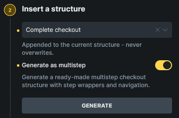
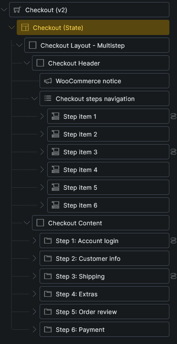
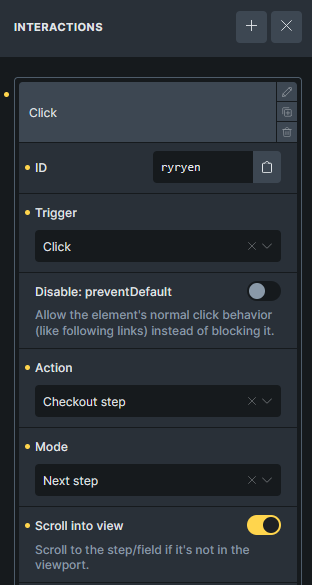

Checkout v2 can split the WooCommerce checkout form into multiple editable steps while keeping the native WooCommerce checkout form and submission flow in place.

Use this workflow when you want a guided checkout experience with separate sections for account login, customer details, shipping, extras, order review, and payment.

:::note
Checkout v2 multistep checkout requires **Bricks > Settings > WooCommerce > Enable advanced modular elements**.
:::

## Create a multistep checkout

You can create a multistep Checkout v2 layout in either of these ways:

- Go to [Woo Setup Wizard](/integrations/woocommerce/woo-setup-wizard/), choose the Checkout area, then select **Advanced multistep (v2)**.
- Edit the assigned Checkout page with Bricks, select the Checkout v2 **Checkout** state, choose **Complete checkout** under **Insert a structure**, enable **Generate as multistep**, then click **Generate**.

The generated structure adds the checkout form sections, checkout step wrappers, step navigation, and next/back interactions for a complete starter flow.

## Generated structure

A multistep checkout uses these generated support elements:

- **Checkout steps navigation**: Displays the step navigation list.
- **Checkout step nav item**: One navigation item inside the steps navigation.
- **Checkout step**: Wraps the content for one checkout step.
- **Checkout billing address**, **Checkout shipping address**, **Payment options**, **Place order**, and other generated checkout support elements.

Some of these support elements are generated-only or context-specific. If you do not see them in the regular Elements panel, create them through **Insert a structure** instead. After generation, you can select, style, move, and edit them in the Structure panel like other Bricks elements.

## Step order and navigation

Checkout step order follows the order of the **Checkout step** elements in the Structure panel. The first step is the initial step.

Navigation items mirror the checkout steps by order. If a checkout step is conditional, add the same condition to the matching navigation item so the visible navigation and visible steps stay aligned.

Each Checkout step has these controls:

- **Step ID**: Used by navigation, interactions, and direct step jumps.
- **Step label**: Used as the step label.
- **Allow direct entry**: Lets the customer jump to this step even if previous steps have not been reached.
- **Validate before leave**: Requires the current step to pass checkout field validation before moving forward.
- **Auto focus first field**: Focuses the first available field when the step becomes active.

Use stable, readable step IDs such as `customer-info`, `shipping`, `order-review`, or `payment` when you plan to target a step with interactions.

## Step buttons and interactions

Generated multistep layouts use regular Bricks buttons with the **Checkout step** interaction action.

The action can:

- Move to the next step.
- Move to the previous step.
- Go to a specific step by Step ID.
- Go to a specific checkout field by field key or field ID, such as `billing_postcode`.
- Scroll the target step or field into view.

Use the **Bricks checkout step changed** interaction trigger when you need to run another action after the active checkout step changes.

## Step numbers

For the navigation element, enable **Show step number** on **Checkout steps navigation** to render step numbers with CSS.

Inside custom headings or labels, use `{woo_checkout_current_step_number}` to output the current step number dynamically.

## Validation

Enable **Validate before leave** on a Checkout step when the customer must complete required fields before moving forward.

Backward navigation is always allowed. Forward navigation checks the current step only when **Validate before leave** is enabled.

WooCommerce notices can still link to invalid fields. The checkout step script can route the customer to the step that contains the field and focus it.

## Recommended review

After generating the multistep layout:

- Test the checkout as a guest and as a logged-in customer.
- Test products that require shipping and products that do not require shipping.
- Review conditional steps, such as account login and shipping.
- Confirm the final payment step contains the payment options, terms, and place order button.
- Test required field validation and WooCommerce notices.
- Review mobile spacing for the step navigation and buttons.

## Related docs

- [Checkout v2 element](/builder/elements/woocommerce/checkout-v2/)
- [Woo Setup Wizard](/integrations/woocommerce/woo-setup-wizard/)
- [WooCommerce advanced modular elements](/integrations/woocommerce/advanced-modular-elements/)
- [WooCommerce v2 query loops and dynamic tags](/integrations/woocommerce/woocommerce-v2-query-loops-dynamic-tags/)
