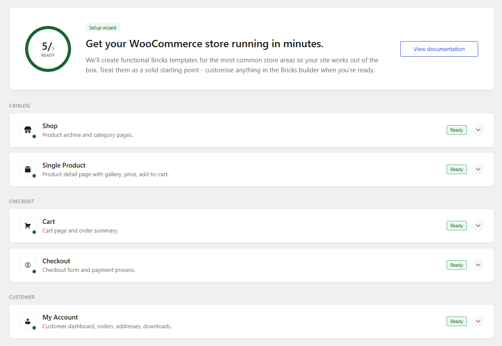
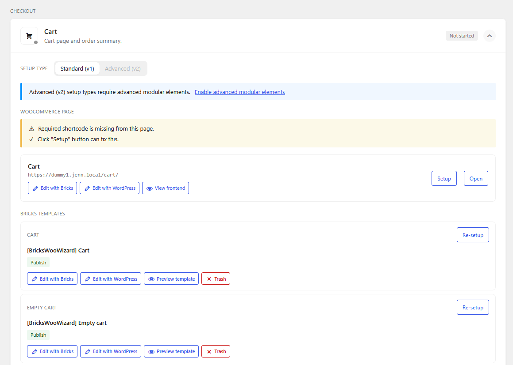
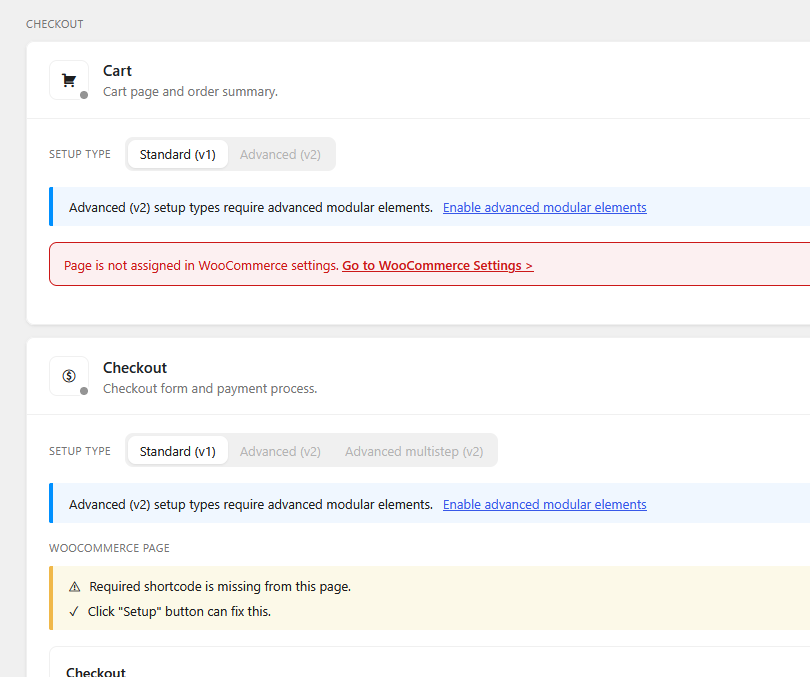
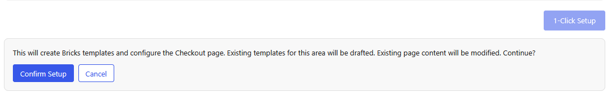

The Woo Setup Wizard helps you check, create, and repair the main WooCommerce layouts used by Bricks.

Go to **Bricks > Woo Setup Wizard** to review the current setup status for the store. The wizard checks the Shop, Single product, Cart, Checkout, and My Account areas, then shows the available setup actions for each area.

The wizard is not dependent on **Enable advanced modular elements**. It can set up the classic WooCommerce builder workflow without that setting. Advanced v2 setup types may appear in the wizard, but they stay disabled until advanced modular elements are enabled under **Bricks > Settings > WooCommerce > Enable advanced modular elements**.

## When to use it

Use the wizard when you want Bricks to review the WooCommerce setup and create the expected page or template structure for you.

- Set up WooCommerce pages after installing Bricks on a new store.
- Repair a Cart, Checkout, or My Account page that is missing the expected Bricks content.
- Replace WooCommerce block content with Bricks page content.
- Create the classic Bricks WooCommerce templates for shop, product, cart, checkout, or account areas.
- Create Cart v2, Checkout v2, or Account Page v2 structures for the assigned WooCommerce pages.
- Review whether existing published WooCommerce templates may conflict with a selected setup.

:::caution
The wizard can replace Bricks page content, clear WooCommerce block markup from the assigned page, switch the page editor mode to Bricks, create Bricks templates, or draft existing published WooCommerce templates for the same area. Review the setup summary before running an action on an existing store.
:::

## Areas checked

The wizard checks these WooCommerce areas:

- **Shop**: shop page and product archive template setup.
- **Single product**: single product template setup.
- **Cart**: assigned Cart page, classic cart templates, and Cart v2 page structure.
- **Checkout**: assigned Checkout page, classic checkout templates, and Checkout v2 page structure.
- **My Account**: assigned My Account page, classic account templates, and Account Page v2 page structure.

## Setup types

Each area can offer one or more setup types, depending on the selected WooCommerce area and whether advanced modular elements are enabled.

| Area | Setup types |
| --- | --- |
| Shop | Standard (v1) |
| Single product | Standard (v1) |
| Cart | Standard (v1), Advanced (v2) |
| Checkout | Standard (v1), Advanced (v2), Advanced multistep (v2) |
| My Account | Standard (v1), Advanced (v2) |

**Standard (v1)** creates or repairs the classic Bricks WooCommerce workflow. This setup uses the assigned WooCommerce page together with the traditional Bricks WooCommerce template types or shortcode-based page content.

**Advanced (v2)** replaces the assigned WooCommerce page content with the matching v2 parent element and generated state structure. Use it for Cart, Checkout, and My Account pages when you want to edit related WooCommerce screens as states on one page.

**Advanced multistep (v2)** is available for Checkout. It creates a Checkout v2 page with a ready-made [multistep checkout structure](/integrations/woocommerce/multistep-checkout-v2/).

## Status checks

The wizard reports missing, incomplete, or incompatible setup details before you run an action.

Common checks include:

- Required WooCommerce page is not assigned.
- Assigned WooCommerce page was deleted.
- Assigned page is still edited with the WordPress editor instead of Bricks.
- Assigned page contains WooCommerce block content.
- Required v2 parent element is missing from the assigned page.
- Required v2 states are missing.
- Required v2 state elements are empty.
- Existing published WooCommerce templates may conflict with the selected setup.
- Classic setup is missing expected WooCommerce shortcodes or template types.

The wizard does not create or assign missing WooCommerce pages. If a page is not assigned, assign it first in the WooCommerce settings, then return to **Bricks > Woo Setup Wizard**.

## What setup can change

Depending on the selected area and setup type, the wizard can:

- Write Bricks page content to the assigned WooCommerce page.
- Clear WordPress `post_content` when it contains WooCommerce block markup.
- Set the assigned page editor mode to Bricks.
- Create Bricks WooCommerce templates from presets.
- Draft existing published WooCommerce templates for the same template type when they would conflict.
- Generate external CSS files when file-based CSS generation is enabled.
- Ask for overwrite confirmation when the target page already contains Bricks data.

## Before running setup

Review the setup summary before confirming any action.

- Confirm the correct WooCommerce pages are assigned in the WooCommerce settings.
- Duplicate or export important pages and templates on existing stores.
- Check whether the selected setup edits pages, templates, or both.
- Review whether existing WooCommerce templates will be drafted.
- If the site uses custom breakpoints, review responsive styles after setup. Presets are authored with the default Bricks breakpoint keys, such as `mobile_landscape` and `mobile_portrait`.

## After setup

Open the generated page or template in Bricks and review the result.

- For classic layouts, confirm the expected WooCommerce template types and shortcodes are in place.
- For Cart v2, review the Filled cart and Empty cart states.
- For Checkout v2, review Checkout, Login required, Pay, Thank you, and Order receipt states.
- For Advanced multistep Checkout v2, test the checkout step navigation and interactions.
- For Account Page v2, review the account navigation, login, password, address, order, download, and edit account states.
- Test the live Cart, Checkout, and My Account flows with WooCommerce products and customer sessions.

## Related docs

- [WooCommerce Builder](/integrations/woocommerce/woocommerce-builder/)
- [WooCommerce advanced modular elements](/integrations/woocommerce/advanced-modular-elements/)
- [Cart](/integrations/woocommerce/cart/)
- [Checkout](/integrations/woocommerce/checkout/)
- [WooCommerce Account Builder](/integrations/woocommerce/woocommerce-account-builder/)
