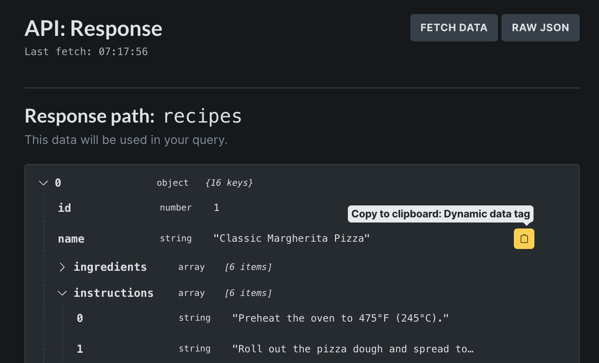
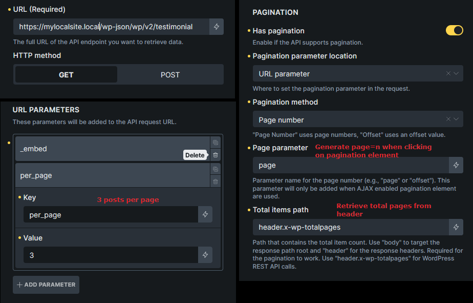

Starting with Bricks 2.1, the Query Loop can fetch JSON from an external API and render the returned array as loop items.

https://youtu.be/84jlX9gSz7o

Use an API query loop when the data does not live in WordPress:

- Products from an external inventory system
- Recipes, books, events, or jobs from a public API
- Data from another WordPress site's REST API
- Structured data from a custom backend
- A spreadsheet or no-code tool that exposes JSON through an endpoint

:::note
API query loops are experimental. They do not support Query Filters, live search, or Bricks components.
:::

## How API Queries Work {#how-it-works}

An API query loop follows this lifecycle:

1. The loop element is set to Query Type **API**.
2. You configure the API request in the API Settings popup.
3. Bricks parses dynamic data in most API settings.
4. Bricks builds the request URL, headers, authorization, body, and pagination parameters.
5. Bricks checks the cache if caching is enabled.
6. Bricks sends the request through WordPress.
7. Bricks decodes the JSON response.
8. Bricks extracts the configured response path.
9. The extracted array becomes the query result.
10. Each array item is rendered once by the loop.

Only array data can be looped. If the response path resolves to an object, a string, a number, or a missing path, the loop cannot render the intended result set.

## Create An API Query Loop {#create}

1. Add a supported loop element such as a Container, Block, or Div.
2. Enable **Query Loop**.
3. Set **Type** to **API**.
4. Click **API Settings**.
5. Enter the API URL and request settings.
6. Click **Fetch** in the preview panel.
7. Set the response path so it resolves to the array you want to loop.
8. Save the API settings.
9. Add child elements inside the loop.
10. Use `{query_api}` dynamic tags to render fields from each item.


## API Settings Popup {#settings-popup}

The API Settings popup has controls on the left and a response preview on the right.


Use the preview before building the design. If Bricks cannot fetch or parse the response, fix the request first.

## Request Settings {#request-settings}

### Name

The name is an internal label for the API configuration. It is optional, but useful when a page has more than one API query.

Examples:

- `Books API`
- `Events endpoint`
- `Remote WP posts`

### URL

The URL is required. It must point to the endpoint that returns JSON.

Example:

```text
https://example.com/wp-json/wp/v2/posts
```

Dynamic data is supported in the URL. The name and response path are not parsed as dynamic data.

### HTTP Method

Supported methods:

- `GET`
- `POST`

Use `GET` for typical read-only API listings. Use `POST` only when the API requires a body.

### Headers

Bricks sends these default headers:

```text
Content-Type: application/json
User-Agent: BricksBuilder/{CURRENT_VERSION}
```

You can add custom headers or override defaults in the Headers repeater.

### URL Parameters

URL parameters are appended to the endpoint query string.

Example:

| Key | Value |
| --- | --- |
| `limit` | `5` |
| `category` | `news` |

If the URL already contains query parameters, Bricks merges the existing parameters with the configured parameters.

### Request Body

Request Body settings appear for `POST` requests.

Supported body types:

- JSON
- Form Data
- x-www-form-urlencoded

For JSON, enter the raw JSON body. For form modes, use key/value rows.

Pagination parameters can also be added to the body when pagination is configured to use body location.

## Authorization {#authorization}

Bricks supports:

- API key
- Bearer token
- Basic Auth

API keys can be sent in either the request header or URL parameters. Bearer and Basic Auth use the `Authorization` header.

For sensitive values, enable **Use PHP Constant**. Bricks then reads the secret from a PHP constant instead of storing the value in the builder.

Constant names are based on the query element ID:

```php
define( 'BRX_QUERY_API_KEY_ABC123', 'your-api-key' );
define( 'BRX_QUERY_BEARER_TOKEN_ABC123', 'your-token' );
define( 'BRX_QUERY_BASIC_AUTH_USERNAME_ABC123', 'username' );
define( 'BRX_QUERY_BASIC_AUTH_PASSWORD_ABC123', 'password' );
```

Replace `ABC123` with the uppercase query element ID.

Use constants for production credentials. Builder-stored secrets are easier to expose through exports, screenshots, or team access.

## Dynamic Data In API Settings {#dynamic-settings}

Most string settings in the API configuration can use Bricks dynamic data. This includes URL, headers, parameters, body values, and auth values when they are stored directly in settings.

The following are intentionally not parsed as dynamic data:

- API name
- Response path

Dynamic API settings are parsed at request time using the current page context. This is useful for endpoints that depend on the current post, user, term, or URL state.

Examples:

```text
https://example.com/api/events?city={acf_city}
```

```json
{
  "postId": "{post_id}"
}
```

## Response Preview {#preview}

Click **Fetch** to preview the response.

The preview can show:

- Full response tree
- Extracted response path
- Raw JSON view
- Last fetch time
- Error state

If settings changed since the last fetch, Bricks asks you to fetch again before relying on the preview.

Only the first part of large extracted arrays may be shown in the preview, but the saved API query still uses the configured response at render time.

## Response Path {#response-path}

The **Response path** tells Bricks which part of the JSON response should become the loop result.

Leave it empty when the top-level response is already the array you want to loop.

Use dot notation for nested data:

```text
data.results
```

Example response:

```json
{
  "data": {
    "results": [
      {
        "name": "Recipe A"
      },
      {
        "name": "Recipe B"
      }
    ]
  }
}
```

For that response, set:

```text
data.results
```

:::note
The response path must resolve to an array. If the path is missing, Bricks falls back to the full decoded response. If that full response is not the intended array, the loop will not render as expected.
:::

## Render API Fields {#render-fields}

Use the `query_api` dynamic data tag inside the API query loop.

Basic field:

```text
{query_api @key:'name'}
```

Nested field:

```text
{query_api @key:'title|rendered'}
```

The pipe character separates nested keys inside the current array item.



In the API response preview, hover a field to copy a ready-to-use dynamic data tag. You can also create a shortcut that appears in the Dynamic Data picker.

:::note
API dynamic-data shortcuts are saved in your browser localStorage. They are not saved to the database and are not shared with other users.
:::

## Pagination {#pagination}

API query loops support pagination when the API can receive page or offset parameters and the response exposes a page count or item count.

To enable pagination:

1. Enable **Pagination** in API settings.
2. Add a Pagination element to the page.
3. Set the Pagination element to target the API query.
4. Choose the pagination method.
5. Configure where Bricks should send the pagination parameter.
6. Configure the total items/pages path.

Supported parameter locations:

- URL parameter
- Header
- Request body

### Page Number Pagination

Use page-number pagination when the API expects a page number.

Example:

```text
page=3
```

For the WordPress REST API:

| Setting | Example |
| --- | --- |
| URL parameter | `page` |
| Items per page parameter | `per_page=10` |
| Total path | `header.x-wp-totalpages` |



For page-number pagination, Bricks treats the extracted total value as the total number of pages.

### Offset Pagination

Use offset pagination when the API expects an offset or skip value.

Example:

```text
limit=5&skip=10
```

For offset pagination:

- Configure **Page parameter** as the offset or skip parameter Bricks should update.
- Configure **Offset key** as the parameter or header that contains the items-per-page value.
- Keep that items-per-page value in a URL parameter or header so Bricks can calculate page count.
- Set the total path to a numeric total item count.


For offset pagination, Bricks calculates total pages by dividing total items by items per page.

## Cache Duration {#cache}

API responses are cached with WordPress transients when cache duration is greater than `0`.

Default cache duration:

```text
300 seconds
```

Set cache duration to:

- `0` to disable caching
- A short value while developing
- A longer value for slow or rate-limited APIs

The cache key includes request details such as endpoint, method, headers, URL parameters, and body. Different request parameters create different cache entries.

If an API response does not update as expected, reduce the cache duration, temporarily set it to `0`, or click **Fetch** in the API settings popup to clear that element's API cache.

## Error States {#errors}

Bricks can show or return errors for:

- Missing or invalid API endpoint
- WordPress request errors
- HTTP errors such as 401, 403, 404, or 500
- Empty response body
- JSON decode errors
- Invalid pagination setup
- Missing total path for pagination
- Response path not resolving to the expected data

Common fixes:

- Test the endpoint in a browser or API client.
- Confirm the API returns JSON, not HTML.
- Check authentication values or PHP constants.
- Check CORS only if custom frontend scripts call the API directly. Bricks server-side requests are made through WordPress.
- Set the response path to the array, not to a single object.
- Temporarily set cache duration to `0` while debugging.

## Limitations {#limitations}

API query loops are intentionally narrower than post, term, and user queries.

Current limitations:

- No Query Filters
- No live search
- No Bricks components
- JSON responses only
- Response data must resolve to an array
- No built-in schema mapping beyond `query_api` dynamic tags
- No automatic media import from remote URLs
- No automatic retry/backoff for rate-limited APIs
- Secrets should be handled carefully through PHP constants

If you need filtering, searching, sorting, or complex data joins, consider syncing the external data into WordPress or building a custom integration.

## Practical Examples {#examples}

### WordPress REST API posts

URL:

```text
https://example.com/wp-json/wp/v2/posts
```

URL parameters:

| Key | Value |
| --- | --- |
| `per_page` | `6` |

Response path:

Leave this empty because the WordPress REST API returns an array at the top level.

Render fields:

```text
{query_api @key:'title|rendered'}
{query_api @key:'excerpt|rendered'}
```

### DummyJSON products

URL:

```text
https://dummyjson.com/products
```

URL parameters:

| Key | Value |
| --- | --- |
| `limit` | `8` |

Response path:

```text
products
```

Render fields:

```text
{query_api @key:'title'}
{query_api @key:'price'}
{query_api @key:'thumbnail'}
```

## Troubleshooting {#troubleshooting}

### The loop renders nothing

Check that the response path resolves to an array. If the API returns an object with an array inside it, set the response path to that nested array.

### The preview works but frontend output is stale

Check the cache duration. The preview and frontend can reuse cached responses while caching is enabled.

### Authentication works for one user but not another

Use PHP constants for credentials instead of storing secrets in builder settings. Confirm the constants use the uppercase query element ID.

### Pagination always shows one page

Check **Total items path**. For page-number pagination it should resolve to total pages. For offset pagination it should resolve to total items and Bricks must be able to determine items per page.

### Offset pagination returns the wrong page

Make sure the offset key is the parameter that should receive the calculated offset. For `limit=5&skip=10`, the offset key is `skip`, while `limit` is the items-per-page value.

### Dynamic tags are missing from another browser

Shortcuts created in the API popup are stored in browser localStorage. Recreate the shortcut in that browser, or type the `query_api` tag manually.

### Query Filters do not appear in the API query settings

This is expected. API query loops do not support Query Filters or live search.
