Query Sort, Filter & Live Search lets visitors change a Bricks Query Loop without a full page reload. You can add search inputs, checkboxes, radio buttons, selects, range sliders, date pickers, submit/reset buttons, active-filter displays, and AJAX pagination.

https://youtu.be/5oDHG-bTAfQ

Use Query Filters for interactive listings such as:

- Blog archive filters
- Product filters
- Directory search
- Team/member filters
- Taxonomy, custom-field, and WordPress-field filters
- Sort controls
- Per-page controls
- Live search boxes

Query Filters target a specific Query Loop. The filter elements can live anywhere on the page as long as each filter points to the correct target query.

## Enable Query Filters {#enable}

1. Go to **Bricks > Settings > Query filters**.
2. Turn on **Enable query sort / filter / live search**.
3. Save settings.
4. Open the builder.
5. Add elements from the **Filter** element group.


When the feature is enabled, Bricks also checks and maintains the custom database tables used for filter elements, filter values, and background indexing jobs.

## Mental Model {#mental-model}

Query Filters are a three-part system:

1. **Filter elements** collect visitor input.
2. **A target query loop** receives the filter state.
3. **Bricks converts filter state into query vars** and refreshes the target loop.

On the initial page load, Bricks can read filter values from URL parameters. During interaction, JavaScript stores the selected filter state, updates the browser URL when needed, sends an AJAX request, receives updated loop HTML, updates dynamic filter elements, and restores focus.

On the server, Bricks sanitizes the selected values, builds query vars for the target query type, merges those vars into the original query, and renders the target query again.

## Supported Query Types {#supported-query-types}

Query Filters support these Query Loop types:

- Posts
- Terms
- Users

They do not support:

- API query loops
- Array query loops
- Deeply nested query targets

In nested query scenarios, filters target the outer supported query layer. Do not expect a filter outside the loop to target a deeply nested child query.

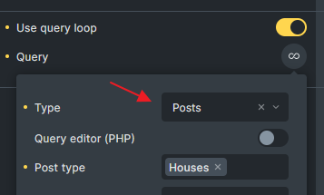

<span id="important-notes"></span>

## Component Limitation {#components}

Filter elements should not be placed inside a Bricks component.

The target query loop also should not be a loop inside a component unless the component root itself is the query loop. This limitation exists because filters target concrete query element IDs and AJAX needs to find and render the matching query element reliably.

## Basic Setup {#setup}

<span id="how-to"></span>

1. Create a Query Loop.
2. Copy the target query ID. This is usually the six-character Bricks element ID without `#brxe-`.
3. Add one or more Filter elements.
4. Set **Target Query** on each filter element.
5. Add a Pagination element if the listing should paginate.
6. Enable **AJAX** on Pagination if it should work together with filters.
7. Test the initial page load, AJAX update, browser back button, and direct URL parameter load.


Filters do not need to be inside the same wrapper as the query loop. You can place filters in a sidebar, header, offcanvas, or above the listing.


## Apply On Input Or Submit {#apply-mode}

<span id="filter-on-input-or-submit"></span>

Filter elements can apply immediately or wait for a submit button.

- **Input**: The query refreshes as soon as the visitor changes the filter.
- **Submit**: The filter value is stored, but the query refresh waits until the visitor clicks a Filter - Submit element that targets the same query.

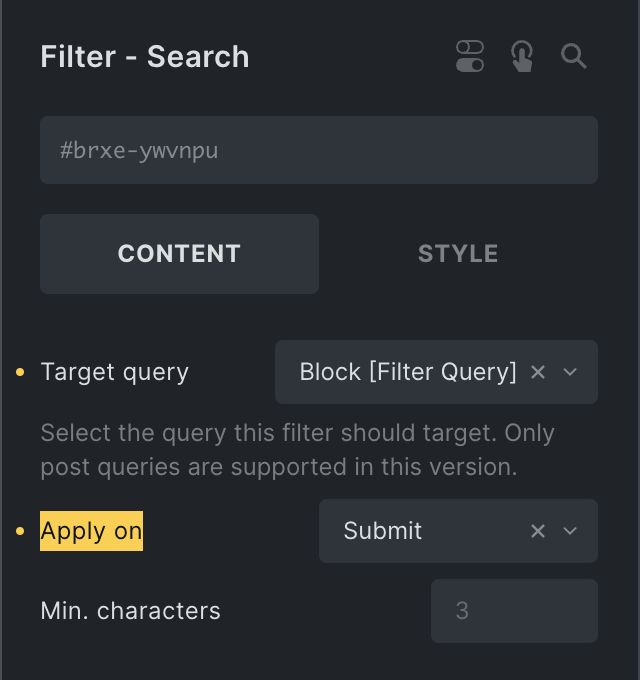

Use **Input** for lightweight listings and search. Use **Submit** when the page has many filters, expensive queries, or a mobile/offcanvas filter UI.

## Filter Elements {#elements}

### Filter - Search {#filter-search-element}

The Search filter sends a text value to the target query.

For post queries, the default search uses the `s` query var. For term and user queries, it uses the query type's search parameter. You can also configure custom search criteria for posts, terms, and users.

Important controls:

- **Target Query**: The query loop to refresh.
- **URL parameter**: The frontend parameter name. Use `s` when the filter should integrate with native WordPress search.
- **Debounce**: Delay before running the search after typing.
- **Min. characters**: Minimum input length before the search runs.
- **Search Criteria**: Custom fields, post fields, term fields, user fields, taxonomies, and weighting options where supported.
- **Clear icon**: Lets visitors clear the search value.


When the URL parameter is `s` on the main search query, Bricks can use the active Search template's search criteria instead of only the individual filter element settings.

### Filter - Checkbox {#filter-checkbox-element}

Use Checkbox filters when visitors can select multiple values.

Supported sources:

- Taxonomy
- WordPress field
- Custom field

Checkbox filters support hierarchical taxonomy display, include/exclude term options, top-level terms only, count display, child-term auto toggle, and button-style display.

For multiple selected taxonomy or custom-field values, Bricks can combine values with OR or AND logic depending on the filter settings.


### Filter - Radio {#filter-radio-element}

Use Radio filters when visitors should choose one value.

Radio filters can act as:

- A filter
- A sort control
- A per-page control

They support taxonomy, WordPress-field, and custom-field sources, plus button-style display.

### Filter - Select {#filter-select-element}

Use Select filters for compact dropdown filtering, sorting, or per-page controls.

Select filters can be single-value or multi-value when Choices.js and multiple selection are enabled. Multi-value filtering uses the same source rules as checkbox filters.

### Filter - Range {#filter-range-element}

Use Range filters for numeric custom fields such as price, area, rating, or score.

Range filters use custom-field source data and build a numeric BETWEEN query. Bricks can use indexed min/max values to set the slider range automatically.

Set decimal places when the values contain decimals. Without the right decimal setting, values can compare incorrectly.

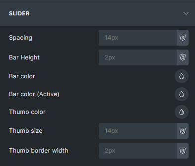

### Filter - Datepicker {#filter-datepicker-element}

Use Datepicker filters for date fields.

Datepicker supports single date and date range modes. Bricks sanitizes datepicker values and converts ranges into a two-value format before building query vars.

### Filter - Active Filters {#filter-active-filters-element}

The Active Filters element displays selected filters and lets visitors remove them.

Options include:

- Excluding specific filter IDs from the active filter list
- Prefix, suffix, and title labels configured on individual filters
- Styling active-filter labels and remove buttons

### Filter - Submit / Reset {#filter-submit-reset-element}

Use Submit when filters should wait before refreshing the query. Use Reset to clear active filters for the target query.

Submit can redirect to another URL while preserving current filter values. This is useful for a homepage live-search input that sends visitors to a search results page.

Reset can hide itself when no filter is active. Bricks adds a class you can style when there are no active filters.

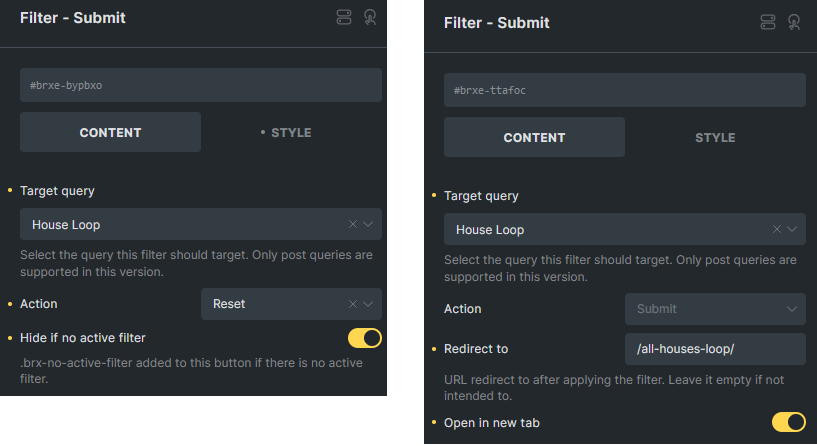

Since Bricks 2.4, the Submit element also emits dedicated submit start/end events for AJAX submissions. Use the [Filter Submit interaction triggers](/builder/features/interactions/#filter-submit-triggers) when another element should react only to a deliberate submit action, for example closing an Offcanvas after mobile filter results finish loading.

### Pagination {#pagination-element}

Pagination participates in the filter system when AJAX is enabled and it targets the same query. Bricks treats pagination as filter state during AJAX requests so selected filters and the current page stay together.


If several Pagination elements target the same query, Bricks updates the current page state across those pagination instances.

## URL Parameters {#url-parameters}

Query Filters can be loaded from URL parameters.

Bricks supports two parameter styles:

- `brx_FILTERID=value`
- A custom nice name configured on the filter, such as `category=shirts`

When the page loads, Bricks reads URL parameters, finds matching filter elements, sanitizes the values by filter type, sets each filter's current value, and merges the resulting query vars into the target query.

Use custom nice names when the URL should be human-readable. Use the default `brx_` format when you want a low-friction internal parameter.

On the target Query Loop, enable **Disable URL Params Filter** when the loop should ignore URL parameters even if matching filters exist.

## Browser History {#browser-history}

When URL parameters are enabled, Bricks tracks filter changes in the browser history. Visitors can use the browser back and forward buttons to move between previous filter states.

Bricks listens for browser navigation, restores the selected filter values for the target query, and refreshes the listing through the same AJAX filter flow. Test this when the page also has custom scripts that update the URL.

## Interactions {#interactions}

Bricks adds interaction triggers for filter state and filter submission:

- **Filter: Empty**
- **Filter: Not empty**
- **Filter Submit (Start)**
- **Filter Submit (End)**

Use **Filter: Empty** and **Filter: Not empty** to show or hide helper UI based on whether a filter element has options or values available.

For example, add a wrapper around an "Active Filters" heading and a Filter - Active Filters element. Then add interactions to that wrapper:

- **Filter: Empty**: Hide element
- **Filter: Not empty**: Show element

The trigger checks the selected filter element. When the Active Filters element has nothing to show, the wrapper can stay hidden. When at least one filter is active, the heading and active-filter list appear.

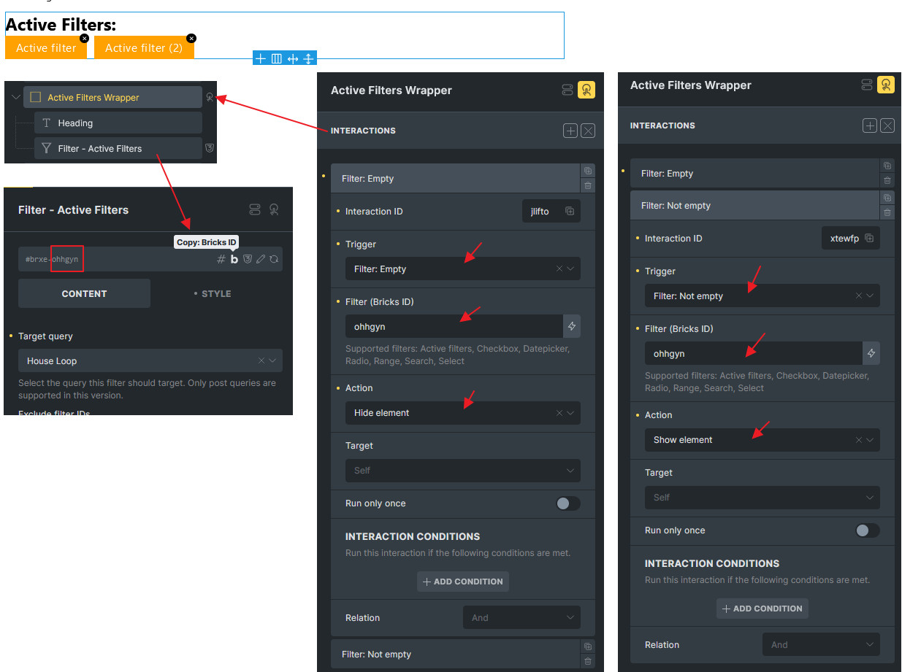

Use **Filter Submit (Start)** and **Filter Submit (End)** to run an action only when a Filter - Submit element starts or finishes an AJAX filter submission for the selected query.

See [Interactions](/builder/features/interactions/#trigger-filter-empty-or-not-empty) for filter option triggers and [Filter Submit triggers](/builder/features/interactions/#filter-submit-triggers) for submit-specific triggers.

## How Filter Values Become Query Vars {#query-vars}

Filter values are converted according to their action and source.

| Filter action | Result |
| --- | --- |
| Filter - taxonomy | Adds a taxonomy query |
| Filter - custom field | Adds a meta query |
| Filter - WordPress field | Adds the relevant post, term, or user query var |
| Search | Adds search vars or a custom search result ID list |
| Sort | Adds orderby/order vars |
| Per page | Sets `posts_per_page` or `number` |
| Pagination | Sets `paged` |

Bricks merges filter vars late so active filters can narrow or override the original query. Page-level route context, such as the current taxonomy archive, can also be preserved and merged unless disabled.

## Custom Fields And Indexing {#custom-fields}

<span id="custom-fields-integration"></span>

Bricks Query Filters work best with simple values that can be indexed and compared.

By default, simple custom fields are indexed as plain values. Complex provider-specific fields may need **Custom fields integration** to be indexed correctly. Fields stored as serialized arrays or complex objects are not reliable as default filter sources.

Supported indexed filter element types:

- Checkbox
- Datepicker
- Radio
- Range
- Select

Search, Submit, Active Filters, and Pagination are dynamic filter controls but are not indexed in the same way.

Enable **Custom fields integration** under **Bricks > Settings > Query filters** when filters should use field settings from supported providers.

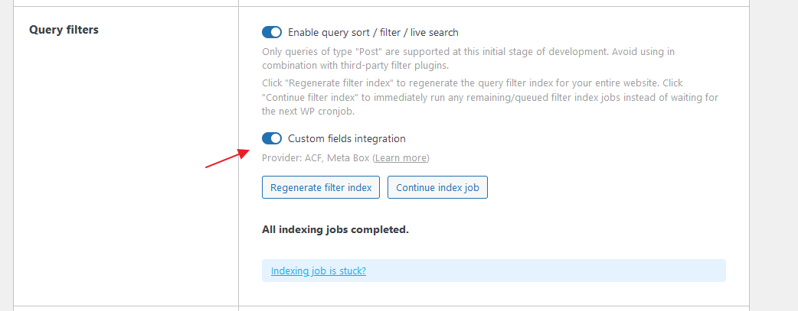

When the filter source is **Custom Field**, Bricks shows a **Provider** control if supported providers are active. Choose the provider, then use the dynamic data picker in the **Meta key** control to select the field. Bricks uses the dynamic tag to read the field settings. It does not parse the tag as frontend dynamic data.

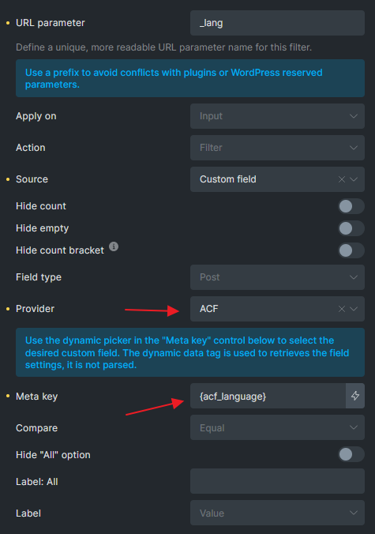

Built-in integrations are available for Advanced Custom Fields and Meta Box. They help Bricks index provider-specific field values, generate filter options from field choices, handle date formats, and build the correct custom-field query for fields that do not behave like plain WordPress meta.

ACF support includes fields such as relationship, post object, user, true/false, choice, date picker, and date time picker fields. Meta Box support includes multiple-choice fields and post, taxonomy, user, and date fields. Meta Box custom table fields are not supported by this integration.

## Filter Index {#filter-index}

Bricks stores filter data in custom tables so filter options and counts can be generated efficiently.

The index system tracks:

- Filter elements and their settings
- Whether each filter element is active and indexable
- Indexed values for posts, terms, and users
- Background indexing jobs and progress

The index updates when relevant Bricks data, posts, terms, users, and metadata change. Large sites can require background jobs to finish before every filter option is accurate.

You can manage indexing under **Bricks > Settings > Query filters**.


Available actions:

- **Regenerate filter index**: Rebuilds index records for all indexable filter elements.
- **Continue index job**: Runs pending index jobs immediately instead of waiting for cron.
- **Fix corrupted database**: Rebuilds stored filter-element metadata when filter elements are missing, stale, or moved.

:::note
If index jobs remain pending without progress, check the Query Filter indexer entry in [Known Issues](/builder/setup/known-issues/#query-filter-indexer-no-progress).
:::

If your site is protected by HTTP Authentication, background indexing can fail because Bricks cannot reach its own background endpoint. Add authentication headers to Bricks remote requests for the indexing action.

```php
add_filter( 'bricks/remote_post', function( $args, $url ) {
  if ( strpos( $url, 'action=bricks_background_index_job' ) === false && strpos( $url, 'action=bricks_system_info_wp_remote_post_test' ) === false ) {
    return $args;
  }

  $username = 'USERNAME';
  $password = 'PASSWORD';

  $args['headers']['Authorization'] = 'Basic ' . base64_encode( $username . ':' . $password );

  return $args;
}, 10, 2 );
```

## Live Search {#live-search}

Live Search shows query results only after a search interaction.

Setup:

1. Add a Filter - Search element.
2. Create a post, term, or user Query Loop.
3. Set the Search filter's **Target Query** to the loop.
4. Enable **Live Search** in the target query settings.
5. Set **Live Search Wrapper Selector** to the wrapper that should show/hide the result area.

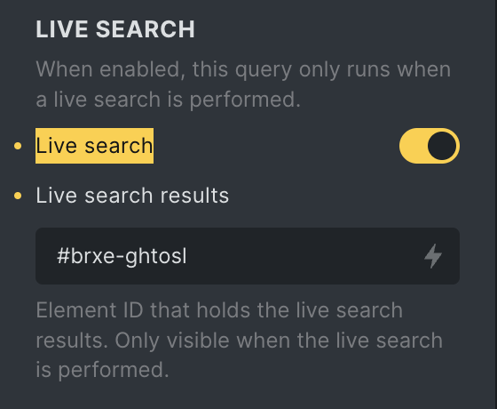

The wrapper selector is usually the parent around the result loop. Bricks uses it to hide empty live-search results, show the loader during AJAX requests, and hide the result box when the visitor clicks outside the search/results area.

Live Search still prepares the query on page load so required scripts, styles, templates, and popup content are available. On the frontend, Bricks suppresses the initial output until the visitor searches.

## Dynamic Data Tags {#dynamic-data}

Query Filters include dynamic tags that update with AJAX.

### `search_term_filter`

Use this to display the current search term for a target query:

```text
{search_term_filter:abc123}
```

Bricks wraps the value in an AJAX-updatable span tied to the target query.

### `query_results_count_filter`

Use this to display the current result count for a target query:

```text
{query_results_count_filter:abc123}
```

### `search_term`

<span id="search_term"></span>

Use this on a static search results page:

```text
{search_term}
{search_term:abc123}
```

For the value from a Filter - Search element, use `search_term_filter` instead.

### `active_filters_count`

<span id="active_filters_count"></span>

Use this to display the number of active filters for a target query:

```text
{active_filters_count:abc123}
{active_filters_count:abc123 @exclude:'filter1,filter2'}
```

You can style the generated span:

```css
span[data-brx-af-count] {
  /* Your styles here */
}
```

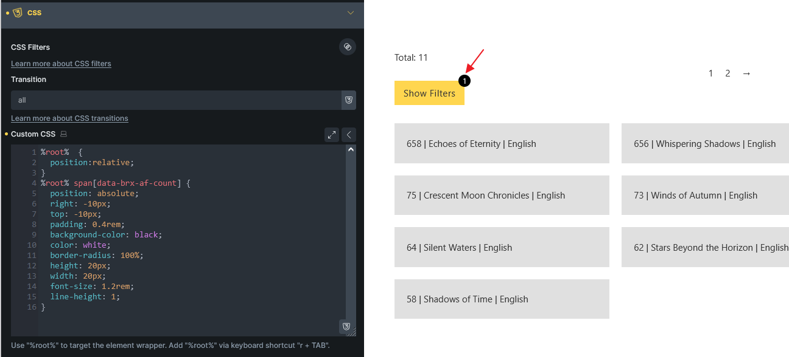

## Search Criteria {#search-criteria}

The Search filter can use default search behavior or custom criteria.

For posts, custom criteria can search:

- Post fields
- Post meta keys
- Assigned terms and taxonomies

For terms, custom criteria can search:

- Term fields
- Term meta keys

For users, custom criteria can search:

- User fields
- User meta keys

Weighted search returns IDs in weighted relevance order. Bricks preserves that order unless a sort filter is active.

Every added field or taxonomy can make the query more expensive. Keep the search surface focused.

## Custom Option Labels {#label}

Custom labels are available for Checkbox, Radio, and Select filters.

Use them when the stored value is not visitor-friendly. For example, map `_stock_status` values to "In stock" and "Out of stock".

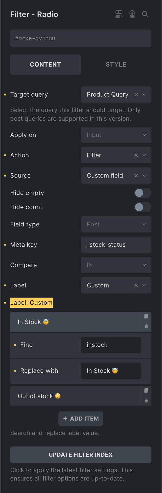

## Results Per Page {#results-per-page-action}

Filter - Select and Filter - Radio elements can use the **Results per page** action for post, term, and user queries.


By default, Bricks offers these values:

```text
10, 20, 50, 100
```

Change the values in **Options: Results per page**. Enter a comma-separated list of allowed page sizes.

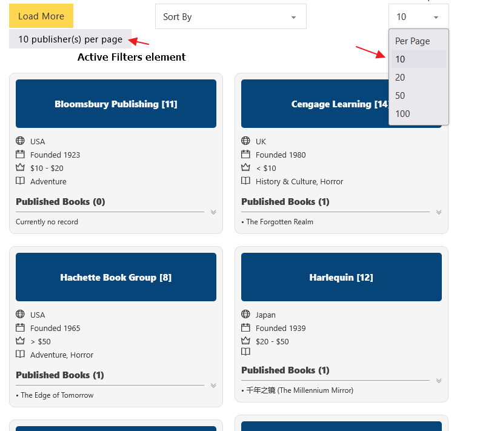

The active value changes the target query page size for the filtered request. It does not rewrite the original query loop setting. If you show an Active Filters element and do not want the per-page filter listed there, exclude the filter element ID in the Active Filters settings.

## WooCommerce Filter Source {#woocommerce}

When WooCommerce is active, Bricks adds **WooCommerce** as a source for supported filter elements.

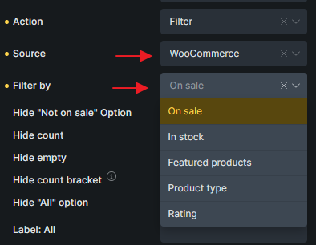

WooCommerce sorting options are also available for supported select and radio filters.


Supported WooCommerce sources depend on the filter element:

| WooCommerce option | Filter - Radio | Filter - Select | Filter - Checkbox | Filter - Range |
| --- | --- | --- | --- | --- |
| On sale | Yes | Yes | Yes | No |
| In stock | Yes | Yes | Yes | No |
| Featured products | Yes | Yes | Yes | No |
| Product type | Yes | Yes | Yes | No |
| Rating | Yes | Yes | No | No |
| Price | No | No | No | Yes |
| Sort by price | Yes | Yes | No | No |
| Sort by rating | Yes | Yes | No | No |


Use WooCommerce filters on product query loops. Common setups combine product category or attribute filters with stock state, price range, rating, and price sorting.

## Practical Patterns {#patterns}

### Archive filter sidebar

Use a Query Loop as the archive main query, add taxonomy filters in a sidebar, and enable AJAX pagination. Keep query merge enabled so the loop still respects the current archive route.

### Product filters

Use taxonomy filters for product categories and attributes, a range filter for price, a checkbox/select for stock state, and a sort select. Regenerate the filter index after adding new product filters.

### Search page with native `s`

Set the Filter - Search URL parameter to `s`, target the main search query, and configure search criteria on the Search template when the filter is part of the main search experience.

### Homepage live search

Use a Filter - Search element with Submit redirect, or use Live Search with a wrapper selector if results should appear inline.

## Troubleshooting {#troubleshooting}

### Filters do not affect the listing

Check that every filter has the correct **Target Query** ID. Then verify that the target loop is a post, term, or user query.

### Filter options are empty or outdated

Regenerate the filter index. If the filter element was duplicated, imported, translated, or moved between templates, also fix the filter element DB.

### URL parameters load but filters do not appear active

Check the filter's URL parameter/nice name, and make sure the filter element still exists and targets the same query ID.

### Search works on input but not on a direct URL

If you expect native search behavior, use `s` as the URL parameter and test the Search template settings. Also check whether **Disable URL Params Filter** is enabled on the query.

### AJAX updates the loop but not the filters

Only dynamic update elements are refreshed after AJAX. Make sure the filter element type is supported and not hidden by element conditions that fail outside the normal page load.

### Filters conflict with another filtering plugin

Avoid combining Bricks Query Filters with plugins or custom code that force-reruns or heavily rewrites the same query. Conflicts are especially likely when another plugin overrides query execution for AJAX filtering.

### Browser back/forward feels wrong

Test whether filters are updating URL state as expected. Bricks restores selected filter state on browser navigation, but custom scripts that rewrite URLs can interfere.
