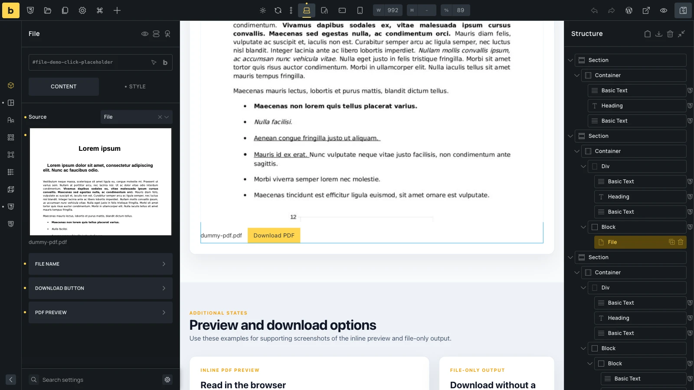
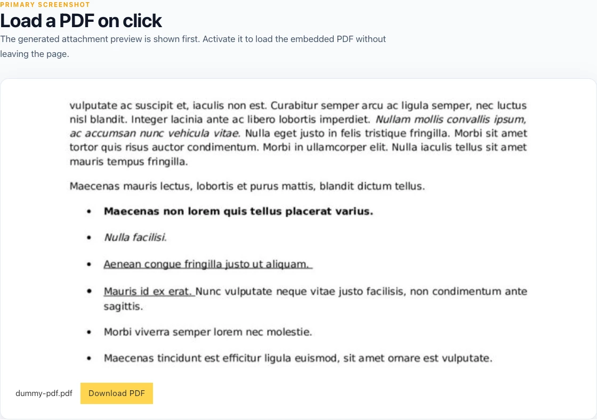
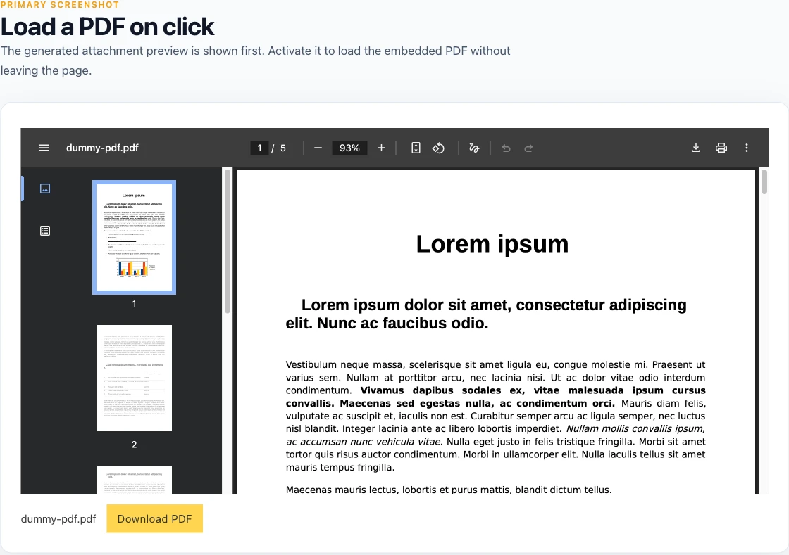

The File element displays a document as a linked file name, a download button, or both. PDF files can also appear in a browser-native inline preview.

The element is available in Bricks 2.4. Find it under **Elements > Media > File**.

## Choose the file source

Use the **Source** control to choose where the file comes from:

- **File**: Select a file from the WordPress Media Library. This is the default source.
- **External URL**: Enter the direct URL of a file hosted on this site or another site.
- **Dynamic data**: Select a file or media value from [dynamic data](/builder/dynamic-content/dynamic-data/). In a template, each post can supply its own document through a custom field.

If a dynamic field returns more than one media item, the File element uses the first item.

## File name

The file name is shown as a link by default. It opens the file instead of forcing a download.

The **File name** group contains these controls:

- **Hide file name**: Removes the linked file name.
- **Custom file name**: Replaces the name from the Media Library or file URL. This control supports dynamic data.
- **Open in new tab**: Opens the file-name link in a new browser tab. It also applies to the fallback link inside a PDF preview.

When no custom name is set, Bricks uses the Media Library filename or extracts the filename from the URL.

## Download button

The download button is shown by default. Use the **Download button** group to change its label, size, style, outline, and circle settings, or enable **Hide download button**.

The filename link and download button have different purposes: the filename link opens the file, while the button uses the browser's download behavior. A browser or external file host can still open the file instead of downloading it.

## PDF preview

Bricks displays the preview when it recognizes the source as a PDF. A Media Library file is identified by its `application/pdf` MIME type. External and dynamic URLs are identified by a `.pdf` extension in the URL path.

An external URL without `.pdf` in its path is not treated as a PDF, even if the server returns PDF content.

The preview fills the element width and is 600px high by default. Its controls are in the **PDF preview** group:

- **Hide PDF preview**: Removes the inline preview. The file name and download button remain available unless you hide them separately.
- **Preview title**: Sets the accessible label for the embedded PDF. When left empty, Bricks generates a label from the file name.
- **Height**: Sets the preview height. Use [responsive editing](/builder/interface/responsive-editing/) to adjust it at different breakpoints.
- **Display**: Keep the preview inline at every viewport width, or use **Inline on desktop, hidden on mobile**.
- **Hide at breakpoint**: Chooses the viewport width at which the preview is hidden. This appears when **Inline on desktop, hidden on mobile** is selected. If you do not choose a breakpoint, Bricks uses the Mobile landscape breakpoint, with 767px as the fallback width.
- **Load PDF on click**: Delays loading the PDF until the visitor activates the preview placeholder.
- **Preview image**: Sets the image shown before a click. This appears when **Load PDF on click** is enabled.

With **Load PDF on click** enabled, Bricks uses the custom preview image first. If none is set, it uses a preview generated for the Media Library attachment when WordPress has one. Otherwise, the placeholder shows a PDF icon and the file name.

:::caution[Keep a file link available]
If the PDF preview is hidden at a breakpoint, its internal fallback link is hidden with it. Keep the file name or download button visible so visitors can still reach the document at that breakpoint.
:::

## Example: A PDF from a custom field

Suppose each property post has a PDF brochure stored in a file field:

1. Add the File element to the property template.
2. Set **Source** to **Dynamic data**.
3. Select the brochure file field.
4. Enter a **Custom file name**, such as `{post_title} brochure`.
5. Enable **Load PDF on click** if you do not want the browser to request the PDF when the page first loads.
6. Add a **Preview image**, or let Bricks use the attachment preview when one is available.
7. Keep the file name or download button visible as the non-preview way to reach the brochure.

Open two property posts on the frontend. Each one displays the PDF stored on that post while keeping the same template layout.

## Browser behavior and document access

The File element uses the browser's built-in PDF support. The PDF toolbar, rendering, and print or download options can differ between browsers and devices.

Hiding a download button or browser controls does not secure the PDF. The visitor's browser still receives the file URL and file contents. Protect restricted documents at the server or application level before using them in the File element.

Non-PDF files do not receive an inline preview. They use the linked file name and download button.
