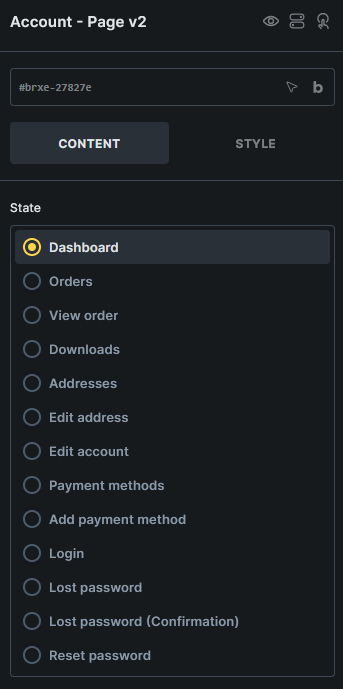
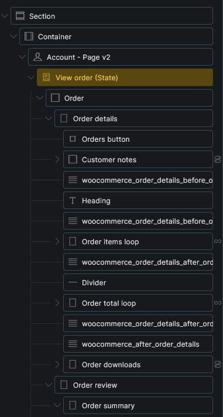
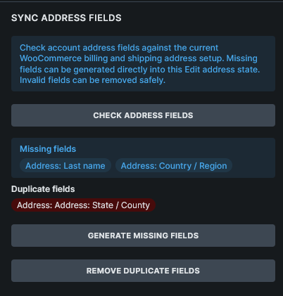

Displays the WooCommerce My Account page as editable endpoint states with shared account navigation.

:::note
This element requires **Bricks > Settings > WooCommerce > Enable advanced modular elements**.
:::

## Where this element works

My Account page.

## Key settings

- **State** (radio) - Switches the builder preview between My Account endpoint states.
- **Direction** (direction)
- **Gap** (number)
- **Disable navigation** (checkbox)
- **Navigation** style controls
- **Content** style controls

## States

- **Dashboard**
- **Orders**
- **View order**
- **Downloads**
- **Addresses**
- **Edit address**
- **Edit account**
- **Payment methods**
- **Add payment method**
- **Login**
- **Lost password**
- **Lost password (Confirmation)**
- **Reset password**

## Generated structures

Each state can generate a complete starter block for that endpoint from **Insert a structure**.

Generated structures are appended to the current state content and do not overwrite existing content.

:::note
Account Page v2 uses support elements for generated account forms and account orders pagination. Account orders, downloads, addresses, and order actions use v2 query loops and dynamic tags inside the matching account state. If you cannot find a support element in the regular Elements panel, use **Insert a structure** and then edit the generated element in the Structure panel.
:::

## Field maintenance

The Edit address state can audit and sync generated account address fields against the current WooCommerce account address field registry.

Use the field maintenance actions after plugins or WooCommerce settings change account address fields:

- **Check address fields**
- **Generate missing fields**
- **Remove invalid fields**
- **Remove duplicate fields**

## Query loops and dynamic data

Account Page v2 supports WooCommerce v2 query loops for account orders, order actions, account downloads, and account addresses.

Use account and order tags such as `{woo_account_address_title}`, `{woo_account_address}`, `{woo_order_number}`, `{woo_order_view_url}`, `{woo_order_download_name}`, and `{woo_order_action_url}` in the matching state or query loop.

See [WooCommerce v2 query loops and dynamic tags](/integrations/woocommerce/woocommerce-v2-query-loops-dynamic-tags/#account-tags) for the complete reference.

## Usage tips

- Use [WooCommerce advanced modular elements](/integrations/woocommerce/advanced-modular-elements/) or the [Woo Setup Wizard](/integrations/woocommerce/woo-setup-wizard/) to create the recommended Account Page v2 structure.
- Review each state after setup so logged-in, logged-out, password reset, payment method, and order views all match your store design.
- Use the classic [WooCommerce Account Builder](/integrations/woocommerce/woocommerce-account-builder/) workflow if you prefer separate endpoint templates.
