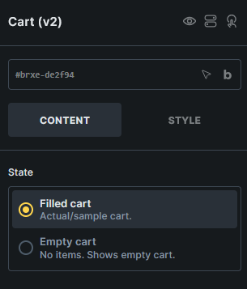
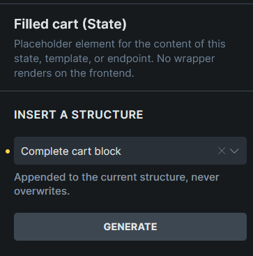
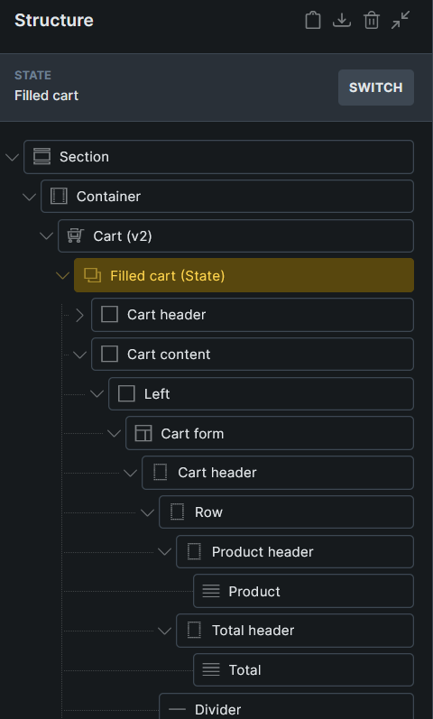

Displays the WooCommerce cart page as editable Filled cart and Empty cart states.

:::note
This element requires **Bricks > Settings > WooCommerce > Enable advanced modular elements**.
:::

## Where this element works

Cart page.

## Key settings

- **State** (radio) - Switches the builder preview between Filled cart and Empty cart.

## States

- **Filled cart** - Used when the cart contains products.
- **Empty cart** - Used when the cart has no products.

The generated Cart v2 structure keeps both states as internal child elements, so you can edit each state from the Structure panel.

## Generated structures

Each state can generate starter content from **Insert a structure**:

- **Complete cart block**
- **Complete empty cart block**

Generated structures are appended to the current state content and do not overwrite existing content.

:::note
Cart v2 uses the Cart form and Cart quantity support elements inside the Filled cart state. If you cannot find a support element in the regular Elements panel, use **Insert a structure** and then edit the generated element in the Structure panel.
:::

## Query loops and dynamic data

Use the **Cart contents** query loop for custom cart item rows. Cart v2 layouts can also use cart total tags such as `{woo_cart_items_count}`, `{woo_cart_order_subtotal}`, `{woo_cart_order_total}`, `{woo_cart_shipping_method}`, `{woo_free_shipping_remaining}`, and `{woo_free_shipping_progress}`.

See [WooCommerce v2 query loops and dynamic tags](/integrations/woocommerce/woocommerce-v2-query-loops-dynamic-tags/) for the complete reference.

## Usage tips

- Use [WooCommerce advanced modular elements](/integrations/woocommerce/advanced-modular-elements/) or the [Woo Setup Wizard](/integrations/woocommerce/woo-setup-wizard/) to create the recommended Cart v2 structure.
- Design both states so the cart page is complete whether the customer has products in the cart or not.
- Use the classic [Cart template workflow](/integrations/woocommerce/cart/) if you prefer separate Cart and Empty Cart templates.
