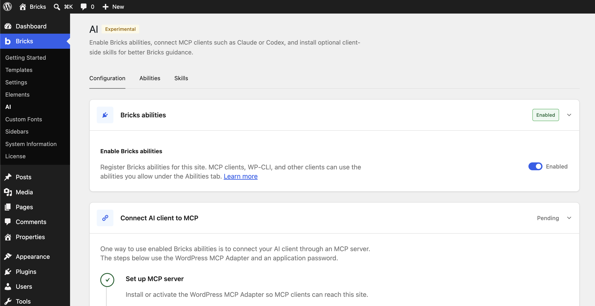
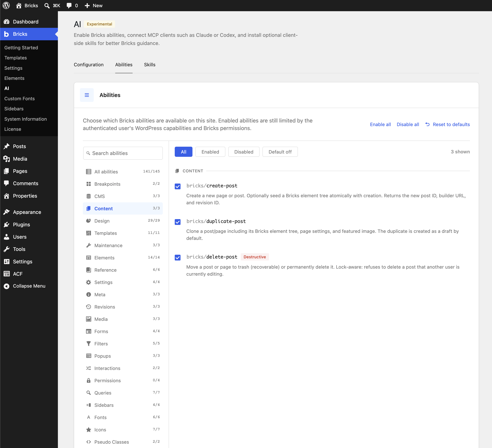

import { Tabs, TabItem } from "@astrojs/starlight/components";

https://www.youtube.com/watch?v=DcmoqqXWGcs

Bricks 2.4 introduces experimental AI abilities for Bricks. Abilities are actions registered with the WordPress Abilities API that an AI agent can run through an MCP-compatible client. Developers can also inspect and run the same registered abilities from WP-CLI when the `wp ability` command is available.

With abilities enabled, a connected agent can read and update parts of a Bricks site: design system, templates, elements, [dynamic data](/builder/dynamic-content/dynamic-data/), media, WooCommerce templates, and [revisions](/builder/interface/revisions/).

Bricks skills are optional companion instructions for AI clients that support skills, rules, or reusable project guidance. They do not add new site permissions or new Bricks actions. They teach the agent how to work with Bricks more carefully, for example when to inspect the existing design system, avoid duplicate classes or variables, preview before saving, and choose the right ability for the task.

Use `Bricks > AI` to set up the MCP connection, choose which abilities are available on the site, create credentials, and install optional Bricks skills.

::::caution[Experimental feature]
AI abilities can write to your site. Test on a local or staging site first. Keep this feature off on production sites while it is experimental.
::::

## Where to find it

Visit the `Bricks > AI` screen in your WordPress dashboard.

The AI screen is split into three tabs:

| Tab             | What it does                                                                                                                                        |
| --------------- | --------------------------------------------------------------------------------------------------------------------------------------------------- |
| `Configuration` | Installs or detects the WordPress MCP Adapter, enables Bricks abilities, creates an application password, and generates client-specific MCP config. |
| `Abilities`     | Lets you choose which Bricks MCP abilities are available on this site.                                                                              |
| `Skills`        | Helps you install and verify the optional Bricks skills package in your AI client.                                                                  |



## How the connection works

The connection has three parts:

| Piece                 | Lives in         | Purpose                                                                                                  |
| --------------------- | ---------------- | -------------------------------------------------------------------------------------------------------- |
| WordPress MCP Adapter | WordPress plugin | Adds the MCP endpoint that exposes registered WordPress abilities.                                       |
| Bricks abilities      | Bricks           | Registers Bricks actions with the WordPress Abilities API.                                               |
| Bricks skills         | AI client        | Adds optional Bricks workflow guidance for clients that support skills, rules, or reusable instructions. |

Bricks generates MCP config that runs `npx -y @automattic/mcp-wordpress-remote@latest` locally. That command connects the AI client to the WordPress MCP endpoint and authenticates with a WordPress application password.

Every request uses the WordPress user behind that application password. Bricks then checks that user's WordPress capabilities, builder access, and builder permissions before abilities can read or write.

## Setup

Use an administrator account for setup. Installing the adapter, activating it, saving settings, and creating credentials can require WordPress permissions such as `manage_options`, `install_plugins`, `activate_plugins`, and permission to edit the selected user account.

### 1. Install or activate the MCP Adapter

Go to `Bricks > AI > Configuration`.

In `Abilities API`, Bricks shows the MCP server status:

| Status          | Meaning                                                           | What to do                                                                                              |
| --------------- | ----------------------------------------------------------------- | ------------------------------------------------------------------------------------------------------- |
| `Not installed` | The WordPress MCP Adapter plugin is not installed.                | Click `Install plugin` if available, or use `View on GitHub` and install the latest stable release ZIP. |
| `Inactive`      | The adapter is installed but not active.                          | Click `Activate plugin`, or activate it from `Plugins`.                                                 |
| `Connected`     | The adapter is active and its REST route is registered.           | Enable the Abilities API and continue.                                                                  |
| `Route missing` | The adapter is loaded, but the MCP REST route did not register.   | Check REST API routing, permalinks, plugin conflicts, and PHP error logs.                               |
| `Disabled`      | `BRICKS_DISABLE_MCP` is set to a truthy value in `wp-config.php`. | Remove the constant or set it to `false` if this environment should allow MCP.                          |

If the one-click installer is not available on your site, download `mcp-adapter.zip` from the latest stable [WordPress MCP Adapter release](https://github.com/WordPress/mcp-adapter/releases) and upload it under `Plugins > Add New Plugin > Upload Plugin`.

Bricks only registers abilities when the WordPress Abilities API is available. WordPress 6.9 includes the Abilities API. Earlier WordPress versions need the MCP Adapter or a related Abilities API package to provide it before Bricks abilities can register.

### 2. Enable Bricks abilities

When the adapter status is `Connected`, enable `Abilities API` in the same section.

Bricks shows the MCP endpoint URL. It usually looks like this:

```text
https://example.com/wp-json/mcp/mcp-adapter-default-server
```

If pretty permalinks are not available, the same endpoint may need the REST route format:

```text
https://example.com/?rest_route=/mcp/mcp-adapter-default-server
```

The toggle stays disabled if the adapter is not connected or if `BRICKS_DISABLE_MCP` forces MCP off.

### Optional: Enable PHP execution

The `bricks/execute-php` ability runs one-off PHP through an authenticated AI client without storing the submitted snippet. It gives the agent access to the same WordPress and PHP runtime as the site, including functions and data that are not covered by a dedicated Bricks ability.

This ability is disabled by default and cannot be enabled from wp-admin or a database setting. Define the constant in one of these PHP locations before Bricks evaluates the ability:

- `wp-config.php`, before the "That's all, stop editing" line
- A must-use plugin
- A plugin
- A child theme's `functions.php`

Do not edit the Bricks parent theme because theme updates overwrite those changes. Define the constant only once:

```php
define( 'BRICKS_ENABLE_EXECUTE_PHP_ABILITY', true );
```

In a child theme's `functions.php` or a plugin, use a guard to avoid redefining the constant:

```php
if ( ! defined( 'BRICKS_ENABLE_EXECUTE_PHP_ABILITY' ) ) {
	define( 'BRICKS_ENABLE_EXECUTE_PHP_ABILITY', true );
}
```

Use the boolean value `true`.

::::caution[Use on trusted development environments]
Enable direct PHP execution only on a local, staging, or otherwise trusted development environment. Remove the constant or set it to `false` when it is no longer needed.
::::

On a local or staging site, an agent can use this ability to:

- Inspect active plugins, theme and plugin versions, PHP extensions, WordPress configuration, registered hooks, scheduled events, and other runtime state.
- Reproduce a plugin or theme function with the site's actual data instead of reasoning from an error message alone.
- Read PHP-accessible files and logs, check paths and permissions, or inspect a plugin or child theme implementation.
- Make an explicitly approved file or data repair, then rerun the failing operation to verify the result.
- Run one-off maintenance, migration, or setup tasks without installing a permanent code-snippet plugin.

File access is limited by the permissions of the PHP process. The ability is not sandboxed, so it can also edit or delete files and data that PHP can access. Keep the site backed up and use version control when testing file changes.

Every call must still meet all of these conditions:

- Bricks abilities are enabled, and `BRICKS_DISABLE_MCP` is not forcing them off.
- The request is authenticated with a WordPress application password.
- The application-password user has the Bricks `Execute code` capability.
- Bricks code execution is enabled under `Bricks > Settings > Custom code`.
- `BRICKS_LOCK_CODE_SIGNATURES` is not enabled. The signature lock overrides the PHP execution constant.

The connected user does not need the WordPress `manage_options` capability. While the constant is enabled, any connected user with the Bricks `Execute code` capability can submit PHP through this ability.

Keeping activation in PHP configuration means the ability cannot be enabled through a WordPress option or database setting alone. The permission and configuration checks above run again for every call.

To disable the ability, remove the constant or change it to:

```php
define( 'BRICKS_ENABLE_EXECUTE_PHP_ABILITY', false );
```

The highlighted `bricks/execute-php` row appears first under `Bricks > AI > Abilities`. Select `View setup` to expand the configuration instructions inside the row. Its status shows whether `BRICKS_ENABLE_EXECUTE_PHP_ABILITY` is undefined, `true`, `false`, or invalid, without exposing an unexpected constant value. When the constant is `true`, a second status shows whether the ability is callable or blocked by another requirement.

### 3. Create a credential

In `Credentials`, select the WordPress user the AI client should act as, enter a credential name, and click `Generate password`.

Use a name that identifies the client or workflow, for example `Codex staging`, `Claude local`, or `Cursor design review`.

Copy the generated application password before leaving the page. WordPress only shows it once.

For shared local or staging environments, create a dedicated WordPress user for the AI client instead of using your personal admin account. Give that user only the [builder access](/builder/interface/builder-access/) and WordPress capabilities it needs.

### 4. Connect your AI client

In `Connect AI client`, choose the client you use. Bricks shows a config block, a command, or a prompt depending on the client.

Use `Paste config` when the client supports config files. It keeps the setup explicit and keeps credentials out of the chat prompt.

`Copy a prompt` asks the AI client to help install the MCP server using the same connection details. Use it only in a local or staging workflow, and only with a client you trust with the credential.

Bricks generates client-specific config for many tools. The examples below show the shape of that config, but use the values generated on your site. The generated config includes:

- `WP_API_URL`: the MCP endpoint URL.
- `WP_API_USERNAME`: the selected WordPress username.
- `WP_API_PASSWORD`: the generated application password.
- `NODE_TLS_REJECT_UNAUTHORIZED=0`, only when Bricks detects a local development HTTPS domain that likely uses a self-signed certificate.
- `npx -y @automattic/mcp-wordpress-remote@latest` as the local command that connects your AI client to WordPress.

Do not put the application password in the endpoint URL, command arguments, or global shell config. Keep it in the MCP server environment for that client.

<Tabs>
<TabItem label="Codex">

Paste the generated block into `~/.codex/config.toml`, or merge it with your existing MCP server config:

```toml
[mcp_servers.example-com]
command = "npx"
args = ["-y", "@automattic/mcp-wordpress-remote@latest"]

[mcp_servers.example-com.env]
WP_API_URL = "https://example.com/wp-json/mcp/mcp-adapter-default-server"
WP_API_USERNAME = "mcp-service-user"
WP_API_PASSWORD = "xxxx xxxx xxxx xxxx"
```

Start a new Codex chat after saving the config so Codex reloads the MCP server.

</TabItem>
<TabItem label="Claude Code">

Run the generated command in your terminal:

```bash
claude mcp add example-com \
  --env WP_API_URL='https://example.com/wp-json/mcp/mcp-adapter-default-server' \
  --env WP_API_USERNAME='mcp-service-user' \
  --env WP_API_PASSWORD='xxxx xxxx xxxx xxxx' \
  -- npx -y @automattic/mcp-wordpress-remote@latest
```

Start a new Claude Code chat after adding the server.

</TabItem>
<TabItem label="Generic JSON">

Many clients use a JSON config shape like this:

```json
{
  "mcpServers": {
    "example-com": {
      "command": "npx",
      "args": ["-y", "@automattic/mcp-wordpress-remote@latest"],
      "env": {
        "WP_API_URL": "https://example.com/wp-json/mcp/mcp-adapter-default-server",
        "WP_API_USERNAME": "mcp-service-user",
        "WP_API_PASSWORD": "xxxx xxxx xxxx xxxx"
      }
    }
  }
}
```

Use the exact file path and wrapper key shown in `Bricks > AI`, because each client names its MCP config differently.

</TabItem>
</Tabs>

::::note[Local HTTPS]
For local domains such as `.local`, `.test`, `.localhost`, `.ddev.site`, `localhost`, or `127.0.0.1`, Bricks may add `NODE_TLS_REJECT_UNAUTHORIZED=0` to the generated MCP server environment. Keep that setting scoped to this MCP server only. Do not set it globally.
::::

### 5. Test the connection

Start a new chat in your AI client and ask:

```text
Call bricks-start-here, then bricks-get-mcp-version, then bricks-list-ability-status.
Tell me whether Bricks abilities are available, which Bricks version is connected, and whether any abilities are disabled.
```

If `bricks-start-here` is not visible as a direct tool, ask the client to call the MCP Adapter dispatcher:

```json
{
  "ability_name": "bricks/start-here",
  "parameters": {}
}
```

If the client cannot list Bricks abilities, fix the MCP connection before installing skills or trying a build task.

## Managing abilities

Open `Bricks > AI > Abilities` to control which Bricks abilities AI clients can use on this site.

::::note[User permissions still apply]
The Abilities tab controls site-level availability. It does not grant permissions to the WordPress user behind the MCP connection. An ability can be enabled here and still not be callable for that user if they do not have the required WordPress capability, builder access, or Bricks builder permission.
::::

### Scope abilities by user or role

Ability toggles are site-wide. Per-user and per-role access comes from the WordPress account used by the MCP connection:

1. Go to `Bricks > Settings > Builder access` and create a custom builder capability.
2. Enable only the actions that account needs, including the relevant post types and element editing permissions.
3. Assign the capability to a WordPress role or to one user from that user's WordPress profile.
4. In `Bricks > AI > Configuration`, generate the application password for that user and use it in the AI client's MCP config.

For example, a `Client editor` capability can allow content and element editing while leaving every permission under `Components` disabled. An AI client connected with that user's application password can edit the permitted content, but component abilities and component operations inside element writes are rejected.

WordPress capabilities still apply alongside Builder access. Avoid using an administrator account for a restricted client workflow because users with `manage_options` receive full builder access. See [Builder Access & Capabilities](/builder/interface/builder-access/) for every permission and the steps for assigning capabilities to roles and individual users.

You can:

- Search abilities by name or description.
- Filter by category, enabled state, disabled state, and default-off state.
- Enable all, disable all, or reset to defaults.
- Review badges such as `Default off` and `Destructive`.

Some diagnostic abilities are always available so clients and admins can understand the connection state:

- `bricks/start-here`
- `bricks/get-mcp-version`
- `bricks/list-ability-status`

Most abilities are enabled by default once the Abilities API is enabled. Sensitive categories, such as builder permission management, are default-off until an admin enables them. Abilities marked destructive can remove data or make changes that are not easy to reverse, so treat them as actions that need clear user approval.



## Fast-path tools and dispatcher tools

Bricks registers many abilities, but only common abilities appear directly in an MCP client's tool list.

Direct MCP tool names use hyphens:

```text
bricks-get-design-context
bricks-get-page-elements
bricks-set-page-elements
```

Ability names use slashes:

```text
bricks/get-design-context
bricks/get-page-elements
bricks/set-page-elements
```

If a Bricks ability is not visible as a direct tool, call it through the MCP Adapter dispatcher:

```json
{
  "ability_name": "bricks/get-mcp-version",
  "parameters": {}
}
```

Use `bricks-list-ability-status` to see which abilities are enabled, which are disabled, and which are default-off.

## Settings Abilities and Remote Libraries

The settings abilities use an allow-list rather than exposing the entire `bricks_global_settings` option:

- `bricks/list-settings-schema` lists supported keys and their value types.
- `bricks/get-global-settings` reads allowed settings.
- `bricks/set-global-settings` updates only the keys sent in the request.
- `bricks/list-credential-status` reports whether known credentials are configured without returning their values.

The Remote Templates and Remote Components settings use these keys:

| Setting key | Ability behavior |
| --- | --- |
| `myTemplatesAccess` | Readable and writable boolean for exposing this site's templates. |
| `myComponentsAccess` | Readable and writable boolean for exposing this site's components. |
| `myTemplatesWhitelist` | Readable and writable newline-separated URL whitelist shared by templates and components. Its stored key keeps the older name for compatibility. |
| `remoteTemplates` | Reads and writes remote-library URLs and optional display names. Stored passwords are preserved but never returned or written through the abilities. |
| `myTemplatesPassword` | Excluded from settings reads and writes. `bricks/list-credential-status` reports only whether the shared **Remote access password** is configured and identifies it as used by remote template and component access. |

The `myTemplatesPassword` key also keeps its older internal name for compatibility. AI and MCP clients cannot read, replace, or clear the password. Manage it in **Bricks > Settings > Templates & components > Remote access**.

## Installing Bricks skills

Skills are optional. Get the MCP connection working first.

Open `Bricks > AI > Skills` and copy the install prompt. Paste it into the AI client you want to use. The prompt points the client to the [Bricks skills repository](https://github.com/codeerhq/bricks-skills), asks it to install the matching skills or rules format, and asks it to report which Bricks skills were installed.

Then copy the verification prompt from the same tab. Start a new chat and ask the client to list loaded Bricks skills.

If no Bricks skills are loaded, the MCP connection can still work. The client can call `bricks-start-here` at the beginning of a session to get the core Bricks workflow rules, fast-path tool names, and dispatcher example.

Skills help with workflows such as:

- Designing or auditing a design system.
- Creating pages and templates.
- Working with [query loops](/builder/dynamic-content/query-loop/) and [dynamic data](/builder/dynamic-content/dynamic-data/).
- Writing element conditions and interactions.
- Converting HTML and CSS into Bricks element data.
- Verifying frontend output with screenshots or browser automation.

## WP-CLI access

Bricks abilities are registered with the WordPress Abilities API, so they are not limited to MCP clients.

For developer checks, WP-CLI can access the same registered abilities from the command line. The WordPress Developer Resources page for [`wp ability`](https://developer.wordpress.org/cli/commands/ability/) describes it as the command for abilities registered through the WordPress Abilities API.

Useful checks:

```bash
wp ability list --namespace=bricks --user=admin
wp ability get bricks/get-mcp-version --user=admin
wp ability run bricks/get-mcp-version --user=admin
wp ability run bricks/list-ability-status --user=admin --format=json
```

Use `--user` so permission checks run in the same WordPress user context your MCP connection would use.

This is separate from the Bricks-specific `wp bricks ...` commands, and it is not required for the MCP setup above. It is a WordPress Abilities API surface for any registered ability, including abilities from Bricks and other plugins.

## Security model

Treat an MCP-connected AI client like a real WordPress user.

- Each call runs as the authenticated WordPress user, for example the application-password user or the `--user` passed to WP-CLI.
- Bricks checks WordPress capabilities, builder access, and Bricks builder permissions before abilities can read or write.
- The Abilities tab controls which Bricks abilities are available on the site.
- `BRICKS_DISABLE_MCP` in `wp-config.php` is a hard off switch for the entire MCP surface.
- `bricks/execute-php` has a separate, strict boolean opt-in in PHP configuration and rechecks its authentication and code-execution requirements on every call.
- Application passwords can be revoked from the selected user's WordPress profile.
- Post and template element writes create Bricks [revisions](/builder/interface/revisions/) where supported. Global data writes, such as classes, variables, theme styles, and components, are not covered by post revisions.

Recommended defaults:

- Use local or staging for first tests.
- Use a dedicated WordPress user for the AI client in shared testing environments.
- Disable abilities that are not needed for the workflow.
- Review destructive actions before approving them in the AI client.
- Revoke old application passwords.

## Troubleshooting

| Symptom                                                    | Likely cause                                                               | What to do                                                                                                                                    |
| ---------------------------------------------------------- | -------------------------------------------------------------------------- | --------------------------------------------------------------------------------------------------------------------------------------------- |
| The Abilities API toggle is disabled                       | MCP Adapter is not connected, or `BRICKS_DISABLE_MCP` is forcing MCP off   | Install and activate the adapter, confirm the status is `Connected`, or update `wp-config.php`.                                               |
| `MCP server enabled but endpoint did not register`         | The adapter loaded, but the REST route is missing                          | Check `/wp-json/`, permalink settings, plugin conflicts, and PHP error logs.                                                                  |
| The client cannot connect                                  | Wrong endpoint, wrong credential, or the client did not reload config      | Confirm the endpoint in `Bricks > AI`, regenerate or re-copy the application password, then start a new chat.                                 |
| Application passwords are unavailable on a local HTTP site | WordPress enables application passwords by default only over HTTPS or when the environment type is `local` | Use HTTPS when possible. For a local HTTP site, add `define( 'WP_ENVIRONMENT_TYPE', 'local' );` to `wp-config.php`.                            |
| Application passwords are unavailable for one user         | A security plugin, filter, or user-level restriction disabled application passwords | Check the selected user, security plugins, and filters that control WordPress application password availability.                              |
| The client only shows `mcp-adapter-*` tools                | Bricks direct tools are not loaded or the ability is outside the fast path | Use `mcp-adapter-discover-abilities`, call long-tail abilities through `mcp-adapter-execute-ability`, and check `bricks-list-ability-status`. |
| A Bricks ability returns disabled                          | The ability is off in `Bricks > AI > Abilities`                            | Enable the ability or reset abilities to defaults.                                                                                            |
| `bricks/execute-php` is unavailable                        | Its PHP constant is missing, a required permission is missing, code execution is disabled, or code signatures are locked | Open `Bricks > AI > Abilities`, select `View setup` for `bricks/execute-php`, and follow the blocked requirement shown there. |
| Local HTTPS fails                                          | The local certificate is not trusted by the local `npx` process            | Use the scoped `NODE_TLS_REJECT_UNAUTHORIZED=0` generated by Bricks for local development, or trust the local certificate.                    |
| The AI client keeps asking for approval on every tool call | The client has per-tool approval settings                                  | Approve the Bricks MCP server or adjust that client's MCP approval settings if you trust the workflow.                                        |

## Example prompts

Start with explicit instructions. Ask the client to inspect the site before writing.

```text
You are connected to a Bricks site through MCP.
Call bricks-start-here, then inspect the design system and the current page before making changes.
Do not create duplicate global classes or variables.
Preview or read back your changes before reporting that the task is done.
```

Build a first pass of a page:

```text
Create an About page for this Bricks site. Use the existing design system, keep the style consistent with the homepage, and show me the plan before saving.
```

Replace static content with dynamic data:

```text
Find the static listing cards on the homepage and replace them with a query loop that pulls the Listing post type. Use the existing card styling.
```

Audit before changing:

```text
Audit the site's global classes, variables, and templates for naming drift or duplicated patterns. Show me the report first. Do not change anything yet.
```
