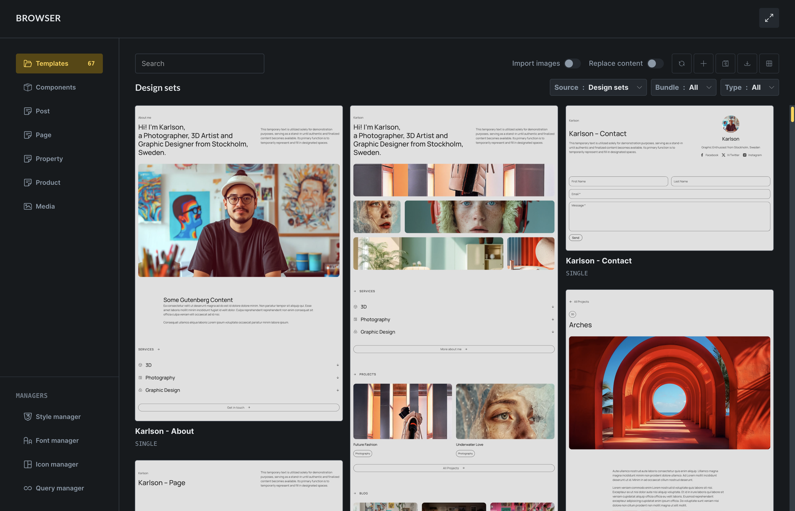

The **Builder Browser**, introduced in Bricks 2.4, is the folder popup in the builder toolbar. It brings templates, components, public post types, media, and builder managers into one browser-style popup.

Use it when you want to insert a template, manage components, jump to another page or post, inspect media, or open a related manager without leaving the builder.

https://www.youtube.com/watch?v=f9LH7xihkc0

## Open the Builder Browser

Click the folder icon in the builder toolbar.

You can also use these keyboard shortcuts:

- `CMD / CTRL + SHIFT + .` toggles the Builder Browser.
- `CMD / CTRL + SHIFT + L` opens the Browser directly on the Templates view when your user has template access.

The **Manage: Browser** action is also available from the [Command Palette](/builder/interface/command-palette/).

The Browser remembers the last section you opened for your user account. If that section is still available, Bricks opens it again the next time you open the Browser.

Use the expand icon in the upper-right corner to switch to full-screen mode. Bricks remembers the full-screen setting in your browser.

## What appears in the sidebar

The sidebar can show:

- **Templates**, when your builder role can create, edit, or insert templates.
- **Components**, when your builder role can insert, edit, or import/export components.
- Public registered post types, including pages, posts, custom post types, and Media.
- **Style Manager**, when your user has Style Manager access.
- **Font Manager**, **Icon Manager**, and **Query Manager**, when your builder role has access to those managers.

Templates, Components, and Managers use your [builder permissions](/builder/interface/builder-access/). Post-type sections come from the public post types registered on the site. Builder support and post-type permissions determine whether an item shows the **Edit with Bricks** action.

## Templates

The Templates view replaces the older standalone Template Library popup.

It lets you browse these template sources:

- **My Templates**
- **Wireframes**
- **Design sets**
- Configured **Remote sites**

You can search templates, switch between grid and list view, filter by source, bundle, tag, and type, and use the available template actions.

Available actions depend on the selected source and your builder permissions:

- **Create template**
- **Save as template**
- **Import template** from JSON or ZIP files
- **Import to templates**, for saving a non-local template under My Templates
- **Generate screenshots**, for local My Templates when screenshot generation is enabled
- **Reload**, for remote template sources
- **Insert**, **edit**, **export**, **delete**, and **preview** on individual templates

The Templates view also includes **Import images** and **Replace content** controls.

**Import images** downloads template images into the Media Library when inserting or importing template data. If disabled, Bricks uses placeholder images.

**Replace content** replaces the current canvas with the inserted template. If disabled, Bricks inserts the template into the existing content.

When a template import contains related data, Bricks may ask you to review imported theme styles, color palettes, global variables, global classes, or Style Manager settings before the template is inserted.

Learn more about template sources in [Template Library](/builder/features/template-library/) and [Remote Templates](/builder/features/remote-templates/).

## Components

The Components view gives you a Component Manager inside the Browser.

You can:

- Switch between **My components** and configured remote sites under **Source**.
- Search components.
- Filter by category.
- Filter by usage: all usage, used on current page, used elsewhere, or unused.
- Switch between grid and list view.
- Import component JSON or ZIP files.
- Edit, duplicate, export, delete, or generate a screenshot for a component.
- Generate screenshots for the currently filtered component list.

When a remote site is selected, the manager shows the remote catalog instead of local usage filters and editing actions. Use **Refresh** to request the catalog again and **Load more** when another page is available. Importing a remote component opens a review for nested components, global classes, global variables, and color palettes before anything is saved locally.

Save pending component, class, variable, and color changes before starting a remote import. Bricks returns to **My components** and refreshes the imported design-system data after a successful import.

Component screenshots are generated from a standalone component preview and saved as component thumbnail metadata. Generating screenshots requires the **Edit components** builder permission.

The usage badge shows component instances as `Instances: current page / total`. For example, `Instances: 2/5` means the component is used twice on the page you are editing and five times across the site. The **Used elsewhere** filter only shows components that are not used on the current page but are used on another page or template.

Click the usage badge to see current-page instances and other pages where the component is used. Current-page items take you to the matching instance in the builder. Other-page items open the matching page or template in Bricks in a new browser tab.

For the local component workflow, see [Components](/builder/features/components/).

## Posts, pages, and custom post types

The Browser lists public registered post types from the current WordPress site. Select a post type to browse its content. A post type can appear here even when it is not enabled for editing with Bricks.

For regular post types, you can:

- Search entries.
- Create a new item from the search field when your role can edit posts and access that post type in the builder.
- Filter by post status.
- Sort by newest, oldest, title A-Z, title Z-A, or recently edited.
- Switch between grid and list view.
- Edit with Bricks, edit in WordPress, duplicate, or view the item when the action is available.

**Edit with Bricks** appears only when the post type is enabled for Bricks and the user has builder access to that post type. The other available actions depend on the item and the user's WordPress capabilities.

The post type settings button lets you set **Posts per page** and toggle visible metadata such as author and date.

By default, regular post types use the WordPress **posts per page** value. If that value is missing, Bricks falls back to `10`. You can override the Browser value per post type, from `1` to `100`.

## Media

The Media view is a media-management workspace for attachments in the WordPress Media Library.

You can:

- Search attachment IDs, file names, titles, captions, descriptions, and alternative text.
- Filter by media type, MIME subtype, uploader, attachment status, upload date, dimensions, file size, missing alternative text, and Media Health status.
- Upload local files or import public files from URLs.
- Switch between grid, masonry, and list views.
- Inspect files and edit attachment metadata.
- Select files across result pages for bulk metadata, download, folder, image-size, and deletion actions.
- Audit common accessibility and file problems with Media Health.
- Organize files with folders when a compatible media-folder integration is active.

The Bricks Media Browser is also the default picker for Image, Image Gallery, Video, Audio, SVG, and File controls. Change the picker under **Bricks > Settings > Builder > Media** if you prefer the standard WordPress Media Library interface. Both interfaces use the same WordPress attachments.

Media defaults to `50` items per page. The settings popover lets you change the pagination between `1` and `100` and choose whether attachment details open beside the results or in an overlay.

## Managers

The Managers section gives quick access to builder-wide managers when your user has permission:

- **Style Manager**
- **Font Manager**
- **Icon Manager**
- **Query Manager**

The Style Manager opens its dedicated popup. Font Manager, Icon Manager, and Query Manager open inside the Browser content area.

For reusable queries, see [Global Queries](/builder/dynamic-content/global-queries-query-manager/).

## Troubleshooting

### A Template, Component, or Manager Section Is Missing

Check the user's [builder permissions](/builder/interface/builder-access/). Templates, Components, Font Manager, Icon Manager, and Query Manager are permission-gated.

### A Post Type Is Missing

The Browser lists public registered post types by default. Check how the post type is registered. Developers can change the registry query with the [`bricks/registered_post_types_args`](/developer/hooks/filters/filter-bricks-registered_post_types_args/) filter.

### Edit With Bricks Is Missing

Enable the post type under **Bricks > Settings > General > Post types** and confirm that the user's builder capability allows access to that post type.

### The Create Button Does Not Appear

The create action appears only for regular post types when the search field has a value, the user can edit posts, and the user has builder access for that post type. It is not available for Media.

### Template Images Do Not Import

Enable **Import images** before inserting or importing the template. When disabled, Bricks uses placeholder images instead of downloading template images into the Media Library.

### Inserted template replaced the page

Check **Replace content**. When enabled, Bricks replaces the current canvas with the inserted template data. When disabled, Bricks inserts the template into the existing content.
