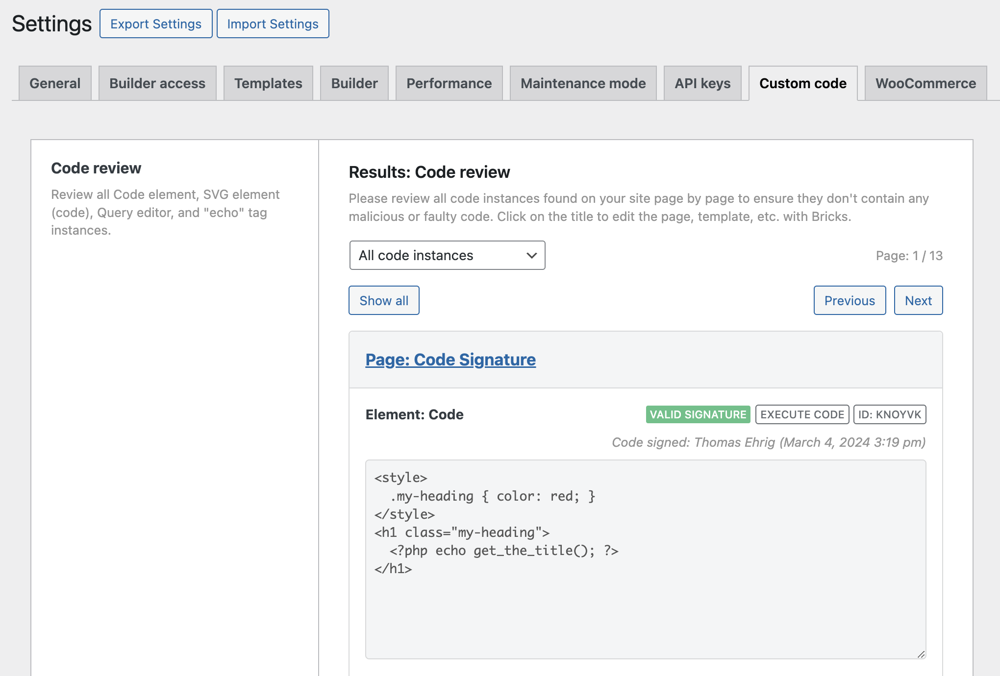

The **Code review** screen helps you find and inspect custom code stored in Bricks before you sign code globally or investigate a security issue.

It is a reporting and inspection tool. It does not store an approval state and does not mark code as permanently "reviewed". Use it to inspect code instances, check signature status, and decide what should be fixed, removed, allowlisted, or signed.

:::note
Run a Code review before regenerating code signatures globally. Global signature regeneration signs all eligible code that Bricks finds, so you should review the code first.
:::

## Start a Code review

Go to **Bricks > Settings > Custom code** and click **Start: Code review**.



<figcaption>

Code review results

</figcaption>

## What Bricks reviews

The Code review screen can show:

- **Code elements** that contain PHP/HTML code. If **Execute code** is enabled, the review also checks the code signature.
- **SVG elements** where **Source** is set to **Code**.
- **Query editor** code used in Query loops.
- **Component query properties** that contain Query editor code.
- **Global query records** that contain Query editor code.
- **Dynamic `echo:` tags** found in Bricks element settings.

The review scans Bricks data in pages, templates, components, global elements, and global queries. It groups results by page/template where possible, and groups component and global query results separately.

## Filters and navigation

Use the Code review filter to inspect:

- **All code instances**
- **Code elements**
- **SVG elements**
- **Query editor**
- **Echo tags**

The review screen includes **Show all**, **Individual**, **Previous**, and **Next** controls so you can inspect code one item at a time or review the full result list.

## Signature statuses

For code types that require signatures, Bricks shows one of these statuses:

- **Valid signature**: The stored signature matches the stored code. The code can run if code execution is enabled and the runtime gate allows it.
- **Invalid signature**: The stored signature does not match the current code. Bricks blocks execution.
- **No signature**: No signature is stored. Bricks blocks execution.

When available, Bricks also shows who signed the code and when it was signed.

## Location details

Each review item can include:

- The page, post type, template, component, or global query location.
- The element label.
- The element ID.
- Whether the item is a global element, component, global query, query, echo tag, or executable code item.
- The stored code in a read-only editor.

If the item belongs to a regular page or template, click the title to open it in the builder and edit the code there.

## Echo tag allowlist helper

Dynamic `echo:` tags can call PHP functions only when those function names pass the [`bricks/code/echo_function_names`](/developer/hooks/filters/filter-bricks-code-echo_function_names/) allowlist check.

When the Code review finds `echo:` tags, Bricks collects the function names and shows a starter snippet that you can place in a child theme, custom plugin, or code-management plugin. The helper can also include function names detected in theme styles, global classes, and raw color palette values:

```php
add_filter( 'bricks/code/echo_function_names', function() {
  return [
    'my_allowed_function',
  ];
} );
```

Review the generated list before using it. Remove any functions you do not want Bricks dynamic data to call.

## Advantages of centralized code monitoring

- **Centralized code oversight:** Review Bricks-managed executable code from one settings screen instead of opening each page manually.
- **Signature visibility:** Find missing and invalid signatures before code fails on the frontend.
- **Safer global signing:** Inspect code before using the global **Regenerate code signatures** action.
- **Echo tag hardening:** See which function names are being requested through `echo:` tags and allowlist only the functions you trust.

## Security checklist

Before regenerating code signatures globally:

- Review every Code, SVG, Query editor, component, and global query item.
- Remove code you do not recognize.
- Fix invalid signatures by reviewing and signing the intended code again.
- Do not copy the full `echo:` allowlist snippet without checking each function.
- Back up the site before global signature regeneration.
