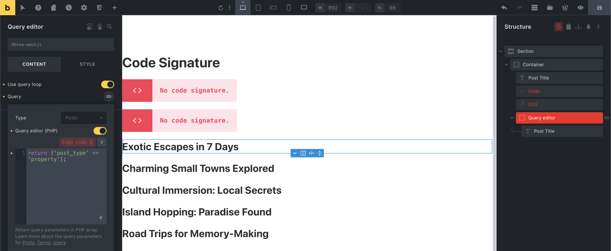
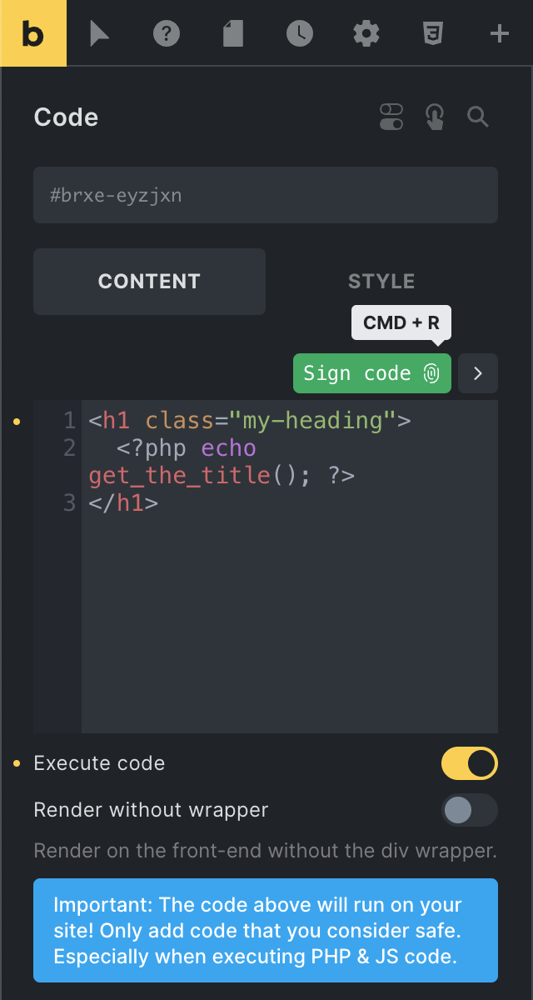
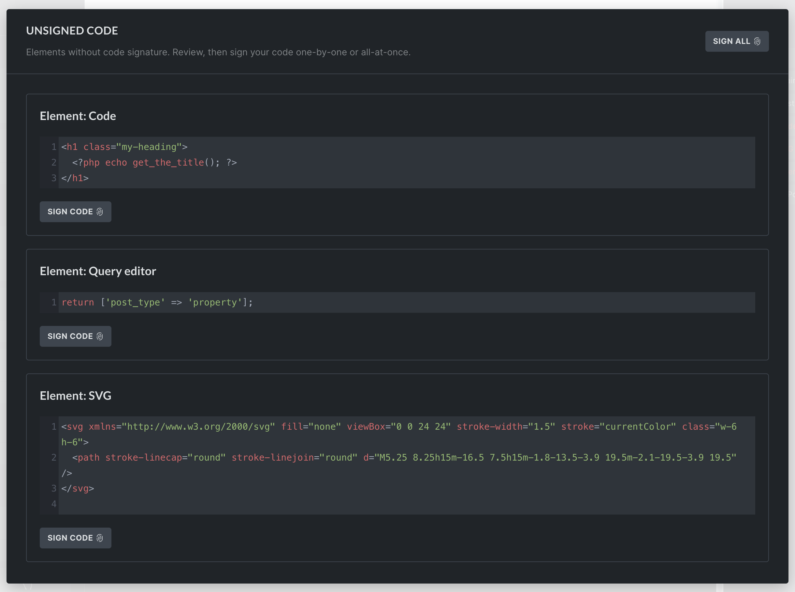

Code signatures protect executable Bricks code from being changed silently in the database.

:::note
Code that requires a signature will not run when the signature is missing or invalid.
:::

When code is signed, Bricks hashes the code with WordPress' `wp_hash()` function and stores the signature with the Bricks data. When the code runs, Bricks hashes the stored code again and compares it with the saved signature. If the values do not match, Bricks blocks execution.

## Elements that require code signatures

The following Bricks code locations require valid signatures to run:

- Code element PHP/HTML when **Execute code** is enabled
- SVG element with **Source** set to **Code**
- Query loop editor code
- Component query properties
- Global query records

Direct CSS and JavaScript in the Code element are rendered as CSS/JS output when the Code element executes. The signature gate applies to the executable PHP/HTML code field and the other executable code locations listed above.

## Required permissions

Code signatures are tied to the code execution security model:

- **Code execution** must be enabled under **Bricks > Settings > Custom code**.
- The user must have the Bricks **Execute code** capability.
- Manual signature generation in the builder is an administrator-level action in Bricks. Global signature regeneration requires WordPress `manage_options`.
- If `BRICKS_LOCK_CODE_SIGNATURES` is set to `true`, Bricks blocks new signature generation regardless of user permissions.
- Dangerous automatic builder signing is a separate opt-in flow. It is not recommended for normal production sites. It still requires code execution to be enabled, the Bricks **Execute code** capability, and unlocked code signatures.

If the Sign code action does not create or update a signature, confirm that code execution is enabled, your user has the Execute code capability, your user has administrator-level access, and code signatures are not locked.

## How to generate code signatures

You can generate code signatures for individual elements when editing them in the builder, view unsigned code for the current page, or regenerate signatures globally via the Bricks settings.

### Generate code signatures in the builder

Inside the builder, elements with unsigned executable code are highlighted in red. You'll also see a red fingerprint icon at the top of the structure panel.



<figcaption>

Builder: Code, SVG, and Query editor with unsigned code

</figcaption>

#### Sign code for an individual element



To generate a code signature for an individual element while you edit it, click the **Sign code** button above the code editor. If your cursor is inside the code editor, you can also use `CMD/CTRL + R`. This action is available only when the required permissions are satisfied.

After signing, save the page so the updated code and signature are stored together.

### View and sign unsigned code in bulk

You can view and sign all elements with unsigned code on the current page by clicking the fingerprint icon at the top of the structure panel. The same icon is also available on individual unsigned elements in the structure panel.



### Sign all code globally via Bricks settings

To generate code signatures for your entire site, navigate to **Bricks > Settings > Custom code > Code signatures** in your WordPress dashboard.

Click **Regenerate code signatures**. This generates code signatures for all pages, templates, global elements, component element trees, component query properties, and global query records built with Bricks.

This action requires a nonce-verified admin request, `manage_options`, code execution capability, and unlocked code signatures. If CSS file loading is enabled, Bricks regenerates CSS files after successful global signature regeneration.

## Locking code signature generation {#lock-code-signatures}

In Bricks 1.11.1, the `BRICKS_LOCK_CODE_SIGNATURES` constant adds another layer of control for high-security environments.

When `BRICKS_LOCK_CODE_SIGNATURES` is set to `true`, Bricks prevents new code signatures from being generated, regardless of user permissions.

To enable this lock, define the constant before signing code:

```php
if ( ! defined( 'BRICKS_LOCK_CODE_SIGNATURES' ) ) {
    define( 'BRICKS_LOCK_CODE_SIGNATURES', true );
}
```

With this constant enabled, any attempt to generate a new code signature returns a "Code signatures are locked" error.

## When to regenerate signatures

:::note
When updating Bricks from a version before 1.9.7, generating code signatures via **Bricks > Settings > Custom code** is mandatory for signed code locations to run. Perform a Code review first.
:::

**After changing your WordPress salts or secret keys:** If the salts in `wp-config.php` change, existing Bricks code signatures become invalid.

**After site migration:** When moving a site to a new domain or server, regenerate signatures if the new environment uses different WordPress salts.

**After editing signed code:** Editing executable Bricks code changes the signed content. Review and sign the updated code before expecting it to run.

## Why code signatures?

Code signatures limit what an attacker can do with database-only access.

If someone can edit Bricks data in the database but cannot generate signatures, they can add malicious code, but Bricks will not execute it because the signature will be missing or invalid.

### Understanding WordPress salts

WordPress salts are secret values stored in `wp-config.php`. Bricks uses WordPress' hashing system, which depends on those salts, so signatures generated on one site environment may not match another environment with different salts.

If salts change, Bricks has to regenerate signatures from the current trusted code.

### Bricks code integrity verification process

1. **Code and signature generation:** When you sign code, Bricks stores a hash generated from the code.
2. **Code retrieval for execution:** When the code is loaded, Bricks retrieves the stored code and signature.
3. **Verification:** Bricks hashes the retrieved code again and compares it with the stored signature.
4. **Execution decision:** If the hashes match, the code can continue through the execution flow. A missing or mismatched signature blocks execution and returns a "No signature" or "Invalid signature" error.

## Why rotating WordPress salts regularly is a bad idea {#rotating-salts}

If you rotate the salts in your `wp-config.php` file, all existing Bricks code signatures become invalid. You need to manually regenerate them from **Bricks > Settings > Custom code > Code signatures** before signed code can run again.

Some plugins offer automatic salt rotation with the claim that it makes cracking passwords harder. That claim is incorrect. WordPress salts are not used for hashing user passwords. Rotating them provides no added protection against password theft or brute-force attacks.

What salt rotation does cause:

- Logs out all users by invalidating authentication cookies.
- Breaks nonces, which can disrupt form submissions and AJAX requests.
- Can break plugins that use salts for encryption or data integrity.
- Invalidates all Bricks code signatures.

Unless your site has been compromised, there is usually no practical reason to rotate salts. It introduces unnecessary breakage and instability.

## Why isn't code automatically signed by default? {#no-automatic-code-signing}

Bricks requires manual code signing to prevent a database-only compromise from becoming full code execution.

If someone gains access to your database, for example through another plugin vulnerability or compromised credentials without code execution capability, they could inject malicious code into Bricks data. That is serious, but it does not automatically mean they can run PHP on your server.

Because Bricks uses signatures tied to your site's WordPress salts, that attacker cannot make the code executable with database access alone. The injected code remains unsigned and Bricks blocks it.

If Bricks automatically signed code by default whenever an authorized user opened the builder, this protection would collapse. The attacker could plant malicious code and wait for an authorized user to load the builder. Manual signing forces a review checkpoint before code becomes executable.

## Dangerous automatic signing constants {#dangerous-automatic-signing}

Bricks includes two opt-in constants for controlled builder workflows where you deliberately accept the risk of automatic signing.

These constants are disabled by default. Define them as the boolean `true`, not as the string `'true'`.

:::danger
We do not recommend enabling these constants on normal production sites. Do not enable them just to avoid the manual Sign code step.

Automatic signing reduces the protection that code signatures are designed to provide. If an attacker, vulnerable plugin, compromised integration, or database-level process can change Bricks data, they may be able to store malicious executable code and wait for a trusted user to open, rerender, or save the builder. With automatic signing enabled, that builder action can turn the stored code into signed code.

Use these constants only when you fully accept that tradeoff, for example in a local development site, disposable sandbox, or tightly controlled internal workflow with additional hardening around database writes, plugins, integrations, users, and deployment access.
:::

| Constant | What it signs |
| --- | --- |
| `BRICKS_DANGEROUSLY_AUTO_SIGN_CODE_ON_BUILDER_SAVE` | Eligible executable code included in a builder save request, including page or template elements, global elements, component element trees, component query properties, and global query records. |
| `BRICKS_DANGEROUSLY_AUTO_SIGN_CODE_ON_BUILDER_RERENDER` | Eligible executable code included in builder preview and rerender requests. Bricks returns the generated signature metadata to the builder so it can update the in-memory element data. A later builder save persists that updated data. |

Example:

```php
if ( ! defined( 'BRICKS_DANGEROUSLY_AUTO_SIGN_CODE_ON_BUILDER_SAVE' ) ) {
    define( 'BRICKS_DANGEROUSLY_AUTO_SIGN_CODE_ON_BUILDER_SAVE', true );
}

if ( ! defined( 'BRICKS_DANGEROUSLY_AUTO_SIGN_CODE_ON_BUILDER_RERENDER' ) ) {
    define( 'BRICKS_DANGEROUSLY_AUTO_SIGN_CODE_ON_BUILDER_RERENDER', true );
}
```

Neither constant bypasses code execution permissions or `BRICKS_LOCK_CODE_SIGNATURES`. If code execution is disabled, the current user cannot execute code, or code signatures are locked, Bricks will not generate signatures automatically.
