Components let you create reusable elements. Each instance can be customized through properties.

While templates serve as blueprints for pages, components serve as blueprints for a specific element or group of elements, such as a button, card, navigation, or hero section. You can reuse a component throughout your site and customize each instance only where needed.

Any change to the main component automatically applies to every instance of that component. This keeps repeated structures and styles consistent across your website while still letting each instance use its own content, query, variant, or slot content.

https://www.youtube.com/watch?v=nNvcrK-vDDs

## How Components Work

A component is a saved element tree with one root element. Bricks stores the component definition separately from the page content. Each instance on a page points to that definition through its component ID and stores only its own instance-specific values, such as property overrides, a selected variant, and slot children.

When Bricks renders the page, it expands the referenced component definition into the page and applies the instance values. If an instance points to a component that no longer exists, that instance is skipped on the frontend.

## How to Create a Component

Create a component from most elements, except Template and Query Filter elements, by right-clicking the element and selecting the `Save as component` action. You need the **Create components** builder permission to create new components.

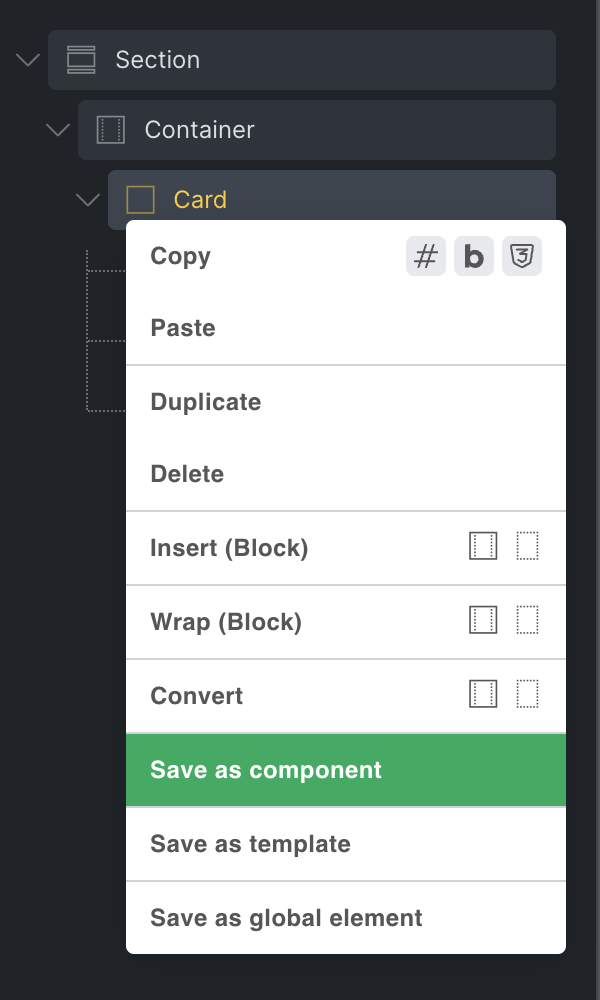

In the popup, enter a name (required), category (optional), and description (optional) for your new component. Click `Create` to finish creating the component.

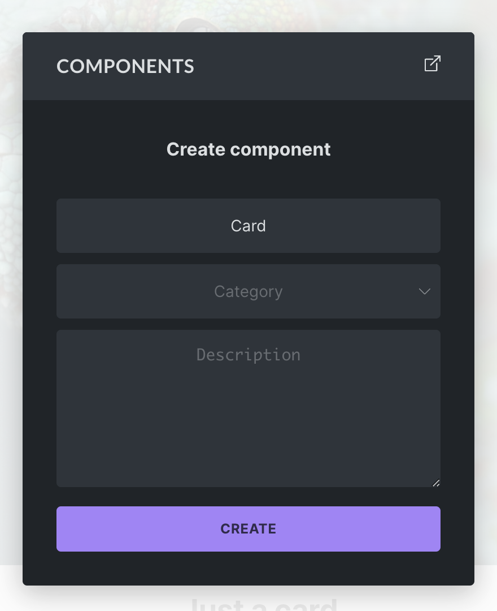

Once created, the selected element becomes a component instance. Bricks moves the original element tree into the component definition, replaces the page element with an instance that points to that component, and adds the component to the Components library.

## Components Library

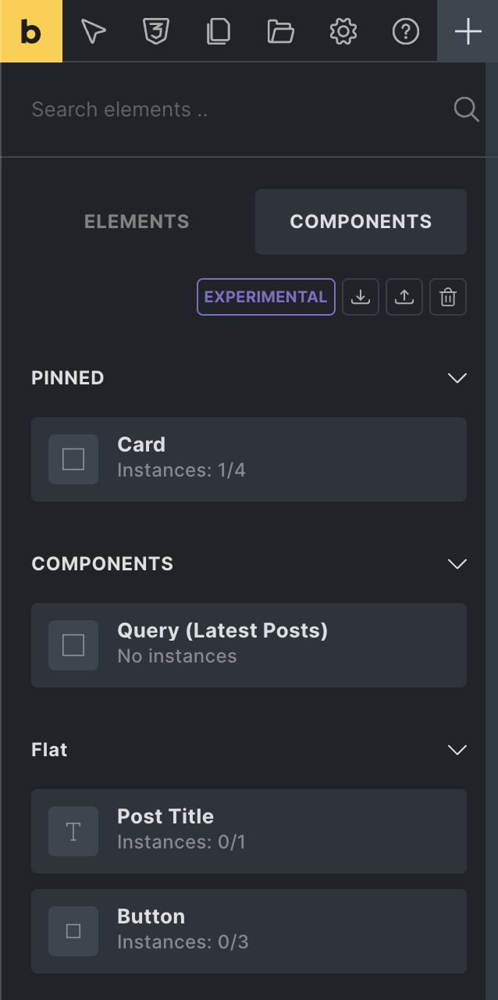

You can access your components from the `Components` tab, located next to the `Elements` panel tab.

From here you can add a component to the canvas or structure panel via drag and drop or click, the same as any other element.

In Bricks 2.4, you can also manage components from the Builder Browser. Open the Browser from the folder icon in the builder toolbar, then select **Components**.

You can perform the following actions from the Components tab:

- **Import:** Import component JSON or ZIP files from another installation.
- **Export:** Export all components of your site as a JSON file. To export a specific component, hover over it and click the export action icon.
- **Delete:** Click the delete icon to enter delete mode. Once activated, hover over the component you want to delete and click the delete icon.
- **Edit:** Open the component properties panel from the component action icons.
- **Duplicate:** Create a copy of an existing component.
- **Use in block editor:** Toggle whether a component can be used as a block in the WordPress block editor, when the block editor integration is enabled.

Component actions are permission-gated. Inserting components, creating components, deleting components, editing component definitions, setting instance property values, and importing/exporting components are separate builder permissions.

Imported components with duplicate IDs are skipped. Exported component JSON also includes global classes used by the component's element settings and class properties.

## Component Manager in the Builder Browser

The Browser's Components view gives you a wider management screen for existing components.

From there you can:

- Search components.
- Filter by category.
- Filter by usage: all usage, used on current page, used elsewhere, or unused.
- Switch between grid and list view.
- Import component JSON or ZIP files.
- Edit, duplicate, export, delete, or generate a screenshot for a component.
- Generate screenshots for the currently filtered component list.

Generating component screenshots requires the **Edit components** builder permission. Component import and export require the **Import/export components** builder permission. The **Used elsewhere** filter only shows components that are not used on the current page but are used on another page or template.

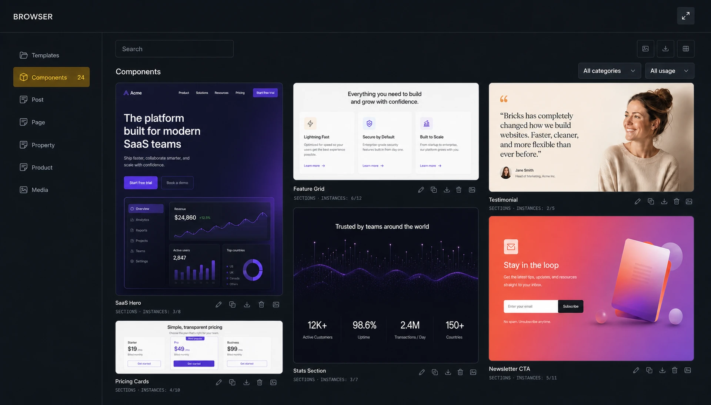

### Instance Count and Location

Below the name of the component is the instance count. For example, `Instances: 3/6` means the component is used three times on the page you are currently editing and six times across the site.

In the Components panel, hover over the component and click the globe icon to see all instances of this component on the current page, plus a list of other pages where the component is used.

In the Builder Browser's Components view, click the instance badge to open the usage popover. The popover separates **Current page** instances from **Other pages**. Current-page items take you to the matching instance in the builder. Other-page items open the matching page or template in Bricks in a new browser tab.

## Instances: How to Reuse a Component

Every time you add a component to a page, Bricks creates an instance of that component.

Changes to the main component automatically reflect in all instances of this component throughout your site. Instance-specific property values, variants, and slot content affect only the selected instance.

The following screenshot shows three instances of the same Card component:

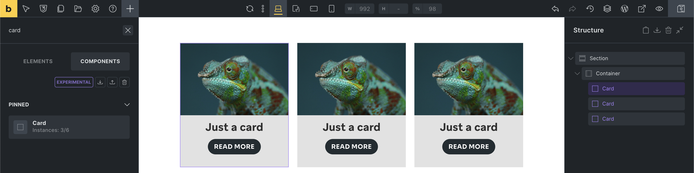

## Editing the Main Component

To view and edit the elements of the main component, which is the source of truth for all its instances, right-click any instance and select `Edit component`.

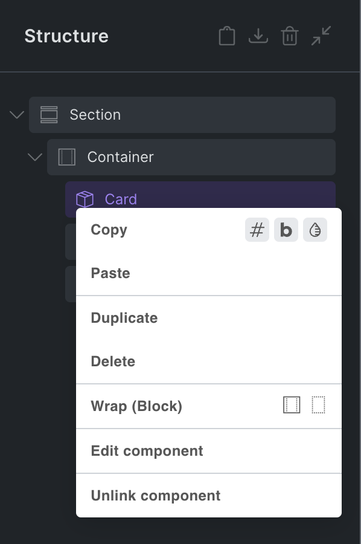

Alternatively, click the gear icon in the control panel header of the instance to enter component editing mode:

You are now editing the main component, indicated by the purple color in the control panel header.

As mentioned before, any change you perform on the main component applies to all instances of this component on your site.

The main component header contains the following actions:

- **Description** (info icon): Show or hide the component description.
- **Category** (folder icon): Show or hide the component category.
- **Block editor** (WordPress icon): Show or hide block editor settings when the component is enabled as a block.
- **Variants** (layers icon): Open the variants panel.
- **Properties** (box icon): Open the component properties panel.
- **Instance** (arrow icon): Exit component edit mode and return to the instance you were editing before, or to the Components library. Pressing the Escape key also exits the main component.

When editing the main component, you can see and edit all elements of this component in the structure panel:

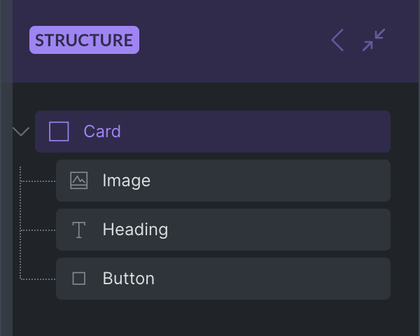

To edit the title of a Card component, select the Heading element inside the component and change its text to `Just a card`.

All instances of the Card component automatically reflect this change:

This is useful for shared structure and design. The real power of components comes from combining shared structure with properties that can be customized per instance.

## Properties {#properties}

Properties let you expose controls for customization on each instance.

For example, a Card component can expose a card title property and a card image property. Each Card instance can then use different content while still sharing the same component structure and styling.

There is a two-step process:

1. Create a property.
2. Connect that property to one or more compatible controls inside the component.

Creating and editing property definitions requires the **Edit components** [builder permission](/builder/interface/builder-access/#components). Setting property values on an instance requires the **Edit properties (Instance)** permission.

### 1. Creating a Property

To access the properties panel, select any instance of the component you want to edit. Then click the edit icon in the properties control panel on the left-hand side:

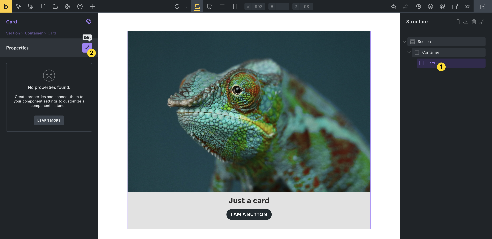

If there are no instances of the component on the current page, go to the Components library, hover over the component, and click the edit icon.

If you are already editing the main component, you can access the Properties panel by clicking the box icon in the panel header.

### Property Types {#property-types}

You can choose from these property types and connect them to compatible controls inside your component:

| **Property type**             | **Connectable to**                             | **Example**                       |
| ----------------------------- | ---------------------------------------------- | --------------------------------- |
| Text                          | Text and textarea controls                     | Heading or Basic text             |
| Rich text                     | Rich text controls                             | Rich text or Accordion content    |
| Icon                          | Icon controls                                  | Icon or Icon Box element          |
| Image                         | Image controls                                 | Image or Logo element             |
| Image gallery                 | Image gallery controls                         | Image gallery or Carousel element |
| Link                          | Link controls                                  | Button or Heading link            |
| Select _(@since 2.0)_         | Select, text, textarea, and rich text controls | HTML tag, Button style            |
| Toggle _(@since 2.0)_         | Checkbox and toggle controls                   | Hide element toggle               |
| Query loop                    | Query controls                                 | Layout elements                   |
| Global classes _(@since 2.0)_ | Global classes controls                        | Element global classes            |

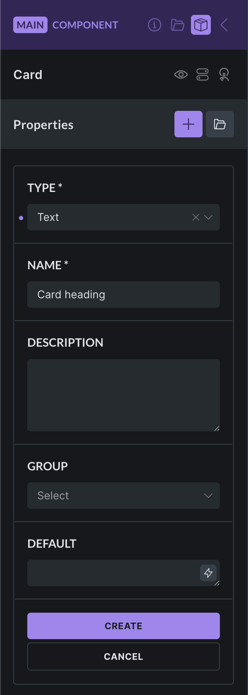

The **property name** is mandatory. Choose a descriptive name, especially for complex components with many properties.

The **property description** is optional, but it helps other builders understand how the property should be used.

The **property group** is optional and helps organize properties inside the instance panel.

The **default property value** is optional. It is used when an instance has not set its own value. If an instance value is cleared or reset, Bricks removes the override so the default value can apply again.

### 2. Connecting a Property to a Control

After creating a property, connect it to the control that should be editable on the instance.

Unconnected properties show a broken-link icon next to their name:

To connect a text property to a Heading element:

1. Edit the main component.
2. Select the Heading element inside the component.
3. Find the text control.
4. Click the purple `+` property icon.
5. Select the property you want to connect.

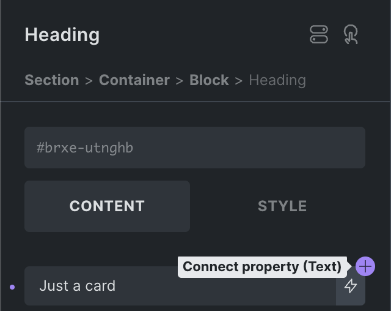

Clicking the `+` icon reveals a list of properties that can connect to this control:

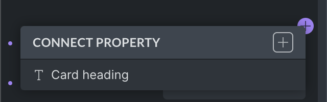

:::note
**Workflow boost:** Quickly create a new property by clicking the `+` icon at the top right of the "Connect property" dropdown.
:::

Once selected, the control shows the name of the property that is connected:

When an instance changes that property, Bricks applies the instance value to every connected control. For nested components, Bricks can also connect a child component property to a property from the parent component.

Most connected controls can use one non-class property. Global class properties are the exception and can be combined with other class property connections.

### Disconnecting a Property

To disconnect a property from a setting, click the connected property setting, hover over the connected property name, and click the unlink icon.

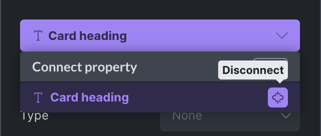

## Customizing an Instance

Select a component instance to customize the properties exposed by the main component. Only connected properties appear in the instance controls.

For example:

- One Card instance can use a custom heading.
- Another Card instance can use a different image.
- Another Card instance can keep the default property values.

Instance changes do not affect the main component or other instances. They only affect the selected instance.

## Components as Loops and Inside Loops {#loops}

Components are compatible with query loops. You can enable a loop on the component root or place a query loop inside the component.

In the following screenshot, the Card component is used inside a loop. The Card title uses the `post_title` dynamic data tag and the Card image uses the `featured_image` tag to render the post title and featured image of the loop results.

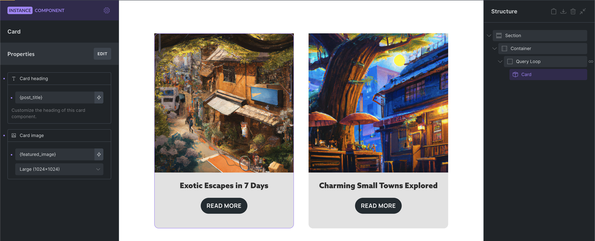

There is also a `Query loop` property type, which allows each component instance to customize an in-component query loop.

## Component Variants {#variants}

Bricks supports native component variants. When editing the main component, open the Variants panel to name the base variant and add custom variants. Each component instance can then select one of those variants.

Use native variants for formal component states or designs. Variant-specific settings are saved on the component definition, and the selected variant is saved on the instance.

Examples:

- Primary and secondary button styles.
- Card layouts with different spacing.
- Light and dark versions of the same component.
- Compact and expanded versions of a component.

For more flexible changes, expose settings as component properties instead.

## Property-Based Variation Patterns {#property-based-variations}

The following patterns use component properties to customize each instance. They are useful when you want instance-level choices without creating formal component variants.

### Show or Hide Elements {#visibility}

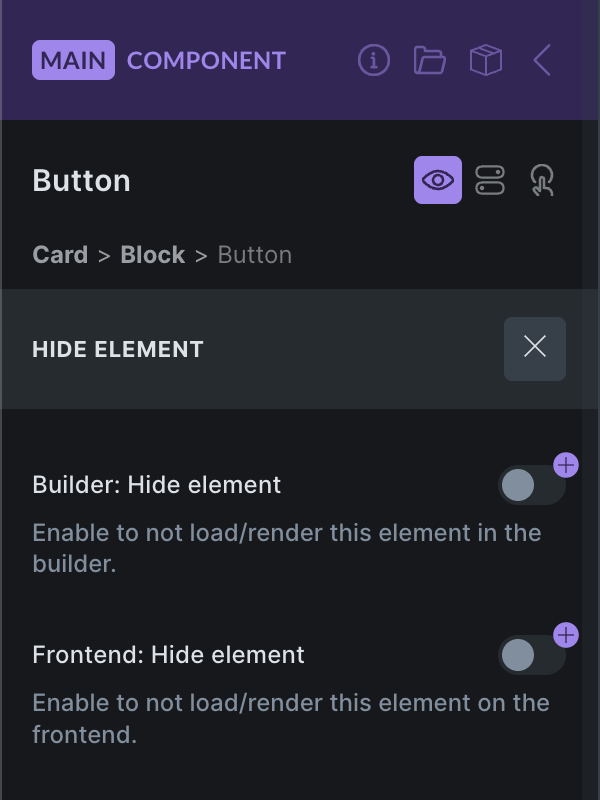

Bricks 2.0 introduces a Hide element feature, available by clicking the eye icon in the element panel header or from the context menu.

You can create a `Toggle` property and connect it to the **Builder: Hide element** and/or **Frontend: Hide element** controls to show or hide elements inside your component on an instance basis.

The frontend hide control is not just a visual CSS helper. Hidden frontend component elements are excluded from the frontend render/settings output.

### Global Classes {#global-classes}

The `Global classes` property type, available since Bricks 2.0, lets you create styling variations through global classes. Assign a collection of default and/or custom classes on the instance for any element of your component.

In the following example, we create a global classes property with the custom options `Small`, `Medium`, and `Large`. Each option has a different global class assigned to it. You can also assign multiple classes.

Once you have created the new `Heading size` property, connect it to the global classes control of the element of your choice. In this example, it is connected to the Heading:

Once connected, the property becomes available on every instance. In the following screenshot, the `Large` option adds the global class `prop-text-lg` to the Heading element of the instance.

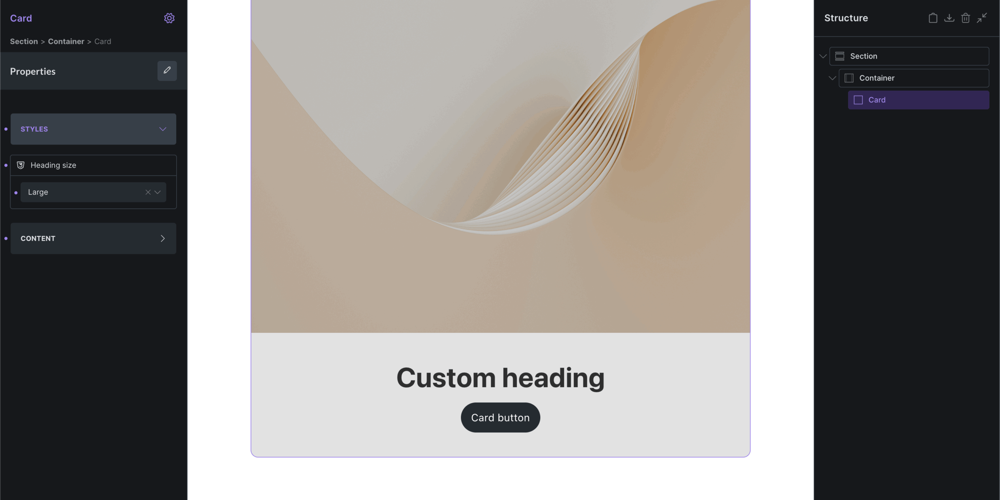

You can connect as many global class properties to an element as needed.

When defining custom options, you can leave the label empty to show the selected global class names instead. User-friendly labels are usually the preferred option.

You can change the global class selection of an option any time. The newly selected global classes are added to the instance if the corresponding option is selected.

### Local Classes {#local-classes}

If you are not working with global classes, you can use the `Select` property type to define custom options that users can choose from, then apply those class names through an attributes control inside the component.

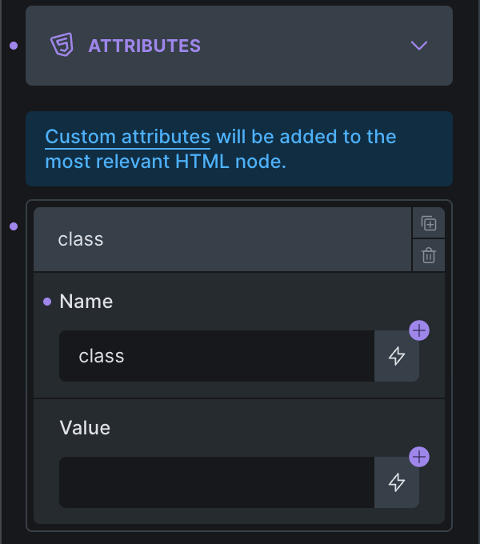

Next, create a `Select` property with class name options:

Once you create and connect this select property to the attributes value, it becomes available on the instance. You can then apply the local class with one click, which adds the `color-red` class to the Heading element inside the component.

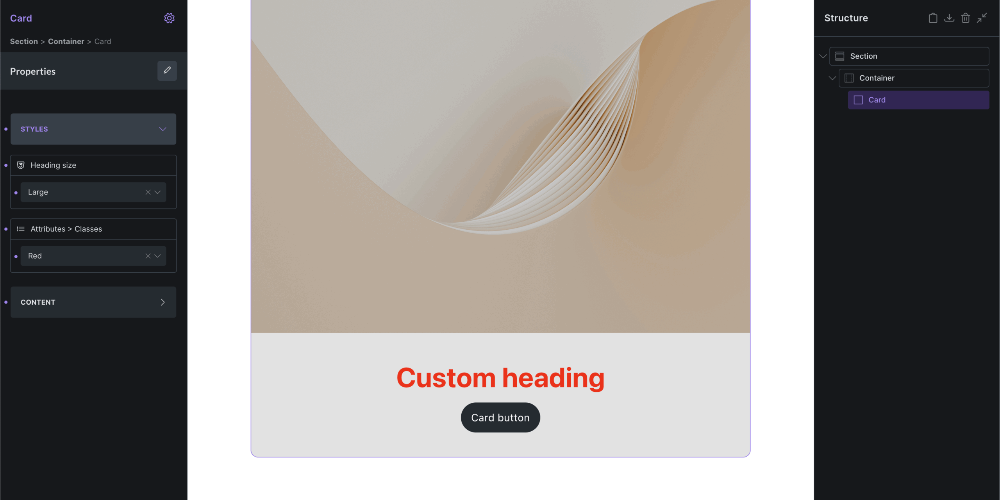

You can also connect a `Text` control to the attributes value if you want users to enter plain class names directly instead of choosing from predefined options.

## Slots {#slots}

The Slot element lets a component define a placeholder for instance-specific children. Add a Slot inside the main component where instance content should appear, then add elements to that slot from a component instance.

A Slot element in the main component is a placeholder. When you select an instance, Bricks exposes virtual slot areas where you can add instance-specific children. Those children are saved on the instance and rendered inside that slot for that instance only.

## Components as Blocks

Components can be used as blocks in the WordPress block editor if the Gutenberg integration is enabled.

To use a component as a block:

1. Enable the Gutenberg integration in Bricks settings.
2. Enable the component for the block editor.
3. Configure the component block title, category, icon, and preview image.
4. Insert the component from the WordPress block editor.

Block editor controls are generated from component properties that are connected to controls inside the component, including direct and nested property connections.

For the full setup, see [Components as Blocks](/integrations/gutenberg/components-as-blocks/).

## Unlinking a Component {#unlink}

To unlink an instance from a component, right-click the instance and select the `Unlink component` icon under the `Edit component` menu item.

Once unlinked, the instance is no longer tied to the main component and can be edited independently, like any other element.

## Global Element to Component Converter

Global elements are deprecated since Bricks 2.0. You cannot create new global elements, but you can convert existing global elements to components from `Bricks > Settings > General > Global elements`.

## Component Data Model

These details explain how Bricks stores and renders component instances:

- Component definitions live in Bricks component data, not as ordinary copied children on every page instance.
- A component must have one root element. The root element ID is the component ID.
- A page instance references its component through the component ID.
- Instance-specific property values are stored on the instance by property ID.
- Component properties are definitions. A property controls an instance value only after it is connected to one or more compatible controls inside the component.
- Variant selections live on the instance. Variant-specific settings live on the component definition.
- Slot children live on the instance, not in the main component definition.
- A missing component reference should be treated as invalid. Bricks skips instances whose component definition no longer exists.

## Notes & Tips

- Components are best for repeated design patterns.
- Properties are best for values that change per instance.
- Use categories to keep the component library organized.
- Use descriptions to make components easier to understand for teams and future maintenance.
- Use variants for design presets.
- Use slots for flexible inner content.
- Use component properties instead of duplicating components for small content differences.
- Export important components before deleting or heavily changing them.
- Keep components simple and focused. Very large components can become harder to maintain.
