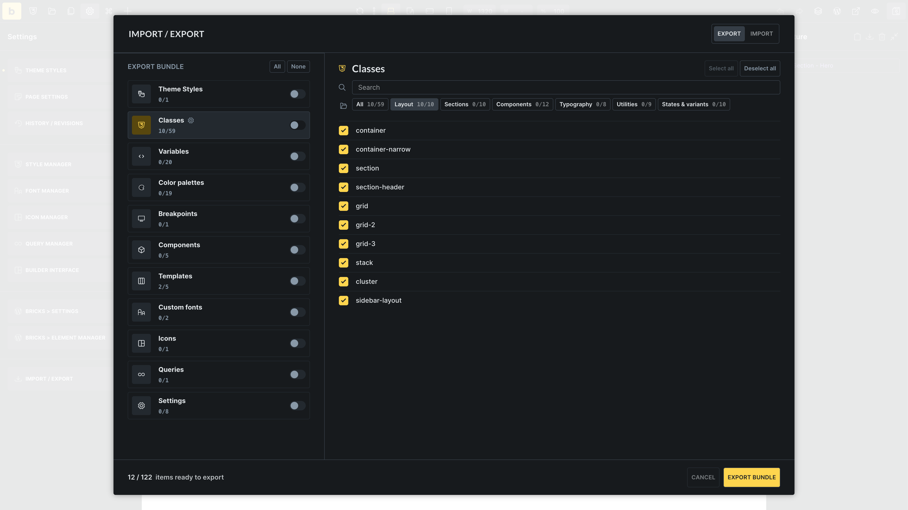
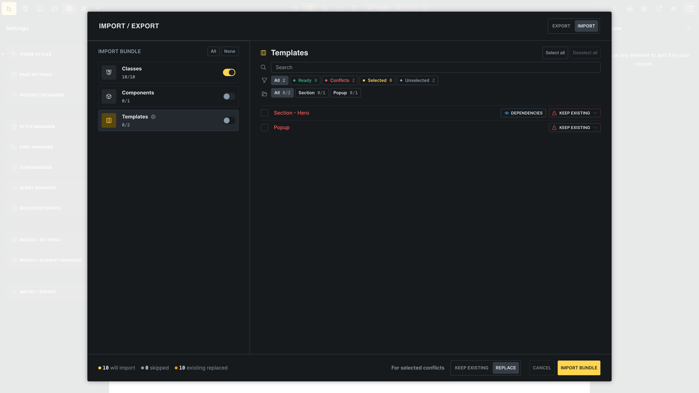
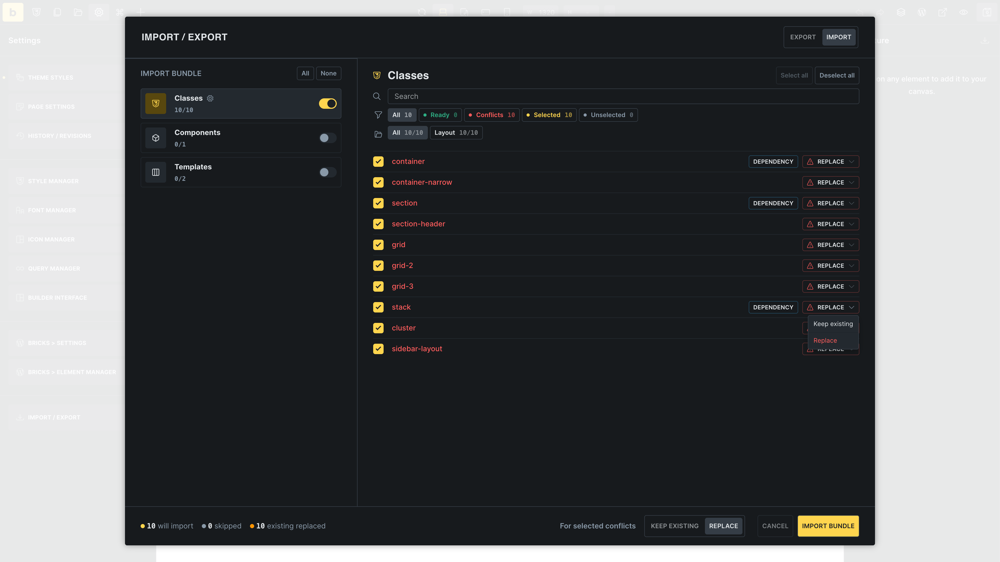
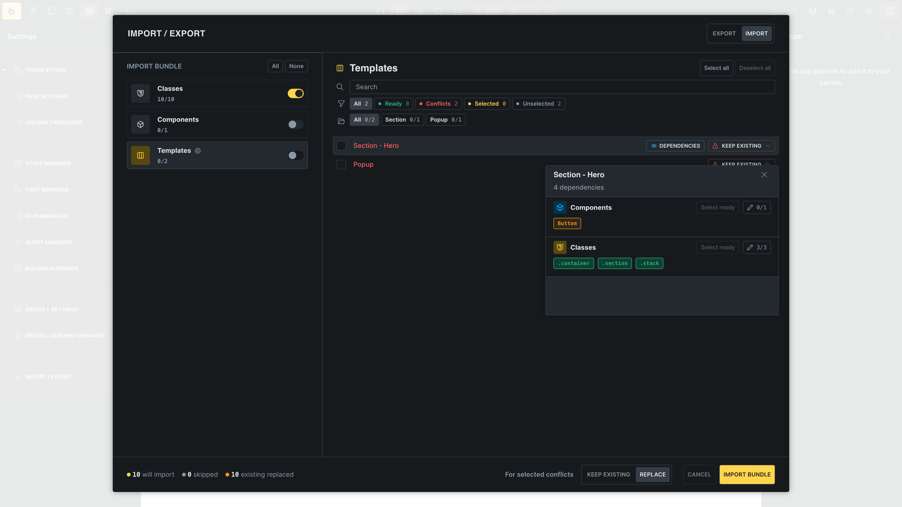

Global Import / Export lets you move selected Bricks global data between sites through one ZIP package.

Use it when you want to transfer a starter design system, reuse global classes and variables across projects, move components or templates with their dependencies, or back up global builder data before major changes.

https://www.youtube.com/watch?v=YTsRaQ8-Q-Y

## Where to Open It

In the builder, open **Settings** and click **Import / Export**.

You can also open the command palette and run **Manage: Import / Export**.

## What You Can Transfer

Global Import / Export supports these data types:

| Type           | What is included                                                                 |
| -------------- | -------------------------------------------------------------------------------- |
| Theme styles   | Selected theme styles                                                            |
| Classes        | Selected global classes and class categories                                     |
| Variables      | Selected global variables and variable categories                                |
| Color palettes | Selected colors and their palette categories                                     |
| Breakpoints    | The breakpoint configuration, including default and custom breakpoints           |
| Components     | Selected components                                                              |
| Templates      | Selected templates                                                               |
| Custom fonts   | Selected custom font families                                                    |
| Icons          | Selected custom icon sets, their SVG files, and disabled state for exported sets |
| Queries        | Selected global queries and query categories                                     |
| Settings       | Supported Bricks settings tabs from the WordPress dashboard                      |

Supported settings tabs include **General**, **Templates**, **Builder**, **Performance**, **Maintenance mode**, **API keys**, **Custom code**, and **WooCommerce**.

Settings transfer is limited to supported, non-security or sensitive settings. It does not replace the full WordPress database or every Bricks option.

## Before You Export

Before creating a package, decide what the target site should receive.

For a starter site or design system, you may want to export shared color palettes, theme styles, global classes, variables, fonts, custom icon sets, breakpoints, and reusable components. For a smaller handoff, select only the specific templates, components, queries, or settings needed for that project.

Review names before exporting. Clear labels for classes, variables, templates, components, and categories make the import review easier to understand on the target site.

If the target site already has a design system, be careful with shared items such as global classes, variables, breakpoints, and theme styles. Replacing them can affect existing layouts.

## Export a Package

1. Open **Import / Export**.
2. Make sure **Export** is selected.
3. Select one or more data types from the left sidebar.
4. Select the items you want to include.
5. Click **Export bundle**.

Bricks downloads a ZIP package. The ZIP contains a `manifest.json` file, JSON files for the selected data, and supported assets for selected custom fonts or custom icon sets.

Use the search field, categories, and select/deselect controls to narrow large lists before exporting.

## Import a Package

1. Open **Import / Export**.
2. Select **Import**.
3. Upload or drag in a Bricks transfer ZIP package.
4. Review the package contents.
5. Select the data types and items to import.
6. Review conflicts, warnings, and dependencies.
7. Click **Import bundle**.

Bricks inspects the package before applying changes. The review screen shows which items are ready to import, which items conflict with existing data, and which selected conflicts will be skipped or replaced.

Nothing is imported until you click **Import bundle**. Use the review step to deselect items you do not need, check warnings, and decide how conflicts should be handled.

Bricks only imports selected items that your current user is allowed to import. If a package contains data types you cannot access, those items are not available to import.

The unified importer also accepts supported JSON exports from individual managers, such as classes, variables, global queries, color palettes, theme styles, components, templates, settings, and icon manager data. Bricks wraps those JSON files into the same review flow so you can check conflicts before applying the import.

## Conflict Handling

When imported data matches existing data on the site, Bricks marks it as a conflict.

The default behavior is **Keep existing**. In that case, the conflicting item is skipped and the existing local item remains unchanged.

Choose **Replace** only for items you intentionally want to overwrite. You can set the conflict behavior for selected conflicts in bulk or per item.

Common conflicts include:

- A color with the same variable name.
- A theme style with the same label.
- A global class or variable with the same name.
- A custom font with the same ID or family.
- An icon set with the same name or ID.
- Breakpoints that differ from the current site configuration.
- A global query or component with the same ID.
- A template with the same title and template type.

## Dependencies

Components and templates can depend on global classes, variables, and other components. Bricks adds those dependencies to the package manifest and marks them in the import review.

Before importing a component or template, check its dependency preview. Select the dependency classes, variables, and components that should come with it, especially when the target site does not already have the same design system.

If a dependency already exists on the target site, review the conflict before replacing it. Replacing a shared class or variable can affect existing layouts on that site.

Dependencies can be included even when you did not select the full **Classes**, **Variables**, or **Components** type for export. This helps components and templates keep the styles and component definitions they rely on without forcing you to transfer every global class, variable, or component from the source site.

When a template uses Bricks components, Bricks includes the required component definitions in the template export. If the package does not include a separate **Components** transfer type, Bricks imports missing embedded component definitions while importing the template and keeps existing local components unchanged.

## Template Images

When importing templates, Bricks can import supported image assets into the Media Library.

Select **Import images** when you want template images copied into the target site. Leave it disabled when the target site should keep the image references from the package.

Template image import only applies to supported images referenced by the imported templates. It is not a full Media Library migration.

## Settings Notes

Settings are transferred by supported Bricks settings tab. This makes settings transfer useful for copying builder configuration between similar sites, but it is not a replacement for a site backup or migration tool.

Review imported settings carefully on production sites. **API keys** are hidden in the preview, and **Custom code** settings can affect the frontend or builder as soon as they are applied.

Settings and custom builder access capabilities require the WordPress `manage_options` capability.

## Permissions and Sensitive Data

Global Import / Export follows [builder permissions](/builder/interface/builder-access/).

Access depends on the data type:

- Color palettes require **Edit color palettes**.
- Theme styles require **Access theme styles**.
- Classes require **Access class manager**. Importing classes also requires permission to create or edit global classes.
- Variables require **Access variable manager**.
- Custom fonts require **Access font manager**. Importing custom fonts also requires permission to upload files.
- Icon manager requires **Access icon manager**. Importing custom icon sets also requires permission to upload files and upload SVGs.
- Breakpoints require **Access breakpoints manager**.
- Global queries require **Access query manager**.
- Components require **Import/export components**.
- Templates require **Import/export templates**.
- Settings and custom capabilities require the WordPress `manage_options` capability.

Sensitive data needs extra care. Settings such as API keys and custom code are marked during review, and API key values are hidden in the preview. Code-bearing component and template data is also guarded by code execution permissions.

Only import a package from a source you trust. Review settings, custom code, templates, components, and dependencies before replacing existing data.

## After Importing

Check the imported data in its manager:

- Open the [Style Manager](/builder/features/style-manager/) for theme styles, classes, variables, and colors.
- Open the [Font Manager](/builder/styling/font-manager/) for custom fonts.
- Open the [Icon Manager](/builder/features/icon-manager/) for custom icon sets.
- Open the breakpoint manager for breakpoints.
- Open [Query Manager](/builder/dynamic-content/global-queries-query-manager/) for global queries.
- Open [Components](/builder/features/components/) for imported components.
- Open [Templates](/builder/templates/) for imported templates.
- Open **Bricks > Settings** for imported settings.

For templates and components, also check whether global classes, variables, custom fonts, custom icon sets, images, queries, and site-specific data exist on the target site. A package can move Bricks data, but it cannot create missing post types, taxonomies, API credentials, or third-party plugin data.

## Troubleshooting

### I Do Not See a Data Type or Item

The current user may not have permission to access that data type, or the source site may not have any exportable items of that type.

### An Item Was Skipped

Skipped items are usually caused by conflicts set to **Keep existing**, deselected items, or unavailable permissions. Reopen the package, review the item, and choose **Replace** only when you want to overwrite the existing local item.

### An Imported Template Looks Different

Check whether the target site has the required global classes, variables, custom fonts, images, queries, custom fields, post types, taxonomies, and plugin data. Importing the template does not automatically recreate everything the source site used outside the supported Bricks data.

### The ZIP Is Not Accepted

Use a ZIP package created by Bricks Global Import / Export. The package must contain the expected manifest and data files, and it must fit within the server upload limits for the target site.

If you are importing an older JSON export from an individual manager, upload the original JSON file in the relevant import flow. Bricks supports selected legacy manager JSON formats, but unsupported or edited JSON files are rejected.
