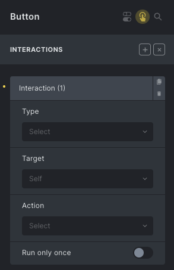
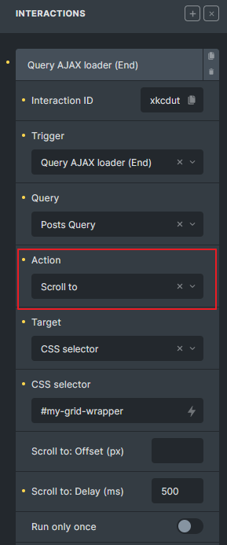
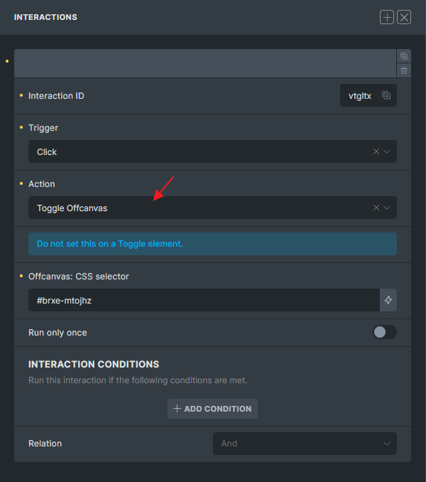
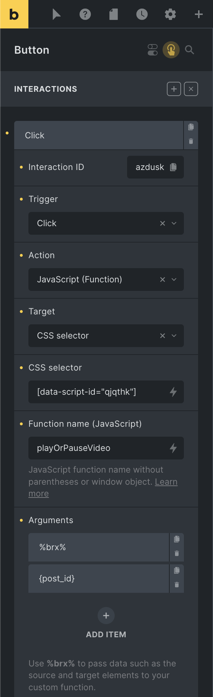
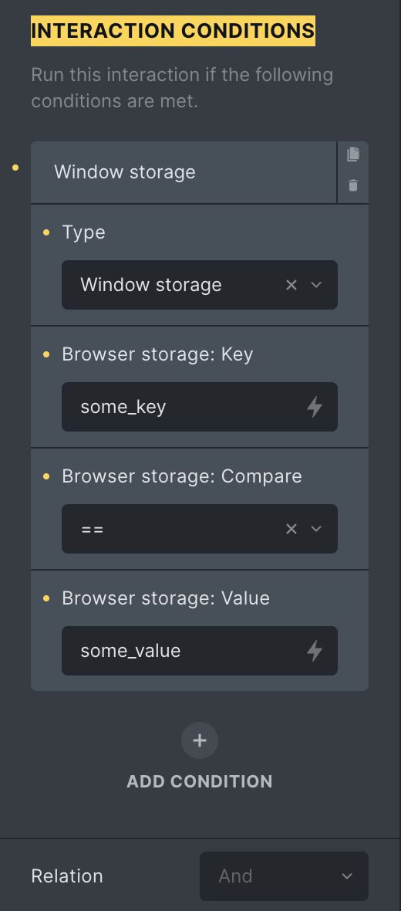
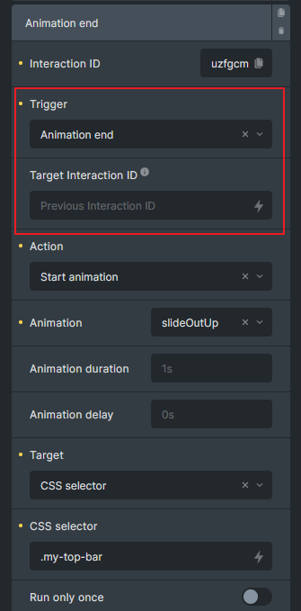
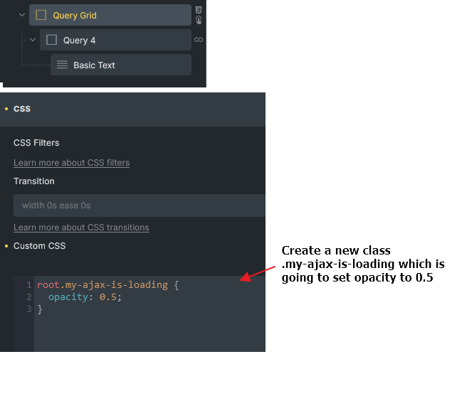
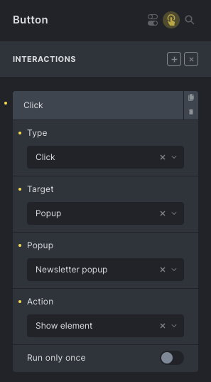
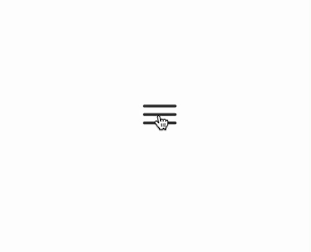
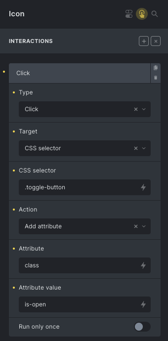

Interactions, available since Bricks 1.6, let you run an action when something happens on the front end. A simple interaction can show a hidden element on click. A more advanced interaction can listen for a query AJAX event, check browser storage, fetch an AJAX popup with the right post context, or call a custom JavaScript function.

An interaction has three main parts:

- **Trigger**: the event Bricks listens for, such as click, content loaded, scroll, enter viewport, form success, or query AJAX end.
- **Action**: the behavior Bricks runs, such as show, hide, toggle a class, scroll to an element, open a popup, load more results, or run a JavaScript function.
- **Target**: the element affected by the action. Depending on the action, the target can be the same element, a CSS selector, or a popup template.

:::note
Interactions run on the front end, not inside the builder canvas. Use preview or the published page to test timing, selectors, popup behavior, browser storage, and AJAX flows.
:::

:::note
You can define interactions on global classes instead of individual elements. Bricks merges global-class interactions into the element output, which is useful for repeated behaviors such as reusable buttons, close icons, or toggles.
:::

## Accessing interactions {#access}

When editing an element, click the "Interactions" toggle icon in the panel header to open or close the element interactions interface.


If an element has interactions, the same icon appears in the structure panel. Click the icon to open that element's interactions.

## Adding interactions {#add}

Click the "+" icon next to the "Interactions" title to add an interaction. You can add multiple interactions to the same element. Clicking the title of a specific interaction lets you rename it.


Each interaction receives its own ID. Bricks uses this ID internally, and you can copy it when another interaction needs to listen for a specific animation-end event.



## Triggers {#trigger}

The **Trigger** determines when the interaction runs.

### Element triggers {#element-triggers}

Element triggers listen on the source element:

- Click
- Hover
- Focus
- Blur
- Mouse enter
- Mouse leave
- Enter viewport
- Leave viewport
- [Animation end](#animation-end)
- [Query AJAX loader: Start / End](#query-ajax-loader)
- [Filter Submit: Start / End](#filter-submit-triggers)
- [Form Submit](#trigger-form-submit), [Form Success](#trigger-form-success), [Form Error](#trigger-form-error)

Click interactions call `event.preventDefault()` by default. Since Bricks 2.0, you can enable **Disable: preventDefault** for a click interaction if the clicked element should keep its normal browser behavior, such as following a link.

Enter viewport supports a `rootMargin` setting since Bricks 2.0. For example, `0px 0px -50% 0px` can make the interaction trigger when the element reaches a more specific viewport position. Leave viewport does not use `rootMargin`.

### Browser and window triggers {#browser-window-triggers}

Browser/window triggers are not tied to a single element event:

- Scroll
- Content loaded
- Mouse leave window

The scroll trigger accepts a scroll offset. Bricks supports pixel values, percentage values based on the document height, and `vh` values based on the viewport height. Content loaded accepts a delay such as `500ms` or `1s`.

The **Run only once** control is available for most triggers, but not for Content loaded.

### Query filter triggers {#query-filter-triggers}

When Query Filters are enabled, Bricks adds:

- Filter: Empty
- Filter: Not empty

These triggers listen for a specific filter element ID. You can enter the raw Bricks ID, `#id`, or `#brxe-id`; Bricks normalizes it before comparing.

Supported filter types are:

- Active filters
- Checkbox
- Datepicker
- Radio
- Range
- Search
- Select

For Active filters, Checkbox, Radio, and Select, Bricks checks whether options or values are available. Select excludes the placeholder option, and Checkbox/Radio exclude the "All" option. For Datepicker and Search, Bricks checks whether the current value is empty. For Range, Bricks checks whether the selected range differs from the filter's min/max values.

:::note
Use Filter: Empty and Filter: Not empty together when you are toggling visibility. If you only hide an element on empty, you usually need the matching not-empty interaction to show it again after the next filter update.
:::

### WooCommerce triggers {#woocommerce-triggers}

When WooCommerce is active, Bricks adds WooCommerce interaction triggers:

- Added to cart
- Adding to cart
- Removed from cart
- Cart updated
- Coupon applied
- Coupon removed
- Bricks dynamic fragments refreshed
- Bricks checkout step changed

The classic WooCommerce triggers listen for WooCommerce frontend jQuery events. **Bricks dynamic fragments refreshed** and **Bricks checkout step changed** listen for Bricks custom events emitted by Dynamic fragment refreshes and Checkout v2 step changes.

The dynamic fragments refreshed and checkout step changed triggers are available since Bricks 2.4.

## Actions {#action}

The **Action** is what Bricks runs after the trigger passes any conditions.

Available actions:

- Show element
- Hide element
- Click element
- Set attribute
- Remove attribute
- Toggle attribute
- [Toggle offcanvas](#toggle-offcanvas)
- Load more (Query loop)
- Load more (Image Gallery)
- [Start animation](#animation-start)
- [Scroll to](#scroll-to)
- [JavaScript (Function)](#javascript)
- Open address (Map)
- Close address (Map)
- Clear form
- Checkout step
- Browser storage: Add
- Browser storage: Remove
- Browser storage: Count

Show and Hide can target regular elements or popup templates. For regular elements, Bricks changes the inline `display` style. For popups, Bricks calls the popup open/close logic.

Set, Remove, and Toggle attribute work on the selected target. If the attribute key is `class`, Bricks adds, removes, or toggles class names via `classList`; otherwise it sets or removes the attribute itself.

The **Click element** action calls `.click()` on each target element. This is useful when you want one UI control to trigger another existing control.

The **Clear form** action clears inputs, textareas, selects, checkboxes, radios, and visible file results. Hidden inputs are not cleared. If the interaction is triggered by Form Submit, Form Success, or Form Error, Bricks clears the matching form. Otherwise, you can provide a target form selector; if no selector is provided, Bricks clears all forms on the page.

Map actions are available since Bricks 2.0. Use **Open address (Map)** and **Close address (Map)** when working with Map/Info Box popups and address interactions.

## Targets {#targets}

Most actions use one of these target modes:

- **Self**: run on the source element.
- **CSS selector**: run on every element matching the selector.
- **Popup**: run on a selected popup template.

Some actions do not use the standard target control because they have their own target field or no target at all. Examples include Load more, Browser storage, Toggle offcanvas, Map actions, and Clear form.

When a popup interaction is inside a query loop, Bricks first tries to match the popup by both the selected popup template ID and the current loop item ID. If no loop-specific popup is found, it falls back to the popup template ID.

## Run only once {#run-only-once}

Enable **Run only once** when the interaction should only run one time during the current page lifecycle. For normal element events, Bricks uses a one-time event listener. For document-level events such as form, AJAX, popup, filter, or WooCommerce events, Bricks tracks and removes the interaction after it runs.

Run only once is page-local. It is not stored across page loads. Use [Browser storage actions](#browser-storage) and [interaction conditions](#conditions) if you need a persistent or session-based rule.

## Action: Scroll to {#scroll-to}

Use **Scroll to** to move the page to the target element. The action supports:

- **Offset (px)**: subtracts pixels from the target position.
- **Delay (ms)**: waits before scrolling. Bricks uses a small delay by default so the DOM can update first.



In this example, after the "Posts Query" AJAX call finishes, the page scrolls to the element with the CSS selector `#my-grid-wrapper`, waiting `500` milliseconds first.

## Action: Checkout step {#checkout-step}

The Checkout step action is available for [WooCommerce Checkout v2 multistep layouts](/integrations/woocommerce/multistep-checkout-v2/).

It can move the checkout flow to:

- Next step
- Previous step
- A specific step
- A specific checkout field

Enable **Scroll into view** when the action should scroll the target step or field into view after the step changes.

Checkout v2 also adds the **Bricks checkout step changed** trigger, which runs after the active checkout step changes. See [Checkout v2 multistep checkout](/integrations/woocommerce/multistep-checkout-v2/) for the full setup workflow and [WooCommerce v2 query loops and dynamic tags](/integrations/woocommerce/woocommerce-v2-query-loops-dynamic-tags/#interactions) for the related WooCommerce events.

## Action: Toggle offcanvas {#toggle-offcanvas}

Since Bricks 1.11, interactions can toggle an Offcanvas element from any element. Set the action to **Toggle offcanvas** and provide the Offcanvas CSS selector, such as `#brxe-off123`.



Do not apply this action directly to the Toggle element itself.

## Browser storage {#browser-storage}

Browser storage actions let an interaction write, remove, or count a key:

- **Window storage**: stored on `window`; resets on page load.
- **Session storage**: stored in `sessionStorage`; normally resets when the browser tab/session ends.
- **Local storage**: stored in `localStorage`; persists until cleared.

The storage actions use the same **Key** field as attribute actions:

- **Browser storage: Add** writes the configured value to the key.
- **Browser storage: Remove** removes the key.
- **Browser storage: Count** reads the key as a number, defaults to `0`, increments it by one, and stores the result.

Storage is especially useful with [interaction conditions](#conditions). For example, one interaction can count how many times a button was clicked, while another interaction only runs when that count is greater than `2`.

## Action: JavaScript (Function) {#javascript}

Since Bricks 1.9.5, interactions can execute your own JavaScript functions.

:::note
Only functions available from the global `window` scope can be executed.
:::

Define your functions globally:

```php
<script>
window.myHelperFunctions = {}

myHelperFunctions.myCall = () => {
  console.log('myCall executed')
}

myHelperFunctions.nestedFn = {
  fn1: () => {
    console.log('fn1 executed')
  },
  fn2: () => {
    console.log('fn2 executed')
  }
}

function toggleMiniCart() {
  const run = () => {
    document.querySelector('.bricks-woo-toggle').dispatchEvent(new Event('click'))
  }

  setTimeout(run, 100)
}
</script>
```

Enter the function name in the **Function name (JavaScript)** field without parentheses and without `window.`:

- `myHelperFunctions.myCall`
- `myHelperFunctions.nestedFn.fn1`
- `myHelperFunctions.nestedFn.fn2`
- `toggleMiniCart`

You cannot execute `run()` from the example above because it is scoped inside `toggleMiniCart()`, not on `window`.

:::note
If your target is a CSS selector that matches multiple elements, Bricks executes the function once per target.
:::

### JavaScript function arguments {#custom-javascript-arguments}

Use the **Arguments** repeater to pass values to your function. The `%brx%` placeholder passes a Bricks object with interaction context:

- `source`: the source element that triggered the interaction.
- `targets`: the array of resolved target elements.
- `target`: the current target element for this function call.



```php
function playOrPauseVideo(brxParam, postId) {
  const target = brxParam?.target || false

  if (!target) {
    return
  }

  const video = target.querySelector('video')

  if (!video || !video.play || !video.pause) {
    return
  }

  if (video.paused) {
    video.play()
  } else {
    video.pause()
  }
}
```

## Interaction conditions {#conditions}

Interaction conditions let an interaction run only when browser storage matches your rules. Conditions support:

- Window storage
- Session storage
- Local storage

Each condition checks a storage key with one of these comparisons:

- Exists
- Not exists
- `==`
- `!=`
- `>=`
- `<=`
- `>`
- `<`

For numeric comparisons, Bricks converts the stored value and comparison value to numbers. Non-numeric values become `0` for those comparisons.

The **Relation** setting controls whether all conditions must pass or whether any condition can pass:

- **And**: every condition must be true.
- **Or**: at least one condition must be true.



The example above runs when `window.some_key` equals `some_value`.

## Animations {#animations}

Bricks uses [Animate.css](https://animate.style/) for interaction animations.

### Action: Start animation {#animation-start}

Set action to **Start animation** and choose an animation type, duration, and optional delay.


When the target is a popup, Bricks applies the animation to `.brx-popup-content`. If the animation name includes `In`, Bricks opens the popup. If a popup content animation includes `Out`, Bricks closes the popup after the animation ends.

### Popup animation behavior {#popup-animation}

Popups handle open and close animations directly. To open or close a popup after an animation, set the interaction action to **Start animation** and choose an animation ending in `In` or `Out`.

You do not need a second interaction that listens for the animation-end trigger only to open or close the popup.


### Trigger: Animation end {#animation-end}

Since Bricks 1.8.4, **Animation end** can run another interaction after a Start animation action finishes.



Use **Target interaction ID** to listen for a specific Start animation interaction. If you leave it empty, Bricks looks for the previous Start animation interaction in the same interaction group.

If the target ID points to the current interaction, or to an interaction that is not a Start animation action, Bricks ignores it.


In this example, interaction `uzfgcm` runs after the `xyyyeh` animation ends.

You can also listen for the same JavaScript event:

<span id="bricks-animation-end-code"></span>

```php
document.addEventListener('bricks/animation/end/xyyyeh', (event) => {
  const element = event.detail.el || false

  if (!element) {
    return
  }

  // Your logic here
})
```

## Query AJAX loader triggers {#query-ajax-loader}

Query AJAX loader triggers were introduced in Bricks 1.9. They listen to Bricks AJAX start/end events for a selected query ID.

:::note
Bricks AJAX includes Infinite Scroll, Load More, AJAX pagination, and Query Filter requests.
:::

Use **Query AJAX loader (Start)** to run an action before a query AJAX request starts, and **Query AJAX loader (End)** to run an action after it completes.

Use the Filter Submit triggers when the interaction should run only in response to a visitor clicking a Filter - Submit element.

##### Example: Apply opacity during AJAX loading

1. Create a grid layout for your query loop and add a custom class that sets opacity to `0.5`.
2. Add one interaction to apply the class when AJAX starts.
3. Add another interaction to remove the class when AJAX ends.




You can also listen to the underlying JavaScript events:

<span id="bricks-ajax-start-end-code"></span>

```php
document.addEventListener('bricks/ajax/start', (event) => {
  const queryId = event.detail.queryId || false

  if (!queryId) {
    return
  }

  // Your logic here
})
```

## Filter Submit triggers {#filter-submit-triggers}

Filter Submit triggers were introduced in Bricks 2.4. They listen to AJAX submissions from the [Filter - Submit element](/builder/dynamic-content/query-filters/#filter-submit-reset-element) for a selected query ID.

- **Filter Submit (Start)** runs after Bricks updates the selected filter values and before the AJAX filter request starts.
- **Filter Submit (End)** runs after the AJAX filter request finishes.

Select the target query in the **Query** control. Bricks only runs the interaction when the event's `queryId` matches that selected query.

These triggers are useful when filters are placed inside an Offcanvas on mobile. Add a **Filter Submit (End)** interaction that closes the Offcanvas, and it will run after the submitted filter results have finished loading. Use **Filter Submit (Start)** if the Offcanvas should close as soon as the visitor clicks Submit.

Filter Submit triggers only run for AJAX filter submissions that refresh the current page results. They do not run when the Submit element redirects to another URL.

The underlying JavaScript events are documented in [Custom JavaScript events in Bricks](/developer/guides/custom-javascript-events-in-bricks/#filter-submit-event-sequence).

## Form triggers {#form}

Since Bricks 1.9.2, interactions can listen to Bricks form events.


<figcaption>

Triggers: Form Submit, Form Success, Form Error

</figcaption>

### Trigger: Form Submit {#trigger-form-submit}

Form Submit runs after Bricks has prepared the form data and before the AJAX form request is sent.

```php
document.addEventListener('bricks/form/submit', (event) => {
  const elementId = event.detail.elementId
  const formData = event.detail.formData

  console.log('Element ID:', elementId)
  console.log('Form Data:', formData)
})
```

### Trigger: Form Success {#trigger-form-success}

Form Success runs after a successful form AJAX response.

```php
document.addEventListener('bricks/form/success', (event) => {
  const elementId = event.detail.elementId
  const formData = event.detail.formData
  const res = event.detail.res

  // Your logic here
})
```

### Trigger: Form Error {#trigger-form-error}

Form Error runs after an error form AJAX response.

```php
document.addEventListener('bricks/form/error', (event) => {
  const elementId = event.detail.elementId
  const formData = event.detail.formData
  const res = event.detail.res

  // Your logic here
})
```

When configuring a form trigger in the Interactions panel, provide the Form ID. Bricks accepts values such as `abcde`, `#abcde`, or `#brxe-abcde` and compares them against the form element ID.

## Trigger: Filter: Empty / Not Empty {#trigger-filter-empty-or-not-empty}

Filter: Empty and Filter: Not Empty were introduced in Bricks 1.11 and are available when the Query Filters feature is active.


Use them to hide, show, or otherwise update UI around filter elements whose options or values become empty after the initial page load or after a query filter AJAX update.

**Filter: Empty** runs when:

- Active filters have no rendered content.
- Checkbox, Radio, or Select has no available options, excluding "All" or placeholder options.
- Datepicker or Search has an empty current value.
- Range is still at its min/max default.

**Filter: Not Empty** runs when:

- Active filters have rendered content.
- Checkbox, Radio, or Select has available options.
- Datepicker or Search has a current value.
- Range differs from its min/max default.


Example: If a Filter - Select returns no options, hide its wrapper to avoid an empty control. Add the matching Not Empty interaction to show the wrapper again when options return.

## Popup example {#example-open-modal}

To open a newsletter popup from a footer button:

1. Create a Popup template named "Newsletter popup".
2. Set the popup template conditions to the pages where the popup should be available, such as Entire website.
3. Add a button in the footer.
4. Add a Click interaction to the button.
5. Set the target to Popup, select the Newsletter popup template, and use Show element.



Now the button opens that popup wherever the popup template is rendered.

## Example: Show custom tooltip on hover {#example-tooltip}

Create a hidden tooltip element, such as a Div with the class `.my-tooltip`, near an Icon element.


Add two interactions to the Icon:

- Hover or Mouse enter: show `.my-tooltip`.
- Mouse leave: hide `.my-tooltip`.


The result can look like this:


## Example: Create a toggle button {#example-toggle-button}

You can build a custom toggle button with two Icon elements inside a Div.



Add a custom class `.toggle-button` to the wrapper Div and use CSS like this:

```php
%root% .toggle-close-icon {
  display: none;
}

%root%.is-open .toggle-open-icon {
  display: none;
}

%root%.is-open .toggle-close-icon {
  display: block;
}
```

Give the default icon the class `.toggle-open-icon`, and the active icon the class `.toggle-close-icon`.

Then add interactions:

- On the default icon, add class `is-open` to the wrapper.
- On the active icon, remove class `is-open` from the wrapper.




