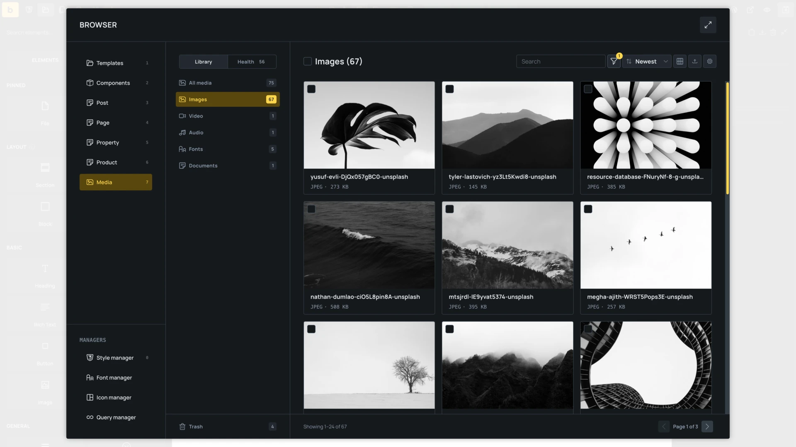
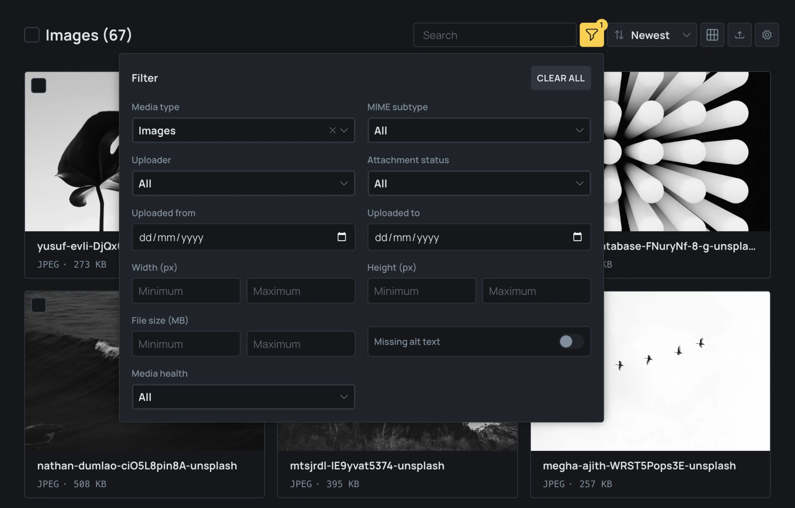
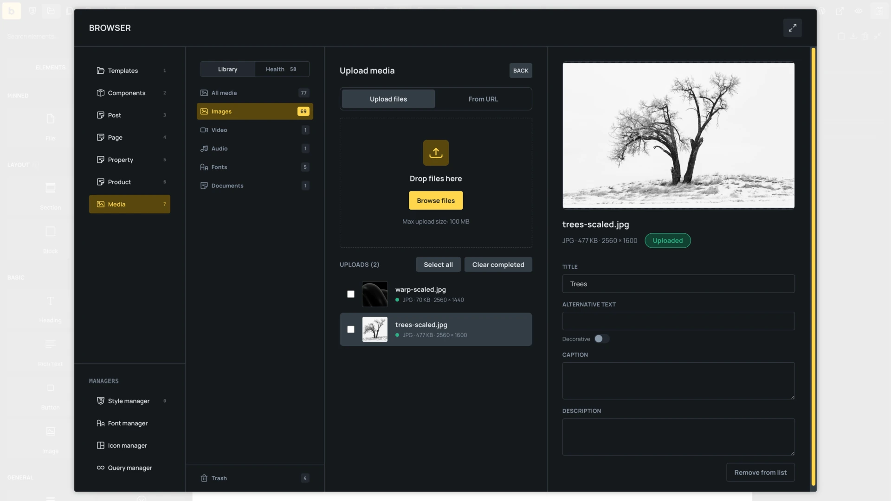
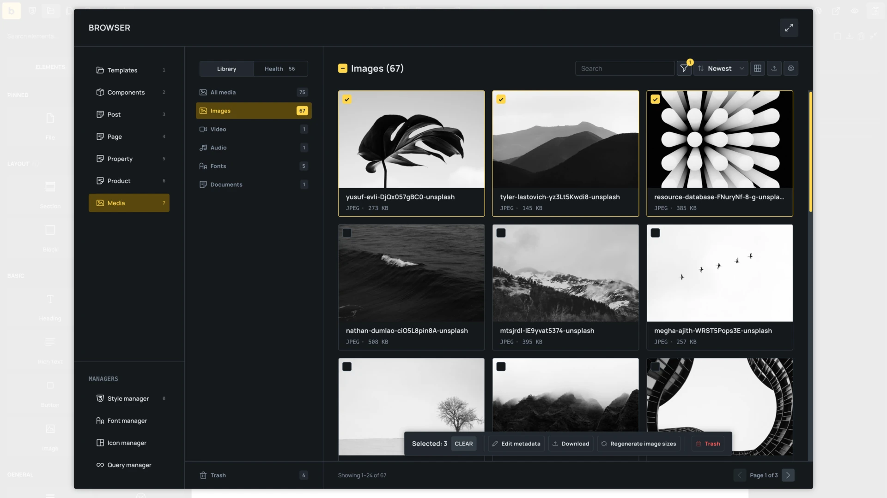
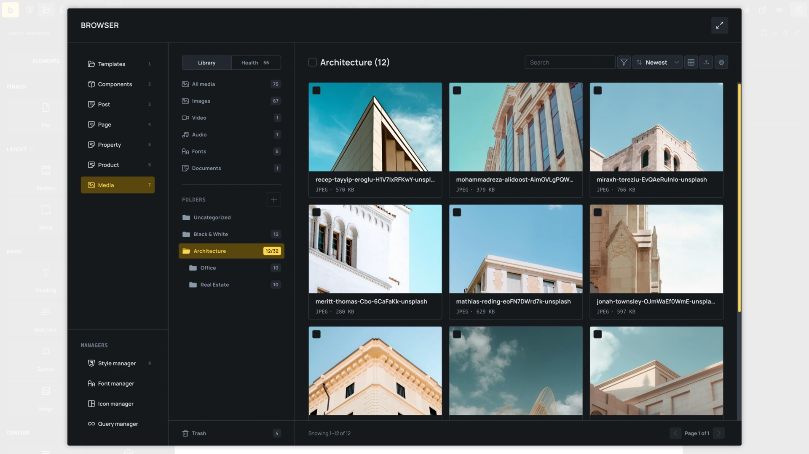
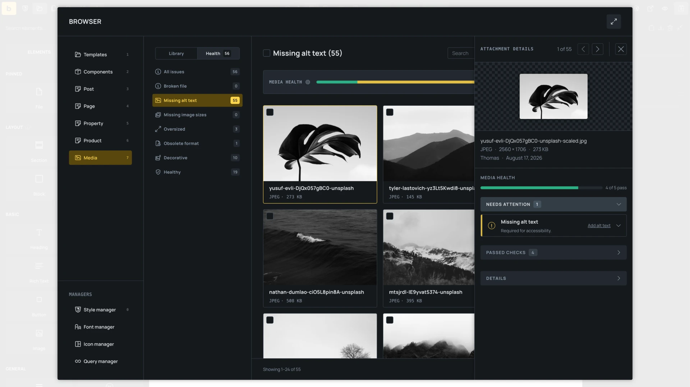

The **Media Browser**, introduced in Bricks 2.4, adds media selection and management to the [Builder Browser](/builder/features/builder-browser/). It works with attachments in the WordPress Media Library, so files uploaded or edited in either interface remain available in both.

Use the Media Browser to:

- Select files for Image, Image Gallery, Video, Audio, SVG, and File controls.
- Search and filter attachments by their metadata and file properties.
- Upload local files or import public files from URLs.
- Edit attachment details without leaving the builder.
- Select multiple attachments for metadata, download, folder, image-size, and deletion actions.
- Find and resolve common accessibility and file problems with Media Health.



## Open the Media Browser

Open the Builder Browser from the folder icon in the builder toolbar, then select **Media**.

The Media Browser can also open as a picker when you choose or change a file in a supported builder control. The picker limits results to the type accepted by the control. For example, an Audio control shows audio files, while an SVG control only shows SVG files.

Image Gallery opens in multi-select mode. Image, Video, Audio, SVG, and File controls select one attachment at a time. Existing control values are preselected when you reopen the picker.

### Choose the media picker

Go to **Bricks > Settings > Builder > Media > Media picker** and choose:

- **Bricks: Media browser (Default)**: Opens the Bricks interface in supported media controls.
- **WordPress: Media library**: Opens the standard WordPress media picker.

This setting changes the interface, not where the files are stored. Both options use the WordPress Media Library.

## Browse, search, and filter media

Use the sidebar to switch between all media, images, video, audio, Trash, and Media Health. If a compatible media-folder integration is active, folders also appear in the sidebar.

The layout control provides grid, masonry, and list views. Media defaults to 50 results per page. Open the settings popover to change the number of results from 1 to 100 and choose whether attachment details open beside the results or in an overlay.

Search checks the attachment ID, file name, title, caption, description, and alternative text.

The filter panel includes:

- Media type and MIME subtype.
- Uploader.
- Attached or unattached status. Featured images count as attached.
- Upload date range.
- Minimum and maximum width, height, and file size.
- Images with missing alternative text.
- Media Health status.

Width and height filters appear for compatible image and video types. The missing-alt filter only applies to images. The filter button shows the number of active filters, and **Clear all** removes them.



## Upload media

Click the upload icon in the Media Browser to open the upload workspace.

### Upload local files

Drop files into the workspace or click **Browse files**. You can stage and upload multiple files in one batch.

Before a local file is uploaded, you can change its file name without changing the extension. Bricks checks the current WordPress upload directory for conflicts. If the name already exists, rename the file or accept the unique name suggested by WordPress.

Existing attachments cannot be renamed from this workflow. Changing an existing file name could break stored URLs and references.

### Import files from URLs

Select **From URL**, then enter one public HTTP or HTTPS file URL per line. Bricks downloads the files into the WordPress Media Library. WordPress upload permissions, allowed file types, and upload-size limits still apply.

### Edit uploaded files

After an upload completes, you can edit its title, alternative text, caption, and description. Changes to an individual attachment save after you leave the edited field. Select several completed uploads to apply metadata changes in bulk.

When Media Health is enabled, images can also be marked **Decorative** during upload. This clears their alternative text and excludes them from the missing-alt check.

If you started the upload from a media control, compatible files can be inserted directly into that control. An uploaded file that does not match the control remains in the Media Library but cannot be inserted into that control.

When uploading while viewing a supported media folder, new files are assigned to that folder.



## Inspect and edit an attachment

In the standalone Media Browser, click an attachment to open **Attachment details**. Depending on the Browser setting and available space, the inspector opens beside the results or in an overlay.

The inspector provides:

- A preview for supported images, video, audio, and PDF files.
- File name, dimensions, file size, upload date, author, and generated image sizes.
- Editable title, alternative text, caption, and description.
- A **Decorative** toggle for images.
- Copy URL and download actions.
- Previous and next navigation through the current results, including other result pages.
- Available Trash, restore, and permanent-delete actions.

Metadata changes save when you leave a changed field. Bricks waits for pending saves before closing the inspector or moving to another attachment.

:::note
The **Decorative** flag classifies an attachment for Media Health and clears its stored alternative text. It does not add `aria-hidden`, change an Image or SVG element's frontend markup, or override an element's custom alternative text. Decide whether an image is decorative in the context where it is used.
:::

## Select and manage multiple attachments

In the standalone Media Browser, use the selection controls on attachment cards to start a bulk selection. You can select the current page, then use **Select all matching items** to include every result from the current search and filters. Individual items can still be excluded.

Available bulk actions depend on your WordPress permissions and the selected attachments:

- **Edit metadata**: Change selected metadata fields and mark images as decorative.
- **Download**: Prepare the selected files as an archive.
- **Move**: Assign the files to a folder when a compatible folder integration is active.
- **Regenerate image sizes**: Rebuild registered image sizes for selected images.
- **Trash** or **Delete permanently**: Remove attachments after a usage review.

Bulk work is processed in batches. If part of an action fails or is interrupted, the results identify completed, skipped, and failed items and offer a retry when the action can continue.



## Trash and permanent deletion

When WordPress Media Trash is enabled, attachments must first be moved to **Trash**. Open Trash from the Media sidebar to restore a file or delete it permanently. If Media Trash is disabled, the Media Browser offers permanent deletion directly.

WordPress disables Media Trash by default. To enable it, edit the `wp-config.php` file in the root of your WordPress installation and add this line before `/* That's all, stop editing! Happy publishing. */`:

```php
define( 'MEDIA_TRASH', true );
```

Media Trash also requires `EMPTY_TRASH_DAYS` to be greater than `0`. See the [WordPress Core attachment deletion documentation](https://developer.wordpress.org/reference/functions/wp_delete_attachment/) for how WordPress handles Trash and permanent deletion.

Before moving attachments to Trash or deleting them permanently, Bricks checks for detected uses and lists affected locations. You must review and acknowledge detected references before continuing with files that are in use.

The usage check covers attachment IDs stored in:

- Saved Bricks elements and page settings.
- Featured images.
- Global classes and theme styles.
- Components.

It does not detect every possible reference. URL-only references, Custom CSS, Code elements, Gutenberg or Classic Editor content, custom fields, unsaved changes, other sites, and external systems are outside the check. Review important files manually before permanent deletion.

:::caution
Deleting an attachment permanently removes its files. Any reference the usage check did not find may become a broken image or download.
:::

## Organize media with folders

Media folders require a compatible integration. Bricks 2.4 includes support for <a href="https://happyfiles.io/" target="_blank" rel="noopener noreferrer">HappyFiles</a>.

When the integration and your permissions allow it, you can:

- Browse all media, uncategorized media, and nested folders.
- Create, rename, move, and delete folders.
- Drag attachments or a selection into a folder.
- Move selected attachments with the bulk action.
- Upload files directly into the active folder.

Deleting a folder does not delete its attachments. Their relationship to that folder is removed. Files without another folder become uncategorized, and child folders move to the deleted folder's parent.



## Check media with Media Health

Media Health audits attachments in the background and groups them by issue. Open **Health** in the Media sidebar to see the scan status, issue counts, decorative images, and attachments that passed all enabled checks.

The available checks are:

- **Missing alt text**: Images with empty alternative text that are not marked decorative.
- **Broken files**: Local original files that are missing, unreadable, or empty.
- **Missing image sizes**: Eligible registered sizes missing from attachment metadata or local storage.
- **Oversized files**: Original files above the configured threshold for their media type.
- **Obsolete formats**: Files whose extensions match the configured list.

Select an issue to inspect the attachment and use the available resolution:

- Add alternative text, mark the image decorative, or ignore the missing-alt finding.
- Generate missing image sizes or regenerate every registered size.
- Optimize an oversized image or replace another oversized file.
- Convert an obsolete image or replace another obsolete file type.
- Replace or relink a broken file, then recheck it.
- Ignore a finding and restore it later if no change is required.

File replacement preserves the attachment ID and attachment metadata. Replacing, relinking, optimizing, or converting an attachment can affect every location that uses it, so Bricks shows detected usage before applying the change. Some image actions can create a new attachment instead of replacing the original.



### Configure Media Health

Go to **Bricks > Settings > Builder > Media**. Media Health and all five checks are enabled by default.

The default oversized-file thresholds are:

| Media type | Default threshold |
| ---------- | ----------------: |
| Images     |              1 MB |
| Fonts      |            0.5 MB |
| Documents  |              5 MB |
| Audio      |             10 MB |
| Video      |             50 MB |

Set a threshold to `0` to disable oversized-file warnings for that media type.

The default obsolete extension list is `bmp,tif,tiff`. Enter extensions without leading dots, separated by commas. An empty list disables obsolete-format findings while leaving the other health checks active.

Changing the enabled checks, thresholds, or obsolete extensions updates the Media Health policy. Attachments are checked again against the current policy.

## Permissions

The Media Browser follows WordPress attachment capabilities:

- Upload actions require permission to upload files.
- Metadata, download, regeneration, move, and repair actions require permission to edit the affected attachments.
- Trash, restore, and permanent deletion require permission to delete the affected attachments.
- Site-wide Media Health auditing requires permission to edit attachments uploaded by other users.

Users can inspect attachments they are allowed to see even when they cannot edit or delete them. Bulk actions are only offered when every selected attachment supports the action.
