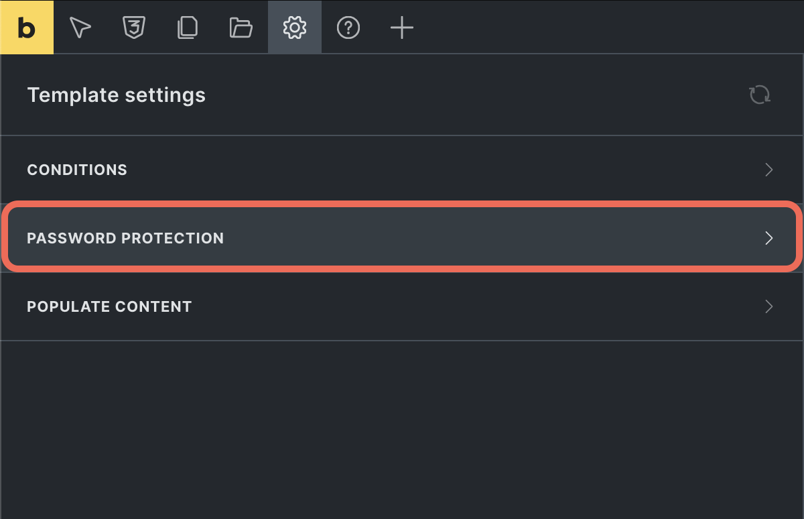

Bricks 1.11.1 introduces a Bricks-native Password Protection feature, giving you a simple yet powerful way to secure content across your website without needing extra plugins.

Whether you want to lock down individual pages, posts, broader areas like custom post types, or even the entire website, you can create custom templates that control access with ease.

Customize the password entry experience, schedule when protection is active, and manage everything directly within Bricks.

:::note
Password protection controls Bricks-rendered frontend output. For sensitive data, use stricter security controls such as proper authentication, authorization, and file access rules.
:::

## How to set up password protection

1. Enable this feature under `Bricks > Settings > General > Password Protection`
2. **Create a password protection template**
  - From the WordPress dashboard, navigate to `Bricks > Templates` and create a new template.
  - Under **Template type**, select **Password protection**.
  - When an empty template is converted to this type, Bricks can populate it with a default section, heading, text, and form.
3. **Configure password protection settings**
  - Click **Edit in Bricks** to customize the template.
  - To access the password protection settings, go to `Settings > Template settings > Password protection`.
  - Available settings include:
    - **Password source:** Select how passwords are managed. Options are **Template password**, **Post password**, or **Template & post password**. See details on each method in the [password source options](#password-source-options) section below.
    - **Password:** Set the password for template-wide protection. This field is only available if the **Password source** is set to **Template password** or **Template & post password**.
    - **Disable for logged-in users:** Allow logged-in visitors to bypass the template password.
    - **Schedule:** Schedule when the template password protection is active.
      - **Start date:** Set the date and time when protection begins.
      - **End date:** Set the date and time when protection ends.

The older **Disable header**, **Disable footer**, and **Disable popups** controls are deprecated and should not be treated as ordinary controls for new password-protection templates.

1. **Set template conditions**
  - Set [the template conditions](/builder/features/template-settings/#template-conditions) under `Settings > Template settings > Conditions` to define where this template applies.
  - For more dynamic control, use the [`bricks/password_protection/is_active`](/developer/hooks/filters/filter-bricks-password_protection-is_active/) filter to customize when the template should be active or bypassed.

1. **Add form element for unlocking**
  - Add a **Form Element** to the password protection template.
  - Add an **Unlock password protection** form action. This action will allow users to unlock the protected content by entering the correct password.
  - Add a password field. In the form action settings, choose that password field. If no field is selected, Bricks uses the first password field in the form.
  - You can customize the form action error message. The default error is `Incorrect password.`

Password protection templates have priority over other matching content templates. When an active password protection template matches the current page, Bricks renders that template as the content template until the visitor unlocks the content or the protection is otherwise bypassed.

## Password source options {#password-source-options}

The behavior of the password protection feature depends on the selected **password source** option. Below are details on how each option works and instructions for setup:

### Template password

Selecting **Template password** applies the password set in the template settings to all pages or posts that meet the template conditions. No further configuration is needed on individual posts. Simply:

- Set the password in `Settings > Template settings > Password protection > Password`.
- Define the template conditions under `Settings > Template settings > Conditions` to specify where this template will apply.

For any content matching these conditions, the password form will be automatically rendered, restricting access to those pages.

When a visitor enters the correct template password, Bricks stores a hashed password cookie named `brx_pp_` plus the WordPress cookie hash. The cookie is HTTP-only, uses the current SSL state, and expires after 10 days by default. You can customize the expiry with the [`bricks/password_protection/cookie_expires`](/developer/hooks/filters/filter-bricks-password_protection-cookie-expires/) filter.

### Post password

When **Post password** is selected, this template customizes the default WordPress password protection form but requires individual post-level password settings.

To protect content using the **Post password** method:

1. Enable password protection on each post or page through the WordPress editor.
2. Set a password directly on the individual post or page (or through quick edit).
3. The template conditions will control where the custom password form appearance applies, but protection is managed at the post level.

For post passwords, Bricks uses the WordPress password-protected post flow. The Bricks form posts to the WordPress `postpass` action, and WordPress decides whether the current post still requires a password. Template password, logged-in bypass, and schedule controls are not used when the source is **Post password**.

### Template & post password

The **Template & post password** option uses the template password by default. However, if an individual post password is set, it will take precedence.

Setup process:

1. Enter a password in **Password protection > Password**.
2. Define template conditions as needed to apply the password protection across relevant content.
3. For any posts with an individual password set, that password will override the template password.

This setup provides flexibility by allowing individual content to have unique passwords while maintaining general protection for all content under the template.

## Scheduling and bypass behavior

The schedule applies to template-password protection. If no schedule is enabled, template-password protection is active whenever the template conditions match. If a start date is set, protection starts after that time. If an end date is set, protection stops after that time. The Start date and End date controls are labeled UTC+0, so enter schedule times in UTC+0.

**Disable for logged-in users** bypasses template-password protection for any logged-in visitor. If the matched post is protected with a WordPress post password and this bypass is enabled through a template-password source, Bricks also skips the WordPress password requirement for logged-in users.

If a password protection template has no template password and the source is not **Post password**, Bricks does not render the template as a password gate.

## Template parts and popups

Password protection templates can hide the normal header, footer, and popups through the deprecated **Disable header**, **Disable footer**, and **Disable popups** settings. These controls are kept for backwards compatibility.

For new templates, prefer designing the password protection template itself as the complete gate the visitor should see. If an older template has those settings enabled, Bricks will remove the matching header/footer/popup template parts while the password protection template is active.

### Password protection filters: {#filters}

- [/developer/hooks/filters/filter-bricks-password_protection-cookie-expires/](/developer/hooks/filters/filter-bricks-password_protection-cookie-expires/)
- [/developer/hooks/filters/filter-bricks-password_protection-is_active/](/developer/hooks/filters/filter-bricks-password_protection-is_active/)
