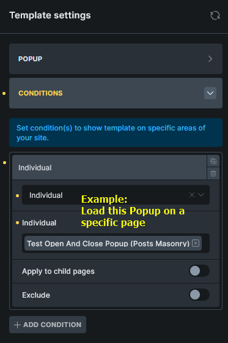
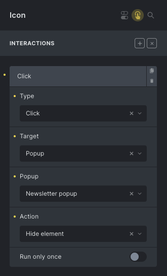
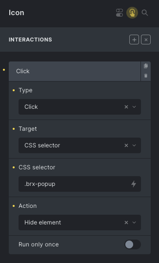
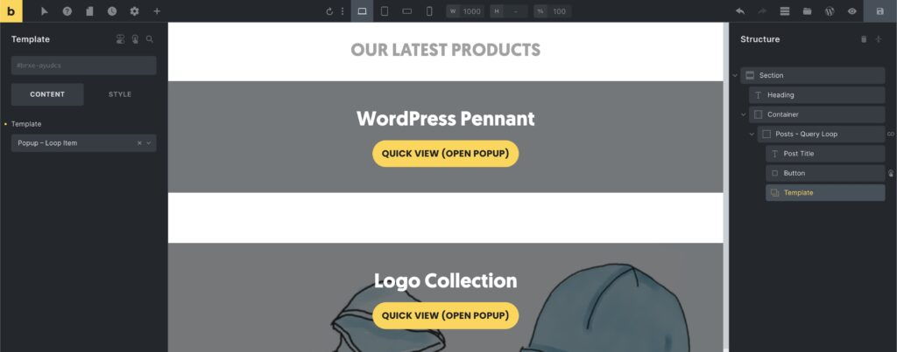
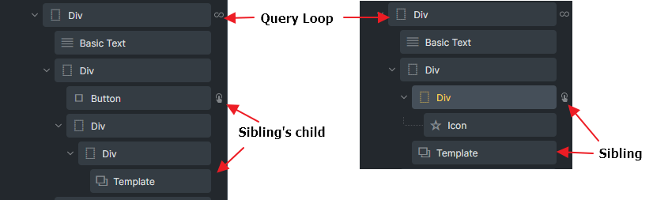
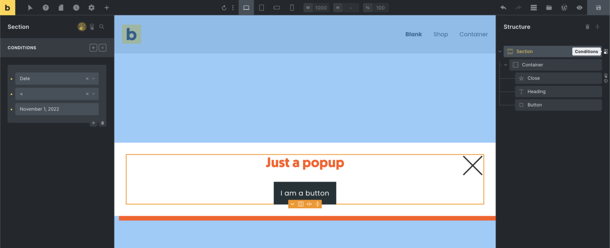

The Popup Builder lets you create fully custom popups in Bricks. A popup is a Bricks template with the template type **Popup**. Bricks renders the popup HTML on the front end, keeps it hidden by default, and opens or closes it through [Interactions](/builder/features/interactions/) or JavaScript.

Use popups for modals, newsletter forms, exit-intent offers, quick views, map info boxes, and contextual content in query loops.

## Create a popup template {#create-popup-template}

Create a new template and choose the **Popup** template type.


Save the template, then edit it with Bricks.

Popup templates look different from normal page templates:

- The popup content is centered on the canvas.
- Template Settings includes a **Popup** group.
- The template does not use Populated Content.


Build the popup body like any other Bricks layout: add sections, containers, forms, buttons, icons, images, or dynamic data to the canvas.

## Popup availability and template conditions {#popup-template-conditions}

Template conditions decide where Bricks renders a popup template. Open **Settings > Template Settings > Conditions** and choose the pages where the popup should be available.



For example, a newsletter popup that can open from the global footer usually needs a condition such as Entire website. A product quick-view popup may only need to be available on shop or product archive pages.

If a popup is not rendered on the current page, an interaction cannot open it because there is no popup element in the DOM. If a page has **Disable popups** enabled in Page Settings, Bricks does not render page popups.

You can render multiple popup templates on the same page.

## Popup settings {#popup-settings}

Popup-specific settings are under **Settings > Template Settings > Popup**.


You can also define global popup defaults in Theme Styles under the Popup control group. Template settings can override those defaults for one popup.

The main popup settings include:

- **Padding**: padding on the popup wrapper.
- **Align main axis** and **Align cross axis**: position the popup content inside the viewport.
- **Close on**: choose Backdrop click, ESC key, None, or the default Backdrop and ESC behavior.
- **Z-index**: controls popup stacking.
- **Scroll (body)**: allow the page body to scroll while the popup is open. If disabled, Bricks adds `no-scroll` to the body while the popup is open.
- **Scroll to top**: scroll popup content to the top when opening.
- **Disable auto focus**: prevent Bricks from focusing the first focusable element inside the popup.
- **Fetch content via AJAX**: render popup content on demand instead of in the initial DOM.
- **AJAX loader**: choose a loader animation and optional selector, color, and scale for AJAX popups.
- **Breakpoints**: choose where the popup is allowed to display.
- **Backdrop**: configure or disable the backdrop.
- **Content**: style the `.brx-popup-content` wrapper.
- **Popup limit**: restrict how often the popup can open.

On the front end, Bricks traps keyboard focus inside open popups, restores focus after closing, supports ESC/backdrop closing according to the **Close on** setting, and emits popup JavaScript events.

:::note
Clicking outside the popup or pressing ESC only closes the popup if the **Close on** setting includes that behavior. If you set Close on to None, add your own close interaction or JavaScript.
:::

## Popup interactions {#popup-interactions}

Further down the popup settings panel, the **Interactions** group lets the popup react to events. Popup template interactions use the same interaction system as elements, plus two popup-specific triggers:

- **Show popup**: runs after this popup opens.
- **Hide popup**: runs after this popup closes.

Use these triggers when the popup itself should run follow-up actions, such as starting an animation, setting storage, or updating another element after the popup has opened or closed.

:::note
For **Hide popup**, target a CSS selector rather than the popup directly. The trigger runs after the popup has already closed.
:::

Most popups are opened by an interaction on another element. For example, add a Click interaction to a Button, set **Target** to Popup, select the popup template, and use **Show element**.

A common automatic popup uses **Content loaded**:


If no popup interaction exists on the popup itself and no other element interaction opens the popup, the popup stays hidden.

## Popup open and close lifecycle {#popup-lifecycle}

When Bricks opens a popup, it follows this front-end flow:

1. Resolve the popup element by template ID or element node.
2. Check popup limits.
3. Check popup breakpoint rules.
4. Remove the `hide` class.
5. Add `no-scroll` to the body unless body scroll is allowed.
6. Fetch AJAX popup content if the popup is configured for AJAX.
7. Insert AJAX content into `.brx-popup-content`, if content was fetched.
8. Emit `bricks/ajax/popup/loaded`, only for AJAX content that was inserted.
9. Emit `bricks/popup/open`.
10. Increment the popup counters.

When Bricks closes a popup, it adds the `hide` class, removes `no-scroll` from the body if no other non-body-scroll popup is open, and emits `bricks/popup/close`.

This lifecycle matters for custom code:

- Listen to `bricks/ajax/popup/loaded` when you need newly fetched AJAX popup DOM to exist.
- Listen to `bricks/popup/open` when you need the popup to be open.
- Listen to `bricks/popup/close` when you need cleanup after close.

## Popup limit {#limit}

By default, a popup can open every time it is triggered. Use **Settings > Template Settings > Popup > Popup limit** to restrict how often it opens.

Bricks checks limits before opening the popup. Once a limit is reached, the popup does not open and the open event is not emitted.

There are four popup limit controls:

| Limit type | Browser storage | Description |
| --- | --- | --- |
| Per page load | `window.brx_popup_{id}_total` | Resets after the page reloads. |
| Per session | `sessionStorage.brx_popup_{id}_total` | Resets when the browser session/tab storage is cleared. |
| Across sessions | `localStorage.brx_popup_{id}_total` | Persists until local storage is cleared. |
| Show again after hours | `localStorage.brx_popup_{id}_lastShown` | Stores the last shown timestamp and waits the configured number of hours before allowing another open. |


The page-load, session, and across-session counters increment each time the popup is successfully opened. The hour-based setting stores the last shown timestamp when the popup passes its limit check.

## Popup breakpoints {#popup-breakpoints}

Popup breakpoint settings control whether a popup is allowed to display at the current viewport width.

Bricks supports two modes:

- **Start display at breakpoint**: show the popup at or above the selected breakpoint width.
- **Display on breakpoints**: show the popup only inside the selected breakpoint ranges.

If the current viewport does not match the popup breakpoint rule, Bricks does not open the popup.

## Closing a popup {#closing-popup}

You can close a popup in several ways:

- Use the popup **Close on** setting for backdrop click and/or ESC.
- Add a close icon or button inside the popup and give it a Hide element interaction targeting the popup.
- Use a reusable close element that targets `.brx-popup`.
- Call `bricksClosePopup()` from JavaScript.

### Example: Add popup close icon {#example-close-icon}

Add an Icon element to your popup. Set its cursor to pointer under **Styles > Layout > Misc**.

Open the Icon element's Interactions panel and add:

- Trigger: Click
- Target: Popup
- Popup: the current popup
- Action: Hide element



If you want to reuse the same close icon in different popups, create it as a [Component](/builder/features/components/). Then use:

- Target: CSS selector
- CSS selector: `.brx-popup`
- Action: Hide element



## JavaScript helper functions and events {#events-functions}

Bricks exposes popup helper functions and custom events on the front end.

### Open or close a popup via JavaScript {#popup-js-functions}

Use `bricksOpenPopup` and `bricksClosePopup` to open or close Bricks popups.

Both functions accept a popup template ID or a popup element node:

```php
bricksOpenPopup(3321)
bricksClosePopup(3321)
```

```php
const popup = document.querySelector('.brx-popup[data-popup-id="3321"]')

bricksOpenPopup(popup)
bricksClosePopup(popup)
```

### Example: Open popup by selector {#open-popup-by-selector}

```php
document.querySelectorAll('.brxe-heading, .my-custom-selector').forEach((el) => {
  el.addEventListener('click', () => {
    bricksOpenPopup(3321)
  })
})
```

### Listen to popup open or close events {#popup-js-events}

Use `bricks/popup/open` and `bricks/popup/close` to run code when a popup opens or closes.

<span id="bricks-popup-open-close-code"></span>

```php
document.addEventListener('bricks/popup/open', (event) => {
  const popupId = event.detail.popupId
  const popupElement = event.detail.popupElement

  if (popupId == 3321) {
    console.log('3321 popup is opened')
  }
})

document.addEventListener('bricks/popup/close', (event) => {
  const popupId = event.detail.popupId
  const popupElement = event.detail.popupElement

  if (popupId == 3321) {
    console.log('3321 popup is closed')
  }
})
```

Use `event.detail.popupId` and `event.detail.popupElement`. The property is `detail`, not `details`.

## Popup inside query loop {#query-loop}

You can add a popup inside a query loop with the **Template** element. Inside the popup template, dynamic data can reference the current loop item.

The example below shows a Quick View button inside a product query loop. The button uses an interaction to show the selected Quick View popup.



For Bricks 1.7.1 and newer, Bricks can build loop-specific popup HTML for query loop popups. For older versions, do not set the interaction on the Query Loop div itself; set it on an element inside the loop item.



<figcaption>

Example layout structure to trigger a looping popup for Bricks versions earlier than 1.7.1

</figcaption>

### Example: Open a looping popup by query element ID and loop index {#open-looping-popup-by-query-element-id-and-loop-index}

If a looping popup is already rendered on the page, you can target it by its query element ID and loop index:

```php
document.addEventListener('DOMContentLoaded', () => {
  setTimeout(() => {
    const queryId = 'vfiqrn'
    const targetPopup = document.querySelector(
      `.brx-popup[data-popup-loop="${queryId}"][data-popup-loop-index="7"]`
    )

    bricksOpenPopup(targetPopup)
  }, 200)
})
```

The small delay is useful in custom code elements because it gives Bricks frontend globals and popup markup time to initialize.

## AJAX popup {#ajax}

AJAX popups were introduced in Bricks 1.9.4. Enable **Fetch content via AJAX** when you want Bricks to keep the initial DOM lighter and fetch popup content only when the popup opens.

This is especially useful for popups inside query loops, where rendering every popup's full content on initial page load can be expensive.


When AJAX is enabled:

- The popup wrapper is rendered on the page.
- `.brx-popup-content` starts empty outside the builder preview.
- Bricks fetches the content from the REST endpoint when the popup opens.
- Returned HTML and dynamic CSS are inserted into `.brx-popup-content`.
- Additional nested popup HTML can be appended to the body if the AJAX content contains looping AJAX popups.

AJAX popup rendering supports post, term, and user context. Dynamic data that does not have a stable object ID, such as some repeater rows, cannot always be resolved as an AJAX popup context.

### AJAX popup context settings {#ajax-context-settings}

When an interaction opens a popup, Bricks exposes context controls for AJAX popups:


Bricks tries to infer the current context automatically. Inside normal post, term, and user loops, this often works. In nested query loops, component instances, custom field repeaters, or more complex dynamic data setups, automatic context can be wrong or unavailable.

Use these fields when dynamic data in the AJAX popup renders empty or from the wrong object:

- **Context type**: Post, Term, or User.
- **Context ID**: the object ID to render dynamic data against.

You can use dynamic data such as `{post_id}`, `{term_id}`, or a custom field value that resolves to a post, term, or user ID.


<figcaption>

A looping product quick-view popup structure in Bricks

</figcaption>

:::note
Do not use a repeater row number as popup context. AJAX popup context expects an object Bricks can resolve, such as a post, term, or user.
:::

### Open an AJAX popup with context in JavaScript {#open-ajax-popup}

Since Bricks 1.9.4, `bricksOpenPopup` accepts three parameters:

- `object`: popup ID or popup element node.
- `timeout`: timeout in milliseconds used by popup animation/counter logic.
- `additionalParams`: AJAX popup context data.

```php
bricksOpenPopup(
  1190,
  0,
  {
    popupContextId: 668,
    popupContextType: 'post'
  }
)

bricksOpenPopup(
  2350,
  0,
  {
    popupContextId: 39,
    popupContextType: 'term'
  }
)
```

For users, the Interactions panel usually handles these parameters. Use JavaScript when you are opening popups from custom scripts.

### AJAX popup events {#ajax-events}

AJAX popups emit three AJAX-specific events:

- `bricks/ajax/popup/start`: emitted before the AJAX popup request is made.
- `bricks/ajax/popup/end`: emitted after the AJAX popup request finishes.
- `bricks/ajax/popup/loaded`: emitted after fetched popup content is inserted into the DOM.

Each event uses `event.detail.popupId` and `event.detail.popupElement`.

```php
document.addEventListener('bricks/ajax/popup/loaded', (event) => {
  const popupId = event.detail.popupId
  const popupElement = event.detail.popupElement

  if (popupId == 3321) {
    console.log('3321 AJAX popup content DOM loaded')
  }
})
```

The AJAX popup open sequence is:

1. `bricks/ajax/popup/start`
2. `bricks/ajax/popup/end`
3. `bricks/ajax/popup/loaded`
4. `bricks/popup/open`

`bricks/ajax/popup/loaded` only fires when AJAX content is inserted. Non-AJAX popups emit `bricks/popup/open` directly after opening.

## Popup setup examples {#popup-setup-examples}

### Example: Show popup when the mouse leaves the browser window {#example-mouse-leaves}

After creating the popup template and layout, open **Settings > Template Settings > Popup**, scroll to Interactions, and add a **Mouse leave window** interaction that shows the popup.


For a real exit-intent popup, combine this with popup limits or browser storage conditions so the popup does not appear too often.

### Example: Show popup before a date/time {#example-date-time}

Template conditions decide where the popup template is available. Element Conditions can decide whether the popup content renders.

To show a popup only before a specific date, add an [Element Condition](/builder/features/element-conditions/) to the outermost popup element.



If that condition is not fulfilled, Bricks does not render the popup content and skips the popup HTML. A trigger that targets that popup has no popup element to open on the page.

### Example: Use popup open/close as triggers {#example-popup-open-close-trigger}

Popup template interactions can react after the popup opens or closes.

For example:

1. Open **Settings > Template Settings > Popup > Interactions**.
2. Add a **Show popup** trigger.
3. Set the action to Browser storage: Count.
4. Store a key such as `newsletter_popup_opened`.

You can then use interaction conditions elsewhere to check that key and adjust page behavior.
