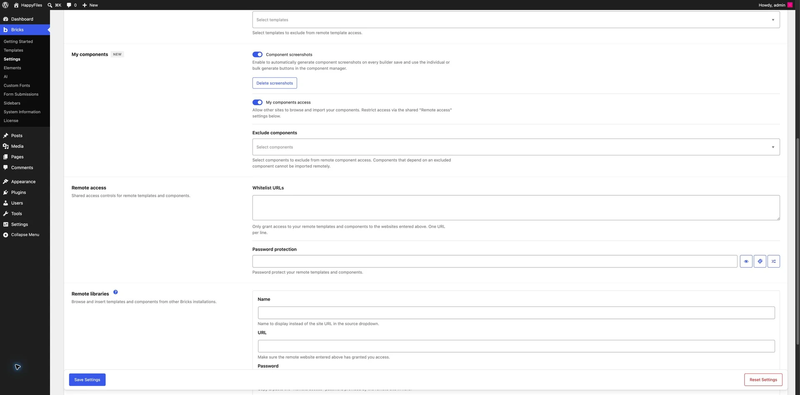
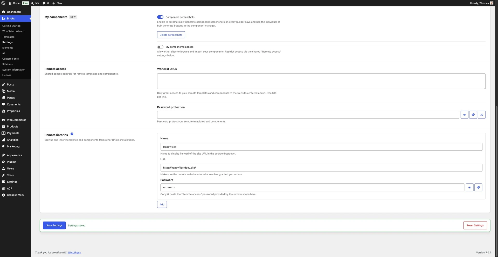
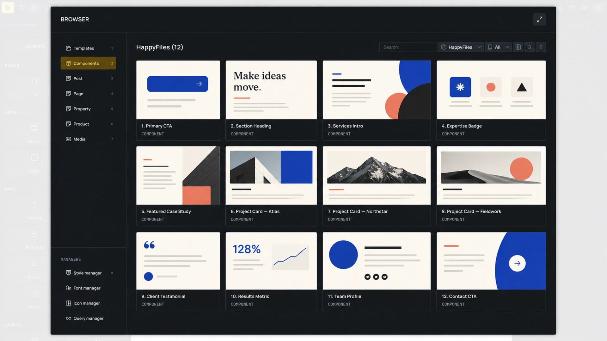
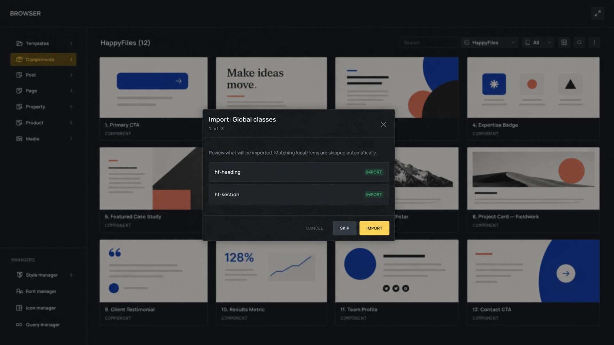

Remote Components let one Bricks site expose selected components and another Bricks site import them from the Component Manager. Use this for component libraries that you maintain across client sites, staging sites, or related projects.

Remote Components are available in Bricks 2.4. Both sites need Bricks 2.4 or later for remote component browsing and dependency-complete imports.

A remote import creates a local component. It does not keep a live connection to the source site, but Bricks records where the component came from so a later import can detect and apply source changes.

## Before You Start

You need:

- A **source site** that contains the components you want to share.
- A **destination site** where you want to import them.
- A non-Plain WordPress permalink structure on the source site.
- Permission to configure Bricks settings on both sites.
- The required [builder permissions](#permissions) for the user importing the component.

## 1. Expose Components on the Source Site

On the source site:

1. Go to **Bricks > Settings > Templates & components**.
2. Under **My components**, enable **My components access**.
3. If needed, choose components under **Exclude components**.
4. Configure the shared **Remote access** controls.
5. Save the settings.

### Exclude Components

Components selected under **Exclude components** do not appear in the remote catalog.

Bricks also blocks the import of any component that depends on an excluded component. For example, if a Card component contains an excluded Button component, the Card may appear in the catalog, but the destination site cannot import it until the Button is allowed or removed from the Card.

### Restrict Remote Access

The **Remote access** settings apply to both remote templates and remote components:

- **Whitelist URLs** allows only the listed destination sites to connect. Enter one URL per line. Leave it empty to allow requests from any site that meets the other access requirements.
- **Password protection** requires destination sites to send the same password. Use the password generator or enter your own value.

Enabling **My components access** without a whitelist or password allows other Bricks sites that know the source URL to browse the exposed component catalog.

## 2. Add the Source to the Destination Site

On the destination site:

1. Go to **Bricks > Settings > Templates & components**.
2. Find **Remote libraries** and click **Add**.
3. Enter the source site's full **URL**.
4. Enter a **Name** to control how the source appears in the builder. This is optional.
5. If the source uses password protection, enter its **Remote access** password.
6. Save the settings.

The same remote-library entry can provide templates, components, or both, depending on what the source site exposes.

## 3. Browse the Remote Component Library

Open the builder, click the folder icon to open the [Builder Browser](/builder/features/builder-browser/), and select **Components**.

Use the **Source** dropdown to switch from **My components** to a configured remote site. Remote libraries appear only when the current user has **Access remote components** permission.

For a remote source, you can:

- Search by component name.
- Filter by category.
- Switch between grid and list view.
- Click **Refresh** to request the catalog again.
- Click **Load more** when the catalog has additional pages.
- View source-provided component thumbnails.

If the source cannot be reached or does not support Remote Components, the Component Manager shows the returned source error instead of a component list.

## 4. Review and Import a Component

Click the import icon on a remote component. Bricks first inspects the package and opens a review for the component and any related design-system data.

Save pending component, global class, global variable, and color changes before importing. Bricks blocks the import when these local changes are unsaved so it does not overwrite a newer in-memory design system with an older saved version.

The review can include:

- Nested components.
- Global classes and their categories.
- Global variables, their categories, and variables referenced by other variables.
- Color palettes containing referenced colors.

Matching local dependencies are skipped automatically. You can skip the Global classes, Global variables, or Color palettes step. The skipped group is not added. When you skip global classes, Bricks also removes those class assignments from the imported component. Review the component after using **Skip**.

Referenced images hosted on the configured source site are downloaded to the destination Media Library when the importing user can upload files. Images from other hosts are left unchanged.

### Name Conflicts

If an unrelated local component already has the same name, Bricks asks for a name for the imported component and suggests one based on the remote-source name. The local component is left unchanged.

Nested components with conflicting names are renamed during the import. Their references are remapped to the imported local copies.

### Previously Imported Components

Bricks tracks each imported component by its remote source and remote component ID.

- If the remote package is unchanged, Bricks reports that the component is already imported.
- If the remote component or one of its nested components changed, the review marks the existing local copy for replacement.
- Replacing a previously imported component keeps its local identity, so existing instances use the updated definition.

Local components that merely share the same name are not treated as previous imports. Provenance, not the label, controls repeat-import behavior.

After a successful import, Bricks returns to **My components**, refreshes the affected components and design-system data, and highlights the imported component.

On a multisite installation configured to use main-site components, the import uses that shared component store instead of creating a separate child-site copy.

Bricks validates the package before writing it and prevents concurrent remote imports. If an import fails after changes begin, Bricks restores the saved component and design-system data.

## What Does Not Transfer Automatically

The package includes the component graph and the referenced Bricks design-system data listed above. Some site-specific features need attention on the destination site.

Bricks shows portability warnings when it detects items such as:

- Query or Global Query settings.
- Icons.
- Executable code.
- Dynamic data.
- Custom fonts.
- Element types that the destination site does not support.

A warning does not always block the import. It tells you to verify the imported component against the destination site's plugins, content model, fonts, icon sets, queries, and code permissions.

Code signatures from the source are not trusted. Bricks removes source signatures and runs imported code through the destination site's normal signing and code-permission flow. Users without code-execution permission receive redacted code-sensitive settings.

### Missing Global Classes

If a component references a global class ID that no longer exists on the source site, the review shows the missing ID and blocks the normal import.

Fix the source component before trying again:

1. Edit the component on the source site.
2. Remove or replace the missing class reference.
3. Save the component and design-system data.
4. Refresh the remote library on the destination site.
5. Import the component again.

Skipping the Global classes step skips every class listed in that step, not only the missing class. Bricks removes those class assignments from the imported component.

## Permissions

Remote component operations combine separate [builder permissions](/builder/interface/builder-access/#components):

| Task | Required permissions |
| --- | --- |
| See configured remote sources and browse their catalogs | **Access remote components** |
| Import a component from a remote source | **Access remote components** and **Import/export components** |
| Insert the imported local component onto a page | **Insert components** |
| Insert a remote template that contains components | **Access remote templates**, **Insert templates**, **Access remote components**, **Import/export components**, and **Insert components** |
| Save a remote template to My Templates when it contains components | **Access remote templates**, **Import/export templates**, **Access remote components**, and **Import/export components** |

Administrators have full builder access. Other users need a custom builder capability with the permissions required for their workflow.

## Troubleshooting

### A Remote Site Is Missing From the Source Dropdown

- Confirm the remote library is saved under **Bricks > Settings > Templates & components**.
- Confirm the current user has **Access remote components** permission.
- Reload the builder after saving the settings.

### The Source Loads, but No Components Appear

- Enable **My components access** on the source site.
- Check whether the components are selected under **Exclude components**.
- Confirm the destination URL matches the source whitelist exactly after URL normalization.
- Confirm the destination has the current **Remote access** password.
- Confirm both sites run Bricks 2.4 or later.

### An Import Says the Component Depends on an Excluded Component

Allow the nested dependency under **Exclude components**, or remove that nested component from the component you are sharing. Bricks will not create an incomplete component graph.

### Bricks Asks You to Save Changes First

Save the current component, class, variable, and color changes, then start the import again. If another import changed the saved design system while the review was open, inspect the component again to create a current import plan.

For local component creation, properties, variants, slots, and instance behavior, see [Components](/builder/features/components/). For sharing templates between sites, see [Remote Templates](/builder/features/remote-templates/).
