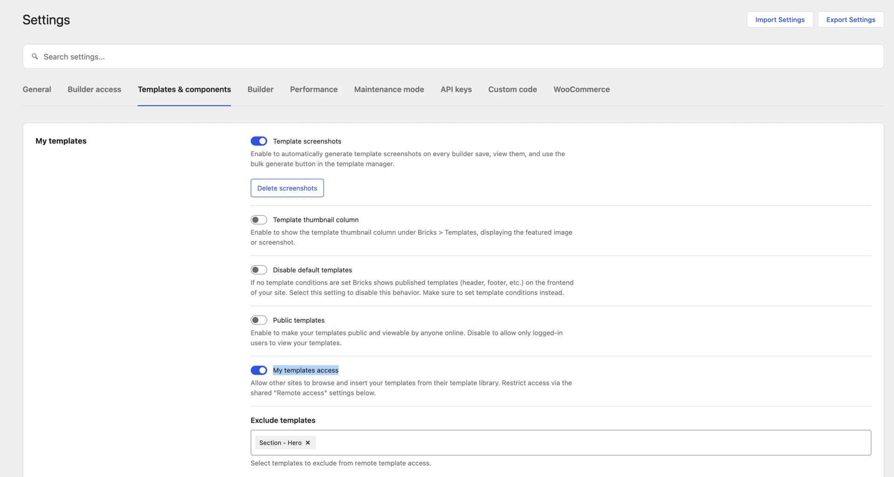
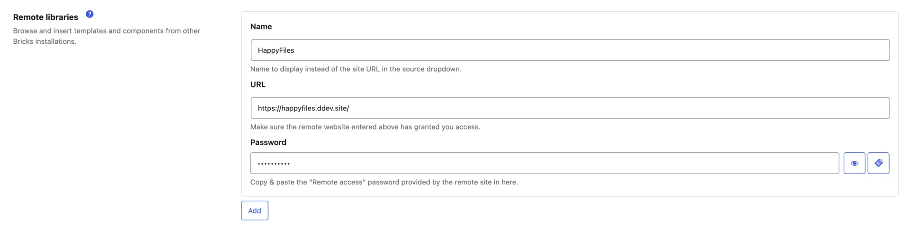
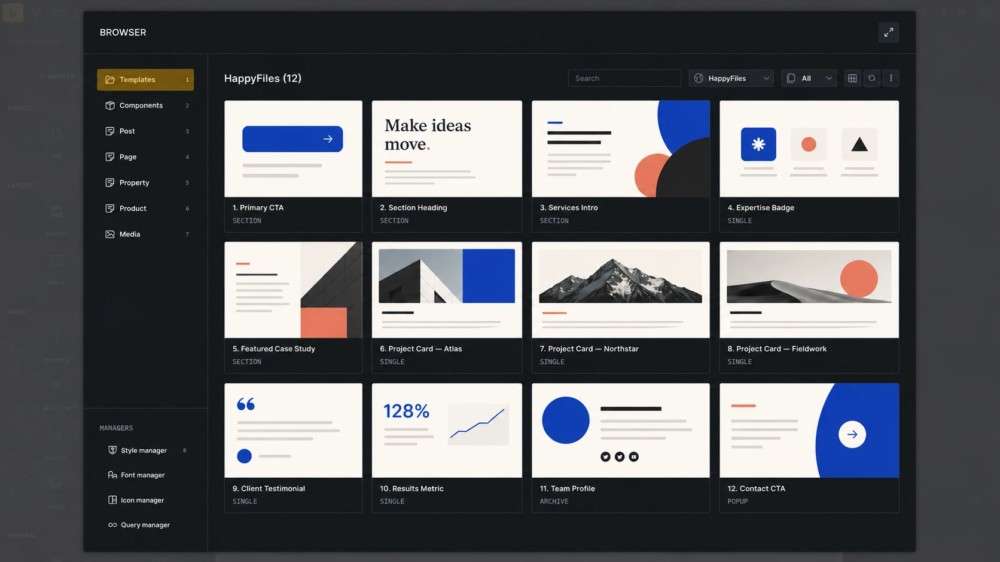

Remote Templates let you browse and insert templates from another Bricks installation without exporting and importing files manually.

The workflow has two sides:

- The **source site** exposes selected templates through its remote library.
- The **destination site** adds that site under **Remote libraries** and accesses its templates from the Builder Browser.

## 1. Expose Templates on the Source Site

On the site that contains the templates:

1. Go to **Bricks > Settings > Templates & components**.
2. Under **My templates**, enable **My templates access**.
3. Use **Exclude templates** to hide any templates that should not be shared.
4. Configure the shared **Remote access** controls.
5. Save the settings.

The **Remote access** settings apply to remote templates and remote components:

- **Whitelist URLs** restricts access to the listed destination sites. Enter one URL per line.
- **Password protection** requires destination sites to provide the same password.

If both fields are empty, any Bricks site that knows the source URL can request the templates exposed by **My templates access**.

The source site's WordPress permalink structure must not be set to **Plain**.

## 2. Add a Remote Site on the Destination Site

On the site where you want to use the templates:

1. Go to **Bricks > Settings > Templates & components**.
2. Under **Remote libraries**, click **Add**.
3. Enter the source site's full **URL**.
4. Optionally enter a **Name**. Bricks shows this instead of the URL in source dropdowns.
5. Enter the source site's **Remote access** password, if it uses one.
6. Save the settings.

You can add multiple remote sites. The same entry can provide templates, components, or both.

## 3. Browse Remote Templates

Open the builder, click the folder icon, and select **Templates** in the [Builder Browser](/builder/features/builder-browser/).

Choose the remote site under **Source**. You can search the library, filter its templates, switch between grid and list view, and use **Reload** to request the source again.

The current user needs **Access remote templates** permission to see configured remote sites.

## Insert a Remote Template

Click **Insert** to add the template to the current canvas. The **Replace content** control decides whether Bricks replaces the current canvas or adds the template to it.

Use **Import images** to download eligible template and component images to the destination Media Library. Leave it disabled to use placeholder images where the normal template import flow supports them.

When the remote template includes related design-system data, Bricks may open additional reviews for theme styles, color palettes, variables, global classes, or Style Manager settings.

Remote code signatures are not trusted. Bricks removes source signatures, and users without code-execution permission do not receive executable Code, SVG, or custom-query settings from the remote template.

### Templates That Use Components

In Bricks 2.4 and later, inserting a remote template also requests the components used by that template. The dependency package includes nested components and their referenced global classes, variable categories and variables, and color palettes.

Bricks remaps the template to the imported local component and design-system IDs before inserting it. Save pending component, class, variable, and color changes before starting the insert.

If a component from this source was imported before and changed remotely, Bricks asks whether to replace the local component before inserting the template. Replacing it updates the existing local component definition and its instances.

If the template depends on a component excluded from remote access on the source site, Bricks blocks the dependency package instead of inserting an incomplete component graph.

## Import to Templates

Click **Import to templates** on a non-local template to save it into **My Templates** instead of inserting it directly onto the current canvas.

For a configured Bricks remote site, Bricks first localizes supported component and design-system dependencies, then passes the template through the regular template import flow. The current user needs **Import/export templates** permission.

## Compatibility With Older Remote Sites

Bricks 2.4 introduces a versioned remote-library package for templates with component dependencies.

When a configured source does not support that package protocol, Bricks falls back to the legacy Remote Templates response. The template can still use the older insertion workflow, but the legacy response does not provide the dependency-complete component package. Update the source site before sharing templates that use components.

## Permissions

Remote template operations use separate builder permissions:

| Task                                                                 | Required permissions                                                                                                     |
| -------------------------------------------------------------------- | ------------------------------------------------------------------------------------------------------------------------ |
| See configured remote sites                                          | **Access remote templates**                                                                                              |
| Insert a remote template without component dependencies              | **Access remote templates** and **Insert templates**                                                                     |
| Save a remote template under My Templates                            | **Access remote templates** and **Import/export templates**                                                              |
| Insert a remote template with component dependencies                 | The insert permissions above, plus **Access remote components**, **Import/export components**, and **Insert components** |
| Import a remote template with component dependencies to My Templates | The template import permissions above, plus **Access remote components** and **Import/export components**                |

See [Builder Access & Capabilities](/builder/interface/builder-access/) for assigning these permissions.

## Fetching and Caching

Bricks keeps fetched template data outside the WordPress database. Remote template data can be cached in the builder browser for up to seven days per source. Use **Reload** when you need the source again before that cache expires.

Remote-library capability checks and component catalogs use shorter server-side caches. In the Component Manager, **Refresh** bypasses those short caches and requests the source again.

## Troubleshooting

### A Remote Site Does Not Appear

- Confirm the remote library row is saved under **Templates & components**.
- Confirm the current user has **Access remote templates** permission.

### A Remote Site Appears but Does Not Load

Check the source site:

- **My templates access** is enabled.
- Permalinks are not set to **Plain**.
- The destination site's URL is included under **Whitelist URLs**, when used.
- The password saved on the destination matches **Remote access > Password protection**.
- The expected templates are not selected under **Exclude templates**.

### A Template With Components Cannot Be Inserted

- Save pending component, class, variable, and color changes on the destination.
- Confirm the user has the required component permissions.
- Confirm every component dependency is available and not excluded on the source.
- Update the source to Bricks 2.4 or later if it only supports the legacy template response.

For the template library controls and local template actions, see [Template Library](/builder/features/template-library/).
