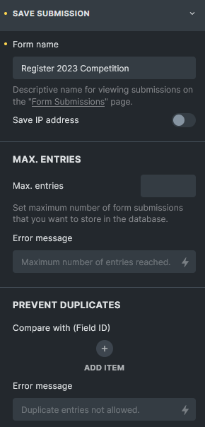
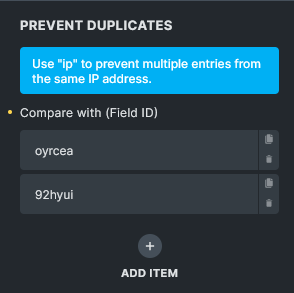
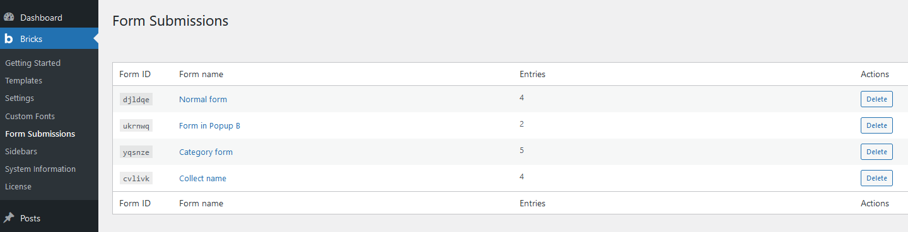
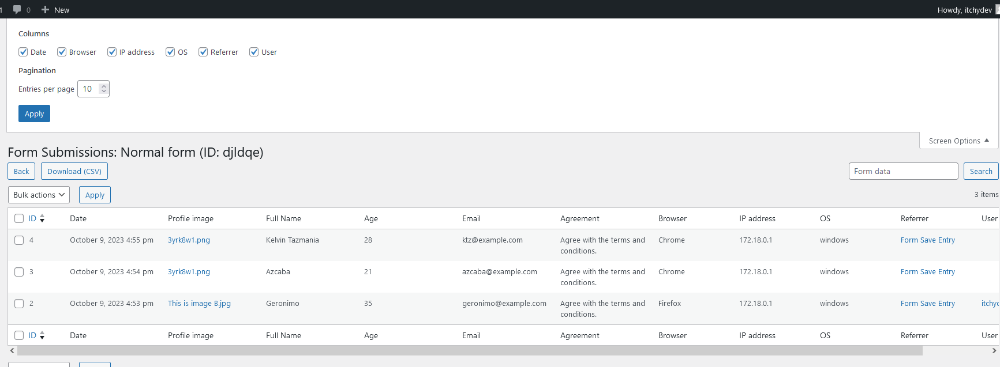

Bricks 1.9.2 introduced the ability to save Form element submissions in your WordPress database. Once enabled globally, each form can use the **Save submission** action to store entries in a Bricks-managed database table and review them from the WordPress dashboard.

Use this for contact forms, quote requests, event registrations, lead capture, and other workflows where you need a dashboard record in addition to email, webhook, or third-party integrations.

:::note
Saved submissions are stored in your WordPress database. Treat them as personal data when forms collect names, emails, IP addresses, files, or account-related information.
:::

## How to enable {#how-to-activate}

Enable **Save form submissions in database** under **Bricks > Settings > General > Form submissions**.

After enabling it, save your settings. Bricks now creates a custom table named `bricks_form_submissions` in your database (plus your WP database prefix).

You should now also see the following action buttons:

- **Reset database table**: Removes all saved submission rows from the table.
- **Delete database table**: Deletes the custom submissions table and disables the global setting.

:::note
These actions are permanent. Make sure you have a backup before resetting or deleting the table.
:::

## Form action: Save submission {#save-submission-form-action}

After the global setting is enabled, edit a Form element and select **Save submission** under the **Actions** control group.

In the example below, the form uses **Save submission** and **Email**.

The sequence of your actions matters. If an action fails, execution of all subsequent form actions is halted. Set the order according to your workflow.

In this example, if **Save submission** fails, the **Email** action that follows it will not be triggered.

Bricks always moves the **Redirect** action to the end of the action list during submission processing.

## What Bricks saves

The saved entry includes the submitted form fields and selected metadata:

- The post ID where the form was submitted from, when available.
- The Form element ID. If the form is a global element, Bricks uses the global element ID.
- The submission date in the database.
- Submitted form field data, stored as JSON.
- Browser and operating system, derived from the user agent.
- Referrer URL, when submitted by the form.
- Logged-in user ID, when the submitter is logged in.
- IP address, only when **Save IP address** is enabled for that form.

HTML fields and honeypot fields are not saved as submitted form data.

Bricks sanitizes data before inserting it into the database. For example, email fields are sanitized as email addresses, URL fields as URLs, number fields as numbers, textarea values as post-safe HTML, and most other values as text or URLs.

## Save submission settings

### Form name

Give your form a unique and descriptive name. This name is used on the **Form Submissions** page in the dashboard. If no name is set, Bricks displays the form as **[No name]** and still identifies it by Form ID.

### Save IP address

Enable this to save the submitter's IP address in the submission entry. Only enable it when you have a clear reason to store the IP address and have updated any required privacy notice.

### Max. entries

Set the maximum number of submissions to store for this form. This is useful for event registration, limited waitlists, and other capacity-based workflows.

When the limit is reached, Bricks returns an error and does not save the new entry. You can customize the error message. Because this is an action error, later actions in the form action list are not executed.

### Prevent duplicates

You can prevent storing duplicate submissions when matching data already exists for the same form.

Copy the unique six-character ID of the field you want to check, create a new item under **Prevent duplicates**, and paste the field ID into **Compare with (Field ID)**.

If **Save IP address** is enabled, you can use the `ip` keyword to prevent saving more than one submission from the same IP address.

A submission is considered a duplicate only if all configured duplicate checks match an existing entry for that form. Field values are compared case-insensitively after trimming whitespace.

Submissions flagged as duplicates are not saved. A customizable error message appears, and all subsequent form actions are halted.

## Viewing form submissions

To view collected submissions, navigate to **Bricks > Form Submissions** in the WordPress dashboard.

### Overview page

The overview page groups submissions by Form ID and shows each form's name and entry count. This helps you quickly understand which forms have stored submissions.

The **Delete** button in each form row deletes all entries for that form.

This action permanently removes all submissions for the selected form, so make sure you have a backup or genuinely intend to delete them.

### Individual form submission

Click a form name on the overview page to view all entries for that specific form.

Click **Screen options** in the top-right corner to toggle metadata columns. Available metadata columns include Date, Browser, IP address, OS, Referrer, and User.

The search box searches the stored form data JSON. It is useful for submitted field values, but it does not search metadata columns such as browser, IP address, OS, referrer, or user.

You can select multiple entries from the list and delete them in bulk. This feature simplifies the process of removing specific submissions, especially if you want to clear out any irrelevant, outdated, or test data.

Click **Download (CSV)** to export all submissions for the form you are viewing.

CSV exports include the visible submission columns and submitted field values. Bricks prefixes cells that could be interpreted as spreadsheet formulas, helping reduce CSV formula-injection risk when exported files are opened in spreadsheet software.

### Form submission access {#access}

Bricks 1.11 introduces more granular control over who can view form submissions on your site. With the new `bricks_form_submission_access` capability, you can specify which user roles or individual users have permission to access form submissions.

Administrators have form submission access by default and cannot be disabled in the role list.

#### User role access

To configure role-based access:

1. Navigate to **Bricks** > **Settings** > **General** > **Form submissions**.
2. Under **Form submission access**, you will see checkboxes for available user roles such as Administrator, Editor, Author, and Contributor.

The **Administrator** role is always enabled by default and cannot be disabled. For other roles, check or uncheck the boxes to grant or revoke access to form submissions.

This allows you to easily control who on your team can view form submissions based on their user role.

#### Individual user access

To configure access on an individual user level:

1. From the WordPress dashboard, go to **Users**.
2. Click to edit a specific user's profile.
3. In the user profile, find and adjust the **Form submission access** setting.

This lets you manage form submissions access for specific users, overriding the broader role-based settings if needed.

Users with form submission access but without broader Bricks admin access can still get a limited **Bricks - Form Submissions** admin menu when submissions are enabled.

Only users who can manage options can reset or delete the whole submissions table, delete all entries for a form from the overview, or delete selected entries in bulk.

## Developer notes

Before saving, Bricks passes the form data through the [`bricks/form/save-submission/form_data`](/developer/hooks/filters/bricks-form-save-submission-form_data/) filter. Use this if you need to normalize, remove, or add stored fields before the database insert.

For file fields, the Form Submissions table can link to files saved in the Media Library, the uploads directory, or a custom directory. The file URL used in the submissions table can be adjusted with the `bricks/form/submission-table/file_url` filter.
