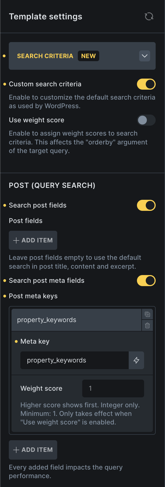

Bricks 2.2 introduces a powerful new way to control **how search results are generated**, whether the search is triggered by:

- the **native WordPress search** (via the Search element), or
- the **Filter – Search** element - Query Filters feature.

With **Search Criteria**, you can define exactly where Bricks should search: post fields, assigned post terms, term fields, user fields, and custom meta fields. This gives you far more control than the default WordPress `"s"` search and allows fully customized search behaviour across your site.

:::note
Search Criteria does not build or maintain a separate search index. It searches the selected WordPress database fields at query time, caches the matched IDs briefly, and then passes those IDs into the target query.
:::

## Override Native WordPress Search ("s" parameter)

The native WordPress search is usually triggered through the **Search element**, and the results land on the **Search Result template**.

By default, WordPress only searches the following post fields:

- post_title
- post_content
- post_excerpt

If you want to override or extend this behaviour for native search results, configure Search Criteria **inside your Search Result template**.

## Search Criteria in the Search Result Template

Inside the builder, open your **Search Result** template → Template Settings → **Search Criteria** section.

**Custom search criteria**: This reveals all available search settings for controlling how the native `s` search behaves.

**Use weight score (optional):** When enabled, Bricks will calculate a ranking score based on your defined weight values and order the results accordingly. More about [weight scoring](#weight-score).

#### Search Controls

Search post fields - Enable to define which standard WordPress post fields should be searched. Available fields are Title, Content, and Excerpt.

Search post meta fields - You can add any meta key here (custom fields) to include them in your search criteria.

Search post terms - Search assigned terms of selected taxonomies by term name, slug, and description.

Search Result templates only provide post-search criteria, because native WordPress search returns posts. Term and user search criteria are available in the **Filter – Search** element when that filter targets a term or user query.

:::note
Make sure the **main Query Loop inside the Search Result template** has **"Is main query"** enabled. Otherwise the native search override will not apply.
:::

Once configured, perform a search on the frontend and your results will follow the criteria defined in the Search Result template. If **Custom search criteria** is enabled but no post fields, meta fields, or taxonomies are enabled, the search has no custom source to search and will return no matches.

## Search Criteria in the "Filter – Search" Element

When [Query Filters](/builder/dynamic-content/query-filters/) are enabled in Bricks, you can create advanced filtering systems for any Query Loop on any page.

Before Bricks 2.2, the **Filter – Search** element always used the default WordPress `"s"` logic. Now, you can define custom search criteria per filter element. Inside the Filter – Search element settings, you will now see a **Search Criteria** section.

If the Filter – Search element uses the native WordPress search URL parameter `s`, Bricks expects the search criteria to come from the Search Result template instead of the individual filter element. This keeps the frontend search box, URL parameter, and Search Result template aligned.

:::note
Meta field search: ACF, Meta Box, and JetEngine Post Object, Relationship, and User fields usually store IDs in post meta. **Search Criteria searches the raw meta value** and does not automatically resolve those IDs to related post titles, post content, or user display names. To search those labels, store them in a separate searchable text meta field and include that meta key in Search Criteria.
:::

#### Post Query

Search post fields - Enable to define whether to search in Title, Content, and Excerpt

Search post meta fields - You can add any meta key here (custom fields) to include them in your search criteria.

Search post terms - Search assigned terms of selected taxonomies by term name, slug, and description. Useful for product categories, tags, brands, or other taxonomy-based relationships.

#### Term Query

Search term fields - Enable to define whether to search in Name, Slug, and Description.

Search term meta fields - You can add any meta key here (custom fields) to include them in your search criteria.

#### User Query

Search user fields - Enable to define whether to search in Username, Nicename, Email, URL, and Display name.

Search user meta fields - You can add any meta key here (custom fields) to include them in your search criteria.

## How matches are applied

For post queries, Bricks searches the selected sources and sets the matching post IDs on the query. For term and user queries, Bricks sets the matching term or user IDs on the query. If there are no matches, Bricks passes an impossible ID/slug so the target query returns no results.

Search Criteria uses partial `LIKE` matching. For post terms, Bricks searches the assigned term name, slug, and description for each selected taxonomy. For custom meta fields, it searches the raw stored `meta_value`.

Every enabled field, meta key, or taxonomy adds work to the database query. Use the smallest set of searchable fields that matches the frontend experience you need.

## What is "Use weight score"? {#weight-score}

Weight score lets you control the order of your search results. The higher the weight score for a specific search field, the higher the result will appear if that field matches the search term.

:::note
Important Notes:
- You must enable **Use weight score** for ranking to take effect.
- If a **Sort** filter is active, it will override the weight-score ordering.
:::

#### Example: How weight scoring works

Search Criteria setup:

Search post fields:
- Title → **weight 1**
- Content → **weight 1**

Search post meta fields:
- my_field → **weight 3**

Search term: **car**

Matched posts:

| Post ID | Found in | Weight |
| --- | --- | --- |
| 1001 | Title | 1 |
| 1002 | Title + Content | 1 + 1 = 2 |
| 1003 | my_field | 3 |

**Final result order:**
**1003**, **1002**, **1001**

Weight scores are integer values with a minimum of 1. Matching scores are added together, so an item that matches multiple low-weight fields can outrank an item that matches one field. Bricks preserves the weighted order by ordering the query by the matched ID list. If a Sort filter is active, that sort order takes precedence.
