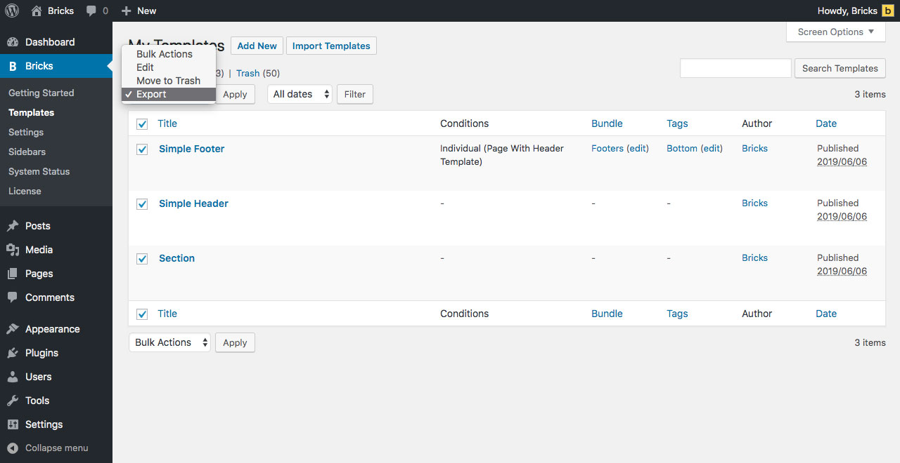

In Bricks 2.4, templates are managed inside the Builder Browser. Open it by clicking the folder icon in the builder toolbar.

You can also press `CMD / CTRL + SHIFT + L` to open the Browser on the Templates view if your user has template access.

All of your own templates are located under the **My Templates** source. You can also browse built-in remote sources such as Wireframes and Design sets, plus any Remote Templates sources configured for your site.

<figcaption>

Template Library: My Templates and remote sources

</figcaption>

https://www.youtube.com/watch?v=Nj8uPGQ56VY

## Template Sources {#interface}

In the Templates view, the **Source** dropdown can include:

- **My Templates**: Templates from the current site.
- **Wireframes**: Structural Bricks templates based on classes and variables.
- **Design sets**: Pre-designed Bricks template sets.
- **Remote templates**: Templates from configured remote Bricks installations.

[Remote Templates](/builder/features/remote-templates/) allow you to browse templates from any other Bricks installation that you have access to.

## Import Images & Replace Content {#import-images}

The Templates view includes two import controls:

- **Import images**: When enabled, template images are downloaded into your Media Library. Leave it disabled to insert the template with placeholder images.
- **Replace content**: When enabled, Bricks replaces the current canvas with the inserted template. Leave it disabled to insert the template into the existing content.

## Template Filters {#filters}

The Templates view can show these filters:

- **Template Bundle**: Select a template bundle to show only templates that belong to the selected bundle. A template bundle can be a collection of templates of the same website (e.g. home page, contact, about us page, etc.)
- **Template Tag**: Select a template tag to show only templates that have the selected tag assigned to them.
- **Template Type**: Select a template type to show only templates of the selected template type.
- **Search Templates**: Enter any keyword to search for a specific template.

## Template Actions

The Templates view includes action icons for creating, saving, importing, reloading remote sources, generating local template screenshots when available, and switching between grid and list view.

Individual templates can show actions such as insert, edit, export, delete, and preview, depending on the source and your builder permissions.

### Create Template {#create-template}

Click the **Create template** icon to create a new template. Enter a title and select a template type. The template bundle is optional. Click **Create template** to create it.

You can also create a new Bricks template from the WordPress dashboard by going to **Bricks → Templates** and click **Add New**. Then give your template a title, select a template type from the meta box on the right side of the editing screen and click **Publish**. Template tags and bundles are optional.

### Save As Template {#save-as-template}

Click the **Save as template** icon to save your current builder content as a template. Enter a title and select a template type. Selecting a template bundle is optional.

To save a specific section as a template hover over a section in the builder. The Edit (pen) icon should appear in the bottom right corner. Hover over it, and click the "disk" icon (Save Section As Template). Give your template section a name and select template type "Section". Then click **SAVE NEW TEMPLATE**.

### Import Template {#import-template}

Click the **Import template** icon to import existing template files. You can import a single template as JSON or multiple templates in ZIP format.

Click "Select file(s) to import" and select the JSON/ZIP file from your computer or drag and drop those files into the marked drop zone.

To import templates from the WordPress dashboard go to
**Bricks > Templates** and click **Import Templates**.

Select your template file (JSON/ZIP) from your computer and click **Import template(s)**. Or drag and drop those files into the drop zone.

When imported templates include related data, Bricks may ask you to review imported theme styles, color palettes, global variables, global classes, or Style Manager settings before inserting the template.

### Sync Templates

The sync icon is available for non-My Templates sources. It refreshes the selected remote source.

## Export Template(s) {#export-templates}

To export a template, hover over the template title and click **Export Template**. This will generate and download a JSON file with your template data onto your computer.

To export multiple templates at once as a ZIP file, go to **Bricks → Templates** in your WordPress dashboard, and select the templates you want to export.

Now select **Export** from the **Bulk Actions** dropdown, and click **Apply**:

A ZIP file of your selected templates will be generated and downloaded onto your computer.

This ZIP file contains all templates as individual JSON files. Either unzip it to import individual templates or import the entire ZIP file to bulk import all templates at once.
