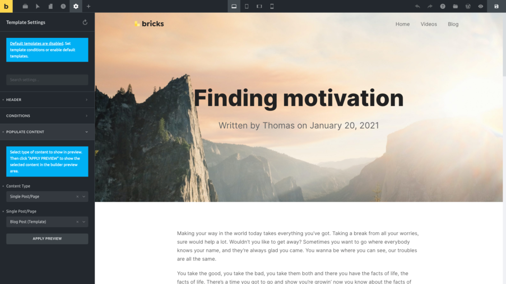

Template Settings control how a Bricks template behaves as a template. They are separate from element settings and page settings.

Use Template Settings to choose where a template renders, which content appears in the builder preview, how a header behaves, how a popup behaves, how a search template modifies native search, and how a password-protection template protects content.

When editing a template, click the **Settings** icon in the builder toolbar, then open **Template Settings**.

<figcaption>

Toolbar > Settings > Template Settings

</figcaption>

The groups you see depend on the template type you are editing.

| Group | Visible when | Purpose |
| --- | --- | --- |
| Header | Header templates | Controls header location, width, sticky behavior, and scrolling styles. |
| Popup | Popup templates | Controls popup layout, styling, interactions, AJAX behavior, and popup limits. |
| Search Criteria | Search Results templates | Customizes the native WordPress search criteria for the search results template. |
| Conditions | Most template types | Determines where the template applies. |
| Password Protection | Password Protection templates | Controls password source, password, logged-in bypass, and schedule. |
| Populate Content | Most template types | Controls the builder preview context. |

Product archive and single product WooCommerce templates can use **Conditions**. Other WooCommerce route templates hide **Conditions** and **Populate Content** because WooCommerce controls when those templates are rendered.

## Group: Header {#template-settings-header}

Only available when editing a **Header** template.

Use these settings to control the header area itself:

- **Header location:** default top header, or left/right side header.
- **Header width:** available when the header is placed left or right.
- **Sticky header:** keeps a top header fixed while scrolling.
- **Sticky on scroll:** keeps the header in normal flow on page load, then switches it to sticky after scrolling.
- **Slide up after:** hides the sticky header after the visitor scrolls past a defined distance.
- **Scrolling text color:** changes text/icon color when the sticky header is in its scrolling state.
- **Scrolling text color (hover):** changes hover color while scrolling.
- **Scrolling background:** changes the sticky header background while scrolling.
- **Scrolling box shadow:** adds a shadow while scrolling.
- **Transition:** controls the CSS transition used by sticky header state changes.

Left and right headers also create spacing beside the content and footer. Use them only when the site layout is intentionally built around a side header.

## Group: Popup {#template-settings-popup}

Only available when editing a **Popup** template.

Popup settings control the popup container and behavior. Depending on your Bricks version and selected options, this includes layout, backdrop, dimensions, position, animation, close behavior, body-scroll behavior, z-index, AJAX rendering, and limits.

Popup templates can also use interactions. The Popup group includes popup-specific interaction triggers such as **Show popup** and **Hide popup**.

When using **Hide popup**, target a CSS selector for the action that should run after the popup closes. Do not target the popup itself for that post-close action.

## Group: Search Criteria {#template-settings-search-criteria}

Only available when editing a **Search Results** template.

By default, WordPress search uses its own criteria. The Search Criteria group lets the Search Results template customize that native search behavior.

Enable **Custom search criteria** to configure:

- **Search post fields:** title, content, and excerpt.
- **Search post meta fields:** custom meta keys.
- **Search post terms:** selected taxonomies, including term slug, name, and description.
- **Use weight score:** assign numeric weights so stronger matches can sort higher.

Every added meta key or taxonomy can affect query performance. Use only the fields that matter for your site search.

For the custom criteria to affect the displayed result list, the main Query Loop in the Search Results template should be configured as the main query.

## Group: Conditions {#template-conditions}

Conditions determine where a template applies on the frontend.

Bricks evaluates conditions against the current WordPress request: single post, page, front page, archive, taxonomy term, search results, 404 page, WooCommerce route, and similar contexts.

You can add more than one condition to a template.

You can choose from the following template conditions:

- **Entire website:** broad condition for the whole site.
- **Front page:** the page configured as the WordPress front page.
- **Post type:** posts, pages, products, or custom post types.
- **Archive:** all archives, post type archives, author archives, date archives, or term archives.
- **Search results:** native WordPress search results.
- **Error page:** 404 pages.
- **Terms:** single entries assigned to selected terms.
- **Individual:** selected posts, pages, custom post type entries, or child pages.

### Condition fields

The fields shown inside each condition depend on the selected condition type.

| Condition type | Extra fields | How it is used |
| --- | --- | --- |
| Entire website | None | Matches every frontend page. |
| Front page | None | Matches the configured WordPress front page. |
| Post type | Post type selector | Matches entries of selected post types. |
| Archive | Archive type, archive post types, archive terms, child terms | Matches archive contexts. Empty archive post type or term fields can mean "all" for that archive subgroup. |
| Search results | None | Matches native search results pages. |
| Error page | None | Matches 404 pages. |
| Terms | Term selector | Matches single entries assigned to selected terms. |
| Individual | Post/page/CPT selector, child pages | Matches selected entries and optionally their child pages. |

### Include and exclude conditions {#exclude}

Every condition can be used as an include or an exclude.

Use include conditions to define where the template should apply. Use exclude conditions to remove a more specific area from a broad condition.

Example:

1. Include **Entire website**.
2. Exclude **Individual > Landing Page**.

The template applies everywhere except the selected landing page.

Exclude conditions can disqualify a template even when another condition matches. This is useful for global headers, footers, and broad Single or Archive templates.

When selecting archive terms or individual entries, you can also apply the condition to child terms or child pages.

### Condition specificity

If multiple templates of the same area match the current page, Bricks uses the most specific match.

As a practical guide:

- Individual entries are more specific than child-page matches.
- Front page is more specific than a general post type match.
- Selected terms, selected archives, and child-page matches are more specific than broad archive or post type matches.
- Post type is more specific than Entire website.
- Entire website is a broad fallback.

If the wrong template renders, check for another published template with a more specific matching condition.

### Section hooks

Section templates can be rendered at a WordPress action hook.

When editing a Section template, each condition can expose:

- **Hook: Name**
- **Hook: Priority**

Bricks checks the condition and then renders the section when the hook runs. For example, a Section template with condition **Entire website** and hook name `bricks_before_footer` renders at that hook across the site.

Hook fields are only available for Section templates in the builder.

### Default templates

If no template conditions are set, Bricks can still use published templates of supported types when default templates are enabled.

This setting is in **Bricks > Settings > Templates & components > Disable default templates**.

When disabled, templates need matching conditions or route-specific behavior to render. This makes production template assignment easier to audit.

## Group: Password Protection {#template-settings-password-protection}

Only available when editing a **Password Protection** template.

Password protection templates replace the normal content template when their conditions match and the password gate is active.

Settings include:

- **Password source:** choose **Template & post password**, **Template password**, or **Post password**.
- **Password:** the template-level password. Not available when using only post passwords.
- **Disable for logged-in users:** bypass the gate for logged-in users.
- **Schedule:** optionally set start and end dates.
- **Start date / End date:** UTC+0 schedule fields.

If a Password Protection template uses a template password source but no password is set, Bricks shows a warning because the template will not render as an active password gate.

Older password-protection controls for disabling header, footer, and popups are deprecated. New implementations should use the current password-protection behavior and page/template settings instead of relying on those deprecated controls.

## Group: Populate Content {#template-preview}

Populate Content controls the builder preview context. It does not decide where the template renders on the frontend.

Use it when dynamic data, query loops, archive titles, search results, product data, or page spacing need a real context on the canvas.

Available preview types include:

| Preview type | Extra field | Use it for |
| --- | --- | --- |
| Archive (Recent posts) | None | Blog/archive preview. |
| Archive (Author) | Author | Author archive templates. |
| Archive (Date) | None | Date archive templates. |
| Archive (Posts) | Post type | Post type archive templates. |
| Archive (Term) | Term | Category, tag, or taxonomy archive templates. |
| Single (Post/Page/CPT) | Single entry | Single templates, headers, footers, and layouts that need a real page or post behind them. |
| Search results | Search term | Search Results templates. |

After choosing the content type and related field, click **Apply preview**. Bricks saves the preview setting and reloads the template canvas in that context.

Example: when editing a header, choose **Single (Post/Page/CPT)** and select the homepage or a representative page. This lets you see how the header sits above real content while editing.

WooCommerce cart, checkout, thank-you, and account route templates hide Template Conditions and Populate Content because WooCommerce controls when those templates are used. Product archive and single product templates still use the normal condition and preview controls.

## WordPress admin: template preview image

A template's featured image is used when browsing "My Templates" in the Template Library. You can assign a featured image when editing a template in the WordPress dashboard.

Use preview images to make large template libraries easier to scan. They do not affect frontend output.

## Troubleshooting

**The template does not show on the frontend:** Confirm it is published, has the correct template type, and has matching conditions. If it has no conditions, check whether default templates are disabled.

**The wrong template shows:** Look for a more specific matching condition on another template, or an exclude condition that removes the template you expected.

**Dynamic data is empty in the builder:** Set **Populate Content** to a real context that contains the data you expect.

**Template Conditions are missing:** Check the template type. WooCommerce route templates other than product archive and single product render automatically and do not expose normal conditions.

**Header or footer is missing only on one page:** Open that page and check **Settings > Page Settings > General** for **Disable header** or **Disable footer**.

**A Search Results template does not change results:** Enable custom Search Criteria, configure the fields you need, and make sure the result Query Loop is using the main query.
