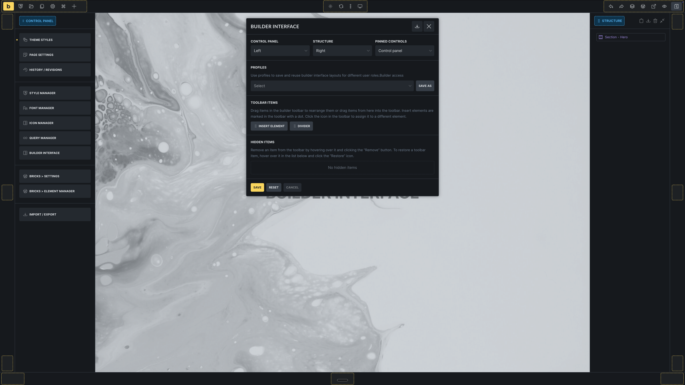
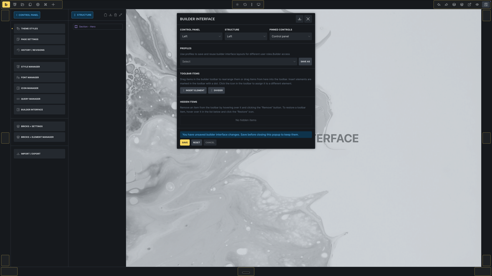
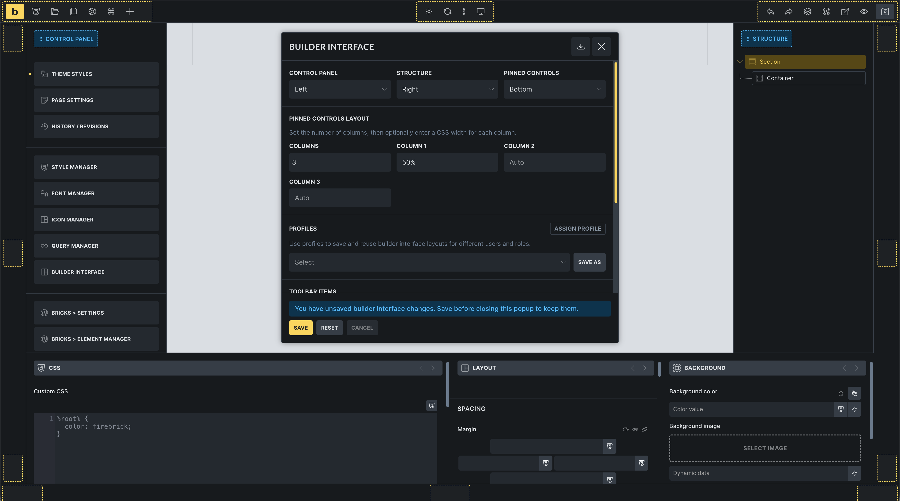
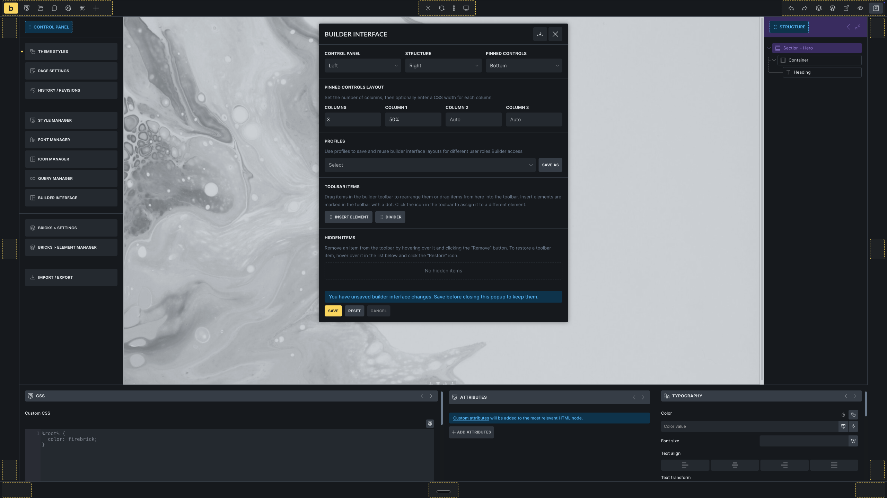
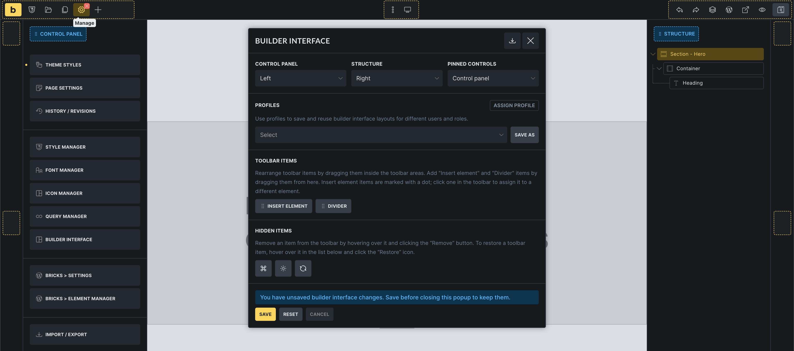
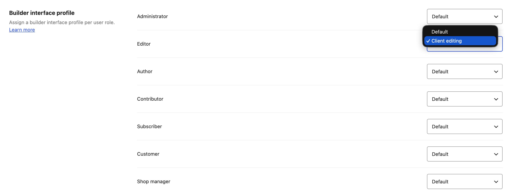
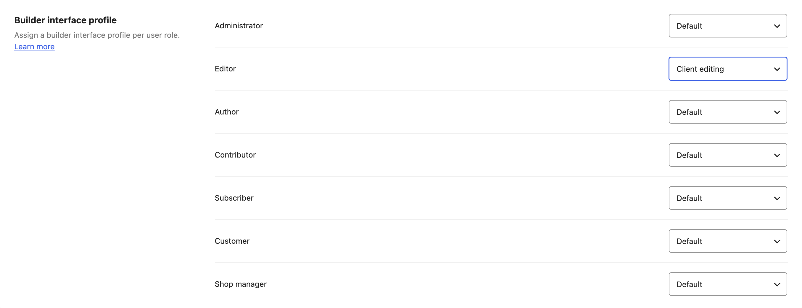
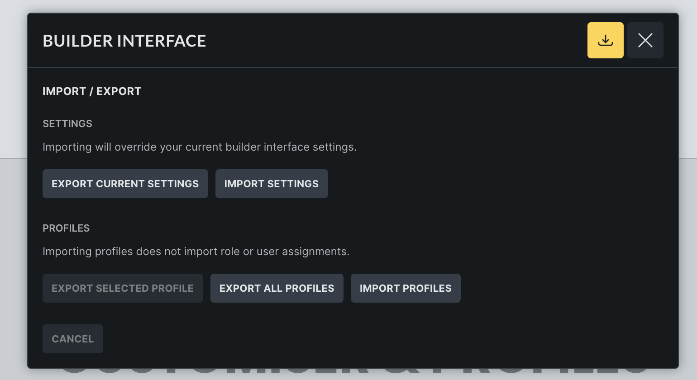

The Builder Interface Customiser lets you adjust the Bricks builder workspace to match the way you work.

You can add, hide and move toolbar items, dock the Control panel and Structure, place Pinned controls in the bottom dock, and save layouts as profiles for different users or roles.

This changes the builder workspace only. It does not change frontend output, templates, elements, or page data.

https://www.youtube.com/watch?v=iIUmLZQp_CY

## Requirements

Builder interface customization is available in Bricks 2.4.

The Builder interface entry appears when the current user can customize the builder interface or manage builder interface profiles. Administrators with full builder access can use both by default.

Use [Builder access](/builder/interface/builder-access/) to grant these permissions to other roles:

- **Customize builder interface**: Lets the user save and reset their own builder interface preferences.
- **Manage builder interface profiles**: Lets the user create, load, rename, overwrite, delete, import, and export builder interface profiles.

Site admins can disable the customiser globally under `Bricks -> Settings -> Builder -> Builder interface` by enabling **Disable builder interface customiser**.

## Open the Builder interface

Open the builder, then use either of these entry points:

- Open the builder settings panel and click **Builder interface**.
- Open the [Command Palette](/builder/interface/command-palette/) and choose **Builder interface** from the Builder scope.

## Workspace layout

The Builder interface popup controls the main workspace areas.

### Control panel and Structure

Use the **Control panel** and **Structure** settings to dock each panel to the **Left**, **Right**, or **Bottom**.

When the Control panel and Structure are assigned to the same side dock, Bricks displays them next to each other instead of stacking both panels in the same area.

### Pinned controls

Pinned controls can stay inside the control panel or move to the bottom dock.

When **Pinned controls** is set to **Bottom**, the popup shows a **Pinned controls layout** section. Use it to set the number of columns and optional column widths. Bricks supports up to six pinned-control columns.

### Bottom dock

The bottom dock can contain:

- Control panel
- Structure
- Pinned controls

Items in the bottom dock appear as tabs. You can reorder those tabs while editing the builder interface.

When more than one item is assigned to the bottom dock, the popup shows a **Bottom dock layout** section. Use it to set the number of bottom dock columns and optional CSS widths for each column. The maximum number of columns matches the number of items currently assigned to the bottom dock.

## Toolbar layout

The toolbar can be placed on the **Top**, **Right**, **Bottom**, or **Left** edge of the builder.

Each toolbar edge has three groups:

- **Start**
- **Center**
- **End**

Drag toolbar items between these groups to change their order and placement. Bricks keeps the breakpoint controls together as one locked cluster.

### Toolbar items

The **Toolbar items** section contains optional items you can drag into the toolbar. This includes repeatable toolbar dividers and custom **Insert element** shortcuts.

An Insert element shortcut can insert a selected element or component directly from the toolbar.

### Hidden items

Drag optional toolbar items into **Hidden items** to remove them from the visible toolbar. Use the restore button on a hidden item to bring it back.

Required toolbar items cannot be hidden. In Bricks 2.4, **Elements**, **Structure**, **Preview**, and **Save** are required.

## Save or reset your layout

Click **Save** to store the current builder interface for your user account.

Click **Reset** to remove your saved builder interface preferences and return to the resolved default layout. The reset keeps pinned control groups where possible, so frequently used pinned groups are not lost just because the workspace layout was reset.

If the popup shows an unsaved-changes message, save before closing the popup if you want to keep the layout.

## Profiles

Builder interface profiles save a complete builder interface layout that can be reused.

In the **Profiles** section, you can:

- **Load** an existing profile into the current popup.
- **Save as** a new profile from the current layout.
- **Overwrite** the selected profile.
- **Rename** the selected profile.
- **Delete** the selected profile.

Profiles are useful when different people need different builder workspaces. For example, a designer might use a wide control panel and visible Structure panel, while a content editor might use fewer toolbar items and a simplified bottom dock.

:::note
Bricks applies profiles after personal builder interface preferences. If a setting exists in both places, the assigned profile wins. Use profile assignments when you want a role or user to consistently receive a specific builder workspace.
:::

Saving a profile does not assign it automatically. Assign profiles under Builder access after creating them.

## Assign profiles to roles or users

After creating profiles, assign them under `Bricks -> Settings -> Builder access -> Builder interface profile`.

Each WordPress role can use:

- **Default**
- Any saved builder interface profile

You can override the role assignment for a specific person by editing that user's WordPress profile and selecting a **Builder interface profile**.

If a user has multiple roles with different profile assignments, Bricks uses the first matching role assignment from the user's role list.

Deleting a profile removes any role and user assignments that pointed to that profile.

## Import and export

Open the import/export icon in the Builder interface popup to move layouts between sites or browsers.

You can export or import:

- Current builder interface settings
- The selected profile
- All profiles

Importing builder interface settings overrides the current builder interface settings. Importing profiles does not import role or user assignments.

When imported profiles conflict with existing profile IDs, Bricks lets you overwrite, import as a copy, or skip each profile. Conflicting profiles are skipped by default until you choose another option.

## Reset another user's preferences

Admins can reset another user's saved builder interface preferences from that user's WordPress profile.

In the user's WordPress profile, find **Builder interface** and click **Reset builder interface**. This removes that user's custom builder interface preferences and restores the default or assigned profile layout on the next builder load.

## Troubleshooting

- **The Builder interface entry is missing:** Check that the user has **Customize builder interface** or **Manage builder interface profiles**, and that **Disable builder interface customiser** is not enabled.
- **A user's saved layout does not appear after reload:** Check whether a builder interface profile is assigned to the user's role or user account. Assigned profiles override personal preferences.
- **A toolbar item will not hide:** Required toolbar items cannot be hidden.
- **A profile is missing after deletion:** Deleting a profile also removes role and user assignments for that profile.
- **Profile assignments did not move during import:** Importing profiles does not import role or user assignments. Assign the profiles again under **Builder access**.
