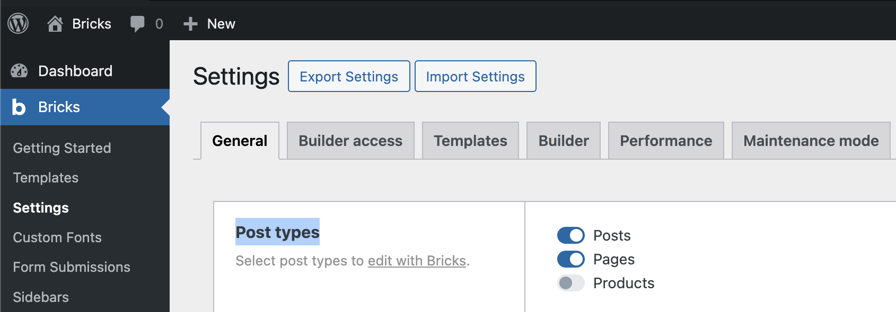
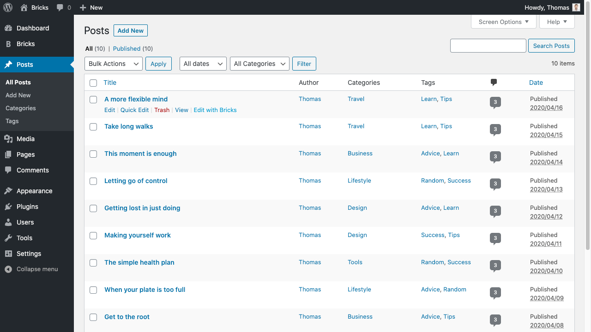
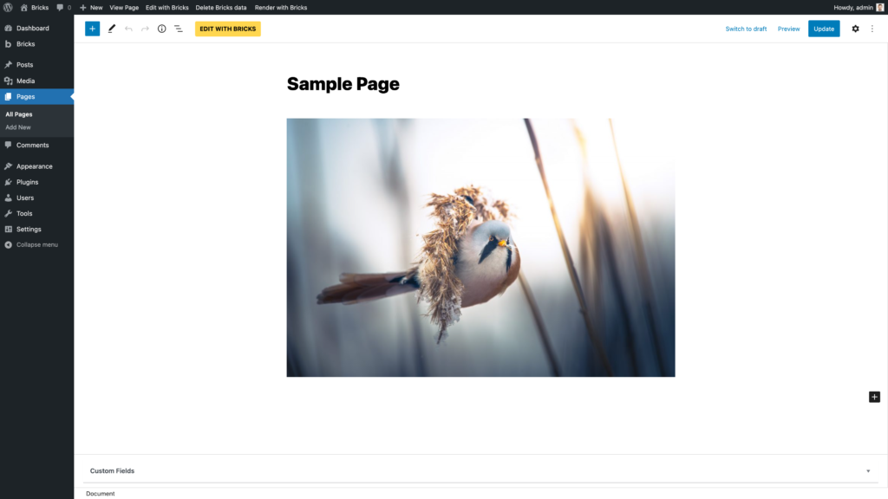
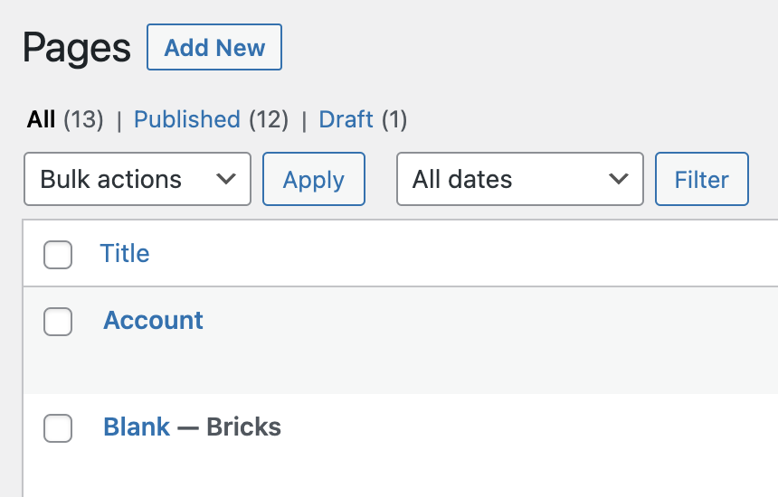

This article explains how to open the Bricks builder, what each main area of the interface does, and how editing with Bricks relates to rendering the page on the frontend.

## Before you open the builder

Bricks shows builder entry points when the current post can be edited with Bricks:

- The current user has permission to use the builder.
- The post type is enabled for Bricks.
- The post can be edited by the current user.

Bricks checks the license when the builder opens. If the license is not valid, Bricks redirects to the [license screen](/builder/license/license-and-updates/) instead of loading the builder.

Go to **Bricks -> Settings** and select the post types you want to edit with Bricks:

:::note
While you can enable Bricks for blog posts, most sites work better when posts are written in the WordPress editor and displayed through a Bricks template. Use Bricks for the layout, and use WordPress for the editorial content.
:::

## Open the builder

You can open the builder from several places in WordPress.

### Posts list

Hover over a supported post, page, or custom post type in the WordPress dashboard and click **Edit with Bricks**:

### Post edit screen

When editing an existing post or creating a new one, click **Edit with Bricks** in the Bricks editor area:

### Frontend admin bar

When you are logged in and viewing the page on the frontend, use the WordPress admin bar. The Bricks menu can open the current page, the active header template, the active content template, the active footer template, or the Templates screen when those links apply to the current page.

If the **Edit with Bricks** link is missing, check the current user's builder permissions and make sure the post type is enabled under **Bricks -> Settings**.

## Edit with Bricks vs render with Bricks

Editing with Bricks opens the visual builder. Rendering with Bricks controls which content source the frontend uses.

A post can have WordPress editor content, Bricks data, or both. The **Render with Bricks** / **Render with WordPress** option in the admin bar switches the editor mode for the current post. If a post is set to render with WordPress, its Bricks data remains stored, but the frontend uses the WordPress content instead.

Bricks templates are different. Templates are Bricks documents by definition, so the editor mode toggle does not apply to them.

Use the render mode deliberately:

- Choose **Render with Bricks** when the page itself is built in Bricks.
- Choose **Render with WordPress** when the page should use normal WordPress content, usually with a Bricks template controlling the surrounding layout.
- Do not use the render toggle as a content backup system. It only chooses the frontend render source.

If a page is rendered with Bricks, the post list shows a **- Bricks** status after the title:

<figcaption>

Post status "Bricks" shows you that a page is rendered with Bricks

</figcaption>

## Delete Bricks data

The admin bar and post edit screen can show a **Delete Bricks data** button when this option is enabled in **Bricks -> Settings**.

This removes Bricks-generated data from the current post, including page content, page settings, header/footer data, editor mode, and template type metadata. Treat it as destructive. Use it only when you want the post to stop using its stored Bricks layout data.

## Builder anatomy

The builder is made of four main working areas.

### Toolbar

The toolbar runs across the top of the builder. It gives you access to global builder actions and mode switches, including:

- Style Manager
- Pages panel
- Templates
- Settings
- Command Palette
- Elements and Components
- Breakpoints
- Preview width, height, and scale
- Reload canvas
- Undo and redo
- Preview and save actions

Which buttons you see depends on your permissions and global builder settings. For example, template actions require template permissions, and the breakpoints manager requires breakpoint access.

### Panel

The left panel changes depending on what you are doing. It can show the element library, the selected element controls, page/template settings, revisions, pages, or other manager views.

The panel can be resized and minimized. When an element is selected, the panel shows the element label, element actions, class/selector controls, and the relevant Content and Style controls.

### Canvas

The canvas is the live visual preview of the current page. It renders the Bricks layout in an iframe, so selecting and editing elements feels close to editing the frontend output.

The canvas can be reloaded from the toolbar. Reloading is useful after changing settings that need a fresh render, or when external scripts, query data, or dynamic content affect the preview.

### Structure panel

The Structure panel shows the element tree. It is the safest place to understand nesting, select hard-to-click elements, move elements, and work with deeply nested layouts.

Use the Structure panel whenever the canvas view is visually crowded, an element is hidden, or you need to confirm parent-child relationships.

## First successful edit workflow

Use this workflow when creating or editing a normal page:

1. Enable the page post type under **Bricks -> Settings**.
2. Create or open the page in WordPress.
3. Click **Edit with Bricks**.
4. Open the Elements panel and add a layout element, such as a Section or Container.
5. Add content elements inside the layout.
6. Select an element on the canvas or in the Structure panel.
7. Edit its Content controls for markup and data.
8. Edit its Style controls for design.
9. Switch breakpoints and adjust responsive styles where needed.
10. Save the builder.
11. Preview the page and confirm it is rendered with Bricks.

## Common builder states

### Preview mode

Preview mode hides the normal editing controls so you can inspect the layout. While previewing, builder editing actions such as the custom context menu are disabled.

### Unsaved changes

The builder tracks history and unsaved changes. Use save before leaving the builder, switching important context, or testing frontend-only behavior.

### Unsupported post type

If a post type is not enabled for Bricks, Bricks redirects you back to WordPress admin instead of opening the builder. Enable the post type under **Bricks -> Settings** or use a Bricks template for that content type.

### Missing permissions

Users can have full access, content-editing access, or custom permission sets. Missing permissions can hide toolbar buttons, element categories, manager popups, settings panels, and editing controls. Review [Builder Access](/builder/interface/builder-access/) if a user can open the builder but cannot see or edit a specific area.

### Login or license redirects

If the builder detects that the current browser session is no longer logged in, it redirects to the login page. If the license is not valid, Bricks redirects to the [license screen](/builder/license/license-and-updates/).

## Troubleshooting checklist

- **No Edit with Bricks button:** Check post type support, user permissions, and whether the current user can edit the post.
- **The page opens in WordPress instead of Bricks:** Confirm the page has Bricks data or switch the admin bar render mode to **Render with Bricks**.
- **Builder opens but controls are missing:** Check builder permissions and whether the selected element is disabled.
- **Canvas looks stale:** Reload the canvas from the toolbar.
- **Page looks different on the frontend:** Save the builder, confirm render mode, and test outside preview mode.
