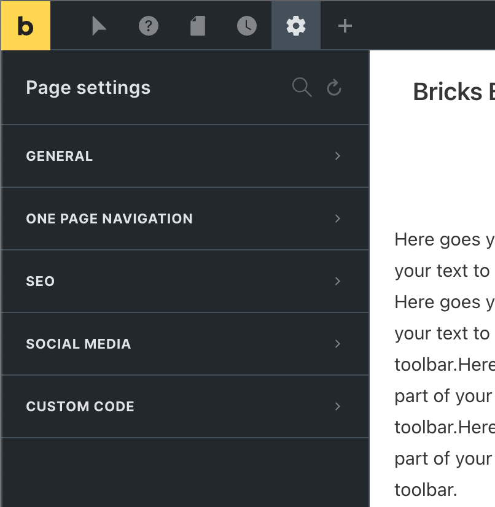
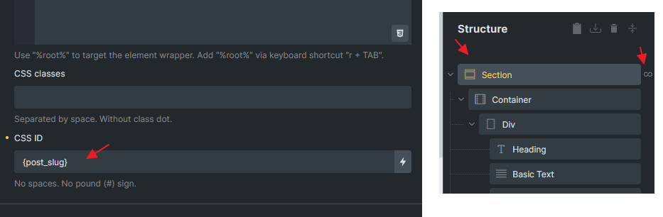

Page Settings control output for the page, post, or content template you are currently editing. They are different from global Bricks settings and different from an individual element's controls.

Use Page Settings when a setting should apply to the whole current page, such as body classes, header/footer visibility, page-level scroll snap, SEO metadata, social sharing data, or page-specific code.

## Open Page Settings

Open the builder and click the **Settings** icon in the toolbar. Choose **Page Settings**.

Page Settings are available only when the current user has permission to access them. Some groups can also be hidden by global settings.

Use the **Reset** icon in the panel header to clear all page settings with a single click.

## How Page Settings are applied

Page Settings are stored with the current Bricks document. On the frontend, Bricks reads those settings while rendering the page.

Some settings change markup, such as body classes or disabling the header. Some generate CSS, such as scroll snap and Custom CSS. Some print metadata or scripts into the document head or body. Some settings are visible in the builder immediately, while others should be checked on the frontend.

## General settings

The General group contains page-wide output options.

| Setting | What it does |
| --- | --- |
| CSS classes (body) | Adds space-separated classes to the page `<body>` tag. Dynamic data can be used when appropriate. |
| Disable header | Prevents the active Bricks header from rendering on this page. Not shown for header or footer templates. |
| Disable footer | Prevents the active Bricks footer from rendering on this page. Not shown for header or footer templates. |
| Disable lazy load | Disables Bricks lazy loading for the current page. |
| Disable popups | Prevents Bricks popups from rendering on the current page. |
| Page layout | Overrides the page layout inherited from Theme Styles. |
| Page background | Overrides the page background inherited from Theme Styles. |
| Content margin | Overrides the content margin inherited from Theme Styles when available. |

Use these settings for page-specific exceptions. If you need the same behavior on many pages, use global settings, Theme Styles, or templates instead.

## Scroll snap

The Scroll snap group configures page-level CSS scroll snapping.

| Setting | What it does |
| --- | --- |
| Type | Sets the page scroll-snap type on the `html` element. |
| Snapping elements selector | Defines which elements should snap. Defaults to Bricks sections when left empty. |
| Align | Sets the snap alignment of snapping elements. |
| Margin | Sets scroll margin for snapping elements. |
| Padding | Sets scroll padding on the `html` element. |
| Stop | Sets scroll-snap-stop behavior. |

Scroll snap is primarily a frontend behavior. Test it on the frontend, not only in the builder canvas. Layout height, overflow, sticky headers, and browser behavior can affect the result.

If you use a custom selector, make sure the selector matches the elements that should become snap points. If the selector matches nothing, the page can have scroll snap enabled without visible snapping.

## One Page Navigation {#one-page-nav}

If enabled, Bricks adds a vertical dot menu to the right edge of the page in a fixed position, with each dot linking to the page's root element.

One Page Navigation is shown only where it applies, such as normal pages and content templates. It is not shown for header or footer templates.

The navigation uses the IDs Bricks renders for root elements. Add custom CSS IDs when you need stable, readable anchors or when root elements are generated dynamically.

:::note
If a root element is inside a query loop, use dynamic data in the CSS ID, such as a post ID or slug, so every repeated root element has a unique anchor.
:::

The One Page Navigation controls style the dot menu and its active state:

- Spacing
- Item width and height
- Item color
- Border
- Box shadow
- Active item width and height
- Active item color
- Active border
- Active box shadow

The active dot changes based on the root element currently in the scroll range.

## SEO

The SEO group controls page-level metadata. This group is hidden when Bricks SEO output is disabled globally.

| Setting | What it does |
| --- | --- |
| Permalink | Updates the post slug. Use lowercase words separated by dashes. |
| Title | Updates the WordPress post title after applying the change. |
| Document title | Sets the frontend SEO title without changing the WordPress post title. |
| Meta description | Prints a page-level meta description. |
| Meta keywords | Prints page-level meta keywords. |
| Meta robots | Prints robots directives such as `noindex` or `nofollow`. |

Use **Save new title/permalink** after changing the post title or permalink in the SEO group. Other page settings are saved through the normal builder save flow.

If you use a dedicated SEO plugin, decide which tool owns the metadata. Avoid setting competing metadata in multiple places.

## Social media

The Social media group controls Open Graph style sharing data for the current URL. This group is hidden when Bricks Open Graph output is disabled globally.

| Setting | Default when empty |
| --- | --- |
| Title | The post/page title. |
| Description | The post/page excerpt. |
| Image | The featured image. |

Use this group when a page needs a social title, description, or image that differs from its normal SEO data.

## Custom Code

The Custom Code group adds page-specific CSS and scripts.

| Setting | Output location |
| --- | --- |
| Custom CSS | Inline CSS in the document `<head>`. Supports breakpoint-specific values. |
| Header scripts | Before the closing `</head>` tag. |
| Body (header) scripts | Immediately after the opening `<body>` tag. |
| Body (footer) scripts | Before the closing `</body>` tag. |

Script fields are shown only to users who are allowed to add unfiltered HTML. Users without that capability see an informational notice instead.

Use page-level code sparingly. Prefer element settings, classes, Theme Styles, global settings, or properly enqueued code when the behavior should be reused across the site.

## Common mistakes

- **Changing SEO title but not applying it:** Use **Save new title/permalink** for title and slug changes.
- **Expecting header/footer disable to affect templates globally:** These settings affect only the current page render.
- **Using duplicate IDs for One Page Navigation:** Give repeated root elements unique IDs, especially inside query loops.
- **Testing scroll snap only in the builder:** Always test on the frontend.
- **Adding scripts without the right capability:** Script fields require permission to add unfiltered HTML.
- **Using page code for reusable behavior:** Page Custom Code is local to the current page. Use global settings or enqueue code for site-wide behavior.
