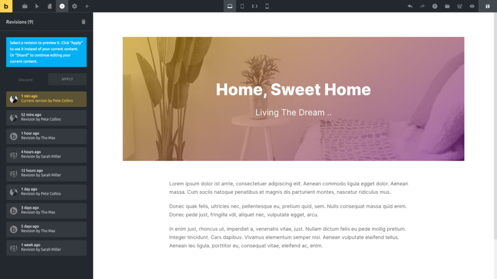

When you save builder data changes, Bricks creates a revision/snapshot of the relevant Bricks data and page settings (template, page, etc.) using the official WordPress Revisions API.

Bricks also stores autosaves separately. Autosaves are backup copies from the autosave process, while regular revisions are created when Bricks element data or page settings are included in a manual save. After a regular revision is created, Bricks clears the related autosave.

You can browse, preview, and apply your revisions inside the builder by clicking the **Revisions** (clock) icon in the builder toolbar, then going to the "Revisions" tab.

Select any revision in this list to preview it. The canvas should automatically update showing you the selected revision.

Click **Apply** to continue editing the selected revision. Click **Discard** to continue editing your current version.

If your builder capability includes **Delete revisions**, you can delete individual revisions or delete all revisions from the Revisions panel.



## Manage the number of Bricks revisions {#bricks_max_revisions_to_keep}

In order to limit the number of Bricks revisions, you may define the constant `BRICKS_MAX_REVISIONS_TO_KEEP` like so (insert this code in the Bricks child theme):

```php
if ( ! defined( 'BRICKS_MAX_REVISIONS_TO_KEEP' ) ) {
    define( 'BRICKS_MAX_REVISIONS_TO_KEEP', 10 );
}
```

By default, Bricks sets the maximum to 100 revisions per post for the Bricks templates and enabled post types.

You may set the following values:

- true: unlimited revisions
- false or 0: do not store any Bricks' revisions
- value above 0: store up to this number of revisions per post. Old revisions are automatically deleted.
