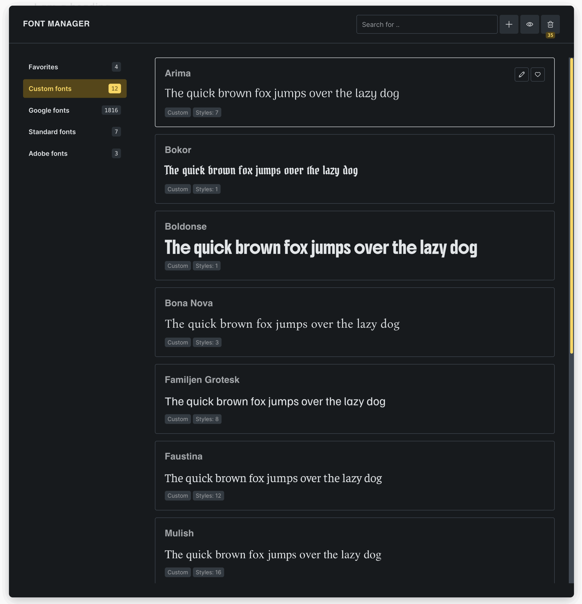

The Font Manager is the central place to browse, favorite, download, upload, edit, and remove the fonts available in Bricks typography controls.

Use it when you want to:

- Upload custom font files.
- Download Google Fonts and serve them locally.
- Mark frequently used fonts as favorites.
- Search and preview available fonts.
- Restore or permanently delete custom fonts from the Font Manager trash.

The Font Manager affects which fonts are available in builder typography controls. It does not automatically apply fonts to your site. After adding or favoriting a font, select it in an element, global class, Theme Style, page setting, template setting, or another typography control.

## How Font Manager works

Font Manager groups fonts by source:

| Font source | What it means |
| --- | --- |
| Favorites | Fonts you marked with the heart icon. |
| Custom | Fonts stored on your site as custom font records and font files. |
| Google | Google Fonts available to preview and optionally download locally. |
| Standard | System font-family options available without loading font files. |
| Adobe | Fonts synced from the Adobe Fonts project ID in Bricks settings. |

Custom fonts are stored as Bricks custom font records. Each custom font has a font family name and one or more variations. A variation is a file plus metadata such as font weight, font style, and optional unicode range.

When custom fonts are available, Bricks generates `@font-face` rules for them and makes those fonts available in the builder and on the frontend. Custom font output uses `font-display: swap`.

:::note
Font Manager access depends on the **Access font manager** builder permission. Users without this permission will not see the Font Manager entry or the font-family action icon.
:::

## Opening Font Manager

You can open the Font Manager by going to **Settings > Font Manager** in the builder toolbar, or by clicking the **gear icon** next to any font-family control.

This opens a popup where you can manage all available fonts (Google fonts, Adobe fonts, Standard fonts, and Custom fonts).

## Browsing and previewing fonts

The Font Manager sidebar lets you switch between font sources. The search field filters the current source by family name, category, or type.

Each font card shows:

- The display name.
- The source type.
- The category, when available.
- The number of available styles or variants, when available.
- A preview line using the current preview text.

Use the preview icon in the header to enter custom preview text. The default preview text is `The quick brown fox jumps over the lazy dog`.

Google font previews load only when the font card becomes visible. This keeps the popup lighter, but it means previewing Google Fonts can still make browser requests to Google. Downloading a Google Font converts it into a custom font stored on your site.

## Favorites and font-family controls

Click the heart icon on any font to add or remove it from Favorites.

Favorites are stored differently depending on the source:

- Custom fonts are favorited by custom font ID.
- Google, Adobe, and Standard fonts are favorited by source and family name.

Favorites affect the font-family control:

- If no favorites are saved, the font-family dropdown shows all available fonts.
- If favorites exist, they appear at the top of the dropdown.
- Under **Bricks > Settings > Builder > Font family: Options**, you can choose **Show favorites only**.

When **Show favorites only** is enabled, Bricks still shows the currently selected font in the dropdown if that font is not a favorite. This prevents existing typography settings from becoming invisible while editing.

## Creating a custom font

1. Open Font Manager.
2. Click the **Add** icon.
3. Enter the font family name.
4. Add one or more font variations.
5. Save the builder.

When you click **Add**, Bricks creates an empty draft custom font record. If you close the editor without a font family name and without uploaded variations, Bricks deletes that empty draft.

### Add a single variation

Inside a custom font, click **Add** to create a variation row.

For each variation, set:

- **Font file**: Choose a supported font file from the Media Library.
- **Font weight**: 100 through 900.
- **Font style**: Normal, Italic, or Oblique.
- **Unicode range**: Optional. Use this when a variation should only load for a specific character range.

Supported upload formats are:

- `.woff2`
- `.woff`
- `.ttf`

Bricks validates the file by extension and MIME type. The user also needs WordPress upload permissions.

### Import multiple variations

Click **Import** to upload multiple `.woff2`, `.woff`, or `.ttf` files at once. Bricks processes the files and tries to detect font weight and style from the file metadata.

If Bricks cannot detect the weight or style, the variation falls back to `400` and `normal`. Review imported variations before saving, especially when the font family has multiple weights or italic styles.

Bricks warns when variations overlap. Two variations overlap when they share the same weight and style and either have no unicode range or have the same unicode range.

## Downloading Google Fonts locally

The Google tab lists Google Fonts unless Google Fonts are disabled in Bricks settings.

To download a Google Font locally:

1. Open the **Google** source.
2. Find the font.
3. Click the download icon.
4. Wait for the success message.

Bricks fetches the Google Fonts CSS, downloads the referenced font files, creates a custom font record, saves the files in WordPress, and adds the font to the Custom source. After download, the Google font card shows that it has already been downloaded.

Downloaded Google Fonts are custom fonts. Edit them from the Custom source if you need to inspect or adjust the stored variations.

:::tip
If you want to avoid external Google Fonts requests on the frontend, download the Google Font locally and use the custom font version in your typography controls.
:::

## Adobe and Standard fonts

Adobe fonts appear when an Adobe Fonts project ID is configured and synced in Bricks settings. The Font Manager shows Adobe font names, but the actual CSS family used in typography controls can be the Adobe slug or one of the synced CSS names.

Standard fonts are system font-family options. They do not require uploading files or loading external font CSS.

## Editing custom fonts

Custom fonts and downloaded Google Fonts can be edited.

In the custom font editor, you can:

- Rename the font family.
- Add, remove, or replace variation files.
- Change variation weight or style.
- Add or edit unicode ranges.
- Mark the font as a favorite.
- Move the font to trash.

Renaming a custom font changes the family name used by that custom font record. Review existing typography settings after renaming, especially if the old name was used in custom CSS.

When you edit variation files, Bricks updates the custom font data and regenerates custom font-face CSS on save so the updated font can be used in the builder and frontend.

## Trash, restore, and permanent delete

Moving a custom font to trash removes it from the active Custom font list and removes it from Favorites.

To review trashed fonts, click the trash icon in Font Manager. From there you can:

- **Restore**: Move the font out of trash and publish it again.
- **Delete permanently**: Delete the custom font record and its stored font file attachments.

Permanent deletion cannot be undone from Font Manager. Use it only when you are sure the font is no longer needed.

## Loading behavior

Custom fonts are available because Bricks generates `@font-face` rules from the saved variations. For each variation, Bricks uses the saved font family, weight, style, optional unicode range, and file URLs. WOFF2 files are preferred first in generated source lists when available.

Bricks avoids loading a Google Font from Google when a custom font with the same family name exists. This prevents a locally stored custom font from being overwritten by a Google font with the same name.

### Preloading custom fonts

Under **Bricks > Settings > Performance**, enable **Preload custom fonts** to add preload tags for custom fonts that Bricks detects in the active page output.

When this setting is enabled, Bricks scans active Theme Styles, header, content, footer, page settings, template settings, global class settings, and component instance settings for custom font usage. It then preloads matching `.woff2`, `.woff`, or `.ttf` files.

For automatic preloading, the custom font family and the relevant weight/style need to be set together in Bricks typography settings. Bricks does not resolve every possible inherited CSS combination. For example, if an element inherits the custom font family from a parent but sets only `font-weight: 700` on itself, Bricks may not preload the 700 font file automatically. Set the family and weight/style explicitly in the typography control when that specific variation should be preloaded.

Preloading can improve perceived loading for important above-the-fold fonts, but it should be used carefully. Preloading too many font files can hurt performance.

### Webfont loading method

For webfonts such as Google Fonts, Bricks settings include a webfont loading method option. The default is stylesheet loading. The Webfont Loader option can hide page content until webfonts are loaded to reduce flashes of unstyled text.

This setting is separate from custom font preloading.

## Troubleshooting

### The Font Manager icon is missing

Check the user's builder permissions. The user needs **Access font manager**.

### A Google Font does not appear

Google Fonts may be disabled in Bricks settings. If Google Fonts are disabled, the Google source in Font Manager shows a disabled message instead of the font list.

### A downloaded Google Font still appears in the Google list

That is expected. The Google source remains a browser of Google Fonts. Once downloaded, the local version is available in the Custom source and the Google card shows the downloaded state.

### A custom font does not appear in a typography control

Check that the font has a family name, at least one saved variation, and that the builder was saved after the change. Also confirm that the font was not moved to trash.

### A variation loads as the wrong weight or style

Edit the custom font and review each variation. Bulk import tries to detect weight and style from font metadata, but you may need to set them manually.

### Font files cannot be uploaded

Confirm that the file is `.woff2`, `.woff`, or `.ttf`, that the current user has upload permissions, and that the site allows those MIME types through the Font Manager permission path.

### The wrong Google Font loads instead of a custom font

If a custom font and a Google Font share the same family name, Bricks skips the Google font when generating frontend webfont links. If you still see an unexpected font, check for custom CSS or third-party font loading outside Bricks.
