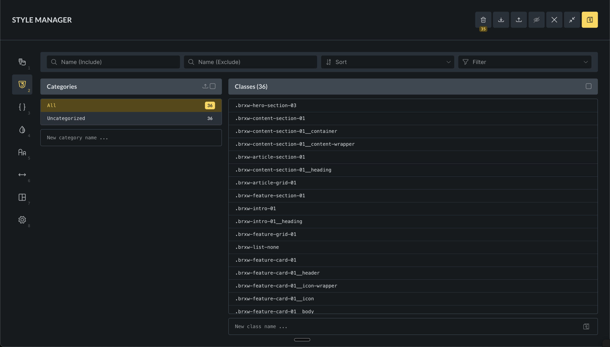
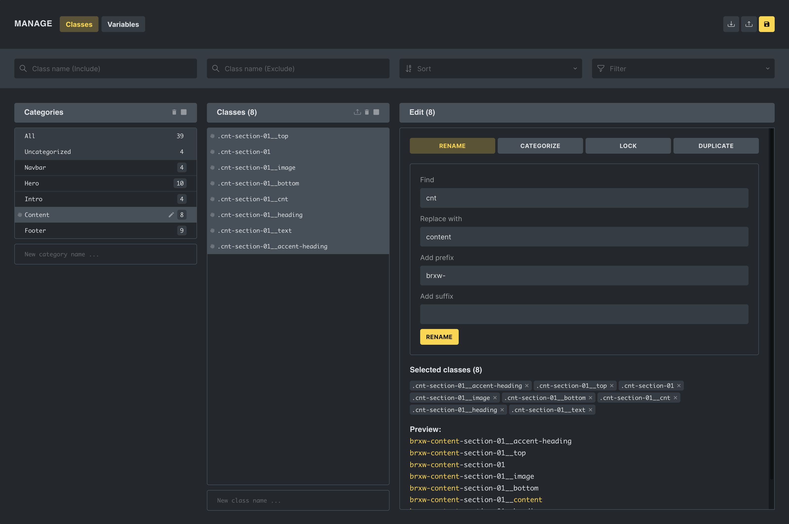
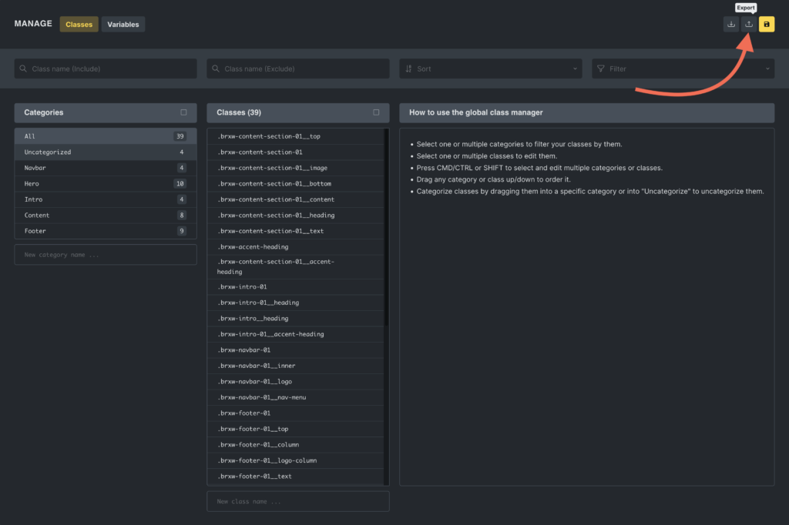
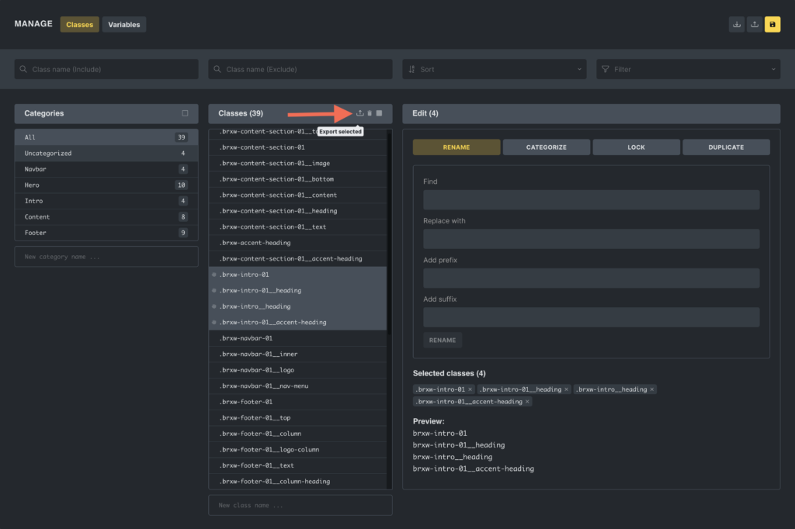

The Global Class Manager is the central place to maintain your reusable CSS classes in Bricks. It is different from the class selector on an element: the element panel is for assigning and editing classes while you work on a specific element; the Class Manager is for organizing, importing, exporting, locking, deleting, and reviewing the whole class library.

Use the Class Manager when your site has more than a few reusable classes or when you maintain a design system across pages, templates, and imported layouts.

For the element-level workflow of assigning and styling classes while editing an element, see [Global CSS Classes](/builder/styling/global-css-classes/).

## Accessing the class manager

To access the Class Manager, click the **Style Manager** icon in the builder toolbar. Then select the **Classes** tab.

The Class Manager can be disabled under `Bricks > Settings > General > Disable global class manager`.

Access is also permission-based. A user may be able to use the builder without having permission to access the Class Manager, create classes, edit classes, delete classes, lock classes, or copy and paste class styles.

## What the Class Manager stores

A global class is a site-level record. It can contain:

- A class ID.
- A class name.
- Style settings.
- Custom selectors and pseudo-state settings.
- A category.

Bricks also tracks lock state, trash/restore data, and import conflict metadata around those class records so the manager can protect classes and resolve imports safely.

Elements that use a class store a reference to the class. This is why class imports and conflicts matter: a class name is what you see, but Bricks also needs to keep element references mapped correctly.

## Class Manager vs element class selector

Use the element class selector when you want to:

- Add a class to the selected element.
- Remove a class from the selected element.
- Select the active class and edit its styles through element controls.
- Work with element-specific pseudo states and custom selectors.

Use the Class Manager when you want to:

- Create or rename classes without selecting a specific element.
- Organize classes into categories.
- Bulk rename or duplicate classes.
- Lock or unlock multiple classes.
- Move classes to trash, restore them, or delete them permanently.
- Export and import classes.
- Review usage, conflicts, and imported classes.

## Create and edit classes

In the Class Manager, use the new-class input at the bottom of the class list to create a class.

You can also select one or more classes and use the editor column to:

- Rename one class.
- Bulk rename multiple classes with find/replace, prefix, or suffix.
- Duplicate classes with find/replace, prefix, or suffix.
- Assign selected classes to a category.
- Lock or unlock selected classes.

If you rename or duplicate a class, Bricks checks for duplicate class names and skips names that would conflict.

When class custom CSS uses the old class root selector, Bricks updates that root selector during a rename or duplicate operation. CSS written outside Bricks-managed class settings is not changed automatically.

## Categories

Categories help you organize large class libraries. They do not change CSS output by themselves; they are an organizational layer in the builder.

You can:

- Create categories.
- Rename categories.
- Reorder categories.
- Filter the class list by category.
- Export categories with the classes that belong to them.

If a class has no category, or its stored category no longer exists, Bricks treats it as uncategorized.

## Search, sorting, and filters

Use the Class Manager header to reduce the class list before editing or exporting.

Available filters include:

- Text include/exclude filters.
- Alphabetical sorting.
- Used on this site.
- Unused on this site.
- Used on this page.
- Unused on this page.
- Has styles.
- Has no styles.
- Locked.
- Unlocked.

Usage filters are useful for cleanup, but review results carefully before deleting classes. A class can be unused on the current page and still be used elsewhere.

## Lock classes

Locking protects classes from accidental edits. A locked class can still exist in the class library and can still be assigned where permissions allow, but its styles cannot be edited until it is unlocked.

Use locks for foundational design-system classes such as layout wrappers, button bases, typography classes, or generated utility classes that should not be changed casually.

Locking is permission-based. Users without lock/unlock permission cannot change the lock state.

## Trash, restore, and permanent delete

Deleting a class from the active list moves it to trash. Trashed classes can be restored from the trash view.

When a class is restored, Bricks attempts to restore it to its previous position. If a class with the same name already exists, Bricks may rename the restored class to avoid the name conflict.

Permanent delete removes the class from the trash. Use permanent delete only after verifying that the class should not be restored.

:::note
Moving a class to trash is not the same as removing a class from one element. Removing a class from an element only removes that element's assignment. Moving a class to trash removes the class from the active class library.
:::

## Exporting and importing classes

The Global Class Manager facilitates the exporting and importing of CSS classes, making it easier to maintain a consistent styling framework across various Bricks projects.

### Exporting classes

You have two options for exporting classes:

1. **Export all:** Click the export button at the top of the manager to export the current class library.

2. **Export selected:** Select one or more classes and click the export-selected icon in the classes column.

Exports include category metadata for classes that belong to a category.

### Importing classes

In the import popup, drag and drop a JSON file containing exported classes.

## Import conflicts

When importing classes, Bricks checks for conflicts by class ID and class name.

A conflict can happen when:

- The imported class has the same ID as a local class but different data.
- The imported class has the same name as a local class.
- A template or pasted layout references a class that already exists locally.

Depending on the global class import setting, Bricks can:

- Add new classes automatically and show only conflicts for review.
- Ask you to review new classes.
- Skip conflicting classes.
- Ask you to review both new and conflicting classes.
- Map imported class IDs to existing local class IDs so inserted elements keep a valid class reference.

When reviewing an import, you can accept, reject, rename, duplicate, categorize, lock, or mark conflicting classes to override local classes.

If you're importing global classes and need to handle **conflicts** or organize new classes before they are added to your project, check out the [Global Class Import Manager](/builder/styling/global-class-import-manager/). This feature, introduced in Bricks 1.12, provides a structured way to resolve conflicts and categorize imported classes, ensuring a smooth and controlled workflow.

## Template and paste imports

Templates, remote templates, copied elements, and converted layouts can bring global classes with them.

When Bricks inserts content that references imported classes, it must keep the element's class references valid. If the imported class is identical to an existing class, Bricks can map the imported class to the existing one. If the class differs, Bricks can route the class through the import review workflow.

This is why reviewing class imports matters: accepting a class can change the class library, while mapping a class can make the inserted content reuse an existing local class.

## Generated CSS lifecycle

Bricks does not output every class record on every page just because it exists in the Class Manager.

Global class CSS is generated for classes that are used by elements in the current rendered context. Bricks also generates class CSS per element type so element-specific controls can output the correct selectors for that class.

Starting in Bricks 2.4, the **Output global class CSS in Class Manager order** setting under [Bricks settings](/builder/setup/settings/#miscellaneous) can make generated global class CSS follow the class order shown in the Class Manager. This affects same-specificity class overrides. It does not make unused classes output CSS.

This has a few practical effects:

- An unused class can exist in the Class Manager without producing frontend CSS on a page.
- A class with no styles can be assigned but may not output useful CSS.
- A class can output different generated rules depending on the element types that use it.
- If a site uses external CSS files, class changes may require Bricks to regenerate CSS files.

## Conflict detection while saving

If global class synchronization/conflict checking is enabled, Bricks can detect when another user changed global classes after your builder session loaded.

The save flow can report:

- Classes added by another user.
- Classes modified by another user.
- Classes deleted or trashed by another user.
- True conflicts where both your session and another session changed the same class.

Resolve the notification before continuing. This protects shared class systems on teams.

## Best practices

- Use clear class names that describe purpose, not only appearance.
- Keep foundational classes locked once they are stable.
- Use categories for large systems such as layout, typography, buttons, cards, utilities, and components.
- Avoid deleting classes based only on the current page's usage filter.
- Review imports before accepting them on client sites.
- Keep utility classes small and predictable.
- Avoid creating several classes that set the same property in conflicting ways.

## Troubleshooting

### A class is in the manager but has no visible effect

Check whether the class is assigned to an element, has styles, and is not overridden by element ID styles or custom CSS.

### I cannot edit a class

The class may be locked, your user role may not have the required permission, or the Class Manager may be disabled.

### I restored a class and its name changed

That can happen when a class with the same name already exists. Rename the restored class if you need a different convention.

### Imported content does not look like the source site

Check whether imported classes were accepted, mapped to local classes, or rejected. Also check whether required variables, color palettes, or theme styles were imported.
