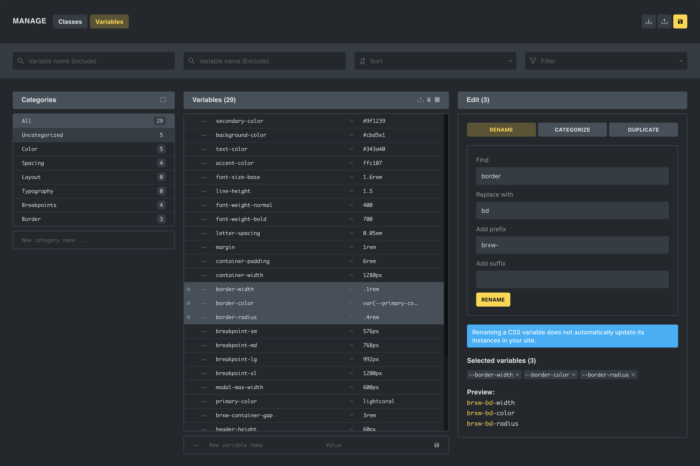
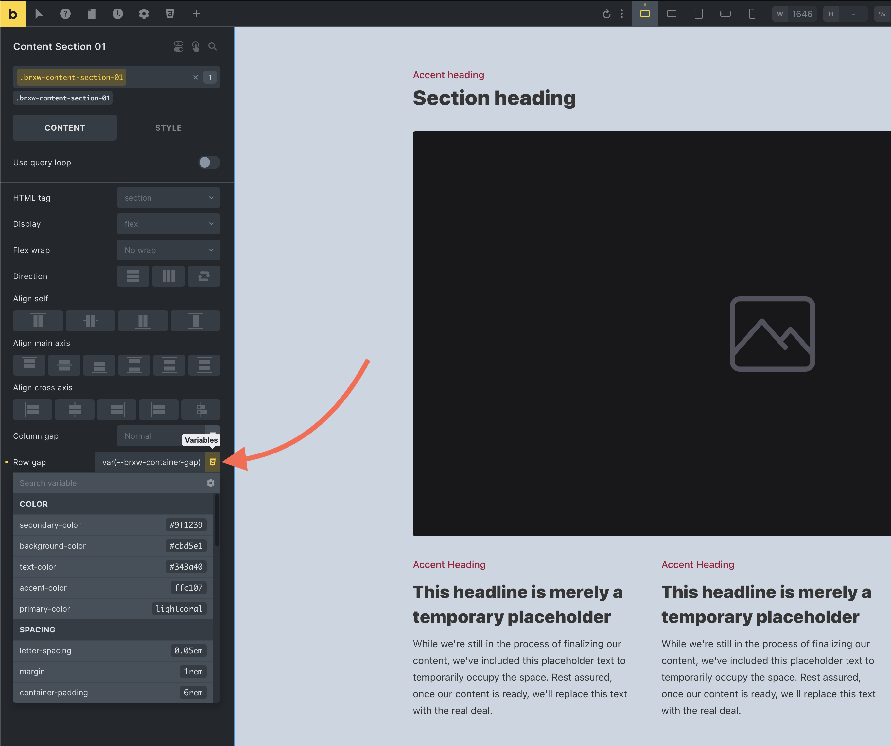
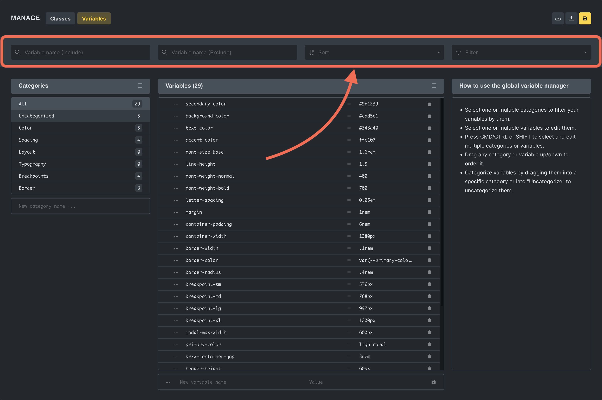
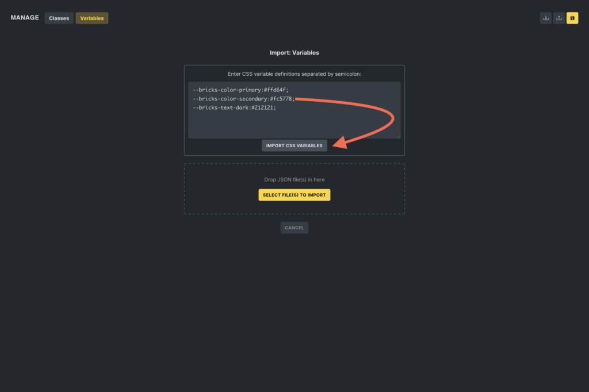

The Global Variables Manager lets you create and maintain reusable CSS custom properties in Bricks.

Use global variables for values that should stay consistent across controls, classes, templates, and pages: spacing sizes, typography sizes, radii, layout widths, color values, shadows, or any repeated design token.

For example, instead of typing `clamp(1rem, 2vw, 1.5rem)` into several controls, create a variable named `text-m` and use `var(--text-m)` wherever that value is needed.

## Accessing the Variable Manager

To access the Variable Manager, click the **Style Manager** icon in the builder toolbar. Then select the **Variables** tab.


You can disable the Variable Manager under `Bricks > Settings > General > Disable CSS variables manager`.

The variable picker value display can be hidden under `Bricks > Settings > Builder > Variable dropdown: Hide value`.

## The mental model

Global variables are stored as site-level Bricks data. A variable has:

- An internal ID.
- A name, stored without the leading `--`.
- A value.
- An optional category.

On the frontend, Bricks outputs variables as CSS custom properties with the `--` prefix:

```css
:root {
  --text-m: clamp(1rem, 2vw, 1.5rem);
}
```

In a Bricks control or CSS field, use the variable like this:

```css
var(--text-m)
```

Bricks only outputs variables that have a name and a non-empty value.

## Create a variable

1. Open **Style Manager > Variables**.
2. Enter a variable name without the leading `--`, such as `space-m`.
3. Enter the value, such as `clamp(1rem, 2vw, 2rem)`.
4. Press `Enter` or click the save icon.

If you paste a name that starts with `--` or `var(--...)`, Bricks normalizes it to the stored variable name.

Variable names must be unique. Bricks also prevents duplicate variable names that conflict with variable-based colors in the Color Manager.



## Use variables in controls

Many builder controls include a variable picker. Open the picker and select a variable to insert it into the active control.

The picker inserts a `var(--name)` reference. You can also type `var(--name)` manually in controls that accept CSS values.



Variables are useful in:

- Element ID styles.
- Global class styles.
- Theme Styles.
- Page settings.
- Custom CSS fields.
- Other Bricks-managed style settings that accept CSS values.

## Update, rename, duplicate, and delete variables

Select one or more variables to edit them.

You can:

- Rename a single variable.
- Bulk rename variables with find/replace, prefix, or suffix.
- Duplicate variables.
- Categorize variables.
- Delete selected variables.
- Reorder variables by drag and drop.

When a variable is renamed, Bricks updates Bricks-managed references from `var(--old-name)` to `var(--new-name)` in builder data. This update runs in the builder and again on save.

:::note
Variable rename updates apply to Bricks-managed data. CSS or code written outside Bricks-managed settings may still need to be updated manually.
:::

## Categories

Categories organize variables in the manager and picker. They do not change the variable name by themselves.

You can:

- Create categories.
- Rename categories.
- Reorder categories.
- Filter variables by category.
- Export categories with selected variables.

If a variable has no category, or its category no longer exists, Bricks treats it as uncategorized.

## Search, sorting, and usage filters

Use the manager header to narrow the variable list.

You can filter by:

- Text include/exclude filters.
- Alphabetical sorting.
- Used on this page.
- Unused on this page.



Usage filters are helpful for cleanup, but review before deleting. A variable can be unused on the current page and still be used elsewhere.

## Scales and utility classes

Style Manager scales use variable categories. A typography or spacing scale is stored as a variable category with scale settings.

A scale can generate variables such as:

```text
text-xs
text-s
text-m
text-l
space-xs
space-s
space-m
space-l
```

Scale categories can also define utility class patterns. For example:

```text
Class name: text-*
CSS property: font-size
```

For a variable named `text-m`, Bricks can generate:

```css
.text-m {
  font-size: var(--text-m);
}
```

If a class pattern does not contain `*`, Bricks appends the scale step name to the class pattern.

Generated utility classes are part of the Style Manager CSS output and are also reflected in the builder preview.

## CSS output

Global variables with non-empty values are output as `:root` CSS custom properties.

Bricks also generates a Style Manager CSS file when relevant Style Manager data changes. That file can contain:

- Color palette variables.
- Color utility classes.
- Variables from scale categories.
- Utility classes generated from scale categories.

If the Style Manager CSS file exists, Bricks enqueues it on the frontend. If file generation fails because of filesystem permissions, cache configuration, or another environment issue, regenerate Bricks CSS files and check the site's file permissions.

## Exporting and importing variables

The Global Variables Manager facilitates the exporting and importing of CSS variables, making it easier to maintain a consistent styling framework across various Bricks projects.

### Exporting variables

You have two options for exporting variables:

1. **Export all:** Click the export button at the top of the manager to export all variables and categories.


2. **Export selected:** Select one or more variables and click the export-selected icon in the variables column.


Selected exports include the categories used by the selected variables.

### Importing variables

Importing variables into Bricks is flexible and user-friendly, accommodating different scenarios:

**Importing via JSON file:** In the import popup, drag and drop a JSON file containing exported variables.


When importing a JSON file, Bricks adds variables that do not already exist by name. If the file includes categories, Bricks can also import categories that do not already exist by name.

**Manual text entry:** You can manually enter variables into a textarea. This is useful for quickly importing variables from a child theme, custom plugin, stylesheet, or snippet.

The expected format is a semicolon-separated list of CSS variable definitions:

```css
--bricks-color-primary: #ffd64f;
--bricks-color-secondary: #fc5778;
--bricks-text-dark: #212121;
```



Manual imports add variables that do not already exist by name.

**Importing from remote templates:** When inserting a remote template, Bricks can offer to import variables from the remote source. Remote template variables are matched by name. New variables can be imported; existing local variables with the same name are not duplicated.

Remote template variable categories are not imported with the template variables, so imported variables may appear uncategorized.

## Best practices

- Name variables by purpose: `space-m`, `radius-card`, `text-step-2`.
- Use variables for repeated values, not every one-off value.
- Keep values valid CSS for the controls where you plan to use them.
- Prefer scale-generated variables for typography and spacing systems.
- Avoid renaming variables casually on production sites with lots of custom CSS.
- After large variable changes, regenerate Bricks CSS files and review important templates.

## Troubleshooting

### A variable does not appear in the picker

Check whether the variable exists, has a valid name, and whether the current control supports variable insertion.

### A variable exists but does not output CSS

Check whether it has a non-empty value. Bricks skips variables with empty values.

### A renamed variable still appears in custom CSS

Bricks updates Bricks-managed `var(--old-name)` references. External stylesheets, child theme CSS, custom plugin CSS, or manually written code outside Bricks-managed data may still need manual updates.

### Imported variables are uncategorized

Remote template variable imports do not import variable categories. JSON imports can import categories when the file includes them and you confirm the category import.

### Utility classes are missing

Check that the variable category is a scale, that utility classes are configured for that scale, and that Bricks can generate and enqueue the Style Manager CSS file.
