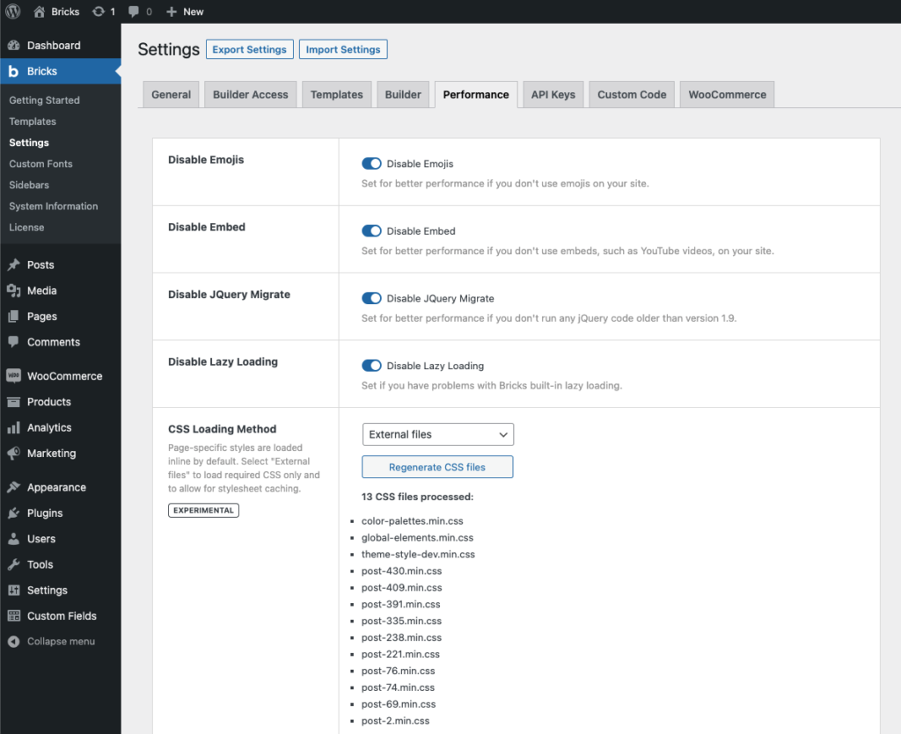

"Performance" being one of Bricks' three pillars, Bricks only loads many frontend assets when they are needed on the current page.

https://www.youtube.com/watch?v=O_B19LBtnwM&t=45s

Bricks always enqueues the main frontend stylesheet through the `bricks-frontend` handle and the main frontend script through the `bricks-scripts` handle. Additional libraries such as sliders, lightboxes, maps, animations, icon fonts, and date pickers are registered and loaded only when needed.

By default, Bricks uses the cascade-layer frontend stylesheet (`frontend-layer.min.css`). If cascade layers are disabled, Bricks falls back to `frontend.min.css`. When the CSS loading method is set to "External Files", Bricks uses the lighter frontend stylesheet (`frontend-light-layer.min.css`, or `frontend-light.min.css` when cascade layers are disabled) and loads the generated CSS files for the current page.

## How To Reduce Asset Loading Even Further through "External Files" {#external-files}

By default, generated styles such as page settings, template settings, element styles, global custom CSS, theme styles, color palettes, global class CSS, and other Bricks data are output inline.

To further optimize & minimize the loaded styles you can set the "CSS Loading Method" under "Bricks - Settings - Performance" to "**External Files**".

To regenerate all CSS files in one go, click **Regenerate CSS files** under **Bricks > Settings > Performance > CSS loading method**. This action is available after setting CSS loading method to **External Files**.

**Please click the "Regenerate CSS files" button once you've changed the CSS loading method to "External Files", so Bricks can create the required directory and CSS files.**

This generates minified CSS files for your Bricks data within the `wp-content/uploads/bricks/css` directory (or whatever you've set as your WordPress "uploads" directory) and serves them as needed according to the requested page.

:::note
If the "External Files" CSS loading method does conflict for some reason with your server or plugin caching solution or outputs incorrect or missing styles, please revert to the default "**Inline Styles**" CSS loading method, and report the issue to us via [email](https://bricksbuilder.io/contact/), so we can address it. Thank you!
:::




<figcaption>

CSS Loading Method: "External Files"

</figcaption>


## How To Enqueue Individual Styles & Scripts {#enqueue}

If you are working with a third-party Bricks plugin or if for some reason a certain style/script is not being loaded as needed, you can always load/enqueue those individually to your own needs by following the instructions below.

What follows is a list of Bricks style & script names which you can enqueue on any of your pages as needed through your child theme's functions.php by hooking into the `wp_enqueue_scripts` WordPress action or inside the `enqueue_scripts` function in case your [custom Bricks element](/developer/elements/create-your-own-elements/) depends on any of those styles and/or scripts.

```php
add_action( 'wp_enqueue_scripts', function() {
  // isotopeJS (e.g. metro & masonry layouts)
  wp_enqueue_script( 'bricks-isotope' );
  wp_enqueue_style( 'bricks-isotope' );

  // Icon font files
  wp_enqueue_style( 'bricks-font-awesome-6' );
  wp_enqueue_style( 'bricks-font-awesome-6-brands' );
  wp_enqueue_style( 'bricks-ionicons' );
  wp_enqueue_style( 'bricks-themify-icons' );

  // Animations
  wp_enqueue_style( 'bricks-animate' );

  // Tooltips
  wp_enqueue_style( 'bricks-tooltips' );

  // Datepicker
  wp_enqueue_script( 'bricks-flatpickr' );
  wp_enqueue_style( 'bricks-flatpickr' );

  // swiperJS (e.g. slider, carousel)
  wp_enqueue_script( 'bricks-swiper' );
  wp_enqueue_style( 'bricks-swiper' );

  // splideJS (e.g. nestable slider, carousel)
  wp_enqueue_script( 'bricks-splide' );
  wp_enqueue_style( 'bricks-splide' );

  // Lightbox
  wp_enqueue_script( 'bricks-photoswipe' );
  wp_enqueue_script( 'bricks-photoswipe-lightbox' );
  wp_enqueue_script( 'bricks-photoswipe-caption' );
  wp_enqueue_style( 'bricks-photoswipe' );

  // Leaflet map
  wp_enqueue_script( 'bricks-leaflet' );
  wp_enqueue_style( 'bricks-leaflet' );

  // Code prettifier
  wp_enqueue_script( 'bricks-prettify' );
  wp_enqueue_style( 'bricks-prettify' );

  // Choices.js
  wp_enqueue_script( 'bricks-choices-lib' );
  wp_enqueue_script( 'bricks-choices-js' );
  wp_enqueue_style( 'bricks-choices' );
}, 11 );
```
