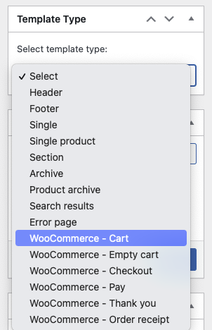
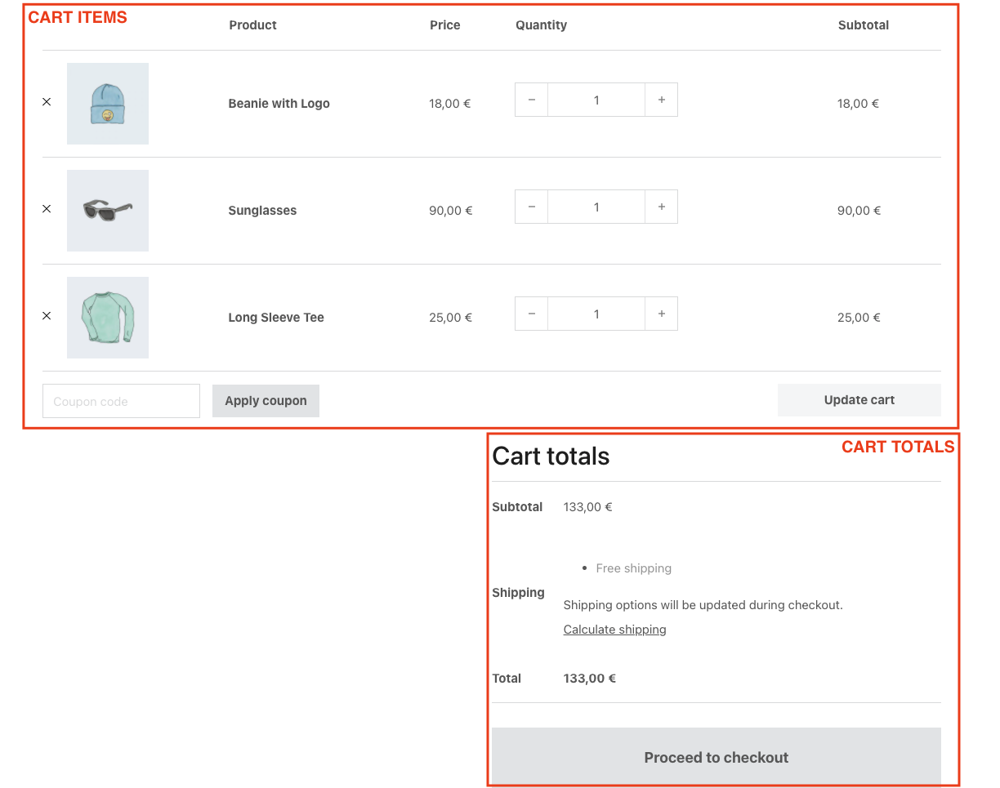
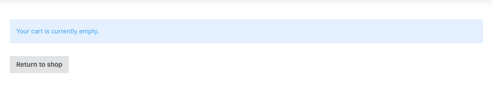
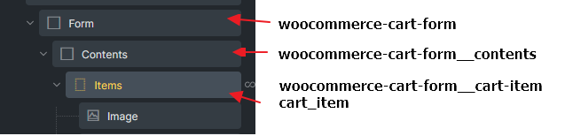
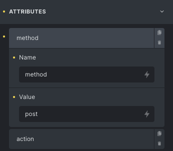
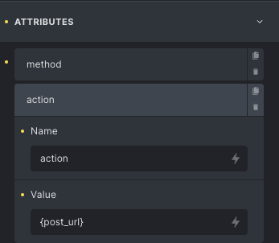

## Overview

The Cart page is a special WooCommerce page, created by default during WooCommerce installation and assigned under **WooCommerce > Settings > Advanced**.

Starting in Bricks 2.4, you can choose between two Cart building workflows:

- **Cart v2 workflow**: Build the assigned Cart page directly with [WooCommerce advanced modular elements](/integrations/woocommerce/advanced-modular-elements/) and the [Cart v2 element](/builder/elements/woocommerce/cart-v2/).
- **Cart v1 workflow**: Keep the classic WooCommerce cart shortcode on the assigned Cart page and customize the output with separate Bricks Cart and Empty Cart templates.

Use Cart v2 for new builds or redesigns where you want to edit the filled and empty cart states in one place. Use Cart v1 for existing sites that already rely on the classic shortcode/template setup.

The [Woo Setup Wizard](/integrations/woocommerce/woo-setup-wizard/) can check or create either workflow. The same v2 data tools can also be used with [Dynamic fragment](/builder/elements/woocommerce/dynamic-fragment/) to build cart-dependent header content such as a custom mini cart.

## Cart v2 workflow

With advanced modular elements enabled, Cart v2 keeps the filled cart and empty cart screens as editable states on the assigned Cart page.

Use the [Woo Setup Wizard](/integrations/woocommerce/woo-setup-wizard/) and choose **Advanced (v2)** to replace the assigned Cart page content with the [Cart v2 element](/builder/elements/woocommerce/cart-v2/) and generated state structure.

Cart v2 includes two states:

- **Filled cart** for carts that contain products.
- **Empty cart** for carts with no products.

Each state can generate starter content through **Insert a structure**. Use **Complete cart block** for the Filled cart state and **Complete empty cart block** for the Empty cart state. Generated structures are appended to the current state content, so you can insert a starter block and then move, style, or remove the generated elements.

Cart v2 is the recommended workflow when you want to design the Cart page directly, switch between filled and empty previews in one place, and use the v2 cart dynamic tags. The classic shortcode/template workflow below is still useful for existing sites that already use separate **WooCommerce - Cart** and **WooCommerce - Empty Cart** templates.

:::note
Some Cart v2 support elements, such as the cart form wrapper and cart quantity controls, are generated-only or context-specific. If you cannot find a support element in the regular Elements panel, create it through **Insert a structure** or the [Woo Setup Wizard](/integrations/woocommerce/woo-setup-wizard/), then edit it from the Structure panel.
:::

Cart v2 layouts can use the **Cart contents** query loop and cart total tags such as `{woo_cart_items_count}`, `{woo_cart_order_subtotal}`, `{woo_cart_order_total}`, `{woo_cart_shipping_method}`, `{woo_free_shipping_remaining}`, and `{woo_free_shipping_progress}`.

For the complete element reference, see [Cart v2](/builder/elements/woocommerce/cart-v2/). For all new WooCommerce v2 query loops and dynamic tags, see [WooCommerce v2 query loops and dynamic tags](/integrations/woocommerce/woocommerce-v2-query-loops-dynamic-tags/#cart-tags).

## Cart v1 workflow

The classic Cart workflow renders the WooCommerce `[woocommerce_cart]` shortcode on the assigned Cart page, then uses Bricks WooCommerce template types to customize the filled and empty cart screens.

:::note
Remove the Gutenberg Cart block if it is located within your Cart Page. Instead, replace it with `[woocommerce_cart]` or use a Shortcode element if you edit the Cart page with Bricks.
:::

For the Cart v1 workflow, place the `[woocommerce_cart]` shortcode directly on the Cart page, or edit the Cart page with Bricks and use a Shortcode element with `[woocommerce_cart]` as its content. Bricks offers two template types to customize the cart:

- **WooCommerce - Cart**: Rendered when the cart contains products.
- **WooCommerce** - **Empty** **Cart**: Rendered when the cart is empty.

:::note
The "Cart" and "Empty Cart" template types are only visible if you have the WooCommerce plugin installed and active. These templates are used inside the WooCommerce Cart shortcode logic and **they do not support template conditions (they are automatically rendered on the correct page)**.
:::

By default, the cart in the Bricks theme will be shown as in the image below. You'll notice there are typically two different zones: the cart items table & the cart totals:

If you want to customize this screen, you'll need to create a **WooCommerce - Cart** template type.

:::note
Please remember to add [template hooks](/integrations/woocommerce/woocommerce-template-hooks/#cart-template-hooks) if you are using third-party plugins.
:::

## Cart template {#cart-template}

You would set the **WooCommerce - Cart** template type to customize the Cart page (used when the cart contains products).

When opening this template with Bricks you'll see three new elements (specific for this template type):

<figcaption>

The specific Bricks elements to be used inside the "WooCommerce - Cart" template type

</figcaption>

### Cart items

Render the cart contents table. With this element, you'll be able to hide different parts of the table, style the table elements and the buttons, and hide the coupon input (so you could set it separately using the **Cart Coupon** element). For custom layout, check the section down below [Cart contents loop](#loop).

### Cart totals

Renders the cart totals zone. With this element, you could hide the cart cross-sells, style the totals table, and style the button.

### Cart Coupon

Render the coupon input. Use this element if you don't want to have the coupon input attached to the cart items table. With this element, you could style the input and the apply coupon button

## Empty cart template {#empty-cart-template}

You would set the **WooCommerce - Empty Cart** template type to customize how the cart page renders when the cart is empty.

By default, the empty cart shows a message and a button to return to the shop page.

To customize this screen you need to create a **WooCommerce - Empty Cart** template type where you could place the required elements and configure as needed.

## Cart contents loop {#loop}

Bricks 1.4 introduced the **Cart Contents** query loop. This query loops through all visible products in the cart, enabling [Dynamic Data tags](/integrations/woocommerce/woocommerce-builder/#dynamic-data) for cart item data such as the product name (post title), product image (featured image), price, description, SKU, and more. This query loop is intended for cart-content layouts and is not restricted to the Cart page.

This allows you to build your own cart items widget. In Bricks 2.4, the same `wooCart` query loop is also useful inside a [Dynamic fragment](/builder/elements/woocommerce/dynamic-fragment/) for custom mini cart layouts that refresh after cart changes.

### Build your own cart items element inside the cart page {#custom-cart-contents-loop}

By default, the list of products inside the cart appears displayed on a table layout. This happens in the default WooCommerce cart template or when using the Bricks Cart Items element.

To create a different layout for the cart products list, you'll need to add a container with a query loop, and set it to **Cart Contents**. Inside this container you may use the following dynamic data tags. The cart-specific tags were introduced in Bricks 1.5.3; product SKU and GTIN support inside this loop was added in Bricks 2.4.

:::note
In order to make your custom cart loop work, you must add `woocommerce-cart-form__cart-item cart_item` CSS class on the loop itself and add `woocommerce-cart-form__contents` CSS class on the parent of looping div.
:::

<figcaption>

CSS classes needed for WooCommerce JS works in cart page

</figcaption>

<figcaption>

Cart Contents query loop

</figcaption>

- `{woo_cart_product_name}` - Renders the product name with a link. It is meant to be used inside of the Cart Contents loop.
- `{woo_cart_remove_link}` - Renders the anchor tag with the link to remove the product from the cart. By default, uses an "x" in the anchor content. Remember to add `product-remove` CSS class on the element that holding this dynamic tag. Do **NOT** use on Rich text element or additional `` tag will cause the AJAX not working.
- `{woo_product_price}` - This tag shows the product price. But when used inside of the Cart Contents loop it doesn't show the sale price.
- `{woo_product_sku}` - Returns the product SKU for the current cart item. (@since 2.4)
- `{woo_product_gtin}` - Returns the product GTIN for the current cart item. (@since 2.4)
- `{woo_cart_quantity}` - Renders the input field to add/remove the product quantity inside of the cart.
- `{woo_cart_quantity:value}` - Outputs the cart item quantity as text.
- `{woo_cart_subtotal}` - Renders the product price subtotal (price x quantity)
- `{woo_cart_update}` - Renders the update cart button and nonce. Use this outside the cart item loop but inside the cart form.

Bricks 2.4 also adds cart total and checkout tags such as `{woo_cart_items_count}`, `{woo_cart_order_subtotal}`, `{woo_cart_order_total}`, `{woo_cart_shipping_method}`, `{woo_free_shipping_remaining}`, and `{woo_free_shipping_progress}`. See [WooCommerce v2 query loops and dynamic tags](/integrations/woocommerce/woocommerce-v2-query-loops-dynamic-tags/#cart-totals-and-checkout-tags) for the complete list.

For a custom mini cart, wrap the mini cart in the [Dynamic fragment element](/builder/elements/woocommerce/dynamic-fragment/), add a child element with the **Cart contents** query loop, and place cart item tags inside that loop. Put total tags outside the loop but still inside the Dynamic fragment wrapper.

To complete this component, you have to wrap the products loop inside a `form` tag in order to use the product quantity input fields. To do that, wrap the container loop inside of another container (or div, or block) and set the HTML tag to `custom` and then insert `form` in the Custom tag input field.

<figcaption>

Wrap the products loop with a form container

</figcaption>

:::note
**IMPORTANT**: Using Bricks 1.10.2+ you have explicitly allow the `form` HTML tag programmatically. Please follow the instructions at [/developer/hooks/filters/filter-bricks-allowed_html_tags/](/developer/hooks/filters/filter-bricks-allowed_html_tags/)
:::

This form container, in order to work properly with the WooCommerce scripts needs the following configurations:

- Add the custom class `woocommerce-cart-form` (Style > CSS > CSS classes)
- Add custom attributes: method = `post` and action = `{post_url}`

<figcaption>

Example Form container

</figcaption>

To add the update cart button, there's also another dynamic data tag `{woo_cart_update}` that you'll need to add inside of the form container (but outside of the loop). This will generate a button with the proper settings to update the cart.
