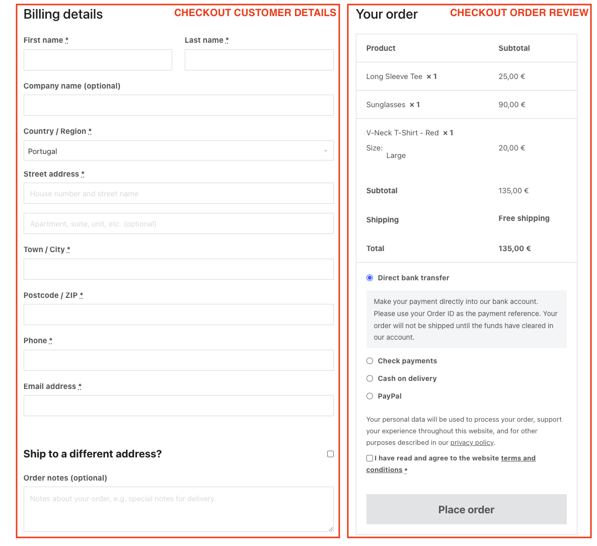
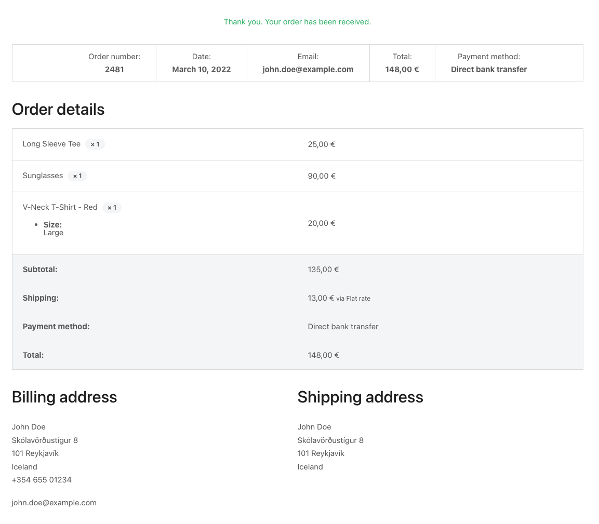
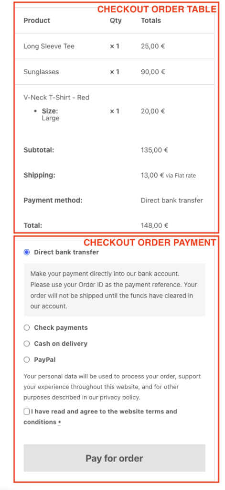
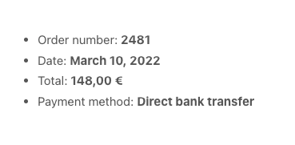
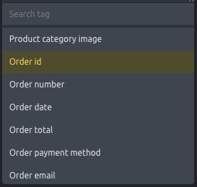

## Overview

The Checkout page is a special WooCommerce page, created by default during WooCommerce installation and assigned under **WooCommerce > Settings > Advanced**.

Starting in Bricks 2.4, you can choose between two Checkout building workflows:

- **Checkout v2 workflow**: Build the assigned Checkout page directly with [WooCommerce advanced modular elements](/integrations/woocommerce/advanced-modular-elements/) and the [Checkout v2 element](/builder/elements/woocommerce/checkout-v2/).
- **Checkout v1 workflow**: Keep the classic WooCommerce checkout shortcode on the assigned Checkout page and customize the output with separate Bricks Checkout, Thank You, Pay, and Order Receipt templates.

Use Checkout v2 for new builds or redesigns where you want to edit checkout, payment, thank-you, receipt, and login-required states in one place. Use Checkout v1 for existing sites that already rely on the classic shortcode/template setup.

The [Woo Setup Wizard](/integrations/woocommerce/woo-setup-wizard/) can check or create either workflow.

## Checkout v2 workflow

With advanced modular elements enabled, Checkout v2 keeps the checkout, pay, thank-you, order receipt, and login-required screens as editable states on the assigned Checkout page.

Use the [Woo Setup Wizard](/integrations/woocommerce/woo-setup-wizard/) and choose:

- **Advanced (v2)** for a complete one-page checkout structure.
- **Advanced multistep (v2)** for a ready-made [multistep checkout structure](/integrations/woocommerce/multistep-checkout-v2/).

Checkout v2 can generate complete checkout blocks or smaller sections such as billing fields, shipping fields, payment options, order summary, and place order. Generated checkout fields are editable Bricks elements, so you can move, style, and reorder them after generation.

Use Checkout v2 field sync after installing or reconfiguring plugins that change WooCommerce checkout fields. Field sync can find missing, invalid, and duplicate generated fields, generate missing fields, remove invalid or duplicate fields, and update labels or placeholders from WooCommerce.

Checkout v2 also adds query loops and dynamic tags for applied coupons, fees, taxes, order items, order totals, order downloads, and customer notes. See [WooCommerce v2 query loops and dynamic tags](/integrations/woocommerce/woocommerce-v2-query-loops-dynamic-tags/) for the complete reference.

The **Login required** state is used when WooCommerce requires a customer to log in before viewing order-related checkout screens. Bricks 2.4 also improves logged-out Thank you, Order receipt, and Order pay handling for non-guest orders.

## Checkout v1 workflow

The classic Checkout workflow renders the WooCommerce `[woocommerce_checkout]` shortcode on the assigned Checkout page, then uses Bricks WooCommerce template types to customize the checkout-related screens.

:::note
Remove the Gutenberg Checkout block if it is located within your Checkout Page. Instead, replace it with `[woocommerce_checkout]` or use a Shortcode element if you edit the Checkout page with Bricks.
:::


For the Checkout v1 workflow, place the `[woocommerce_checkout]` shortcode directly on the Checkout page, or edit the Checkout page with Bricks and use a Shortcode element with `[woocommerce_checkout]` as its content. Bricks offers four template types to customize the checkout workflow:

- WooCommerce - Checkout
- WooCommerce - Thank you
- WooCommerce - Pay
- WooCommerce - Order receipt


:::note
The "WooCommerce - Checkout", "WooCommerce - Pay", "WooCommerce - Thank you", and "WooCommerce - Order receipt" template types are only visible if you have the WooCommerce plugin installed and active. These templates are used inside the WooCommerce checkout shortcode logic and **they do not support template conditions (they are automatically rendered on the correct page)**.
:::

## Checkout template {#checkout-template}

The default checkout page consists of a two-columns layout: one column with the billing and shipping details form and another one with the order summary + a button to proceed with the order.




<figcaption>

Bricks default WooCommerce default checkout screen

</figcaption>


Use the **WooCommerce - Checkout** template type to change the appearance of this first checkout screen.

When editing this template with Bricks you’ll see two new elements (specific to this template type):


### Checkout customer details

The checkout customer details element renders the billing and shipping details form.

You'll be able to remove/hide some of the non-required fields (e.g. Company name) and style the form fields.

### Checkout order review

The checkout order review element renders the order summary, the available payment methods, and the button to place the order. Using this element, you'll be able to style its different parts.

### Remove the checkout coupon form {#remove-coupon-form}

If you have enabled the use of coupons in the WooCommerce general settings you'll notice a blue coupon form on the top of the checkout form page. If you want to remove this form from the checkout page you may hide it using custom CSS or adding the following code to your child theme:

```php
remove_action( 'woocommerce_before_checkout_form', 'woocommerce_checkout_coupon_form', 10 );
```

### Checkout Coupon & Checkout Login elements {#checkout-coupon-login}

Starting at version 1.11.1 you have greater control over the location and design of the checkout coupon & login by enabling and using the following two checkout elements:

- [Checkout Coupon element](/integrations/woocommerce/element-checkout-coupon/)
- [Checkout Login element](/integrations/woocommerce/element-checkout-login/)

## Thank you template {#thank-you-template}

After placing an order, and depending on the payment workflow, you'll get to the "Thank you" screen.




<figcaption>

The Bricks default **Thank You** screen

</figcaption>


To style this screen, you'd create a Bricks template of type **WooCommerce - Thank you**. And insert the **Checkout Thank You** element to customize the thank you message, and modify the styles of the different components of the order details.

## Pay template {#pay-template}

For the situation where the visitor gets a link to pay for an unpaid order, there's a special checkout screen that contains the order summary, the available payment gateways, and the button to pay for the order.




<figcaption>

Default pay form screen with the representation of the Bricks elements

</figcaption>


If you would like to customize this screen you'd need to add a **WooCommerce - Pay** template type where you'll have access to two new elements: the **Checkout order table** and the **Checkout order payment** both with style controls to customize the look and feel.

## Order receipt {#order-receipt-template}

For the situation where the visitor gets a link to the unpaid order receipt, the checkout workflow triggers the `checkout/order-receipt.php` template, which by default will look like this:



If you would like to customize this template you could add the Bricks **WooCommerce - Order receipt **template type and inside the builder, you'll have access to the order-specific Dynamic Data tags such as:



`{woo_order_id}` - Returns the order id

`{woo_order_number}` - Returns the order number

`{woo_order_date}` - Returns the order date

`{woo_order_total}` - Returns the order total

`{woo_order_payment_title}` - Returns the order payment method name

`{woo_order_email}` - Returns the email address registered with the order

:::note
**NOTE:** These Dynamic Data tags will also work inside the **WooCommerce - Thank you** template type.
:::

Bricks 2.4 adds additional order tags and order-aware query loops for v2 layouts, including order items, totals, downloads, actions, and customer notes. See [WooCommerce v2 query loops and dynamic tags](/integrations/woocommerce/woocommerce-v2-query-loops-dynamic-tags/#order-tags).
