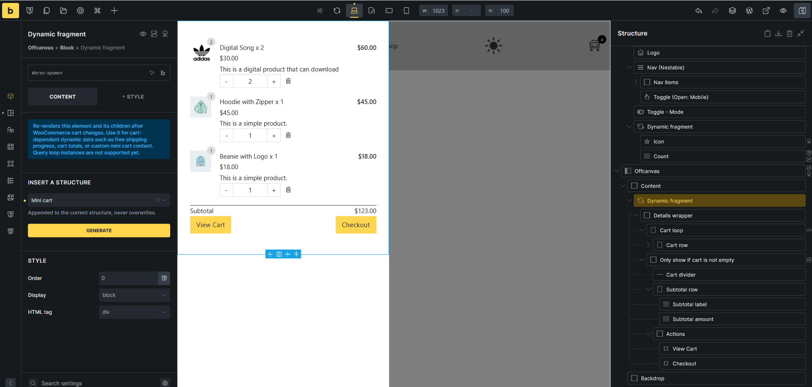
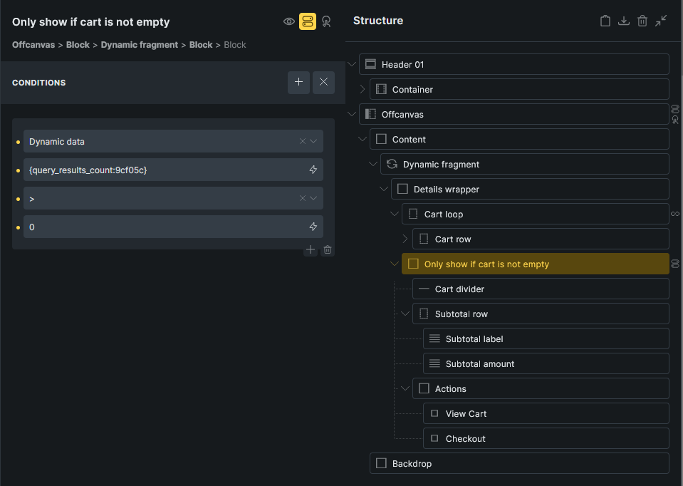
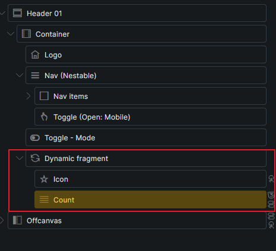
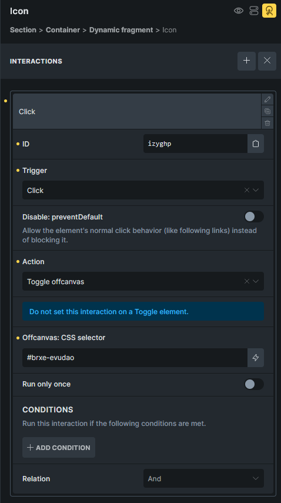
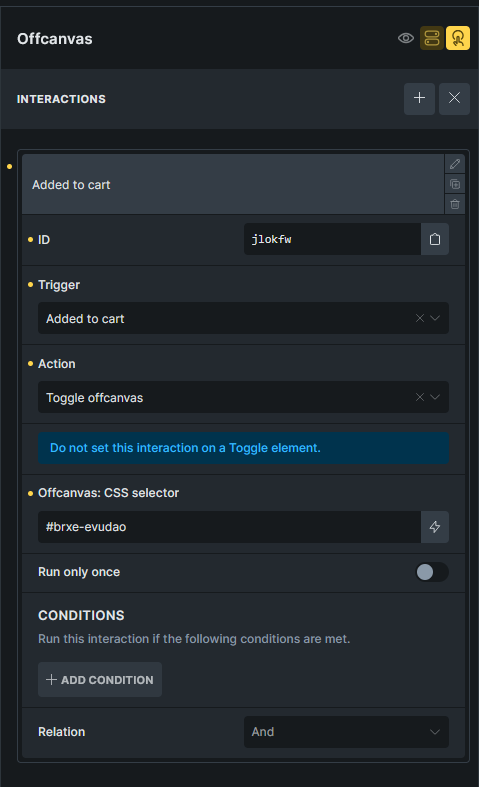
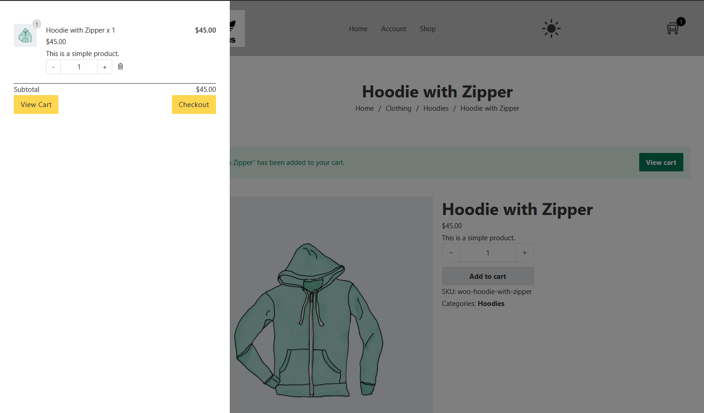

Use the Dynamic fragment element when you need cart-dependent content outside the main Cart page, such as a custom mini cart in a header Offcanvas, dropdown, or popup.

Dynamic fragment re-renders itself and its children after WooCommerce cart changes. For a mini cart, place the cart item loop and cart totals inside the fragment so product rows, quantities, subtotal, and buttons stay current after add-to-cart, remove, and quantity changes.

:::note
Dynamic fragment requires **Bricks > Settings > WooCommerce > Enable advanced modular elements**.
:::

## Common setup

Mini carts are usually added to a header template and shown in an Offcanvas:

- The header contains the cart icon and cart count.
- The cart icon toggles the Offcanvas.
- The Offcanvas contains the generated mini cart structure.

Place the generated mini cart in a dropdown or popup for smaller layouts. Use an Offcanvas when you want more room for product rows, quantity controls, totals, and checkout actions.

## Create the Offcanvas mini cart

1. Open the header template or page where the mini cart should appear.
2. Add an **Offcanvas** element.
3. Inside the Offcanvas content area, add a **Dynamic fragment** element.
4. In the Dynamic fragment controls, go to **Insert a structure**.
5. Select **Mini cart**.
6. Click **Generate**.

Bricks appends the generated structure inside the Dynamic fragment. It does not replace existing child elements.

## What Bricks generates

The generated Mini cart structure already includes the cart item layout, totals, and buttons. You do not need to add these manually unless you want to change the design or content.

Inside the Dynamic fragment, Bricks creates:

- A **Details wrapper** that contains the mini cart content.
- A **Cart loop** using the **Cart contents** query type.
- A cart row inside the loop with product image, product name, product price, product excerpt, quantity control, remove icon, and line subtotal.
- An empty-cart message from the Cart contents query loop.
- A separate block after the Cart loop for the subtotal and action buttons.
- A condition on that subtotal/actions block so it only shows when the Cart loop has more than `0` results.
- **View Cart** and **Checkout** buttons using WooCommerce URL dynamic data.

## What the generated structure uses

The generated cart row uses WooCommerce cart tags inside the **Cart contents** loop.

Common row tags:

| Tag                             | Use                            |
| ------------------------------- | ------------------------------ |
| `{featured_image}`              | Product image.                 |
| `{woo_cart_product_name:plain}` | Product name as plain text.    |
| `{woo_cart_quantity}`           | Quantity input.                |
| `{woo_cart_quantity:value}`     | Quantity number as text.       |
| `{woo_cart_subtotal}`           | Line subtotal.                 |
| `{woo_cart_remove_link:url}`    | Remove URL for a link or icon. |

The subtotal and buttons are outside the Cart contents loop, but still inside the Dynamic fragment. The generated structure uses:

| Element              | Dynamic data                |
| -------------------- | --------------------------- |
| Subtotal amount      | `{woo_cart_order_subtotal}` |
| View Cart button URL | `{woo_url:cart}`            |
| Checkout button URL  | `{woo_url:checkout}`        |

The generated remove icon uses `{woo_cart_remove_link:url}` as its link URL. Keep the `product-remove` CSS class on the remove element so WooCommerce cart behavior can target it.

## Add a header cart icon

In the header template, add a second Dynamic fragment near the navigation for the cart icon and count. This fragment only needs to contain the small cart trigger, not the full mini cart.

Inside that header Dynamic fragment:

1. Add an Icon element and choose a cart icon.
2. Add a Text Basic element for the cart count.
3. Set the count text to `{woo_cart_items_count}`.
4. Position the count as a small badge on the cart icon.
5. Add an element condition to the count so it only shows when `{woo_cart_items_count}` is greater than `0`.
6. Add an interaction to the cart icon:
   - **Trigger**: Click
   - **Action**: Toggle offcanvas
   - **Offcanvas: CSS selector**: the target Offcanvas element ID, such as `#brxe-evudao`

Because the icon and count are inside Dynamic fragment, the count updates after cart changes. Keep the rest of the header outside the Dynamic fragment unless it also depends on cart data.

## Open the Offcanvas after add to cart

You can open the mini cart Offcanvas when a product is added through AJAX.

On the Offcanvas element, add an interaction:

- **Trigger**: Added to cart
- **Action**: Toggle offcanvas
- **Offcanvas: CSS selector**: the Offcanvas element ID

Add a condition to the Offcanvas if you do not want this behavior on checkout. For example, show the Offcanvas only when the current URL does not contain `{woo_url:checkout}`.

## Preview the refresh behavior

Dynamic fragment refreshes on the frontend after WooCommerce cart events such as add to cart, remove from cart, cart emptied, cart totals updated, checkout updated, and coupon apply/remove events.

To test the mini cart:

1. Open the frontend page that contains the mini cart.
2. Add a product to the cart.
3. Confirm the mini cart updates without reloading the page.
4. Confirm the header cart count updates.
5. Click the cart icon and confirm the Offcanvas opens.
6. Remove the item or change quantity if your layout includes quantity controls.
7. Confirm the row count, subtotal, and buttons still render correctly.

## Limits

- Dynamic fragment is frontend-only.
- Keep the Dynamic fragment wrapper outside other query loops. The Cart contents loop can be inside the fragment.
- Component instances are not supported.
- The fragment must render from the header, content, or footer area.
- Keep the fragment focused on cart-dependent content. Static header, menu, or layout elements do not need to be inside it.

## Related

- [Dynamic fragment element](/builder/elements/woocommerce/dynamic-fragment/)
- [WooCommerce v2 query loops and dynamic tags](/integrations/woocommerce/woocommerce-v2-query-loops-dynamic-tags/)
- [WooCommerce advanced modular elements](/integrations/woocommerce/advanced-modular-elements/)
